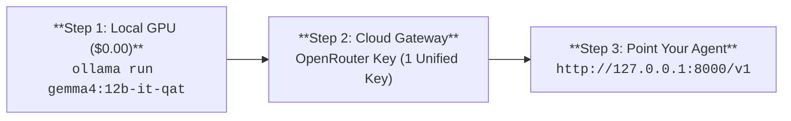

<!-- markdownlint-disable MD033 MD041 -->
<p align="center">
  
</p>

# 🌮 Nacho Flow

<p align="center">
  <a href="https://github.com/dixieflatline76/nacho-flow/actions/workflows/ci.yml"></a>
  <a href="https://marketplace.visualstudio.com/items?itemName=dixieflatline76.nacho-flow"></a>
  <a href="https://pkg.go.dev/github.com/dixieflatline76/nacho-flow"></a>
  <a href="https://golang.org"></a>
  <a href="LICENSE"></a>
  <a href="https://github.com/dixieflatline76/nacho-flow/releases/latest"></a>
  <a href="https://github.com/dixieflatline76/homebrew-nacho-flow"></a>
  <a href="https://github.com/dixieflatline76/nacho-flow/pkgs/container/nacho-flow"></a>
</p>

> Nacho Flow sits between your coding agent and your LLM backends. Routine turns run on your local GPU for $0.00. Complex reasoning escalates to frontier models automatically. Loop detection kills runaway agents in < 3s.

**Nacho Flow** is a hybrid model dispatcher and agent supervisor written in pure Go. Point [Cline](https://github.com/cline/cline), [Zoo Code](https://www.zoocode.dev), [OpenCode](https://github.com/anomalyco/opencode), [Aider](https://github.com/paul-gauthier/aider), [Cursor](https://cursor.com), or [Continue](https://continue.dev) at `http://localhost:8000/v1` and it handles the rest.

🌐 **Website & Documentation**: [spicebox.dev/nacho-flow](https://spicebox.dev/nacho-flow/)
💸 **Latest Research**: [The Frontier Tax: 1:1 Claude Sonnet 5 vs. Nacho Flow](docs/FRONTIER_CONTROL_STUDY_2026.md) *(5.7x cheaper, 12 minutes faster)*
Part of the **[spicebox.dev](https://spicebox.dev)** developer tool suite by [@dixieflatline76](https://github.com/dixieflatline76).

---

## What It Does

- **Hybrid routing**: Local GPU -> budget cloud -> frontier, evaluated per-turn via [deterministic AST bytecode rules](docs/TUNING_GUIDE.md) (`Tokens`, `Retries`, `Keywords`, `HasTools`, `HasImages`)
- **Cycle Killer**: Monitors live SSE streams across thinking/prose/tool lanes. Kills repetition loops in < 3s, injects a local $0.00 override to force tool action, never interrupts file writes
- **Kickstart**: Detects consecutive non-write turns (analysis paralysis) and injects resuscitation prompts or escalates to a smarter model
- **Tool Normalizer**: Converts 8 raw tool-call format families (Hermes, Mistral, Llama 3, ReAct, Markdown fences, bare JSON) into standard OpenAI `tool_calls` JSON -- no harness crashes
- **Fairy Dust**: Programmable frontier checkpoints every N file writes for quality audits (without running expensive models all day)
- **Cost engine**: Prompt-cache-aware billing tracking input, output, and cache tokens at exact provider rates
- **Auto-Tune**: Replays your `logs/traffic.jsonl` to find optimal tier thresholds (`nacho-flow tune`)
- **VS Code extension**: Bundles the Go binary, live financial telemetry, route inspector, one-click preset switching. Zero CLI setup. [Install from Marketplace](https://marketplace.visualstudio.com/items?itemName=dixieflatline76.nacho-flow)
- **Wire-speed core**: < 0.19ms routing overhead, <!-- BENCHMARK:README_CORE_START -->30,000+ req/s (peak 30,284 req/s)<!-- BENCHMARK:README_CORE_END -->, lock-free atomic RCU state, zero heap churn during proxying
- **Zero runtime dependencies**: Single static binary, CGO_ENABLED=0, no Node or Python required
<!-- COVERAGE:SUMMARY_START -->
* **🧪 Engineered for Reliability**: Strictly $\ge 95.0\%\text{--}100\%$ statement test coverage across all packages (95.4% global coverage), 100% race-detector clean (`-race`), and static security audited (`gosec`).
<!-- COVERAGE:SUMMARY_END -->

> **NTS (experimental token compaction)** is available but disabled by default to preserve prompt cache stability and prevent diff drift. See [NTS docs](docs/USER_GUIDE.md) if you need it for extreme context limits.

---

## Quickstart (3 Steps)



1. **Local GPU ($0.00)** -- Install [Ollama](https://ollama.com/download) and pull a coding model:
   ```bash
   ollama run gemma4:12b-it-qat
   ```
   > Set `OLLAMA_CONTEXT_LENGTH=32768` to prevent prompt truncation (`setx OLLAMA_CONTEXT_LENGTH 32768` on Windows). See [User Guide](docs/USER_GUIDE.md#crucial-workstation-setup-configure-ollama_context_length32768).

2. **Cloud Gateway via OpenRouter** -- One key for all frontier tiers (Qwen 3 Coder Plus, Gemini 3.8 Flash, Claude Sonnet 5):
   ```bash
   export OPENROUTER_API_KEY="sk-or-v1-..."
   ```

3. **Start Nacho Flow & Connect Your Agent**
   - **VS Code Extension**: Install [from Marketplace](https://marketplace.visualstudio.com/items?itemName=dixieflatline76.nacho-flow), click `Start` in the sidebar.
   - **Standalone CLI**: Run `nacho-flow` in your terminal.
   - Set your agent's **Base URL** to `http://127.0.0.1:8000/v1`, **Model ID** to `nacho-hybrid`.

---

## Installation

**VS Code Extension (All-in-One Runtime)**:
```bash
code --install-extension dixieflatline76.nacho-flow
```

**Universal Shell Installer (Linux & macOS)**:
```bash
curl -fsSL https://raw.githubusercontent.com/dixieflatline76/nacho-flow/main/scripts/install.sh | bash
```

**Docker / Podman (Multi-Arch Distroless Container)**:
```bash
docker run -d -p 8000:8000 \
  -v $(pwd)/config.yaml:/config/config.yaml \
  ghcr.io/dixieflatline76/nacho-flow:latest
```

**Homebrew (macOS & Linux)**:
```bash
brew install dixieflatline76/nacho-flow/nacho-flow
```

**Pre-compiled Binaries**: [GitHub Releases](https://github.com/dixieflatline76/nacho-flow/releases)

**Go**:
```bash
go install github.com/dixieflatline76/nacho-flow/cmd/nacho-flow@latest
```

---

## Configuration (`config.yaml`)

Create a `config.yaml` in your project folder or `~/.config/nacho-flow/config.yaml`:

```yaml
port: 8000
host: "127.0.0.1"
auth_token: "sk-nacho-secret-key"

providers:
  ollama:
    base_url: "http://127.0.0.1:11434/v1"
    type: "local"

  openrouter:
    base_url: "https://openrouter.ai/api/v1"
    api_key: "ENV_OPENROUTER_API_KEY"
    headers:
      HTTP-Referer: "https://spicebox.dev"
      X-Title: "nacho-flow"

  langdock:
    base_url: "https://api.langdock.com/v1"
    api_key: "ENV_LANGDOCK_API_KEY"

  anthropic:
    base_url: "https://api.anthropic.com"
    type: "anthropic"
    api_key: "ENV_ANTHROPIC_API_KEY"

# Tiers evaluated top-to-bottom: first match wins
tiers:
  - name: "Cloud Reasoning"
    model: "deepseek/deepseek-r1"
    provider: "openrouter"
    when: "any(Keywords, { # in ['deadlock', 'mutex', 'race', 'concurrency', 'atomic'] })"

  - name: "Cloud Vision"
    model: "google/gemini-2.5-flash-lite"
    provider: "openrouter"
    when: "HasImages"

  - name: "Local GPU"
    model: "qwen3.8-coder:14b"
    provider: "ollama"
    max_context: 16384
    when: "Tokens < 16000 && !HasImages && !HasTools && Retries < 2"
    strip_images: true

  - name: "Cloud Agentic Fast"
    model: "qwen/qwen3-coder-30b-a3b-instruct"
    provider: "openrouter"
    when: "Tokens >= 16000 || HasTools || Retries >= 2"

default_tier:
  name: "Cloud Fallback"
  model: "deepseek/deepseek-v4-flash-latest"
  provider: "openrouter"
  when: "true"

cycle_killer:
  enabled: true
  max_tool_tokens: 8192
  repetition_threshold: 3
  kickstart_threshold: 5

fairy_dust:
  enabled: true
  entries:
    - name: "Tactical Code Review"
      frequency: 15
      provider: "openrouter"
      model: "anthropic/claude-sonnet-5"
    - name: "Strategic Architecture Review"
      frequency: 40
      provider: "openrouter"
      model: "anthropic/claude-sonnet-5"
```

---

## In-Chat Control Directives (`@nacho:`)

Control routing and guardrails directly from your editor chat without restarting the gateway:

| Category | Directive | Action |
| :--- | :--- | :--- |
| **Session Switches** | `@nacho:kickstart-off` / `on` | Suspend / resume Kickstart idle stall escalation |
| | `@nacho:cyclekiller-off` / `on` | Suspend / resume Cycle Killer stream loop breaker |
| | `@nacho:shield-off` / `on` | Suspend / resume synthetic tool-call synthesis |
| | `@nacho:raw-on` / `off` | Enable / disable raw upstream SSE stream |
| | `@nacho:fairydust-off` / `on` | Suspend / resume periodic frontier checkpoints |
| **Inspection & Reset** | `@nacho:toggles` | Display live session switches ($0.00 / 0 tokens) |
| | `@nacho:status` | Display daemon telemetry, spend & saved dollars |
| | `@nacho:reset` | Hard reset turn counter & restore default switches |
| **Single-Turn Overrides** | `@nacho:local` | Force current turn to Local GPU ($0.00) |
| | `@nacho:cloud` | Force current turn to Cloud Fallback tier |
| | `@nacho:reasoning` | Force current turn to DeepSeek-R1 / o1 |

> **Plan Mode Auto-Detection**: When your agent switches into Plan Mode (zero write tools declared), Nacho Flow automatically detects `HasWriteCapability == false` and suspends Kickstart -- no manual toggles required.

---

## Auto-Tune (`nacho-flow tune`)

Replays your actual `logs/traffic.jsonl` to find where your local GPU starts failing, prune dead tiers, and stop over-escalating to expensive frontier models:

```bash
# Advisory dry-run
nacho-flow tune

# Target specific VRAM ceiling
nacho-flow tune --vram-gb=16

# Apply recommendations with timestamped backup
nacho-flow tune --apply
```

---

## Running as a Background Daemon

```bash
# Install as native OS service (Windows Service / systemd / launchd)
nacho-flow service install

# Start the background daemon
nacho-flow service start
```

---

## Connect Your IDE

Nacho Flow exposes a standard OpenAI-compatible proxy at `http://localhost:8000/v1`. Use `nacho-hybrid` as your Model ID.

#### Zoo Code & Cline
- **API Provider**: `OpenAI Compatible`
- **Base URL**: `http://localhost:8000/v1`
- **API Key**: `sk-nacho-secret-key`
- **Model ID**: `nacho-hybrid`
- Enable **Supports Images**, **Supports Tools**, Context Window `128,000`, Max Output `8,192`

#### OpenCode
```bash
export OPENAI_BASE_URL="http://127.0.0.1:8000/v1"
export OPENAI_API_KEY="sk-nacho-secret-key"
opencode --model openai/nacho-hybrid
```

#### Aider
```bash
export OPENAI_API_BASE="http://127.0.0.1:8000/v1"
export OPENAI_API_KEY="sk-nacho-secret-key"
aider --model openai/nacho-hybrid
```

#### Cursor
- **OpenAI API Base URL**: `http://localhost:8000/v1`
- **OpenAI API Key**: `sk-nacho-secret-key`
- Add custom model: `nacho-hybrid`

#### Continue.dev
```json
{
  "models": [{
    "title": "Nacho Flow (Hybrid Local + Cloud)",
    "provider": "openai",
    "model": "nacho-hybrid",
    "apiBase": "http://127.0.0.1:8000/v1",
    "apiKey": "sk-nacho-secret-key"
  }]
}
```

---

## Documentation

Visit **[spicebox.dev/nacho-flow](https://spicebox.dev/nacho-flow/)** for the full documentation portal.

- **[User Guide](docs/USER_GUIDE.md)**: Full configuration reference, custom tier rules, OS service setup, IDE walkthroughs
- **[VS Code Extension Guide](docs/EXTENSION_USER_GUIDE.md)**: Sidebar control hub, status bar, route inspector, agent setup
- **[Rule & Tier Tuning Guide](docs/TUNING_GUIDE.md)**: Practical recipes for writing and optimizing `expr` routing rules
- **[Architecture & System Design](docs/ARCHITECTURE.md)**: Pipeline internals, RCU concurrency model, lock-free pricing oracle
- **[Performance & Benchmarks](docs/BENCHMARKS.md)**: High-concurrency stress test results (**<!-- BENCHMARK:README_BENCHLINK_START -->30,000+ req/s, 350k requests up to 1,000 workers<!-- BENCHMARK:README_BENCHLINK_END -->**) on AMD Ryzen hardware
- **[Frontier Tax Control Study](docs/FRONTIER_CONTROL_STUDY_2026.md)**: 1:1 Claude Sonnet 5 empirical benchmark
- **[Developer Guide](docs/DEVELOPER_GUIDE.md)**: TDD workflow, plugin extension guide, benchmarking
- **[Product Roadmap](ROADMAP.md)**: Phase milestones for open-source, extension, fleet, and SaaS
- **[Contributing](CONTRIBUTING.md)**: Code style, issue guidelines, pull requests

---

## Support Nacho Flow

Nacho Flow is 100% free and open source. If it saved your sanity or your API bill:

- **Don't buy me a coffee.** Grab a copy of **Spice** on the [Mac App Store](https://apps.apple.com/us/app/spice-wallpaper-manager/id6760980759?mt=12) or [Microsoft Store](https://apps.microsoft.com/detail/9NPBQ3C91WPF) -- you get a native desktop utility, and it funds continued development.
- **On Linux?** [Star Nacho Flow on GitHub](https://github.com/dixieflatline76/nacho-flow) to help other devs find it.

---

## Licensing

**Dual-Licensing Model**:

1. **Free & Open-Source (GNU AGPL-3.0 with API Interoperability Exception)**: Free for individual developers, open-source projects, and local evaluation. Calling Nacho Flow's OpenAI-compatible APIs from client apps or IDEs does not make your code a derivative work. Modifying and distributing or network-hosting Nacho Flow requires source disclosure under AGPL-3.0.

2. **Spicebox Commercial & Enterprise OEM License**: For enterprise fleet deployments, closed-source embedding, commercial SaaS hosting, and IP indemnification. See **[COMMERCIAL_LICENSE.md](COMMERCIAL_LICENSE.md)** or contact [`karl@spicebox.dev`](mailto:karl@spicebox.dev).

Contributions accepted under our **[Contributor License Agreement (.github/CLA.md)](.github/CLA.md)**.

---

Copyright © 2026 [Karl Kwong / Spicebox](https://spicebox.dev) · Licensed under **GNU AGPL-3.0** with Commercial Dual-Licensing. (VS Code Extension licensed under **MIT**).