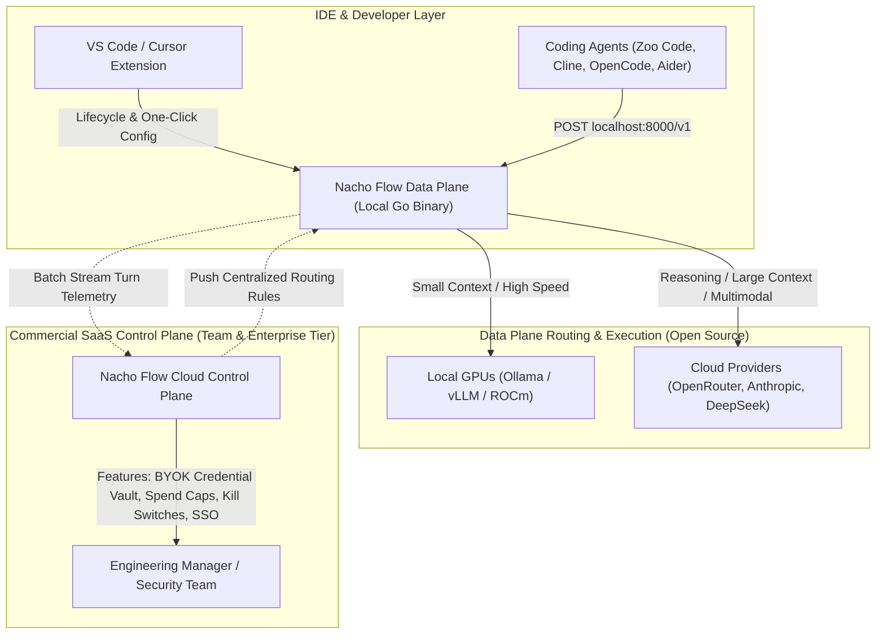
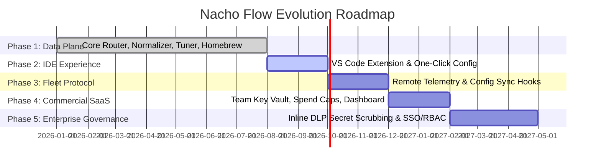

# 🌮 Nacho Flow Product & Commercial Architecture Roadmap

This document outlines the evolutionary roadmap for **Nacho Flow**, spanning its core open-source data plane, IDE-first distribution layer, and commercial SaaS control plane for engineering teams.

---

## 🏛️ Strategic Architecture: Control Plane vs. Data Plane

Nacho Flow adheres strictly to the **Tailscale / Grafana Open-Core Architecture**:
1. **The Data Plane (100% Free & Open Source)**: The local, high-performance Go binary deployed on developer machines and edge infrastructure. It executes wire-speed routing, tool call normalization, empirical cost-penalty auto-tuning, and local telemetry.
2. **The IDE Layer (Free Distribution Engine)**: A native VS Code / Cursor companion extension that eliminates configuration friction, manages daemon lifecycles, and visualizes real-time savings.
3. **The Control Plane (Commercial SaaS & Enterprise)**: A centralized web dashboard and management API that solves organizational governance: credential vaulting (BYOK), per-developer spend caps, global rule synchronization, and fleet-wide cost controls.

---

## 🗺️ Execution Milestones

---

### Phase 1: High-Performance Open-Source Data Plane 🟢 (Completed)

The core technical routing engine is fully operational, thoroughly tested, and distributed across major operating systems.

- [x] **Wire-Speed RCU Routing Engine**: Sub-millisecond routing overhead utilizing pre-compiled AST expressions (`expr-lang/expr`).
- [x] **Universal Tool Normalizer**: Real-time conversion across 8 open-source tool call format families (Hermes XML, Mistral bracketed JSON, Llama 3 functions, Llama 3.1 Python tags, Claude XML invoke, ReAct single/multi-line, Markdown code fences, and Bare JSON completions) via a zero-allocation Strategy Pipeline.
- [x] **Lock-Free Pricing Oracle**: Atomic thread-safe pricing sync from OpenRouter API calculating real-time USD cost differentials.
- [x] **Cost-Penalty Auto-Tuner (`pkg/tuner`)**: Empirical turn-record replay analyzing context thresholds and domain friction keywords with automated backup creation.
- [ ] **Global Multi-Tier Decision List Induction (v2 Tuner)**: Advanced combinatorial optimizer synthesizing full $N$-tier decision lists simultaneously with precedence conflict resolution and shadow-route prevention.
- [x] **Curated Model Gallery & OTA Sync (`pkg/telemetry/curation`)**: Embedded binary baseline + Over-The-Air GitHub semver updates with 3-tier capability classification.
- [x] **"Heat Seeker" Live Model Deals & Discovery Engine (`nacho-flow deals` / `nacho-flow heat-seek`)**: Automated promotion discovery and tier recommendation with elastic `text/tabwriter` CLI reporting and REST API endpoint (`/api/v1/deals`).
- [x] **Dedicated Catalog Generator Tool (`cmd/util/gen_catalog`)**: Tooling to scrape, benchmark, and regenerate canonical repository and embedded catalogs.
- [x] **Comprehensive Test Suite & CI Matrix**: 96%+ global statement coverage (strictly $\ge 95.0\%$ across every package) with zero race conditions (`-race`), zero security alerts (`gosec`), and multi-platform CI verification (macOS, Ubuntu, Windows).
- [x] **Dedicated Homebrew Distribution**: Published Formula in [`dixieflatline76/homebrew-nacho-flow`](https://github.com/dixieflatline76/homebrew-nacho-flow) with automated background service blocks.

---

### Phase 2: IDE-First Distribution (VS Code Companion Extension) 🎯 (In Progress)

Bring the power of Nacho Flow directly inside the developer's primary workspace to maximize distribution and eliminate setup friction.

- [ ] **One-Click Agent Auto-Configuration**:
  - Automatically detect installed extensions (Zoo Code, Cline, Continue).
  - One-click button to inject `http://127.0.0.1:8000/v1` and custom model headers directly into VS Code `settings.json`.
- [ ] **Status Bar Real-Time Savings HUD**:
  - Live indicator displaying: `🌮 Nacho: $14.20 Saved Today | 78% Local GPU`.
  - QuickPick menu with instant start, stop, restart, and log viewing actions.
- [ ] **Visual Trace & Diff Inspector Webview**:
  - Live inspector displaying arriving prompts, calculated token counts, and matched routing rules.
  - Side-by-side visual diff showing raw local markdown output converted into clean OpenAI `tool_calls` JSON.
- [ ] **Interactive Visual Tuner Webview**:
  - GUI for `nacho-flow tune` rendering cost-vs-retries trade-offs.
  - One-click **"Apply Recommendation"** button updating `config.yaml` with backup creation.
- [x] **Agentic Tool Fallback Shield**:
  - Real-time zero-allocation sliding tail-buffer prose-to-tool auto-wrapping intercepting conversational plan/question turns from local models and synthesizing schema-compliant `ask_followup_question` tool payloads to eliminate 3-strike agent harness crashes in Zoo Code and Cline.
- [ ] **Daemon Lifecycle Automation**:
  - Auto-spawn daemon on VS Code startup and graceful shutdown on IDE exit.
  - Automatic detection and execution of Homebrew/System PATH binaries.

---

### Phase 3: Remote Synchronization & Fleet Protocol (Data Plane Hooks)

Extend the open-source binary with non-intrusive hooks for optional remote management.

- [ ] **Control Plane Client CLI**:
  - Add `--control-plane <url>` flag and `nacho-flow login --team <team-slug>` command.
- [ ] **Remote Telemetry Observation Sink**:
  - Implement a non-blocking `telemetry.ObservationSink` that buffers `TurnRecord` payloads and ships compressed batches via HTTPS to the control plane.
- [ ] **Community Savings Counter (RFC-001)**:
  - Anonymous, zero-PII opt-in weekly savings reporter ([RFC-001](docs/RFC-001-ANONYMOUS-SAVINGS-TELEMETRY.md)) feeding the live website impact ticker once user threshold is reached.
- [ ] **Dynamic Remote Rule Fetching & Hot Reloading**:
  - Background polling / WebSocket worker to receive team configuration updates and atomically swap routing tiers via RCU without dropping active requests.
- [ ] **Local Offline Fallback**:
  - Graceful degradation to local `config.yaml` if the remote control plane is unreachable.

---

### Phase 4: Commercial SaaS Control Plane ("Nacho Flow for Teams") 🚀

A hosted, multi-tenant web application tailored for scale-ups, agencies, and engineering teams (10–50 developers) billed self-serve at $49–$199/month.

- [ ] **Centralized API Key Vault (BYOK)**:
  - Engineering managers store company Anthropic, OpenAI, and OpenRouter keys in a centralized encrypted vault.
  - Developers authenticate with lightweight team tokens; raw cloud API keys never touch local workstations.
- [ ] **Developer Spend Guardrails & Budget Kill Switches**:
  - Configurable daily/weekly/monthly spend limits per developer and per project.
  - Automated kill switches that force local GPU routing or block requests when budgets are exhausted.
- [ ] **Global Configuration Management**:
  - Web UI for engineering managers to define and push routing rules across the entire engineering organization.
- [ ] **Fleet Analytics & ROI Dashboard**:
  - Aggregated cost savings reports, local vs. cloud utilization ratios, and prompt efficiency metrics.
- [ ] **Self-Serve Billing & Team Management**:
  - Stripe integration with seat-based subscription tiers and invite links.

---

### Phase 5: Enterprise Governance & Data Loss Prevention (DLP) 🔒

Targeted compliance and security features for regulated industries and large enterprise deployments ($20k–$50k/year).

- [ ] **Inline Secret Scrubbing & DLP Sanitizer**:
  - Intercept and redact API keys, passwords, database URIs, and proprietary tokens before payloads leave the internal network.
- [ ] **Enterprise SSO / SAML / OIDC & RBAC**:
  - Integration with Okta, Azure AD, Google Workspace, and GitHub Enterprise.
- [ ] **Audit Logging & Compliance Exports**:
  - Tamper-proof JSON audit trails of all routed prompts and completions for SOC 2, HIPAA, and GDPR compliance.
- [ ] **Self-Hosted Kubernetes / Docker Distribution**:
  - Air-gapped control plane deployment for enterprises with strict data sovereignty mandates.

---

## ⚖️ Open-Source vs. Commercial Boundary Matrix

To maintain open-source community trust and viral developer adoption, technical capabilities remain open, while organizational governance is commercialized:

| Capability | Open-Source Data Plane (Free / MIT) | Team SaaS Tier ($49–$199/mo) | Enterprise Tier ($20k+/yr) |
| :--- | :---: | :---: | :---: |
| **Wire-Speed Routing (`expr` AST)** | 🟢 Included | 🟢 Included | 🟢 Included |
| **Universal Tool Call Normalization** | 🟢 Included | 🟢 Included | 🟢 Included |
| **Cost-Penalty Auto-Tuner** | 🟢 Included | 🟢 Included | 🟢 Included |
| **Local Metrics & Logging HUD** | 🟢 Included | 🟢 Included | 🟢 Included |
| **VS Code / Cursor Extension** | 🟢 Included | 🟢 Included | 🟢 Included |
| **Centralized API Key Vault (BYOK)** | ❌ | 🟢 Included | 🟢 Included |
| **Per-Developer Budget Caps & Kill Switch** | ❌ | 🟢 Included | 🟢 Included |
| **Centralized Team Config Sync** | ❌ | 🟢 Included | 🟢 Included |
| **Organization Spend Analytics** | ❌ | 🟢 Included | 🟢 Included |
| **Inline Secret Scrubbing (DLP)** | ❌ | ❌ | 🟢 Included |
| **SSO / SAML / RBAC** | ❌ | ❌ | 🟢 Included |
| **Air-Gapped Self-Hosted Control Plane** | ❌ | ❌ | 🟢 Included |

---

## 📬 Enterprise Inquiries & Early Access

For custom enterprise integrations, fleet licensing, or early access to the team control plane, contact us at **[info@spicebox.dev](mailto:info@spicebox.dev)**.
