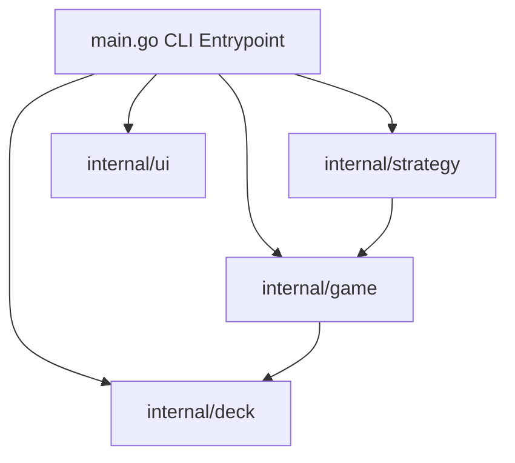

# Blackjack Simulator, Strategy Trainer, and Monte Carlo CLI: Architecture Plan

## 1. System Overview
An interactive Blackjack simulator, strategy trainer, and Monte Carlo simulation engine written in pure Go (standard library only).

## 2. Architecture & Components

### 2.1 Package: `internal/deck`
- `Suit`: Spades, Hearts, Diamonds, Clubs with Unicode symbols (`♠`, `♥`, `♦`, `♣`).
- `Rank`: 2 through 10, Jack, Queen, King, Ace.
- `Card`: Struct storing `Suit`, `Rank`, and standard Blackjack base `Value` (Ace defaults to 11, Face cards to 10).
- `Shoe`:
  - Contains 1–8 decks (configurable, default 6 decks).
  - `Shuffle()`: Cryptographically or PRNG-driven Fisher-Yates shuffle algorithm.
  - Cut-card penetration trigger (default 75% penetration).
  - `Draw() (Card, error)`: Draws next card, marks when penetration cut card is crossed.

### 2.2 Package: `internal/game`
- `Hand`:
  - Slice of `Card`, current bet amount, flags for isSplit, isDoubled, isBusted, isBlackjack, isStanding.
  - `Total() (hard int, soft int, isSoft bool)`: Dynamic Ace evaluation where Ace can count as 1 or 11.
  - `BestValue() int`: Highest value <= 21, or lowest if busted.
  - `CanSplit() bool`: Only on 2 cards of equal value / rank.
  - `CanDouble() bool`: Only on initial 2 cards.
- Casino Rules:
  - Dealer stands on soft 17 (S17).
  - Natural Blackjack pays 3:2.
  - Standard actions: Hit, Stand, Double Down, Split.
  - Payout computation:
    - Win: 1:1
    - Blackjack: 3:2 (1.5x)
    - Push: 0:0 (return stake)
    - Loss: -1x

### 2.3 Package: `internal/strategy`
- Standard 4–8 deck, S17, Double After Split (DAS) Basic Strategy tables:
  - **Hard Totals**: 5–21 vs Dealer upcard (2–A).
  - **Soft Totals**: A,2 (Soft 13) through A,9 (Soft 20) vs Dealer upcard.
  - **Pairs**: 2,2 through A,A vs Dealer upcard.
- Fallback mechanics:
  - When Double is recommended but not allowed (e.g. after hit), fallback to Hit or Stand according to strategy rules.
  - When Split is recommended but not allowed (e.g. already split or hand size > 2), fallback to Hard/Soft lookup.
- `OptimalAction(playerHand Hand, dealerUpcard Card, canDouble bool, canSplit bool) Action`:
  Returns `ActionHit`, `ActionStand`, `ActionDouble`, or `ActionSplit`.

### 2.4 Package: `internal/ui`
- Compact ANSI card rendering: e.g. `[ 10♠ ] [  A♥ ] (Soft 21)`.
- Color support with red for hearts/diamonds, white/bold for clubs/spades.
- Table summary formatting and interactive prompt presentation.

### 2.5 CLI Entrypoint: `main.go`
- Flags:
  - `-sim`: Run simulation mode (Monte Carlo).
  - `-n <int>`: Number of rounds to simulate (default 10,000).
  - `-decks <int>`: Number of decks in shoe (default 6).
  - `-hint`: Show optimal action hint in interactive mode.
- Interactive mode:
  - Bankroll management (starting at $1,000, bet between $10 and $500).
  - Step-by-step turn loops, asking user action with optional strategy hint.
- Simulation mode:
  - High performance automated execution of N rounds using pure basic strategy.
  - Outputs summary metrics: Rounds played, Wins, Losses, Pushes, Player Blackjacks, Dealer Blackjacks, Total wagered, Net profit/loss, Return to Player (EV %), and elapsed runtime.

## 3. Testing & Verification Strategy
- Table-driven unit tests for `deck` (card counts, distribution, shuffle uniformity, penetration).
- Table-driven unit tests for `game` (soft ace handling, blackjack detection, dealer S17 logic, payout calculations, split hand state).
- Matrix tests for `strategy` verifying every single cell of hard, soft, and pair tables against standard blackjack basic strategy charts.
- Race detector verification: `go test -race ./...`.
- Overall coverage requirement: $\ge 80\%$ via `go test -cover ./...`.
- Final end-to-end simulation run: `go run main.go -sim -n 10000`.
