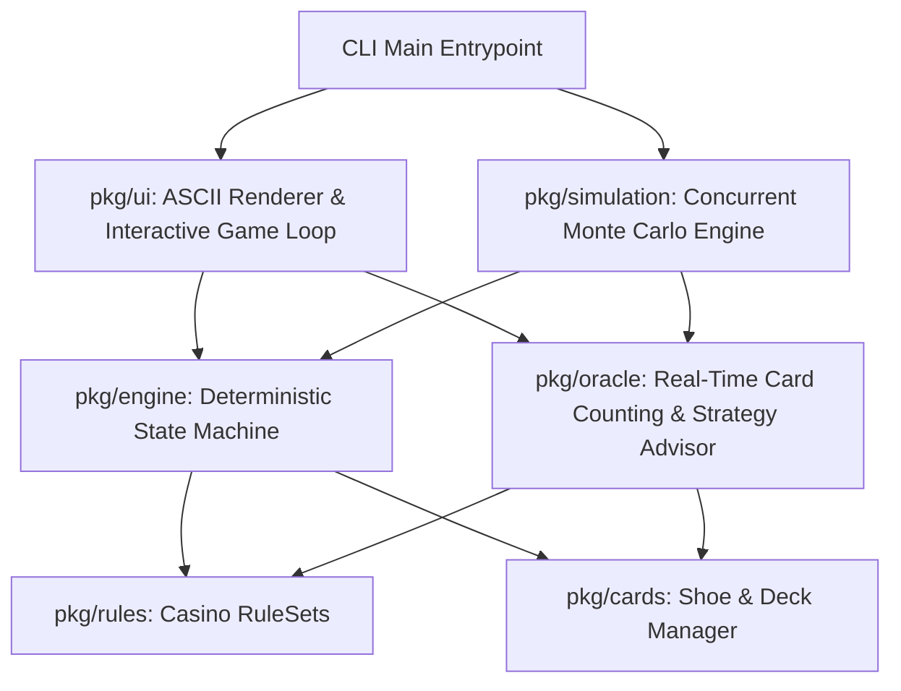

# Architecture Specification: Concurrent Blackjack Engine & Real-Time Card Counting Oracle CLI

## 1. System Overview
A high-performance, modular, concurrent Blackjack engine, deterministic state machine, real-time card counting and probability oracle, ASCII card rendering interface, and multi-threaded Monte Carlo simulation suite built in Go.

## 2. Package Architecture

### 2.1 `pkg/cards`
- **Card**: Rank (2-10, J, Q, K, A) and Suit (Hearts, Diamonds, Clubs, Spades).
- **Shoe**: Multi-deck shoe (1-8 decks) with Fisher-Yates cryptographically secure/seeded shuffling, cut card penetration (e.g., 75%), running discarded tracking, and deal mechanics.
- **Dealt Tracking & Callbacks**: Event listeners when cards are dealt/revealed for counting synchronizations.

### 2.2 `pkg/rules`
- **RuleSet Configuration**:
  - `Decks`: 1 to 8 decks.
  - `DealerHitsSoft17` (H17 vs S17).
  - `BlackjackPayout`: 3:2 (1.5) or 6:5 (1.2).
  - `DoubleAfterSplit` (DAS): bool.
  - `DoubleDownRestriction`: Any 2 cards, 9-11 only, 10-11 only.
  - `MaxSplitHands`: e.g. 4 (split up to 3 times).
  - `ResplitAces`: bool.
  - `HitSplitAces`: bool.
  - `Surrender`: Late surrender, Early surrender, None.
  - `DealerPeek`: European No-Hole-Card (ENHC) vs US Peek for Blackjack on Ace/10.
  - `InsuranceOffered`: bool (pays 2:1).
- **Presets**:
  - `VegasStrip()`: 4 decks, S17, 3:2 BJ, DAS, US Peek, Late Surrender, Split to 4.
  - `AtlanticCity()`: 8 decks, S17, 3:2 BJ, DAS, US Peek, Late Surrender, Split to 4, Resplit Aces (1 card each).
  - `European()`: 2 decks, S17, 3:2 BJ, DAS restricted (9-11), ENHC (No Peek), No Surrender.
  - `SingleDeckVegas()`: 1 deck, H17, 3:2 or 6:5 BJ, No DAS.

### 2.3 `pkg/engine`
- **Hand**: Cards, wager, state (Active, Stood, Doubled, Busted, Blackjack, Surrendered, Split), soft/hard score evaluation.
- **State Machine**:
  - `StateWaitingBet` -> `StateDealing` -> `StateInsurance` (if dealer Ace up) -> `StateDealerPeek` -> `StatePlayerTurn` -> `StateDealerTurn` -> `StateRoundResolved`.
- **Actions**:
  - `ActionBet(amount)`
  - `ActionInsurance(accept bool)`
  - `ActionHit`
  - `ActionStand`
  - `ActionDouble`
  - `ActionSplit`
  - `ActionSurrender`
- **Deterministic Resolution & Outcomes**:
  - Exact net payout calculation per player hand (push = 0, win = 1x, BJ = 1.5x/1.2x, surrender = -0.5x, double win = 2x, etc.).

### 2.4 `pkg/oracle`
- **Card Counting Systems**:
  - **Hi-Lo**: 2-6 (+1), 7-9 (0), 10-A (-1).
  - **KO (Knock-Out)**: Unbalanced; 2-7 (+1), 8-9 (0), 10-A (-1).
  - **Omega II**: Multi-level; 2,3,7 (+1), 4,5,6 (+2), 8,A (0), 9 (-1), 10,J,Q,K (-2); separate Ace side-count.
- **Calculations**:
  - `RunningCount (RC)`
  - `RemainingDecks = RemainingCards / 52.0` (with quarter/half-deck resolution)
  - `TrueCount (TC) = RunningCount / RemainingDecks`
  - `ShoePenetration = DiscardedCards / TotalCards`
  - `BettingUnitAdvice`: Proportional Kelly / TC ramp.
- **Dynamic Basic Strategy Decision Advisor Matrix**:
  - Hard totals (5 to 20 vs Dealer upcard 2-A)
  - Soft totals (A,2 to A,9 vs Dealer upcard 2-A)
  - Pair splits (2,2 to A,A vs Dealer upcard 2-A)
  - Surrender tables & Insurance threshold (e.g., Hi-Lo TC >= +3 -> Buy Insurance).
  - Rules-aware adjustments (H17 vs S17, DAS vs NDAS, Surrender allowed).

### 2.5 `pkg/simulation`
- **Concurrent Worker Pool**:
  - Multi-threaded goroutines partitioned across CPU cores (`runtime.NumCPU()`).
  - Capable of simulating 100,000+ hands/sec with zero allocations in inner loops.
  - Tracks aggregate stats: Total Rounds, Total Hands, Total Wagered, Total Won/Lost, Net EV, Win/Loss/Push percentages, Blackjacks dealt, House Edge % with standard error $\pm \sigma / \sqrt{N}$.

### 2.6 `pkg/ui`
- **ASCII Card Renderer**:
  - Crisp multi-card horizontal rendering with box drawing characters (`┌───┐`, `│ A ♠│`, `└───┘`).
  - Red / White / Blue terminal color styling support (with ANSI codes).
  - Dynamic HUD displaying Hand Values, Dealer Upcard, Card Counting Oracle (Hi-Lo, KO, Omega II, Running Count, True Count, Penetration %, Recommended Action with explanation).

### 2.7 `main.go`
- Interactive Play Mode with customizable rules.
- Fast Monte Carlo Simulator Mode (`--sim --hands 50000 --rules vegas --workers 8`).
- Help & rule inspection subcommands.
