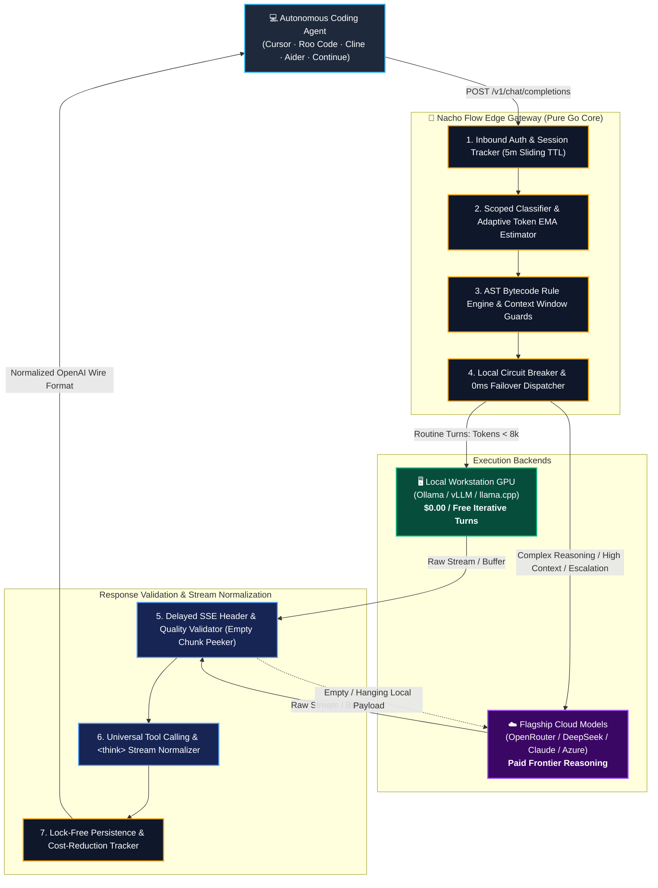

# 🌮 Nacho Flow: Architecture & System Design

This document provides a comprehensive technical overview of **Nacho Flow**'s internal architecture, capability-based provider system, execution pipeline, concurrency model, and persistent storage.

---

## 1. High-Level Architecture Diagram



---

## 2. Request Lifecycle & Pipeline Stages

Every incoming request passes through an optimized multi-stage processing pipeline before dispatch and return:

### Stage 0: Inbound Perimeter Authentication (`pkg/server/proxy.go`)
- If `auth_token` is configured in `config.yaml` or `ENV_NACHO_AUTH_TOKEN`, incoming requests must present a matching key via `Authorization: Bearer <token>`, `X-API-Key`, or `api-key`.
- Requests with invalid or missing credentials receive an OpenAI-standard `401 Unauthorized` JSON payload (`invalid_api_key`).
- Public health probes (`/health`, `/v1/health`) automatically bypass auth and return service status and version information.

### Stage 1: Session Tracking & Context Classification (`pkg/router/session.go`, `pkg/router/classifier.go`)
- **Session Retry Tracking**: Computes an FNV-1a hash of the initial conversation prompt prefix to correlate prompt turns within a sliding 5-minute window. Increments a turn retry counter on consecutive turns with identical prefixes without detached goroutines (lazy TTL eviction).
- **Adaptive Token Estimation**: Uses a lock-free Exponential Moving Average (EMA, $\alpha=0.2$) estimator seeded at 3.2 chars/token to accurately estimate code and JSON token densities without underestimating payloads.
- **Multimodal Detection**: Scans message blocks for `image_url` payloads and base64 strings (`HasImages`).
- **Tool Calling Detection**: Inspects `tools` array and `tool_choice` parameters (`HasTools`).
- **Scoped Keyword Extraction**: Extracts programming concepts (`deadlock`, `mutex`, `race`, `concurrency`, `atomic`, `sql`, `refactor`) **strictly from the latest user prompt** (`latestUserPrompt`), preventing historical multi-turn token pollution.

### Stage 2: AST-Compiled Rule Evaluation & Context Window Guards (`pkg/strategy/expr_evaluator.go`)
- **$\mathcal{O}(1)$ Context Boundary Guard**: If a tier defines `max_context` and `Tokens > max_context`, the tier is skipped immediately without expression evaluation overhead.
- **Bytecode Expression Engine**: Uses `github.com/expr-lang/expr` compiled bytecode expressions to evaluate 1..N tiers sequentially (*Top-to-Bottom: First Match Wins* in $< 0.6 \mu\text{s}$).
- Supported context variables: `Tokens`, `HasImages`, `HasTools`, `Keywords`, `Retries`, `IsRetry`, `Model`.

### Stage 3: Payload Sanitization & Model Rewriting (`pkg/router/sanitizer.go`)
- If the selected tier model is text-only (or `strip_images: true`), all historical images in past conversation turns are sanitized into `[Image Attached]` text placeholders.
- This prevents `400 Bad Request` crashes on cheaper cloud models or local models that lack vision encoders.
- The top-level `"model"` field in the JSON payload is rewritten to the target tier's upstream model ID.

### Stage 4: Circuit-Breaker-Aware Dispatch & Reverse Proxying (`pkg/server/proxy.go`, `pkg/provider/circuit_breaker.go`)
- Resolves the target provider from the `provider.Registry`.
- **Circuit Breaker Check**: Checks `cb.AllowRequest()`. If the provider is in an `Open` state (tripped by consecutive connection refusals, dial errors, or 5xx errors), the proxy bypasses the primary provider with 0ms dial delay and immediately dispatches to the default fallback tier.
- Using zero-allocation interface assertions:
  - If provider implements `AuthProvider`: Injects `Authorization: Bearer <API_KEY>`.
  - If provider implements `HeaderProvider`: Injects custom headers (`HTTP-Referer`, `X-Title`, `X-Custom-Org`).
  - If provider is local (`Type: "local"`): Inbound client auth headers are stripped so local inference engines (Ollama, llama.cpp) do not reject requests.
- Uses a shared `http.Transport` with connection pooling (`MaxIdleConns: 10000`, `MaxIdleConnsPerHost: 2000`) to guarantee zero OS socket exhaustion under massive concurrency.

### Stage 5: Response Quality Validation & Delayed Header Fallback (`pkg/server/proxy.go`)
- **Delayed Header Pattern (Streaming)**: For SSE streams, the proxy holds off on writing `w.WriteHeader(200)` until peeking the first 4KB chunk via `NewStreamNormalizer`. If a local provider emits an immediate `data: [DONE]` stream with zero content, the stream is cleanly closed and transparently re-dispatched to the cloud fallback tier.
- **Empty Content Fallback (Non-Streaming)**: If a local model returns a 200 OK with empty choices (`""`), the defective response is caught and the request is transparently re-routed to the fallback tier.

### Stage 5b: Extended Reasoning Stream Normalization (`pkg/server/stream_normalizer.go`)
- **SSE Stream Interception**: When `Content-Type: text/event-stream` is detected, `resp.Body` is wrapped with `NewStreamNormalizer`.
- **Wire-Speed Fast Filter**: `bytes.Contains(chunk, []byte("reasoning"))` evaluates in `< 4ns`, bypassing standard chat completion chunks with near-zero overhead.
- **TCP Packet Boundary Framing**: Uses a pooled `bufio.Reader` (`sync.Pool`) to assemble complete `\n\n` SSE event boundaries, guaranteeing that TCP fragmentation never splits JSON payload boundaries.
- **Thought-Stream State Machine**:
  - Automatically transforms `reasoning_content` / `reasoning` tokens, Qwen `<|im_start|>think` / `<|im_start|>thought`, and Claude `<thinking>...</thinking>` tags into standard `<think>...</think>` tags inside `delta.content` in real-time.
  - Automatically closes the `<think>` accordion upon transition to final answer, tool calls, `[DONE]`, `finish_reason`, or abrupt `io.EOF`.

### Stage 5c: Universal Strategy-Pipeline Tool Normalization (`pkg/router/tool_normalizer.go`)
- **Zero-Alloc Fast Path**: If `reqCtx.HasTools` is false or the raw response bytes do not contain candidate syntax anchors (`<[{` or `Action:`), `hasCandidateTokens` exits in **< 30 nanoseconds** with 0 heap allocations (`0 B/op, 0 allocs/op`).
- **Modular Strategy Pattern**: Decoupled into `ToolParser` strategy implementations evaluated in a prioritized fail-fast pipeline (`NormalizerPipeline`).
- **Lexical Bracket Balancing**: When a local model outputs embedded tool calls in markdown, XML, or bare JSON, `extractBalancedJSON` scans byte tokens to detect the true balanced boundaries of `{}` and `[]` structures without regex truncation bugs.
- **8 Model Format Families Supported**:
  1. *Hermes / Nous / Qwen XML*: `<tool_call>{"name": "...", "arguments": {...}}</tool_call>`
  2. *Mistral / Mixtral*: `[TOOL_CALLS] [{"name": "...", "arguments": {...}}]`
  3. *Llama 3*: `<function=name>{"path": "..."}</function>`
  4. *Llama 3.1 Python*: `<|python_tag|>name.call(k=v)`
  5. *Claude XML*: `<function_calls><invoke name="...">...<parameter name="...">`
  6. *ReAct / LangChain*: `Action: ...\nAction Input: ...`
  7. *Markdown Code Fences*: ` ```json\n{"name": "..."}\n``` ` (with 3 or 4 backticks, preserving `<think>` CoT blocks)
  8. *Bare JSON Object/Array*: Direct Ollama/Qwen JSON completions with conversational preambles (`{"name": "...", "arguments": {...}}`).
- **OpenAI Conformance**: Converts extracted tools into strict OpenAI `tool_calls` structures with stringified `arguments`, updates `finish_reason` to `"tool_calls"`, and recalculates `Content-Length`.

### Stage 6: Telemetry Calibration & Lock-Free Pricing (`pkg/router/estimator.go`, `pkg/telemetry/pricing.go`)
- **Estimator Dynamic Calibration**: If upstream returns `usage.prompt_tokens`, calibrates the local `TokenEstimator` ratio in real time using lock-free atomic pointer swaps.
- **Pricing Calculation**: Queries the `PricingOracle` using `atomic.Pointer[map[string]ModelPricing]` (RCU pattern) for 0-mutex lock lookups.

### Stage 7: Asynchronous Telemetry Ingestion & Persistence (`pkg/telemetry/metrics.go`, `pkg/store/store.go`)
- The proxy dispatches an `Observation` struct to a buffered Go channel (`chan Observation`, capacity 5,000).
- A single background event worker aggregates metrics, token counts, tier distributions, and USD savings.
- The `DiskStore` periodically syncs snapshots to `~/.config/nacho-flow/stats.json` using atomic write-to-temp-then-rename mechanics to survive unexpected reboots.

---

## 3. Provider Capability Interface Architecture (`pkg/provider`)

Adapted from the proven architecture of **Spice** (`Spice/pkg/provider`), Nacho Flow separates concerns using composable capability interfaces:

```go
type LLMProvider interface {
    ID() string
    Name() string
    BaseURL() string
    IsLocal() bool
}

type AuthProvider interface {
    GetAPIKey() string
}

type HeaderProvider interface {
    GetHeaders() map[string]string
}

type HealthCheckProvider interface {
    Ping(ctx context.Context) error
}

type CircuitBreakerProvider interface {
    AllowRequest() bool
    RecordSuccess()
    RecordFailure()
    State() string
}

type PricingProvider interface {
    Name() string
    FetchPricing(ctx context.Context) (map[string]ModelPricing, error)
}
```

---

## 4. Smart Multi-Mode Logging

`nacho-flow` detects its execution context via `kardianos/service.Interactive()`:

| Mode | Trigger | Logging Destination | Features |
| :--- | :--- | :--- | :--- |
| **Interactive CLI** | Running directly in terminal | `os.Stdout` + `logs/router.log` | Structured text/JSON formatting with `lumberjack.Logger` (10MB max size, 5 rotating backups). |
| **Service Daemon** | Windows Service / systemd / launchd | OS Native System Logger | Uses an `slog.Handler` adapter routing directly to `service.Logger` (systemd journal / Windows Event Log / launchd). |

---

## 5. Autonomous Rule Optimization Subsystem (`pkg/tuner`)

The auto-tuning engine uses an **Advisory-First**, pure Go empirical cost-penalty tuning architecture:

1. **Passive Telemetry Collector (`pkg/telemetry/traffic_log.go`)**:  
   An asynchronous `ObservationSink` capturing non-blocking metadata in `logs/traffic.jsonl` (zero code, zero prompt content).
2. **Mathematical Optimizer (`pkg/tuner/optimizer.go`)**:  
   - Computes keyword friction odds ratios to isolate high-risk domains for local models.
   - Evaluates a weighted cost-penalty sweep across candidate thresholds to maximize local GPU utilization while penalizing prompt retries.
3. **Symbolic Distiller (`pkg/tuner/distiller.go`)**:  
   - Formulates and AST-compiles mathematically optimal `expr` expressions.
4. **Advisory & Atomic Applier (`pkg/tuner/advisor.go`, `pkg/tuner/applier.go`)**:  
   - Renders formatted terminal comparison reports (`nacho-flow tune`).
   - Supports atomic config file replacement with automatic `.bak.<timestamp>` creation (`nacho-flow tune --apply`).

---

## 6. Distribution & Packaging Architecture

Nacho Flow employs a tri-channel distribution model:

| Channel | Target | Packaging & Security Mechanism |
| :--- | :--- | :--- |
| **Universal Shell Installer** | Linux & macOS | POSIX `scripts/install.sh` with CPU architecture auto-detection, SHA-256 verification against `checksums.txt`, non-root fallback (`~/.local/bin`), and optional `systemd` unit setup. |
| **Multi-Arch Container** | Docker / Kubernetes / Podman | Distroless `gcr.io/distroless/static-debian12:nonroot` multi-stage build (< 15MB footprint, nonroot UID 65532, volume `/config`) published to `ghcr.io/dixieflatline76/nacho-flow`. |
| **Package Managers** | Windows & macOS | Cryptographically signed binaries (Azure Trusted Signing for Windows EXE, Homebrew Tap formula sync for macOS/Linux, Winget manifest for Windows). |


