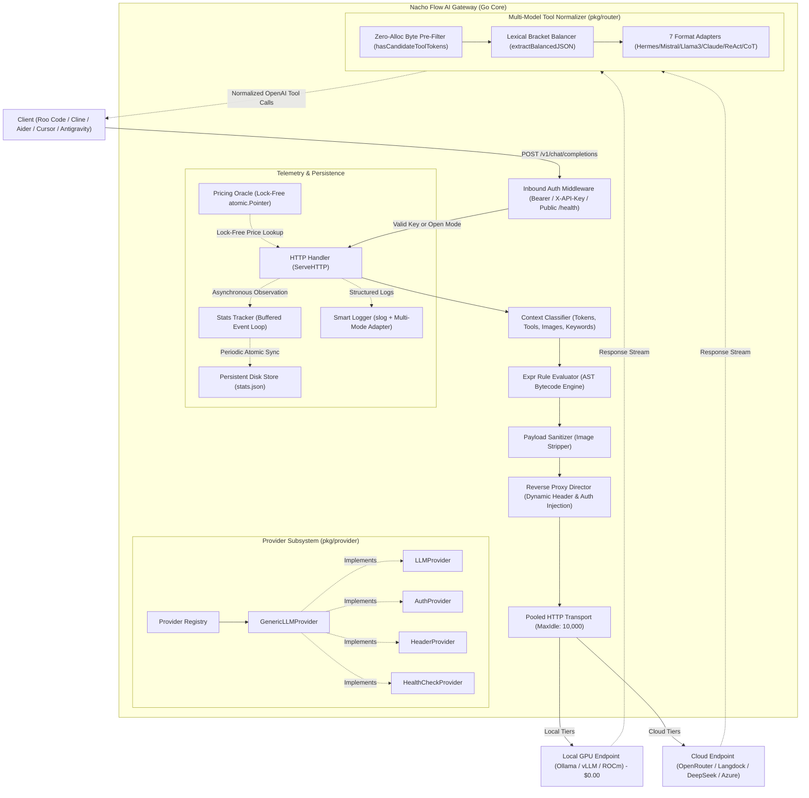

# 🌮 Nacho Flow: Architecture & System Design

This document provides a comprehensive technical overview of **Nacho Flow**'s internal architecture, capability-based provider system, execution pipeline, concurrency model, and persistent storage.

---

## 1. High-Level Architecture Diagram



---

## 2. Request Lifecycle & Pipeline Stages

Every incoming request passes through an optimized 8-stage processing pipeline before dispatch and return:

### Stage 0: Inbound Perimeter Authentication (`pkg/server/proxy.go`)
- If `auth_token` is configured in `config.yaml` or `ENV_NACHO_AUTH_TOKEN`, incoming requests must present a matching key via `Authorization: Bearer <token>`, `X-API-Key`, or `api-key`.
- Requests with invalid or missing credentials receive an OpenAI-standard `401 Unauthorized` JSON payload (`invalid_api_key`).
- Public health probes (`/health`) automatically bypass auth to facilitate orchestrator liveness checks.

### Stage 1: Context Classification (`pkg/router/classifier.go`)
- **Token Estimation**: Fast heuristic character-to-token parsing across system, user, and assistant message contents.
- **Multimodal Detection**: Scans message blocks for `image_url` payloads and base64 strings (`HasImages`).
- **Tool Calling Detection**: Inspects `tools` array and `tool_choice` parameters (`HasTools`).
- **Keyword Extraction**: Extracts high-intent programming concepts (`deadlock`, `mutex`, `race`, `concurrency`, `atomic`, `sql`, `refactor`) into a lookup slice (`Keywords`).

### Stage 2: AST-Compiled Rule Evaluation (`pkg/strategy/expr_evaluator.go`)
- Uses `github.com/expr-lang/expr` compiled bytecode expressions to evaluate 1..N tiers sequentially (*Top-to-Bottom: First Match Wins*).
- Rules execute directly in memory with sub-microsecond latency.
- Supported context variables: `Tokens`, `HasImages`, `HasTools`, `Keywords`, `Model`.

### Stage 3: Payload Sanitization & Model Rewriting (`pkg/router/sanitizer.go`)
- If the selected tier model is text-only (or `strip_images: true`), all historical images in past conversation turns are sanitized into `[Image Attached]` text placeholders.
- This prevents `400 Bad Request` crashes on cheaper cloud models or local models that lack vision encoders.
- The top-level `"model"` field in the JSON payload is rewritten to the target tier's upstream model ID.

### Stage 4: Dynamic Provider Resolution & Reverse Proxy Dispatch (`pkg/server/proxy.go`)
- Resolves the target provider from the `provider.Registry`.
- Using zero-allocation interface assertions:
  - If provider implements `AuthProvider`: Injects `Authorization: Bearer <API_KEY>`.
  - If provider implements `HeaderProvider`: Injects custom headers (`HTTP-Referer`, `X-Title`, `X-Custom-Org`).
  - If provider is local (`Type: "local"`): Inbound client auth headers are stripped so local inference engines (Ollama, llama.cpp) do not reject requests.
- Uses a shared `http.Transport` with connection pooling (`MaxIdleConns: 10000`, `MaxIdleConnsPerHost: 2000`) to guarantee zero OS socket exhaustion under massive concurrency.

### Stage 5: Universal Multi-Model Tool Normalization (`pkg/router/tool_normalizer.go`)
- **Zero-Alloc Fast Path**: If `reqCtx.HasTools` is false or the raw response bytes do not contain candidate tool markers, the parser bails out in **23.5 nanoseconds** with zero allocations.
- **Lexical Bracket Balancing**: When a local model outputs embedded tool calls in markdown or XML, `extractBalancedJSON` scans byte tokens to detect the true balanced boundaries of `{}` and `[]` structures without regex truncation bugs.
- **7 Model Format Families Supported**:
  1. *Hermes / Nous / Qwen ChatML*: `<tool_call>...</tool_call>`
  2. *Mistral / Mixtral*: `[TOOL_CALLS] [...]`
  3. *Llama 3*: `<function=name>{...}</function>`
  4. *Llama 3.1*: `<|python_tag|>name.call(k=v)`
  5. *Claude XML*: `<function_calls><invoke name="...">`
  6. *ReAct / LangChain*: `Action: ...\nAction Input: ...`
  7. *DeepSeek-R1 CoT*: Preserves `<think>...</think>` reasoning while extracting markdown code blocks.
- **OpenAI Conformance**: Converts extracted tools into strict OpenAI `tool_calls` structures with stringified `arguments`, updates `finish_reason` to `"tool_calls"`, and recalculates `Content-Length`.

### Stage 6: Response Interception & Latency Profiling
- Intercepts upstream status codes, response headers, and measures roundtrip latency.
- Injects tracking headers into client response:
  - `x-nacho-router-tier`: Name of the matched tier.
  - `x-nacho-target-model`: Actual model executed upstream.

### Stage 7: Lock-Free Pricing Calculation (`pkg/telemetry/pricing.go`)
- Queries the `PricingOracle` to compute exact prompt and completion costs.
- Lookups use `atomic.Pointer[map[string]ModelPricing]` (RCU pattern), ensuring **zero mutex locks** on the hot proxy path.

### Stage 8: Asynchronous Telemetry Ingestion & Persistence (`pkg/telemetry/metrics.go`, `pkg/store/store.go`)
- The proxy dispatches an `Observation` struct to a buffered Go channel (`chan Observation`, capacity 5,000).
- A single background event worker aggregates metrics, token counts, tier distributions, and USD savings.
- The `DiskStore` periodically syncs snapshots to `~/.config/nacho-flow/stats.json` using atomic write-to-temp-then-rename mechanics to survive unexpected reboots.

---

## 3. Provider Capability Interface Architecture (`pkg/provider`)

Adapted from the proven architecture of **Spice** (`Spice/pkg/provider`), Nacho Flow separates concerns using composable capability interfaces:

```go
type LLMProvider interface {
    ID() string
    Name() string
    BaseURL() string
    IsLocal() bool
}

type AuthProvider interface {
    GetAPIKey() string
}

type HeaderProvider interface {
    GetHeaders() map[string]string
}

type HealthCheckProvider interface {
    Ping(ctx context.Context) error
}

type PricingProvider interface {
    Name() string
    FetchPricing(ctx context.Context) (map[string]ModelPricing, error)
}
```

---

## 4. Smart Multi-Mode Logging

`nacho-flow` detects its execution context via `kardianos/service.Interactive()`:

| Mode | Trigger | Logging Destination | Features |
| :--- | :--- | :--- | :--- |
| **Interactive CLI** | Running directly in terminal | `os.Stdout` + `logs/router.log` | Structured text/JSON formatting with `lumberjack.Logger` (10MB max size, 5 rotating backups). |
| **Service Daemon** | Windows Service / systemd / launchd | OS Native System Logger | Uses an `slog.Handler` adapter routing directly to `service.Logger` (systemd journal / Windows Event Log / launchd). |

---

## 5. Autonomous Rule Optimization Subsystem (`pkg/tuner`)

The auto-tuning engine uses an **Advisory-First**, pure Go Recurrent Bandit architecture:

1. **Passive Telemetry Collector (`pkg/telemetry/traffic_log.go`)**:  
   An asynchronous `ObservationSink` capturing non-blocking metadata in `logs/traffic.jsonl` (zero code, zero prompt content).
2. **Mathematical Optimizer (`pkg/tuner/optimizer.go`)**:  
   - Computes keyword friction odds ratios to isolate high-risk domains for local models.
   - Evaluates multi-objective continuous thresholds to maximize cost savings while penalizing prompt retries.
3. **Symbolic Distiller (`pkg/tuner/distiller.go`)**:  
   - Formulates and AST-compiles mathematically optimal `expr` expressions.
4. **Advisory & Atomic Applier (`pkg/tuner/advisor.go`, `pkg/tuner/applier.go`)**:  
   - Renders formatted terminal comparison reports (`nacho-flow tune`).
   - Supports atomic config file replacement with automatic `.bak.<timestamp>` creation (`nacho-flow tune --apply`).

