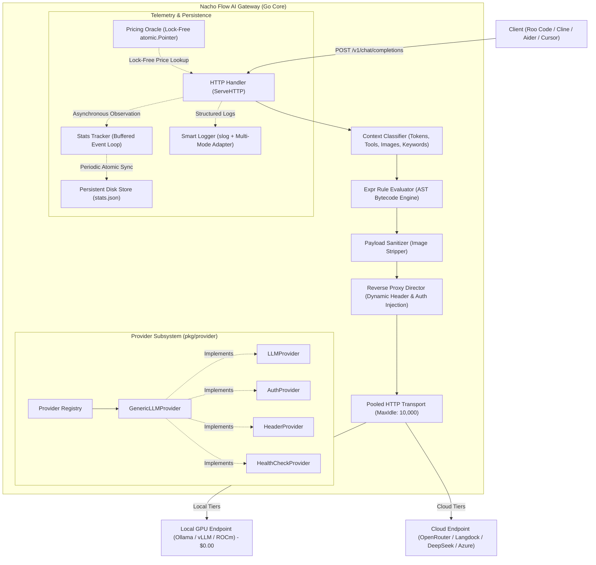

# 🌮 Nacho Flow: Architecture & System Design

This document provides a comprehensive technical overview of **Nacho Flow**'s internal architecture, capability-based provider system, execution pipeline, concurrency model, and persistent storage.

---

## 1. High-Level Architecture Diagram



---

## 2. Request Lifecycle & Pipeline Stages

Every incoming request passes through an optimized 7-stage processing pipeline before dispatch:

### Stage 1: Context Classification (`pkg/router/classifier.go`)
- **Token Estimation**: Fast heuristic character-to-token parsing across system, user, and assistant message contents.
- **Multimodal Detection**: Scans message blocks for `image_url` payloads and base64 strings (`HasImages`).
- **Tool Calling Detection**: Inspects `tools` array and `tool_choice` parameters (`HasTools`).
- **Keyword Extraction**: Extracts high-intent programming concepts (`deadlock`, `mutex`, `race`, `concurrency`, `atomic`, `sql`, `refactor`) into a lookup slice (`Keywords`).

### Stage 2: AST-Compiled Rule Evaluation (`pkg/strategy/expr.go`)
- Uses `github.com/expr-lang/expr` compiled bytecode expressions to evaluate 1..N tiers sequentially (*First Match Wins*).
- Rules execute directly in memory with sub-microsecond latency.
- Supported context variables: `Tokens`, `HasImages`, `HasTools`, `Keywords`, `Model`.

### Stage 3: Payload Sanitization & Model Rewriting (`pkg/router/sanitizer.go`)
- If the selected tier model is text-only (or `strip_images: true`), all historical images in past conversation turns are sanitized into `[Image Attached]` text placeholders.
- This prevents `400 Bad Request` crashes on cheaper cloud models or local models that lack vision encoders.
- The top-level `"model"` field in the JSON payload is rewritten to the target tier's upstream model ID.

### Stage 4: Dynamic Provider Resolution & Reverse Proxy Dispatch (`pkg/server/proxy.go`)
- Resolves the target provider from the `provider.Registry`.
- Using zero-allocation interface assertions:
  - If provider implements `AuthProvider`: Injects `Authorization: Bearer <API_KEY>`.
  - If provider implements `HeaderProvider`: Injects custom headers (`HTTP-Referer`, `X-Title`, `X-Custom-Org`).
- Uses a shared `http.Transport` with connection pooling (`MaxIdleConns: 10000`, `MaxIdleConnsPerHost: 2000`) to guarantee zero OS socket exhaustion under massive concurrency.

### Stage 5: Response Interception & Latency Profiling
- Intercepts upstream status codes, response headers, and measures roundtrip latency.
- Injects tracking headers into client response:
  - `x-nacho-router-tier`: Name of the matched tier.
  - `x-nacho-target-model`: Actual model executed upstream.
  - `x-nacho-route-reason`: Rule reason triggering the match.

### Stage 6: Lock-Free Pricing Calculation (`pkg/telemetry/pricing.go`)
- Queries the `PricingOracle` to compute exact prompt and completion costs.
- Lookups use `atomic.Pointer[map[string]ModelPricing]` (RCU pattern), ensuring **zero mutex locks** on the hot proxy path.

### Stage 7: Asynchronous Telemetry Ingestion & Persistence (`pkg/telemetry/metrics.go`, `pkg/store/store.go`)
- The proxy dispatches an `Observation` struct to a buffered Go channel (`chan Observation`, capacity 5,000).
- A single background event worker aggregates metrics, token counts, tier distributions, and USD savings.
- The `DiskStore` periodically syncs snapshots to `~/.config/nacho-flow/stats.json` using atomic write-to-temp-then-rename mechanics to survive unexpected reboots.

---

## 3. Provider Capability Interface Architecture (`pkg/provider`)

Adapted from the proven architecture of **Spice** (`Spice/pkg/provider`), Nacho Flow separates concerns using composable capability interfaces:

```go
type LLMProvider interface {
    ID() string
    Name() string
    BaseURL() string
    IsLocal() bool
}

type AuthProvider interface {
    GetAPIKey() string
}

type HeaderProvider interface {
    GetHeaders() map[string]string
}

type HealthCheckProvider interface {
    Ping(ctx context.Context) error
}

type PricingProvider interface {
    Name() string
    FetchPricing(ctx context.Context) (map[string]ModelPricing, error)
}
```

---

## 4. Smart Multi-Mode Logging

`nacho-flow` detects its execution context via `kardianos/service.Interactive()`:

| Mode | Trigger | Logging Destination | Features |
| :--- | :--- | :--- | :--- |
| **Interactive CLI** | Running directly in terminal | `os.Stdout` + `logs/router.log` | Structured text/JSON formatting with `lumberjack.Logger` (10MB max size, 5 rotating backups). |
| **Service Daemon** | Windows Service / systemd / launchd | OS Native System Logger | Uses an `slog.Handler` adapter routing directly to `service.Logger` (systemd journal / Windows Event Log / launchd). |
