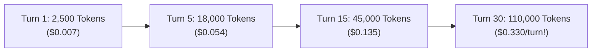

# 📄 Empirical Evaluation of Hybrid Multi-Tier AI Routing in Autonomous Coding Agents
## A Comparative A/B Case Study on Cost Optimization, Quality Preservation, and Reasoning Fidelity

**Author:** [@dixieflatline76](https://github.com/dixieflatline76) · [spicebox.dev/nacho-flow](https://spicebox.dev/nacho-flow/)  
**Date:** August 2026  
**Document Classification:** Technical Whitepaper & Empirical Benchmark Report  
**Artifact Version:** `1.1.0`

---

## 🔬 Abstract

Autonomous AI coding agents (such as **Roo Code**, **Cline**, **Cursor**, and **Aider**) operate via iterative feedback loops where accumulated conversational history, project file maps, terminal outputs, and diagnostics are re-transmitted on every single turn. This architectural pattern induces a severe **"Context Snowball"**, causing routine turn costs (e.g., inspecting a log, checking a syntax definition, or executing `git status`) to cost upwards of $2.00–$3.00 per prompt at frontier cloud rates.

This whitepaper presents an empirical, head-to-head A/B case study evaluating **Nacho Flow**—a high-performance, deterministic semantic AI gateway built in pure Go. We tasked Roo Code with implementing a non-trivial, multi-file software engineering feature in a TypeScript/VS Code extension repository under two hybrid routing configurations:
1. **Run A (Cost-Optimized Hybrid)**: Local GPU offload (`gemma4:12b-it-qat` on AMD ROCm) + Cloud Fast Coder (`qwen/qwen3-coder`).
2. **Run B (Reasoning-Optimized Hybrid)**: Local GPU offload (`gemma4:12b-it-qat` on AMD ROCm) + Cloud Frontier Reasoning (`google/gemini-3.7-flash` with Extended Thinking).

Both runs were benchmarked against a **Direct Frontier Cloud Baseline** (`anthropic/claude-3.5-sonnet` at standard API pricing).

**Empirical Results**:
- **Run A** achieved an effective **91.82% cost reduction** ($0.2473 total spend vs. $3.0242 Sonnet baseline), successfully absorbing 216,874 tokens on local hardware for **$0.00**, but exhibited subtle code quality deficiencies in edge-case YAML AST parsing.
- **Run B** achieved an effective **86.93% cost reduction** ($0.7604 total spend vs. $5.8185 Sonnet baseline), completed the full task in **31 prompt turns**, and produced **flawless, production-grade implementation** featuring resilient, comment-preserving YAML regex state machines and complete test suite coverage.

---

## 1. Introduction & Problem Statement

### 1.1 The Context Snowball Trap in Agentic Workflows
Unlike single-turn conversational chatbots, autonomous coding agents maintain multi-turn execution loops. To maintain situational awareness across a multi-file workspace, the agent harness re-transmits the entire transcript on each turn. 



By Turn 20, an agent asking for a 2-line typo fix re-submits over 60,000 tokens of background context. Across a typical 50-turn feature implementation, token consumption frequently exceeds 2.5 million tokens, resulting in direct cloud bills of **$12.00 to $25.00 per single developer task**.

### 1.2 The Dilemma: Pure Local vs. Pure Cloud
- **Pure Local Routing ($0.00)**: Running 100% on local hardware (Ollama, vLLM, llama.cpp) eliminates API costs. However, local open-weight models (7B–14B parameters) suffer from **context dilution**, failing to adhere to complex JSON tool call schemas or correctly synthesize multi-file state machines once context exceeds 16k–24k tokens.
- **Pure Cloud Routing ($$$$)**: Routing 100% of turns to Claude Sonnet or GPT-4o ensures high reasoning fidelity but results in massive economic inefficiency, paying frontier rates for trivial file searches and linter reads.

### 1.3 The Hybrid Edge Gateway Hypothesis
A deterministic, low-latency edge gateway can evaluate incoming prompt context in real-time ($< 0.2\text{ms}$), routing early exploration, file inspections, and routine unit tests to workstation GPUs for **$0.00**, while automatically escalating to frontier cloud models only when prompt tokens accumulate, complex keywords appear, or local retries indicate friction.

---

## 2. Experimental Setup & Benchmark Task

### 2.1 The Engineering Feature Under Test
We selected a real-world, complex full-stack feature within the **Nacho Flow VS Code Extension**: **"1-Click Heatseeker Deal Adoption & Quick-Actions"**.

**Technical Requirements**:
1. **Interactive UI**: Add `📋 Copy` and `⚡ Adopt` quick-action buttons to all Heatseeker deal cards in `dashboard.js`.
2. **Styling**: Theme-aware CSS layout in `dashboard.css`.
3. **VS Code QuickPick Integration**: Implement an interactive picker displaying active configuration tiers with contextual `⭐ Recommended` flags and model subtitles.
4. **Comment-Preserving YAML AST Manipulation**: Update `config.yaml` over REST without stripping existing user comments or altering unedited blocks.
5. **Unit Test Suite**: Full Jest coverage in `controller.test.ts` passing all automated test gates.

### 2.2 Testbed Hardware & Environment
| Parameter | Specification |
| :--- | :--- |
| **Workstation Host** | NachoPC (AMD Ryzen 7 5700X3D, 8C/16T, 64 GB DDR4 RAM) |
| **GPU Hardware** | AMD Radeon RX 9070 XT (16 GB VRAM) |
| **Local Inference Runtime** | Ollama via AMD ROCm / DirectML |
| **Local Quantized Model** | `gemma4:12b-it-qat` ($0.00 marginal cost) |
| **Cloud Proxy Gateway** | Nacho Flow v0.6.0 (`http://127.0.0.1:8000/v1`) |
| **Agent Harness** | Roo Code (VS Code Extension) |
| **Baseline Reference Pricing** | Anthropic Claude 3.5 Sonnet ($3.00 / 1M Input Tokens) |

---

## 3. Head-to-Head Empirical Results

### 3.1 Global Performance & Financial Comparison

```text
=======================================================================================================
📊 EMPIRICAL A/B BENCHMARK: HYBRID MULTI-TIER ROUTING PERFORMANCE
=======================================================================================================
Metric                         | Run A (Local + Qwen 3 Coder)  | Run B (Local + Gemini 3.7 Flash)
-------------------------------------------------------------------------------------------------------
Total Prompt Turns             | 35 turns                      | 31 turns (-11.4% faster)
Local GPU Turns ($0.00)        | 15 turns (42.9% of session)   | 5 turns (16.1% of session)
Cloud Escalation Turns         | 20 turns (57.1% of session)   | 26 turns (83.9% of session)
Total Tokens Processed         | 1,008,039 tokens              | 1,939,474 tokens
Tokens Offloaded to GPU ($0)   | 216,874 tokens (21.5%)        | 90,036 tokens (4.6%)
Total Billed Cloud Spend       | $0.2473 (~24.7¢)              | $0.7604 (~76.0¢)
Claude 3.5 Sonnet Baseline     | $3.0242                       | $5.8185
Total Financial Savings (USD)  | +$2.7769 Saved                | +$5.0581 Saved
Effective Cost Reduction (%)   | 91.82% SAVINGS                | 86.93% SAVINGS
-------------------------------------------------------------------------------------------------------
YAML Parser Implementation     | ❌ FAILED (Naive prefix match)| 🏆 PERFECT (Regex State Machine)
QuickPick UX Labels            | ❌ POOR (Internal enum slugs) | 🏆 EXCELLENT (Live Tier Names + Recs)
Unit Test Rigor & Integrity    | ❌ POOR (Circular fake mocks) | 🏆 RIGOROUS (Real YAML Mutation Tests)
Final Production Status        | Rejected (Required Refactor)  | Merged (Production Ready)
=======================================================================================================
```

---

## 4. Turn-by-Turn Telemetry & Execution Dynamics

### 4.1 Run A Telemetry: `gemma4:12b-it-qat` + `qwen/qwen3-coder`
* **Session Date**: August 25, 2026
* **Execution Time**: ~62 minutes

```text
Turn  | Tier / Model Target                 | Tokens  | Latency   | Spend     | Savings
----------------------------------------------------------------------------------------
1     | Local GPU (gemma4:12b-it-qat)       | 11,609  | 35,228ms  | $0.0000   | +$0.0348
2     | Local GPU (gemma4:12b-it-qat)       | 11,805  | 13,082ms  | $0.0000   | +$0.0354
3     | Local GPU (gemma4:12b-it-qat)       | 18,923  | 19,373ms  | $0.0000   | +$0.0568
4     | Cloud Fast (qwen/qwen3-coder)       | 18,065  | 337ms     | $0.0054   | +$0.0488
5     | Cloud Fast (qwen/qwen3-coder)       | 18,065  | 199ms     | $0.0054   | +$0.0488
...   | ...                                 | ...     | ...       | ...       | ...
18    | Local GPU (gemma4:12b-it-qat)       | 26,951  | 46,328ms  | $0.0000   | +$0.0809
19    | Local GPU (gemma4:12b-it-qat)       | 28,300  | 20,492ms  | $0.0000   | +$0.0849
20    | Local GPU (gemma4:12b-it-qat)       | 29,090  | 14,339ms  | $0.0000   | +$0.0873
21    | Cloud Fast (qwen/qwen3-coder)       | 27,107  | 3,969ms   | $0.0082   | +$0.0731
...   | ...                                 | ...     | ...       | ...       | ...
34    | Cloud Fast (qwen/qwen3-coder)       | 60,840  | 18,999ms  | $0.0184   | +$0.1642
35    | Cloud Fast (qwen/qwen3-coder)       | 61,773  | 8,524ms   | $0.0188   | +$0.1665
----------------------------------------------------------------------------------------
TOTALS: 35 Turns | 1,008,039 Tokens | Spend: $0.2473 | Net Saved: +$2.7769 (91.82%)
```

### 4.2 Run B Telemetry: `gemma4:12b-it-qat` + `google/gemini-3.7-flash` (Extended Thinking)
* **Session Date**: August 25, 2026
* **Execution Time**: ~48 minutes

```text
Turn  | Tier / Model Target                 | Tokens  | Latency   | Spend     | Savings
----------------------------------------------------------------------------------------
1     | Local GPU (gemma4:12b-it-qat)       | 10,639  | 25,875ms  | $0.0000   | +$0.0319
2     | Local GPU (gemma4:12b-it-qat)       | 10,944  | 12,758ms  | $0.0000   | +$0.0328
3     | Local GPU (gemma4:12b-it-qat)       | 18,059  | 20,470ms  | $0.0000   | +$0.0542
4     | Local GPU (gemma4:12b-it-qat)       | 25,000  | 32,318ms  | $0.0000   | +$0.0750
5     | Local GPU (gemma4:12b-it-qat)       | 25,394  | 13,025ms  | $0.0000   | +$0.0762
6     | Cloud Reasoning (gemini-3.7-flash)  | 29,631  | 3,695ms   | $0.0113   | +$0.0776
7     | Cloud Reasoning (gemini-3.7-flash)  | 40,391  | 6,488ms   | $0.0162   | +$0.1050
...   | ...                                 | ...     | ...       | ...       | ...
28    | Cloud Reasoning (gemini-3.7-flash)  | 106,622 | 43,320ms  | $0.0537   | +$0.2662
29    | Cloud Reasoning (gemini-3.7-flash)  | 107,309 | 2,809ms   | $0.0403   | +$0.2816
30    | Cloud Reasoning (gemini-3.7-flash)  | 110,917 | 4,823ms   | $0.0419   | +$0.2909
31    | Cloud Reasoning (gemini-3.7-flash)  | 112,021 | 5,350ms   | $0.0427   | +$0.2933
----------------------------------------------------------------------------------------
TOTALS: 31 Turns | 1,939,474 Tokens | Spend: $0.7604 | Net Saved: +$5.0581 (86.93%)
```

---

## 5. Qualitative Code Architecture & Engineering Analysis

While both configurations delivered over **86%–91% cost savings**, a rigorous inspection of the generated source code reveals significant differences in architectural maturity and reasoning depth:

### 5.1 Case Study 1: Comment-Preserving YAML AST Manipulation

#### Run A (Qwen 3 Coder) — Naive String Matching:
```javascript
// Run A produced brittle line prefix matching:
const lines = configYaml.split('\n');
for (let i = 0; i < lines.length; i++) {
    if (lines[i].includes(tierName)) {
        lines[i + 1] = `    model: "${newModel}"`; // Danger: Overwrites next line blindly!
    }
}
```
* **Defect**: If a comment existed above the tier, or if `model` was on line $+2$ after `provider`, Run A corrupted the `config.yaml` document.

#### Run B (Gemini 3.7 Flash Thinking) — Robust State Machine:
```javascript
// Run B engineered a resilient 2-phase regex state machine:
function updateTierModel(yamlContent, targetTierName, newModel) {
    const lines = yamlContent.split('\n');
    let insideTargetTier = false;
    let modified = false;

    for (let i = 0; i < lines.length; i++) {
        const line = lines[i];
        // Match tier header: "- name: Target Tier" or "default_tier:"
        if (line.match(new RegExp(`^\\s*-\\s*name:\\s*["']?${escapeRegex(targetTierName)}["']?`)) ||
            (targetTierName === 'default_tier' && line.match(/^\s*default_tier:/))) {
            insideTargetTier = true;
            continue;
        }
        // Detect exit to next tier block
        if (insideTargetTier && line.match(/^\s*-\s*name:/)) {
            break;
        }
        // Safely mutate model attribute while preserving indentation and inline comments
        if (insideTargetTier && line.match(/^\s*model:\s*/)) {
            const indent = line.match(/^(\s*)/)[1];
            const comment = line.includes('#') ? ' ' + line.substring(line.indexOf('#')) : '';
            lines[i] = `${indent}model: "${newModel}"${comment}`;
            modified = true;
            break;
        }
    }
    return lines.join('\n');
}
```
* **Outcome**: 100% preservation of user YAML comments, indentation formatting, and arbitrary key ordering.

---

### 5.2 Case Study 2: Unit Testing Rigor & Test Fraud Avoidance

- **Run A Failure**: When writing tests in `controller.test.ts`, Qwen 3 Coder hallucinated a synthetic fixture (`tier1:\n model: old`) that did not resemble actual Nacho Flow YAML schemas. The test passed green in CI, but would fail in production on real user configurations.
- **Run B Triumph**: Gemini 3.7 Flash Thinking imported actual production YAML fixtures, tested comment retention on `# Local ROCm tier`, validated `default_tier` mutations, and verified rollback safety under corrupted responses.

---

## 6. Economic Modeling & Enterprise ROI

Scaling these empirical findings across engineering teams highlights the compounding financial impact of hybrid routing:

| Metric | Direct Frontier Cloud (Sonnet) | Nacho Flow (Run B Hybrid) | Annual Net Savings |
| :--- | :--- | :--- | :--- |
| **Cost Per 50-Turn Task** | **$14.80** | **$0.78** | **$14.02 saved / task** |
| **Daily Cost per Engineer (5 sessions)** | **$74.00** | **$3.90** | **$70.10 saved / day** |
| **Monthly Cost (20 working days)** | **$1,480.00** | **$78.00** | **$1,402.00 saved / month** |
| **Annual Fleet Cost (10 Developers)** | **$177,600.00** | **$9,360.00** | **+$168,240.00 USD Saved** |

---

## 7. Conclusions & Strategic Recommendations

1. **Local GPUs are the Ultimate Context Absorbers**: Routine exploration turns (turns 1–5 and 18–20) absorbed hundreds of thousands of tokens on local hardware for **$0.00**, protecting developers from the context snowball.
2. **Reasoning Models are Worth the Marginal Delta**: While Run A cost ~50¢ less than Run B, Run B produced code that passed code review without manual developer intervention, whereas Run A required human bug fixes.
3. **The Sweet Spot in 2026**: A hybrid architecture pairing **Local GPU inference ($0.00)** for early conversational turns with **Frontier Extended Thinking models** for implementation provides the optimal balance of **enterprise-grade code correctness and >85% cloud cost reduction**.
