# 🧑‍💻 A Day in the Life of a Developer: Mastering Nacho Flow & HotSauce Directives

This guide illustrates a realistic, end-to-end workday using **Nacho Flow** alongside autonomous coding agents ([Cline](https://github.com/cline/cline), [Zoo Code](https://zoocode.dev), [Cursor](https://cursor.com), or [Aider](https://github.com/paul-gauthier/aider)). It demonstrates how automatic routing and agent defenses save money on autopilot, and how **🌶️ HotSauce Directives** provide precision steering when you need it.

---

## 🎭 The Persona & Setup

- **Developer**: Alex, Senior Systems Engineer.
- **Project**: High-throughput distributed event pipeline in Go.
- **Hardware**: Workstation with an RTX 4080 (16GB VRAM) running [Ollama](https://ollama.com) (`gemma4:12b-it-qat` or `qwen2.5-coder:14b`).
- **Cloud Gateway**: Single [OpenRouter](https://openrouter.ai) API key covering frontier models (Claude 3.7 Sonnet, DeepSeek-R1, Gemini 2.5 Flash).
- **Agent Config**: Base URL set to `http://127.0.0.1:8000/v1`, Model ID: `nacho-hybrid`.
- **VS Code Extension**: Nacho Flow Companion installed, live telemetry visible in the Status Bar.

```mermaid
flowchart TD
    subgraph Workday["A Day with Nacho Flow"]
        M1["<b>09:00 AM: Scaffolding & Exploration</b><br/>Read 25 files, grep schemas<br/><i>Plan-Mode Protection: Local GPU ($0.00)</i>"]
        M2["<b>10:30 AM: Architecture Decision</b><br/><code>@nacho:frontier</code><br/><i>Single Turn: Claude 3.7 Sonnet</i>"]
        M3["<b>11:45 AM: Autonomous TDD Loop</b><br/>Test fails twice &rarr; Root-Task Escalation<br/><i>Auto-Escalates to Frontier & Fixes Deadlock</i>"]
        M4["<b>01:15 PM: Midday Telemetry Check</b><br/><code>@nacho:status</code> & <code>@nacho:deals</code><br/><i>$15.48 Saved (97.8% Reduction)</i>"]
        M5["<b>02:00 PM: Invisible Senior Review</b><br/>15th Write &rarr; 🧚 Fairy Dusting<br/><i>Proactive Frontier Quality Checkpoint</i>"]
        M6["<b>02:45 PM: Concurrency Proof</b><br/><code>@nacho:reasoning</code><br/><i>Routed: DeepSeek-R1 / o3-mini</i>"]
        M7["<b>03:30 PM: Runaway Loop Intercepted</b><br/>Repetition Loop &rarr; ⚡ Cycle Killer<br/><i>Kills Loop in &lt; 3s ($0.00 Waste)</i>"]
        M8["<b>04:15 PM: Systems Hacking & Guardrails</b><br/><code>@nacho:raw</code> & <code>@nacho:shield-off</code><br/><i>Raw SSE Streams & Headless CI</i>"]
        M9["<b>05:00 PM: Task Completion & Boundary</b><br/>Click '+' New Task &rarr; Auto-Reset<br/><i>Ready for Next Feature</i>"]
    end

    M1 --> M2 --> M3 --> M4 --> M5 --> M6 --> M7 --> M8 --> M9
```



---

## ☕ 09:00 AM — Morning Exploration & Zero-Cost Scaffolding

### The Scenario
Alex opens VS Code to tackle a new feature: refactoring the event pipeline's ring buffer to support dynamic backpressure. Alex prompts Cline:

> *"Audit our current pubsub worker implementation across `pkg/worker/`, list all bottlenecks, and draft an architectural refactor plan."*

### What Happens Automatically
1. **Plan-Mode Auto-Detection**: Cline switches to Architect/Plan mode and issues 25 consecutive tool calls (`read_file`, `list_directory`, `grep_search`).
2. **Local GPU Workhorse ($0.00)**: Because these turns declare read-only tools and involve routine inspection, Nacho Flow routes **100% of these turns to the local GPU** (`gemma4:12b-it-qat`).
3. **No False Interruptions**: Nacho Flow detects that the client declared read-only tools (`HasWriteCapability == false`) and **automatically suppresses Kickstart idle escalation**. The agent explores uninterrupted for 25 turns with zero false `[SYSTEM OVERRIDE]` prompts.

> **Alex's Cost**: **$0.00** across 25 turns (saving ~$1.80 on cloud context resends).

---

## 🏛️ 10:30 AM — The Architectural Dilemma: Splashing `@nacho:frontier`

### The Scenario
The agent presents two alternative refactoring strategies:
1. Mutex-protected ring buffer.
2. Lock-free ring buffer with CAS (Compare-And-Swap) head/tail pointers.

Alex wants a definitive, high-reasoning architectural critique from a world-class model before committing to an approach. Alex doesn't want to open VS Code settings, switch model dropdowns, or restart the agent session.

Alex simply types into chat:

```markdown
@nacho:frontier Compare lock-free CAS ring buffers vs channel fan-out for 100k msg/sec in Go. Propose the optimal memory layout to avoid false sharing on 64-byte cache lines.
```

### What Happens Under the Hood
1. **Microsecond Directive Extraction**: In $< 70\text{ ns}$, Nacho Flow's zero-alloc directive parser detects `@nacho:frontier`.
2. **Clean Prompt Sanitization**: The `@nacho:frontier` tag is stripped from the prompt before dispatching to upstream providers. The LLM receives a clean prompt and is completely unaware of proxy mechanics.
3. **Targeted Elevation**: Nacho Flow routes this single turn directly to **Tier 4 / Claude 3.7 Sonnet**.
4. **90% Prompt Cache Multiplier**: Because Nacho Flow operates with 100% pristine context preservation, the 25 preceding turns stored in conversation history hit OpenRouter's prompt cache at a 90% discount.
5. **Result**: Alex receives an elite, production-grade memory layout design with cache line padding (`cpu.CacheLinePad`).

> **Takeaway**: Alex got frontier intelligence for the single turn that mattered, without paying frontier prices for the 25 turns that preceded it.

---

## ⚡ 11:45 AM — Autonomous TDD Loop & Self-Healing Session Escalation

### The Scenario
Alex approves the plan: *"Proceed with implementing the padded lock-free buffer and write full unit and benchmark tests."*

The agent enters the autonomous coding loop:
- **Turn 1**: Writes `pkg/ringbuffer/buffer.go` using Tier 2 (Qwen 3 Coder Plus).
- **Turn 2**: Writes `pkg/ringbuffer/buffer_test.go` and executes `go test -race ./...`.
- **The Failure**: The test fails with a data race on line 84 (`DATA RACE: Write at 0x00c000...`).
- **Turn 3**: The agent tries to patch line 84, but runs tests again and encounters a deadlock (`fatal error: all goroutines are asleep - deadlock!`).

### The Magic of Root-Task Session Fingerprinting
In previous routers, because each test failure produced different error output, the proxy thought each turn was a "new user prompt" and repeatedly wiped retry counters to 0, permanently trapping the agent in the cheaper tier.

**With Nacho Flow's Root-Task Fingerprinting**:
1. Nacho Flow checks `RootPromptHash` (the fingerprint of the initial task prompt). It recognizes this is the **same ongoing task**.
2. Because `hasToolProgress` was false across consecutive turns, `RetriesCount` increments: `1` $\rightarrow$ `2`.
3. Reaching `retries >= 2`, Nacho Flow **automatically escalates to Tier 3 (Frontier)** without any human intervention!
4. Claude 3.7 Sonnet analyzes the race trace, spots the lock ordering inversion across the CAS cycle, and writes the correct memory barrier fix.
5. On **Turn 4**, `go test -race ./...` passes! With forward progress established (`hasToolProgress == true`), Nacho Flow cleanly resets the retry counter back to `0`, returning subsequent routine tasks to Tier 2.

```text
Turn 1: Write initial code     -> Tier 2 (Qwen Coder)      [Retries = 0]
Turn 2: Run tests (FAIL: Race) -> Tier 2 (Qwen Coder)      [Retries = 1]
Turn 3: Run tests (FAIL: Dead) -> Tier 3 (Claude Sonnet)   [AUTO-ESCALATED: Retries = 2]
Turn 4: Fix applied & PASS     -> Tier 2 (Qwen Coder)      [RESET: Retries = 0]
```

---

## 📊 01:15 PM — Zero-Cost Midday Telemetry & Heat Seeker (`@nacho:status` & `@nacho:deals`)

### The Scenario
Before heading to lunch, Alex glances at the **VS Code Status Bar Item**:
`🌮 Nacho Flow: $0.34 (97.8% Saved) • Local GPU: 76.5%`

Alex wants the full breakdown without digging through terminal logs or running curl commands. Alex types directly into the agent chat prompt:

```text
@nacho:status
```

### The In-Process Response ($0.00 / $< 1\text{ ms}$)
Nacho Flow intercepts the command locally. It consumes **0 upstream tokens** and costs **$0.00**, returning instant formatted markdown:

```markdown
🌮 Nacho Flow Status

• Uptime: 4h 15m (Daemon v1.2.0)
• Total Requests: 64
• Local GPU Turns: 49 (76.5%)
• Cloud Workhorse Turns: 12 (18.8%)
• Frontier Escalations: 3 (4.7%)
• Cumulative Spend: $0.34
• Estimated Direct Cloud Cost: $15.82
• Total Savings: $15.48 (97.8% Spend Reduction)

Active Circuits:
• ollama: OK (Healthy, 18ms latency)
• openrouter: OK (Healthy, 840ms latency)
```

Alex also checks for real-time spot discounts:
```text
@nacho:deals
```
Nacho Flow outputs live spot market discounts discovered by Heat Seeker across OpenRouter and DeepSeek.

---

## 🧚 02:00 PM — The Invisible Senior Code Review (Fairy Dusting in Action)

### The Scenario
Back from lunch, Alex tasks the agent with wiring the new ring buffer into the HTTP intake handlers and writing comprehensive load tests. The agent performs 15 continuous code modifications across multiple files.

### What Happens Automatically
On the **15th file write**, Nacho Flow's **Fairy Dusting engine** triggers in the background:
1. **Automatic Tactical Checkpoint**: Without Alex having to prompt or interrupt, Nacho Flow automatically swaps in **Claude Sonnet 5** for that single turn.
2. **The Catch**: Claude reviews the modified code and flags a subtle vulnerability: if an upstream context cancellation occurs while the queue is draining, a double-close panic could occur on `chDone`. Claude injects a `sync.Once` guard around the shutdown handler.
3. **Session Resumes**: With the quality checkpoint complete, Nacho Flow seamlessly routes the next routine turn back to the local workhorse.

> Alex inspects active guardrails at any time by typing `@nacho:toggles` in chat. If Alex ever wants to pause checkpoints during a scratch experiment, `@nacho:fairydust-off` pauses it for the session.

---

## 🔬 02:45 PM — Algorithmic Invariant Proof: Splashing `@nacho:reasoning`

### The Scenario
Alex is reviewing the ring buffer implementation and spots a theoretical concurrency edge case:
*"On 32-bit architectures, could a 64-bit atomic monotonic counter sequence wrap around or cause torn reads under extreme load?"*

Alex wants formal mathematical chain-of-thought reasoning:

```markdown
@nacho:reasoning Provide a formal invariant proof regarding 64-bit monotonic sequence wrap-around under 100M ops/sec. What is the MTBF (Mean Time Between Failures) until sequence collision?
```

### What Happens
- Nacho Flow recognizes `@nacho:reasoning`.
- The request is routed directly to **DeepSeek-R1** (or **OpenAI o3-mini**).
- The model outputs extended `<think>` reasoning tokens proving that at 100M ops/sec, a $2^{64}-1$ counter takes over **5,800 years** to overflow.
- Nacho Flow's stream normalizer formats the thinking channel cleanly into the agent IDE.

---

## ⚡ 03:30 PM — Runaway Monologue Averted (Cycle Killer in Action)

### The Scenario
While generating mock benchmark payloads, the local model encounters an unclosed JSON tag in its response and starts looping:
```text
Reading benchmark fixture file...
Reading benchmark fixture file...
Reading benchmark fixture file...
```
Under an unmanaged proxy, an autonomous model trapped in a repetitive tool loop can generate 3,000+ wasted tokens and burn 100% GPU compute for several minutes.

### The In-Flight Defense
1. **RFC-002 In-Flight Detection**: Nacho Flow's **Cycle Killer** analyzes streaming token n-grams in real time.
2. **Instant Interception (< 3 Seconds)**: In under 3 seconds, Cycle Killer detects the repeating 3-gram threshold, terminates the HTTP connection to Ollama, and injects a clean recovery notification banner into the IDE:
   ```text
   ⚠️ [CYCLE KILLER] Runaway loop intercepted. Monologue terminated to preserve compute.
   ```
3. **Loop Cleared**: The agent harness receives the notification, backs off, corrects its tool arguments, and continues working with zero manual intervention required.

---

## 🛠️ 04:15 PM — Systems Hacking, Guardrails & Typo Safety

### The Scenario
Alex finishes the core feature and starts writing custom streaming integration tests for an internal SSE consumer.

1. **Inspecting Raw Stream Packets (`@nacho:raw`)**:
   Alex wants to verify that the upstream provider's raw token chunks match HTTP/1.1 SSE specifications without any of Nacho Flow's normalizers or thinking healers touching the bytes:
   ```markdown
   @nacho:raw Stream back the numbers 1 to 10 with 100ms delay.
   ```
   *Nacho Flow switches to full transparent pass-through for that single turn.*

2. **Headless CI Batch Scripts (`@nacho:shield-off`)**:
   Alex runs an automated evaluator script that tests model accuracy against 50 prompts. Because the script is automated and has no human operator, Alex doesn't want the agent shield to synthesize interactive follow-up questions if a model ends its response with a question:
   ```markdown
   @nacho:shield-off Evaluate the benchmark suite in batch mode.
   ```
   *Nacho Flow pauses synthetic tool call synthesis for the duration of the session.*

3. **Typo Safety (Levenshtein Distance)**:
   Typing fast, Alex enters:
   ```text
   @nacho:statuss
   ```
   Nacho Flow's built-in typo matcher responds instantly ($0.00, 0 tokens):
   *\"🌮 Unrecognized directive `@nacho:statuss`. Did you mean `@nacho:status`?\"*

4. **Strict Circuit Alert (Fallback Bypass)**:
   Alex tests what happens if the local GPU is offline by stopping Ollama and typing `@nacho:local Run sanity check`. Instead of silently falling back to Claude and charging Alex's credit card, Nacho Flow respects the strict directive and returns an immediate zero-cost alert:
   *\"⚠️ Local provider circuit is OPEN (Ollama unreachable at 127.0.0.1:11434). Fallback bypassed per strict directive.\"*

---

## 🏁 05:00 PM — Finishing the Feature & The Clean Boundary Reset

### The Scenario
The ring buffer is fully implemented, reviewed by Fairy Dusting, and benchmarked. Alex commits the code, creates a pull request, and clicks `+` (**New Task**) in Zoo Code to start reviewing team PRs.

### Automatic Boundary Deduction vs. Manual Reset
- **Automatic ($0$ Effort)**:
  When Alex clicks "New Task", the agent harness wipes the conversation transcript back to Turn 1. Nacho Flow observes the message count drop ($78 \rightarrow 1$) and automatically resets `RetriesCount = 0`, `MinRetriesFloor = 0`, and updates `RootPromptHash` to the new PR review task. Alex didn't have to touch a single configuration switch.
- **Manual Escape Hatch (`@nacho:reset`)**:
  If Alex ever wants to manually clear all session counters, cooldowns, and guardrails mid-chat, typing:
  ```text
  @nacho:reset
  ```
  instantly restores all guardrail toggles to defaults and zeroes out all session retry counters and root task fingerprints.

---

## 📖 Quick Reference: HotSauce Directives Cheat Sheet

| What You Want to Do | How to Do It | Cost |
| :--- | :--- | :--- |
| **Normal coding, editing, and debugging** | *Just type your prompt normally.* Handled automatically by AST rules. | Local: **$0.00**<br/>Cloud: Pennies |
| **Get high-level architecture advice** | `@nacho:frontier <your question>` | Single-turn cloud cost |
| **Solve a deep logic, math, or concurrency proof** | `@nacho:reasoning <your prompt>` | Single-turn reasoning cost |
| **Force local execution (strict $0.00)** | `@nacho:local <your prompt>` | **$0.00** |
| **Force cloud workhorse execution** | `@nacho:cloud <your prompt>` | Standard cloud cost |
| **Route to a specific model ID** | `@nacho:model="anthropic/claude-3-7-sonnet" <prompt>` | Provider spot rate |
| **Check how much money you've saved** | `@nacho:status` *(in chat)* | **$0.00** (Local, $< 1\text{ ms}$) |
| **Inspect active guardrail switches** | `@nacho:toggles` *(in chat)* | **$0.00** (Local, $< 1\text{ ms}$) |
| **Hard reset session retries & switches** | `@nacho:reset` *(in chat)* | **$0.00** (Local, $< 1\text{ ms}$) |
| **Benchmark raw SSE streams without proxy healing**| `@nacho:raw <prompt>` | Standard turn cost |
| **Run automated/batch headless scripts** | `@nacho:shield-off <prompt>` | Standard turn cost |
| **Pause/resume Fairy Dusting code reviews** | `@nacho:fairydust-off` / `on` | **$0.00** (Local switch) |
| **Pause/resume Kickstart stall recovery** | `@nacho:kickstart-off` / `on` | **$0.00** (Local switch) |
| **Pause/resume Cycle Killer loop defense** | `@nacho:cyclekiller-off` / `on` | **$0.00** (Local switch) |
