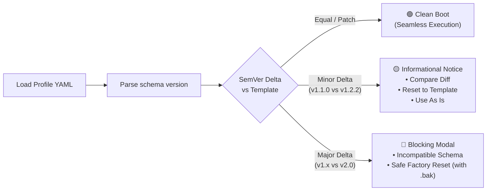

# 🧩 Nacho Flow: VS Code Companion Extension Guide

The **Nacho Flow VS Code Companion Extension** delivers a high-visibility, zero-latency control hub and analytics dashboard for your agent supervisor and model dispatcher. It bridges local GPU inference ([Ollama](https://ollama.com), [vLLM](https://github.com/vllm-project/vllm), [llama.cpp](https://github.com/ggerganov/llama.cpp)) and flagship cloud APIs ([OpenRouter](https://openrouter.ai), [DeepSeek](https://www.deepseek.com), [Anthropic](https://www.anthropic.com)) directly inside VS Code and Cursor.


---

## 📑 Table of Contents

1. [Architectural Doctrine: The Thin Client](#1-architectural-doctrine-the-thin-client)
2. [Installation & Quick Start](#2-installation--quick-start)
3. [Sidebar Control Hub (Activity Bar)](#3-sidebar-control-hub-activity-bar)
   - [3.1 Model Dispatcher Lifecycle (Local vs. Remote Server)](#31-model-dispatcher-lifecycle-local-vs-remote-server)
   - [3.2 User-Configurable Profiles & 1-Click Switching (Profile 1, Profile 2, Profile 3)](#32-user-configurable-profiles--1-click-switching-profile-1-profile-2-profile-3)
   - [3.3 🏆 Recommended Local Model for 16GB Cards: Gemma 4 12B IT QAT & Perfected Ollama Tuning](#33--recommended-local-model-for-16gb-cards-gemma-4-12b-it-qat--perfected-ollama-tuning)
   - [3.4 Coding Agent Pairing (Zoo Code, Cline, Cursor, Aider)](#34-coding-agent-pairing-zoo-code-cline-cursor-aider)
   - [3.5 Maintenance & System Operations](#35-maintenance--system-operations)
4. [Real-Time Analytics Dashboard (`Ctrl+Shift+P` → `Show Dashboard`)](#4-real-time-analytics-dashboard)
   - [4.1 Flight Instruments & Time-Window Telemetry](#41-flight-instruments--time-window-telemetry)
   - [4.2 Cycle Killer Defense & Local Self-Healing](#42-cycle-killer-defense--local-self-healing)
   - [4.3 🗜️ Nacho Token Saver (NTS) Live Telemetry Panel](#43-nacho-token-saver-nts-live-telemetry-panel)
   - [4.4 Live Route History Inspector](#44-live-route-history-inspector)
   - [4.5 🔥 Heat Seeker: Live Model Deals & 1-Click Tier Adoption](#45--heat-seeker-live-model-deals--1-click-tier-adoption)
   - [4.6 🎛️ 1-Click Auto-Tuning Optimizer](#46-️-1-click-auto-tuning-optimizer)
   - [4.7 Interactive Circuit Breaker Management](#47-interactive-circuit-breaker-management)
5. [Status Bar HUD & QuickPick Menu](#5-status-bar-hud--quickpick-menu)
6. [Direct In-Chat Control Directives (`@nacho:`)](#6-direct-in-chat-control-directives-nacho)
7. [Command Palette Reference](#7-command-palette-reference)
8. [Configuration Settings (`settings.json`)](#8-configuration-settings-settingsjson)
9. [Troubleshooting & Pro Tips](#9-troubleshooting--pro-tips)

---

## 1. Architectural Doctrine: The Thin Client

The Nacho Flow extension strictly adheres to the **Thin-Client Doctrine**:

1. **Single Source of Truth**: All routing rules, token boundaries, and provider settings reside exclusively in YAML configuration (`config.yaml`). Zero duplicate routing state is stored in VS Code workspace settings.
2. **Zero Core Logic in TypeScript**: All prompt token estimations, XML/JSON tool normalizations, in-flight loop detection, and cost calculations execute in compiled Go inside the high-performance daemon.
3. **Reactive SSE Transport (Zero Polling)**: The webview and status bar subscribe to Server-Sent Events (SSE) over `/events`. When no LLM traffic flows, the extension consumes **0.0% CPU** and zero battery.

---

## 2. Installation & Quick Start

### Step 1: Install Extension
Install from the Visual Studio Code Marketplace or via command line:
```bash
code --install-extension dixieflatline76.nacho-flow
```
*(Or install the packaged `.vsix` release from GitHub Releases).*

### Step 2: Open Sidebar
Click the **🌮 Nacho Flow** icon in the VS Code Activity Bar (left sidebar).

### Step 3: Launch Local Gateway or Connect Remote
- **Local Mode (Default)**: Click **`▶ Start`** to spawn the bundled native `nacho-flow` binary.
- **Remote Mode**: Select **Remote Server**, enter your daemon URL (e.g. `http://192.168.0.205:8000`), optional Bearer Auth Token, and click **💾 Save Remote Server**.

### Step 4: Point Your Coding Agent
In the sidebar under **3. Coding Agents**, click the **📋 Copy** buttons to copy **Base URL**, **API Key**, and **Model ID** (`nacho-hybrid`), then paste them into Zoo Code, Cline, Cursor, or Aider.

---

## 3. Sidebar Control Hub (Activity Bar)

The sidebar provides immediate visibility and one-click controls without obscuring your editor workspace:

### 3.1 Model Dispatcher Lifecycle (Local vs. Remote Server)

The extension lets you toggle seamlessly between running a local workstation instance or connecting to a shared team gateway:

```text
[🌐 1. Model Dispatcher]
  (•) This Machine      ( ) Remote Server
  [▶ Start] [⏹ Stop] [🔄 Restart] [📄 Logs]
```

#### Mode A: "This Machine" (Embedded Daemon)
- **`▶ Start`**: Launches the local `nacho-flow` binary in the background. The live status chip switches from `⚪ Engine Offline` to `🟢 Engine Online`.
- **`⏹ Stop`**: Gracefully terminates the running local daemon.
- **`🔄 Restart`**: Restarts the local binary and reloads all configuration atomically.
- **`📄 Logs`**: Opens an interactive streaming output channel in VS Code displaying real-time, color-coded daemon logs, token volumes, routing decisions, and latencies. (For physical files on disk, see [Where to Find Runtime Logs on Disk](#6-where-to-find-runtime-logs-on-disk-routerlog--trafficjsonl)).

> [!NOTE]
> **Local Machine Security Isolation (`127.0.0.1`)**:
> - By default, the embedded daemon binds strictly to `127.0.0.1` (local machine only). This guarantees local security isolation and eliminates OS inbound network firewall consent prompts (such as Windows Defender Firewall).
> - **LAN Access**: If you wish to expose the daemon to other machines on your local network (e.g. secondary laptops or remote agent test harnesses), set `host: "0.0.0.0"` in `config.yaml` or launch with `nacho-flow -host 0.0.0.0`.

#### Mode B: "Remote Server" (Team / Home Lab Gateway)
For developers hosting Nacho Flow on a dedicated GPU server, home lab workstation, or cloud VPS:
1. Select **Remote Server**.
2. Enter your **Server Endpoint URL** (e.g. `http://192.168.1.100:8000` or a Tailscale URL `http://nacho-gpu.internal:8000`).
3. Enter your **Bearer Auth Token** if inbound authentication is enabled in the server's `config.yaml` (use the eye icon to toggle visibility).
4. Click **`⚡ Test`** to perform an instant pre-flight ping.
5. Click **`💾 Save Remote Server`** to persist your remote configuration.

> [!TIP]
> **Persistent Engine Isolation & Auto-Resume**:
> - **State Persistence**: The running state of the local engine is remembered across VS Code restarts. If the engine was running when you closed VS Code, it will automatically resume on next startup (controlled by `nachoFlow.autoStartDaemon`).
> - **Resource Isolation**: Switching from "This Machine" to "Remote Server" automatically stops the local daemon to free ports and local GPU resources, while safely preserving your local run intent so that switching back to "This Machine" seamlessly resumes the engine.

---

### 3.2 User-Configurable Profiles & 1-Click Switching (Profile 1, Profile 2, Profile 3)

Nacho Flow features three independent, fully customizable configuration profiles (`profile1.yaml`, `profile2.yaml`, `profile3.yaml`) that can be switched on the fly with **native process isolation, zero configuration drift, and factory template synchronization**:

```text
[⚡ 2. Routing Configuration]          [🔍 Diff] [📝 Edit YAML]
  ACTIVE PROFILE
  [ Profile 1           ▼ ]  [⚡ Switch]  [🔄 Reset]
```

#### Available Profiles:

| Profile | Target File | Suggested Use Case | Customizable Capabilities |
| :--- | :--- | :--- | :--- |
| **🌮 Profile 1** | `profile1.yaml` (`config.yaml`) | General-purpose coding, Aider, Cursor, Continue | Fully user-configurable; suggested for balanced local/cloud context boundaries and default coding workflows. |
| **🤖 Profile 2** | `profile2.yaml` | Multi-agent workflows (e.g. Zoo Code) | Fully user-configurable; suggested for strict OpenAI JSON tool calling and aggressive loop prevention. |
| **🛠️ Profile 3** | `profile3.yaml` | XML tool agents (e.g. Cline, Claude Dev) | Fully user-configurable; suggested for relaxed prose token ceilings and XML write tool extraction. |

> [!TIP]
> **Total Customization Freedom**: Profiles 1, 2, and 3 are independent configuration slots for you to customize however you like. You can configure any profile with your preferred local models (Ollama, vLLM, llama.cpp), cloud endpoints (OpenRouter, DeepSeek, Anthropic), context boundaries, and custom AST rules.

> [!NOTE]
> **Loopback Security Isolation**: All bundled extension profile templates strictly enforce `host: "127.0.0.1"` to provide local machine isolation and prevent Windows Defender Firewall network permission prompts. If you require LAN access for remote machines, set `host: "0.0.0.0"` in your workspace config.

#### 1-Click Profile Switching & Lifecycle Controls:
1. **Dropdown Selection**: Select your target profile (`Profile 1`, `Profile 2`, or `Profile 3`) from the dropdown.
2. **`⚡ Switch`**:
   - **If the Local Engine is running**: The extension cleanly restarts the native Go daemon, passing the resolved absolute configuration path directly via the native `--config <path>` flag. In-flight processes terminate gracefully, and the engine boots immediately with the selected profile.
   - **If the Local Engine is offline**: The extension updates your active profile selection so that the next time you click **`▶ Start`**, the engine automatically initializes with the chosen profile.
3. **`🔍 Diff` (Side-by-Side Template Comparison)**:
   - Click **`🔍 Diff`** (command `nacho-flow.compareProfileWithTemplate`) in the section header to open VS Code's native side-by-side diff editor (`vscode.diff`).
   - Compares your active customized profile against the clean, bundled factory template in real time, letting you easily spot new guardrail keys, schema additions, or upstream default updates without modifying your file.
4. **`🔄 Reset` (Safe Factory Reset)**:
   - Click **`Reset`** (command `nacho-flow.resetProfileToDefault`) to restore the selected profile back to its pristine factory preset.
   - **Safety First**: Automatically creates a timestamped backup copy (`profile<N>.yaml.bak`) of your existing customized file before replacing it, confirms via an explicit dialog, and automatically reloads the running gateway daemon with zero downtime.
5. **`📝 Edit YAML` (Live Editing & Dynamic Sync)**:
   - Click **`📝 Edit YAML`** next to the section header (or the dynamic **`[📝 Profile X (YAML)]`** button in the dashboard) to open the active profile file directly in VS Code with full YAML syntax highlighting and schema validation. Saving changes automatically hot-reloads the daemon in real time.
6. **In Remote Server Mode**: Local profile switching, diffing, and resets are disabled to prevent accidental reconfiguration of remote or shared servers; the UI clearly displays `🌐 Remote Server`.
7. Environment variable placeholders (`ENV_<KEY>`) in the profile are automatically expanded from the host process environment, keeping API authentication seamless.
8. A transient confirmation toast appears: `🌮 Switched to Profile 1!`.

---

#### 🏷️ Config Schema Versioning & SemVer Drift Detection (`version: "1.2.2"`)

Nacho Flow profiles feature top-level schema versioning (`version: "1.2.2"`). Whenever you switch profiles or boot the engine, the extension's SemVer validation engine compares your active profile against the latest extension factory templates:



* **Major Version Delta (Breaking Change)**:
  * Triggers a blocking modal dialog: `⚠️ Incompatible Configuration: Profile X is on schema v1.0.0, but Nacho Flow requires v2.0.0.`
  * Requires a 1-click **Reset to Factory Default** (which automatically backs up your old file as `.bak`) before proceeding, preventing runtime crashes.
* **Minor Version Delta (New Additive Features)**:
  * Displays an actionable notification: `🌮 Profile X is on config schema v1.1.0 (v1.2.2 available with new features). Would you like to review changes or reset to the new template?`
  * Offers three instant actions:
    1. **`Compare Diff`**: Opens side-by-side diff editor.
    2. **`Reset to Factory Default`**: Restores pristine preset with `.bak` safety backup.
    3. **`Use As Is`**: Continues running your customized configuration without interruption.
* **Patch / Equal (Up-to-Date)**:
  * Profile is fully up-to-date; boots instantly with zero prompts.

---

#### Profile Resolution Hierarchy:
When resolving profile files, the extension checks:
1. **Explicit Project Override** (`.nacho/` or workspace root): Checks `./.nacho/profile<N>.yaml` (or `./profile<N>.yaml` / `./config.yaml` if previously present). Storing project overrides in the hidden `.nacho/` directory prevents workspace clutter, ensures Git cleanliness, and avoids accidental credential commits.
2. **Global Storage Profiles (Default)**: `<globalStorage>/profiles/` (e.g. `<globalStorage>/profiles/profile1.yaml`, `profile2.yaml`, `profile3.yaml`). Stores your active personalized configuration centrally so all your workspace projects share your tuned models, API keys, and routing rules without repo pollution.
3. **Bundled Factory Templates**: Built-in, factory-calibrated templates packaged directly with the extension resources.

---

### 3.3 🏆 Recommended Local Model for 16GB Cards: Gemma 4 12B IT QAT & Perfected Ollama Tuning

All three factory profiles shipped with the extension are pre-tuned for **Google Gemma 4 12B Instruction-Tuned QAT** (`gemma4:12b-it-qat`), the gold-standard local workhorse for developers with **16 GB VRAM GPUs** (RTX 4080, RX 6900/9070 XT, Apple Silicon M-series 16GB/24GB).

#### Why `gemma4:12b-it-qat` is the Extension's Recommended Tier 1 Model:
- **100% VRAM GPU Offload (Zero Latency Penalty)**: Consumes only ~7.5 GB to 8.5 GB VRAM in 4-bit QAT mode. Leaves ~7 GB of headroom for OS graphics, editor buffers, and browser windows, completely eliminating CUDA/ROCm out-of-memory crashes.
- **Quantization-Aware Training (QAT)**: Trained specifically with 4-bit Quantization-Aware Training, preventing the syntax and AST degradation common in post-quantized 7B/14B models.
- **Near-Instant Response**: Emits 60–90 tokens/sec on local GPUs, making code inspections, test runs, and single-file modifications completely free ($0.00) and instant.

---

#### ⚠️ Critical Pitfall: The "Runaway Monologue" Bug (DO NOT Hardcode `num_ctx` or `num_predict`)

When testing with agentic harnesses like Cline or Zoo Code:
> [!CAUTION]
> **NEVER hardcode `PARAMETER num_predict 8192` or `PARAMETER num_ctx 32768` inside your Ollama Modelfile!**
> - **Why `num_predict` fails**: If baked into the model, Gemma 4 enters runaway reasoning loops inside `<think>...</think>`, rambling for 45–60+ seconds without emitting active tool calls.
> - **Why hardcoded `num_ctx` fails**: Static 32k context allocation locks up VRAM buffers prematurely and interferes with dynamic windowing.
> - **The Extension's Integrated Fix**: Let Nacho Flow dynamically manage context per request turn via `max_context: 32000` in your profile YAML, while the extension's **Cycle Killer** actively monitors streaming tokens and kills runaway monologues in <3 seconds.

---

#### 🚀 Crucial Workstation Setup: Configure `OLLAMA_CONTEXT_LENGTH=32768` (Prevents Silent Context Truncation)

By default on Windows and certain headless installations, Ollama runs with a restricted context ceiling (`OLLAMA_CONTEXT_LENGTH: 16384` or `4096`).
When an autonomous agent (like Cline or Zoo) reaches long conversation turns (e.g. 18k tokens):
1. Nacho Flow correctly routes the request to Tier 1 (`Tokens < 20000`).
2. If Ollama's server context ceiling is only 16,384, **Ollama silently truncates the top of the prompt**.
3. In Cline and Zoo, the prompt prefix contains the **system prompt, tool schemas, and XML formatting instructions**.
4. When truncated, the model loses its tool definitions, enters a prolonged thinking loop inside `<think>...</think>` (burning 2,000+ reasoning tokens), and terminates with **0 content and 0 tool calls**, causing the agent to stall.

> [!IMPORTANT]
> **Do NOT hardcode `num_ctx` in the Modelfile.** Instead, set `OLLAMA_CONTEXT_LENGTH=32768` at the **Ollama server environment level**. This allows Ollama to allocate a full 32k context buffer dynamically without bloating the model weights or locking VRAM buffers prematurely.

##### 🪟 Windows Setup (PowerShell):
Set permanently for your user account:
```powershell
[System.Environment]::SetEnvironmentVariable('OLLAMA_CONTEXT_LENGTH', '32768', 'User')
```
*(Or in Command Prompt: `setx OLLAMA_CONTEXT_LENGTH 32768`)*

Then restart the Ollama tray application (Right-click tray icon → Quit, and relaunch), or run:
```powershell
Stop-Process -Name "ollama*", "ollama app" -Force -ErrorAction SilentlyContinue
Start-Process "C:\Users\<username>\AppData\Local\Programs\Ollama\ollama app.exe"
```

##### 🐧 Linux Setup (Ubuntu / systemd):
Configure the systemd service override:
```bash
sudo mkdir -p /etc/systemd/system/ollama.service.d
echo -e '[Service]\nEnvironment="OLLAMA_CONTEXT_LENGTH=32768"' | sudo tee /etc/systemd/system/ollama.service.d/override.conf
sudo systemctl daemon-reload
sudo systemctl restart ollama
```

##### 🍎 macOS Setup:
```bash
launchctl setenv OLLAMA_CONTEXT_LENGTH 32768
```
*(Or add `export OLLAMA_CONTEXT_LENGTH=32768` to your shell profile if launching via terminal)*.

##### 🔍 How to Verify:
Inspect Ollama's startup log (on Windows: `%LOCALAPPDATA%\Ollama\server.log`, on Linux: `journalctl -u ollama`):
You should see:
```text
level=INFO source=routes.go:1940 msg="server config" env="... OLLAMA_CONTEXT_LENGTH:32768 ..."
```

---

#### 🛠️ Perfected Ollama Setup

1. **Pull the official QAT model**:
   ```bash
   ollama pull gemma4:12b-it-qat
   ```

2. **(Optional) Apply our perfected sampling Modelfile**:
   ```dockerfile
   # Save as: Modelfile
   FROM gemma4:12b-it-qat

   # 🌮 Perfected Nacho Flow Sampling Parameters for Gemma 4
   PARAMETER temperature 0.6
   PARAMETER top_k 64
   PARAMETER top_p 0.9
   PARAMETER min_p 0.05
   PARAMETER repeat_last_n 64
   PARAMETER repeat_penalty 1.15
   ```
   Build it in Ollama:
   ```bash
   ollama create gemma4:12b-it-qat -f Modelfile
   ```

3. **Active Profile Configuration**:
   All extension profiles (`profile1.yaml`, `profile2.yaml`, `profile3.yaml`) already include the matching tier rule:
   ```yaml
   - name: "Tier 1: Local GPU Workhorse"
     provider: "ollama"
     model: "gemma4:12b-it-qat"
     when: "Tokens < 20000 && Retries < 2"
     strip_images: false
     max_context: 32000
   ```

---

### 3.4 Coding Agent Pairing (Zoo Code, Cline, Cursor, Aider)

Under **3. Coding Agents**, the sidebar displays copy-ready configuration cards:

```text
[🤖 3. Coding Agents]
  Base URL:  http://127.0.0.1:8000/v1  [📋 Copy]
  API Key:   sk-nacho-secret-key       [📋 Copy]
  Model ID:  nacho-hybrid              [📋 Copy]
```

#### Step-by-Step Agent Setup:
1. Open your agent's API settings in VS Code:
   - **Zoo Code**: Click the Zoo robot icon in the sidebar $\rightarrow$ Settings gear.
   - **Cline**: Click the Cline icon $\rightarrow$ Settings gear.
   - **Cursor**: `Cursor Settings` $\rightarrow$ `Models` $\rightarrow$ `OpenAI Compatible`.
2. Select **Provider**: `OpenAI Compatible`.
3. Click **`📋 Copy`** next to **Base URL** and paste: `http://127.0.0.1:8000/v1`.
4. Click **`📋 Copy`** next to **API Key** and paste: `sk-nacho-secret-key` *(or any dummy string if auth is not configured)*.
5. Click **`📋 Copy`** next to **Model ID** and paste: `nacho-hybrid`.
6. *(Optional)* Click **Install Zoo Code** or **Install Cline** in the sidebar for 1-click marketplace installation.

---

### 3.5 Maintenance & System Operations

The **4. Maintenance & Operations** card provides immediate recovery tools:

- **`Recalculate Stats from Logs`**: Replays historical token volumes and counterfactual cost savings from `traffic.jsonl` on disk (`<globalStorage>/presets/logs/traffic.jsonl` or `~/.nacho-flow/logs/traffic.jsonl`).
- **`Reset Circuit Breakers`**: If your local Ollama or vLLM instance crashed, ran out of VRAM, or was restarted, Nacho Flow trips the local circuit breaker to protect agent turns. Once your local engine is back up, click this button to instantly restore traffic to your GPU without restarting the gateway.
- **`Purge All Logs & Reset Stats`**: Archives active traffic and router logs to `*.bak.YYYYMMDD-HHMMSS`, clears cumulative statistics, and resets all financial counters to $0.00 via cold boot restart.

---

## 4. Real-Time Analytics Dashboard

Press `Ctrl+Shift+P` (or `Cmd+Shift+P` on macOS) and select:
```text
Nacho Flow: Show Dashboard
```
*(Or click **Open Full Analytics Dashboard** in the sidebar).*

The dashboard provides a mission-control view powered by an atomic top-down state architecture:

---

### 4.0 Unified Top-Down State Snapshot Architecture

To guarantee zero visual race conditions, no stale telemetry cards, and instant state synchronization across different agent profiles:
- **Atomic Snapshot Delivery (`DashboardSnapshot`)**: The backend aggregates engine status, telemetry statistics, active deals, routes, circuits, and configuration in parallel using non-blocking promises (`Promise.all`). The resulting immutable snapshot is dispatched to the webview runtime as a single atomic event.
- **Monotonic Timestamp Sequencing**: Each snapshot carries an epoch timestamp. The webview runtime enforces monotonic ordering: any late or out-of-order responses caused by network latency or rapid profile switching are safely discarded before rendering.
- **Top-Down Single-State Store**: The webview runtime maintains a single source of truth persisted in `vscode.setState()`. Every snapshot cleanly re-renders the active profile badge, the configuration button, connection state banners, financial KPI cards, and data tables top-down.
- **Clean Disconnect & Offline Purge**: When transitioning between a live remote daemon and an offline local engine, the snapshot pipeline atomically purges all data caches and renders clean offline banners simultaneously, completely preventing "ghost" cards from previous connections.

---

### 4.1 Flight Instruments & Time-Window Telemetry

At the top of the dashboard, live instrumentation cards display your financial and computational metrics, accompanied by live profile and configuration management controls:

```text
[📋 Profile 1: Standard] [📝 Profile 1 (YAML)]
[📊 Statistics & Cost Savings]
  [All Time]  [Today]  [Yesterday]  [This Week]  [This Month]
  ─────────────────────────────────────────────────────────────
  Total Saved: $48.25 (91.4%)   │  Total Spend: $4.55
  Local GPU Turns: 142 ($0.00)  │  Cloud Escalations: 18
  Tokens Billed: 380k           │  Tokens Saved: 3.8M
```

- **Active Profile Badge**: Reflects the current engine profile (`📋 Profile 1`, `📋 Profile 2`, `📋 Profile 3`, or `🌐 Remote Server`).
- **1-Click Config Editor Button**: Displays `[📝 Profile X (YAML)]` in local mode (or `[📝 Remote config.yaml]` when connected to a remote host), opening the exact active file directly in VS Code.
- **Time-Window Tabs**: Toggle between `All Time`, `Today`, `Yesterday`, `This Week`, and `This Month` to inspect session velocity and historical return on investment.
- **Nacho Token Saver (NTS) Instrumentation**: Shows cumulative prompt tokens avoided, bytes cleaned from CLI logs/spinners, and total compacted turns across the selected time horizon.
- **Auto-Refresh Controls**: Set background route polling to `15s`, `30s`, `60s`, or `Off`, or click `Refresh Now`.
- **Counterfactual Savings Engine**: Every turn processed by your local GPU computes what that prompt turn *would have cost* on frontier cloud models (Claude Sonnet 5 / DeepSeek-R1), accounting for prompt cache discounts.

---

### 4.2 Cycle Killer Defense & Local Self-Healing

The **Cycle Killer** panel visualizes real-time protection against runaway agent failure loops:

- **Murdied Loops**: Real-time counter of circular deliberation sequences terminated in $< 3\text{ seconds}$.
- **Avoided Runaway GPU Minutes**: Estimated GPU compute minutes saved from endless prose generation.
- **Local Self-Healing Rate ($0.00)**: Percentage of severed streams successfully recovered locally via `[SYSTEM OVERRIDE]` prompts without paying for cloud failover.
- **Fairy Dust Reviews**: Count of proactive quality checkpoints dispatched to frontier models after major code edits.

---

### 4.3 🗜️ Nacho Token Saver (NTS) Live Telemetry Panel

The **Nacho Token Saver (NTS)** panel monitors real-time in-flight context compaction before prompts reach inference engines:

- **Total Tokens Saved (Avoided Context)**: Cumulative count of token payload eliminated across all evaluated turns (e.g., `1,426,821 tokens saved`).
- **Payload Reduced (Wire Volume)**: Total bytes stripped from raw upstream buffers (e.g., `5.4 MB payload saved`), lowering round-trip network latency and memory overhead.
- **Compacted Turns**: Number of agent request turns where redundant file reads or ANSI console noise were compacted (e.g., `852 compacted turns`).
- **Dual-Lane Immunity Guard**: Zero-alloc safe path ensuring that code syntax, table-driven unit tests, Markdown structures, and file edits are 100% preserved while purging repetitive terminal spinners, carriage returns (`\r`), and redundant ANSI escapes.
- **Structural File Deduplication**: When an autonomous agent re-reads the same repository file across multiple conversation turns without interim modifications, NTS maintains semantic validity while compacting stale read outputs into structural digests.

---

### 4.4 Live Route History Inspector

Inspect the last 500 LLM requests processed by the gateway in real time:

```text
TIME      TIER              MODEL                     TOKENS   LATENCY   REASON
14:23:05  Local ROCm GPU    qwen2.5-coder:14b         4,210    1.2s      Tokens < 16k && !HasTools
14:22:48  Cloud Frontier    anthropic/claude-sonnet-5 18,400   3.4s      Retries >= 2 (Auto-Heal)
14:21:12  Local ROCm GPU    qwen2.5-coder:14b         2,890    0.8s      @nacho:local
```

- Click any turn to expand full prompt metadata, token breakdowns, input/output costs, cache hit counts, and execution trace.
- Inspect why each turn routed to local vs. cloud (token boundaries, active tools, code keywords, or in-prompt directives).

---

### 4.5 🔥 Heat Seeker: Live Model Deals & 1-Click Tier Adoption

**Heat Seeker** is an autonomous market scout integrated directly into the dashboard. It continuously scans 300+ cloud models on OpenRouter, discovering flash discounts, subsidized capacity, and free endpoints:

```text
[🔥 Heat Seeker: Live Model Deals]
  Frontier Benchmark: $3.00/1M  │  4 discount models discovered
  ─────────────────────────────────────────────────────────────
  google/gemini-2.5-flash-lite                     [ 97% OFF ]
  Input: $0.10/1M  │  Output: $0.40/1M
  [🔧 Tools] [🧠 Index 68.1] [openrouter]
  [📋 Copy]  [⚡ Adopt]
  ─────────────────────────────────────────────────────────────
  dots-studio/dots-3-note:free                    [ 100% FREE ]
  Input: $0.00/1M  │  Output: $0.00/1M
  [🔧 Tools] [🧠 Index 52.4] [openrouter]
  [📋 Copy]  [⚡ Adopt]
```

#### Anatomy of a Deal Card:
- **Discount Badge**: Highlights savings relative to the frontier benchmark (up to `99% OFF` or `100% FREE`).
- **Pricing per 1M**: Exact input prompt and output completion token pricing.
- **`🔧 Tools` Badge**: Indicates that the model officially supports OpenAI-compatible tool/function calling.
- **`🧠 Index XX.X` Score**: Verified SWE-bench / coding reliability score from the curated intelligence catalog.

#### 1-Click Tier Adoption (`⚡ Adopt`):
When you find a great model deal, you don't need to manually edit `config.yaml`:
1. Click **`⚡ Adopt`** on any deal card.
2. A VS Code QuickPick modal appears displaying your active routing tiers:
   ```text
   Select tier to adopt google/gemini-2.5-flash-lite into:
   > ⭐ Tier 1: Cloud Vision (Recommended tier for this model index)
     Tier 2: Fast Cloud Workhorse (Current: qwen/qwen3-coder)
     Default Tier (Current: deepseek/deepseek-v4)
   ```
3. Recommended tiers are automatically flagged with a **`⭐`**. Select the tier you want to replace.
4. The extension:
   - Creates an automated timestamped backup (`config.yaml.bak_<timestamp>`).
   - Updates the target tier's `model:` field in your YAML while preserving all comments and indentation.
   - Pushes the updated configuration to the running daemon via hot-reload.
5. A confirmation notification appears: `⚡ Adopted google/gemini-2.5-flash-lite into Tier 1: Cloud Vision!`.

#### 1-Click Copy Model ID:
Click **`📋 Copy`** on any deal card to copy the exact model ID (e.g. `google/gemini-2.5-flash-lite`), ready for instant turn overrides via `@nacho:model="google/gemini-2.5-flash-lite"`.

---

### 4.6 🎛️ 1-Click Auto-Tuning Optimizer

Click **`Run Auto-Tuner`** in the dashboard toolbar to analyze historical turns from `traffic.jsonl`:
- Uses statistical odds-ratio analysis to find the optimal token boundary where local model failure odds increase.
- Recommends new context bounds (e.g. shifting `Tokens < 12000` $\rightarrow$ `Tokens < 14500`).
- Identifies friction keywords (e.g. `concurrency`, `deadlock`) that frequently trigger local retries.
- Displays a visual diff banner in the dashboard. Click **`Apply Recommendation`** to atomically update `config.yaml` with an automatic backup.

---

### 4.7 Interactive Circuit Breaker Management

The **Circuit Breaker** panel displays the live health of all configured inference providers:
- **CLOSED (Green)**: Provider is healthy; traffic flows normally.
- **OPEN (Red)**: Consecutive failures exceeded threshold; gateway automatically bypasses this provider to avoid breaking agent loops.
- **HALF-OPEN (Yellow)**: Canary probe testing provider recovery.
- Click **`Reset`** on any tripped provider to instantly restore traffic after restarting your local GPU engine.

---

## 5. Status Bar HUD & QuickPick Menu

Nacho Flow integrates a high-visibility status widget directly in the VS Code Status Bar (bottom right):

```text
🌮 $14.20 Saved Today (78% Local)
```

### Hover Telemetry Card:
Hovering over the status bar item displays a rich, interactive Markdown HUD featuring a live metrics table and direct timeframe switching:

```markdown
### 🌮 Nacho Flow `🟢 Online`
**🤖 Zoo Code** • `http://127.0.0.1:8000/v1`

| Metric | Today (Rolling 24h) |
| :--- | :--- |
| **Est. Cost Saved** | **`$14.20`** *(88% saved)* |
| **Cloud API Spend** | `$1.85` |
| **Local GPU ($0.00)** | `78%` *(39/50 turns)* |
| **Nacho Token Saver** | `42,850 tokens` *(168.2 KB saved • 18 turns)* |
| **Agent Supervisor** | `2 loops healed • 1 kicks • 3 fairy dust` |
| **Total Prompt Turns** | `50` *(214,000 tokens)* |

Timeframe: [1h] | **✓ [Today]** | [This Week] | [This Month] | [All Time]

---
[📊 Dashboard] • [⚡ Auto-Tune] • [🔥 Deals] • [⚙ Settings]
```

- **Interactive Timeframe Links**: Click **`[1h]`**, **`[Today]`**, **`[This Week]`**, **`[This Month]`**, or **`[All Time]`** directly inside the tooltip to recalculate and display savings metrics across that specific horizon.
- **Nacho Token Saver Telemetry**: Tracks cumulative tokens and bytes stripped from historical turns without opening the full dashboard.
- **Agent Supervisor Statistics**: Real-time counter of Cycle Killer stream severances, Kickstart idle resuscitations, and Fairy Dusting proactive checkpoints.

### Interactive QuickPick Menu:
Clicking the status bar item opens a quick-action menu:
- **Open Dashboard**: Opens the full telemetry webview (`Ctrl+Shift+P` $\rightarrow$ `Nacho Flow: Open Dashboard`).
- **Switch Routing Preset**: Quick-switch between Standard (`config.yaml`), Zoo Code (`config.yaml`), and Cline (`config.cline.yaml`).
- **Start / Stop / Restart Engine**: Instant lifecycle controls.
- **Open config.yaml**: Opens the active configuration document in your editor.
- **Reset Circuit Breaker**: Restores tripped providers to `CLOSED` state.
- **Refresh Deals**: Forces an immediate scan of spot market discounts.

---

## 6. Direct In-Chat Control Directives (`@nacho:`)

You don't even need to leave your agent's chat window to steer the routing gateway! Type `@nacho:` directives directly into your prompt in **Zoo Code**, **Cline**, or **Cursor**:

### Session Guardrail Toggles (Persistent Switches):
These switches update session state across the active 5-minute sliding window:

| Directive | Alias | Effect |
| :--- | :--- | :--- |
| `@nacho:kickstart-off` / `on` | `kickstart=off` / `on` | Suspend or resume Kickstart idle stall escalation. |
| `@nacho:cyclekiller-off` / `on` | `cyclekiller=off` / `on` | Suspend or resume Cycle Killer stream loop interruption. |
| `@nacho:shield-off` / `on` | `shield=off` / `on` | Suspend or resume synthetic tool-call synthesis on prose. |
| `@nacho:raw-on` / `off` | `raw=on` / `off` | Force pure unadulterated upstream SSE stream pass-through. |
| `@nacho:fairydust-off` / `on` | `fairydust=off` / `on` | Suspend or resume periodic frontier quality checkpoints. |

### In-Chat Inspection & Reset:
| Directive | Description |
| :--- | :--- |
| `@nacho:toggles` | Displays live session switches and guardrails with **$0.00 cost** and **0 tokens**. |
| `@nacho:status` | Displays daemon uptime, total spend, dollars saved, and active circuit states. |
| `@nacho:reset` | Hard resets the session turn counter and restores all guardrail toggles to defaults. |
| `@nacho:help` | Displays directive syntax cheatsheet and daemon version. |

### Per-Turn Routing Overrides:
| Directive | Heat Level | Description |
| :--- | :--- | :--- |
| `@nacho:local` | 🟢 Mild | Force current turn to local GPU ($0.00). |
| `@nacho:cloud` | 🟡 Medium | Force current turn to cloud fallback tier. |
| `@nacho:frontier` | 🟠 Extra Hot | Force current turn to Claude Sonnet 5 / GPT-4o. |
| `@nacho:reasoning` | 🔥 Inferno | Force current turn to DeepSeek-R1 / o1. |
| `@nacho:model="<ID>"` | 🌶️ Custom | Route directly to a specific model ID across any provider. |

> [!TIP]
> **Plan Mode Auto-Detection**:
> When your agent enters Plan Mode (where it only possesses read tools like `view_file` or `grep_search`), Nacho Flow automatically detects `HasWriteCapability == false` and **suspends Kickstart idle stall escalation**. You can explore and plan for dozens of turns without false interruptions!

---

## 7. Command Palette Reference

All extension features can be accessed via `Ctrl+Shift+P` / `Cmd+Shift+P`:

| Command | Identifier | Description |
| :--- | :--- | :--- |
| **Show Dashboard** | `nacho-flow.showDashboard` | Opens the full visual telemetry and route history dashboard. |
| **Open Controls in Sidebar** | `nacho-flow.openSettings` | Focuses the Nacho Flow control panel in the Activity Bar. |
| **Open Config Editor** | `nacho-flow.openConfig` | Opens the active preset YAML file in the editor. |
| **Run Auto-Tuner & Optimize** | `nacho-flow.runOptimizer` | Analyzes historical logs and recommends optimized context thresholds. |
| **Refresh Heatseeker Deals** | `nacho-flow.refreshDeals` | Scans upstream pricing oracles for model discounts and subsidized endpoints. |
| **Reset Circuit Breaker** | `nacho-flow.resetCircuit` | Clears tripped provider circuit breakers and restores traffic. |
| **Refresh Statistics** | `nacho-flow.refreshStats` | Forces an immediate refresh of local and cloud token telemetry. |
| **Set Auth Token** | `nacho-flow.setAuthToken` | Prompts for Bearer Auth Token for connecting to authenticated gateways. |
| **Set Timeframe (Today / Week / Month / All Time)** | `nacho-flow.setTimeWindow*` | Switches the active analytics reporting horizon. |
| **Open User Guide & Documentation** | `nacho-flow.openDocs` | Opens the online User Guide at spicebox.dev. |
| **Open Support & Community** | `nacho-flow.openSupport` | Opens the Nacho Flow Support & Community portal. |

---

## 8. Configuration Settings (`settings.json`)

Configure extension behaviors in VS Code Settings (`Ctrl+,` $\rightarrow$ search `Nacho Flow`):

```json
{
  // Operating mode: "local" runs the embedded daemon; "remote" connects to an external gateway
  "nachoFlow.engineMode": "local",

  // Endpoint URL of the active gateway daemon (supports local or remote Tailscale/LAN URLs)
  "nachoFlow.daemonUrl": "http://127.0.0.1:8000",

  // Optional Bearer Auth Token if connecting to a protected remote gateway
  "nachoFlow.authToken": "",

  // Automatically resume the bundled local binary on VS Code launch if previously running
  "nachoFlow.autoStartDaemon": true,

  // Display real-time cost savings and local routing percentage in the status bar
  "nachoFlow.showStatusBar": true
}
```

---

## 9. Troubleshooting & Pro Tips

### 1. Port 8000 Collision (`[FATAL:PORT_IN_USE:8000]`)
If another application is using port 8000, Nacho Flow emits a structured diagnostic toast:
- Click **`[📝 Open config.yaml]`** directly in the toast.
- Change `port: 8000` to an open port (e.g. `port: 8080`).
- Save the file and click **`▶ Start`** in the sidebar.

### 2. Local GPU Out of Memory (OOM / Circuit Tripped)
If your local Ollama or vLLM instance crashes from context overflow:
- Nacho Flow catches the failure and transparently routes that turn to your cloud fallback tier with **zero broken loops**.
- The provider status chip in the sidebar turns red (`Circuit OPEN`).
- Restart your local model in your terminal (`ollama run qwen2.5-coder:14b`).
- Click **`Reset Circuit Breakers`** in the sidebar or dashboard to immediately restore GPU traffic.

### 3. Remote Server Connection Timeout
- Ensure your remote server's firewall allows incoming TCP traffic on port 8000.
- If using Tailscale, verify that your machine can ping the remote MagicDNS hostname or Tailscale IP.
- Click **`⚡ Test`** in the sidebar to verify HTTP connectivity and response latency.

### 4. Reverting Configuration from Automatic Backups
Whenever you use **1-Click Auto-Tuner** or **Adopt Deal**, Nacho Flow creates a timestamped backup:
```text
config.yaml.bak_20260904_013000
```
To revert, simply copy the backup file over `config.yaml` or use VS Code's local timeline.

### 5. Localhost Binding vs. LAN Access (`127.0.0.1` vs `0.0.0.0`)
- **Default Loopback (`127.0.0.1`)**: Nacho Flow listens strictly on local loopback by default. This guarantees that your gateway is never exposed to the wider local network and completely eliminates OS inbound network firewall consent prompts (e.g. Windows Defender Firewall).
- **Enabling LAN Access**: To share the gateway with other physical devices on your LAN, specify `host: "0.0.0.0"` in `config.yaml` or pass the `-host 0.0.0.0` CLI flag. When binding to `0.0.0.0`, always set an `auth_token` in `config.yaml` to secure your model routes against unauthorized network callers.

### 6. Where to Find Runtime Logs on Disk (`router.log` & `traffic.jsonl`)

If you are diagnosing daemon startup issues, attaching logs to GitHub bug reports, or inspecting raw JSON request traffic:

#### On-Disk Log Paths:
| Environment | Log Directory Path |
| :--- | :--- |
| **VS Code Extension (Windows)** | `%APPDATA%\Code\User\globalStorage\dixieflatline76.nacho-flow\presets\logs\` |
| **VS Code Extension (macOS)** | `~/Library/Application Support/Code/User/globalStorage/dixieflatline76.nacho-flow/presets/logs/` |
| **VS Code Extension (Linux)** | `~/.config/Code/User/globalStorage/dixieflatline76.nacho-flow/presets/logs/` |
| **Standalone CLI Daemon** | `~/.nacho-flow/logs/` (or directory specified via `--log-dir <path>`) |

#### Log Files Produced:
- **`router.log`**: Human-readable daemon output, server startup banners, port bindings, in-flight route decisions, Cycle Killer loop triggers, and circuit breaker trip events.
- **`traffic.jsonl`**: High-performance structured JSONL stream containing turn-by-turn request/response telemetry, token counts, pricing, and savings metrics. This file feeds the Analytics Dashboard and is replayed by **Recalculate Stats from Logs**.
