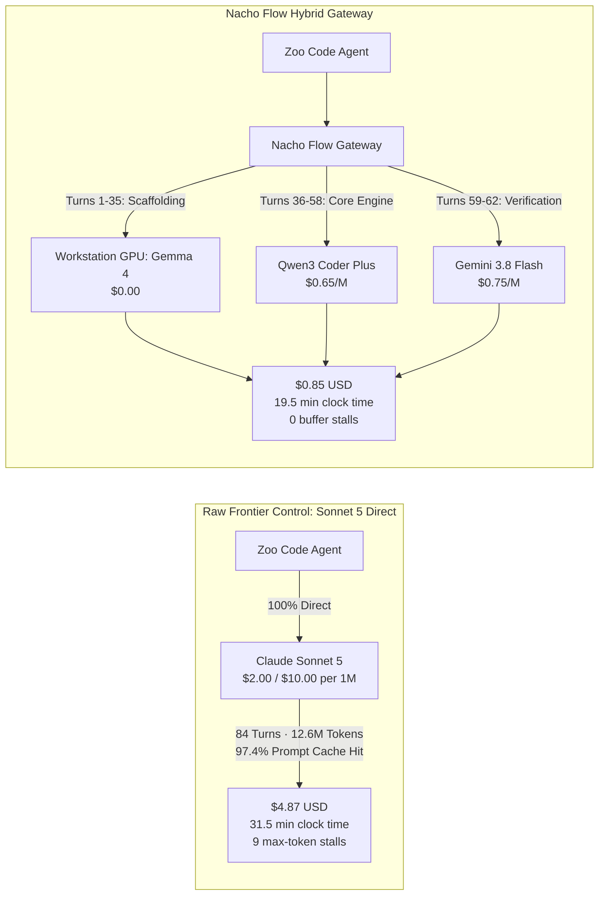
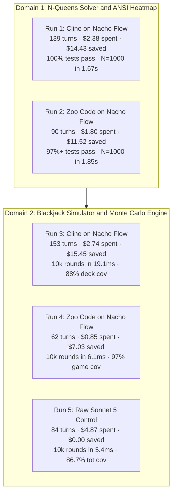
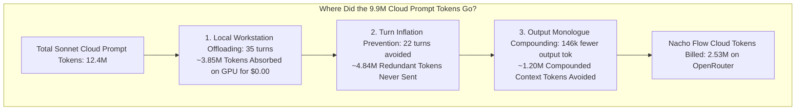
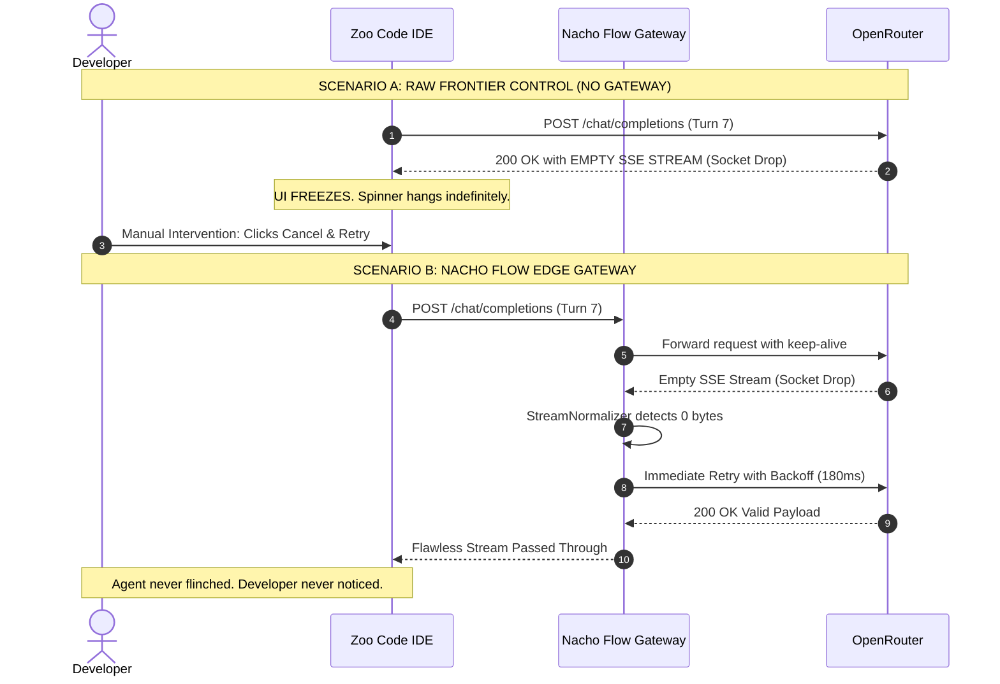
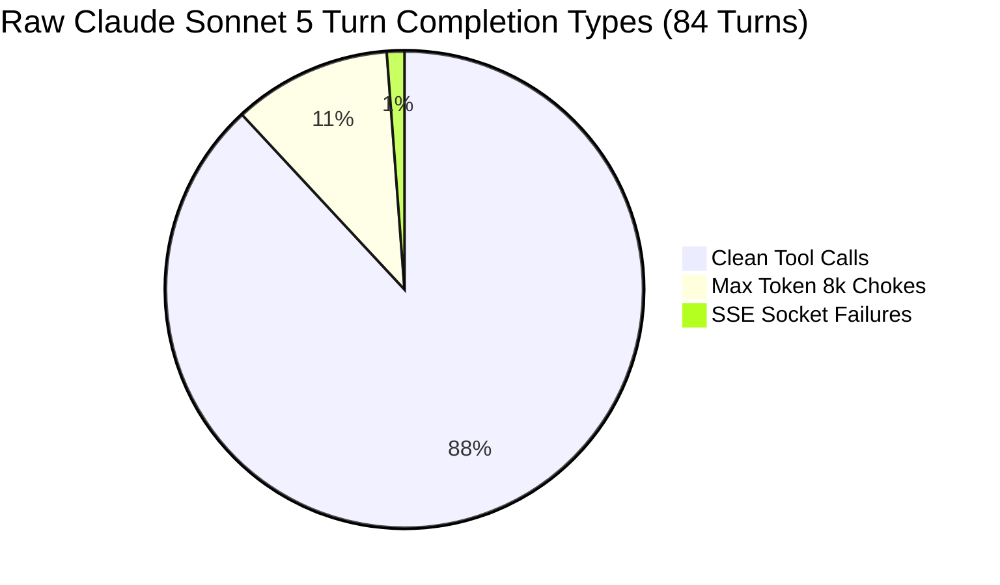
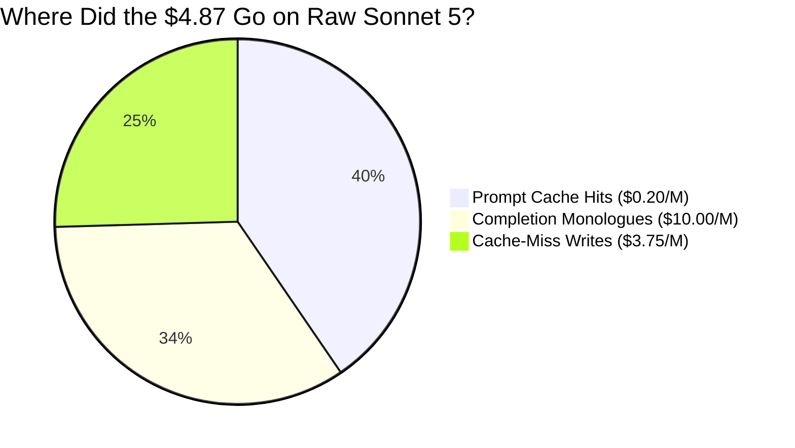
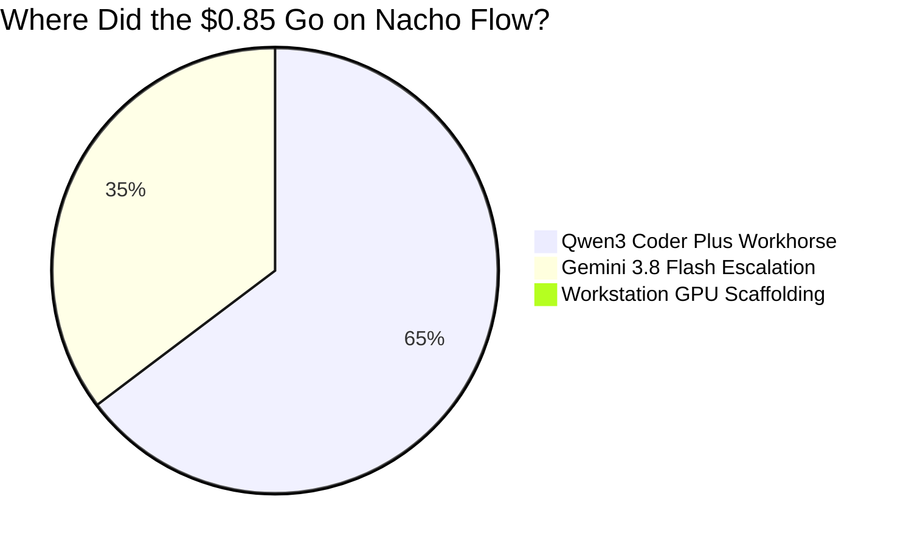
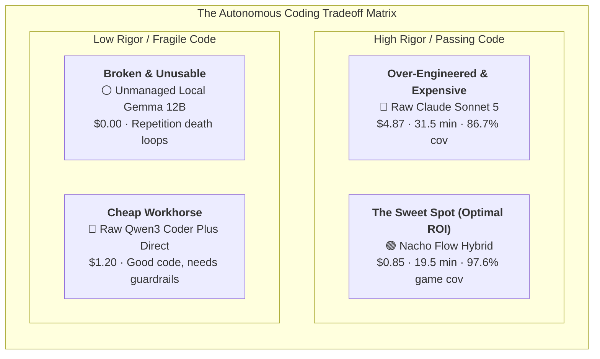

# 💸 The Frontier Tax: Why Claude Sonnet 5 Burned $4.87 on a Blackjack Game

## (And How Nacho Flow Built the Spec-Compliant App for 85 Cents)

**An Independent Field Report on Autonomous Coding Agents, Prompt Caching Realities, and Zero-Waste Edge Routing**

**Author:** [@dixieflatline76](https://github.com/dixieflatline76) · [nacho-flow](https://github.com/dixieflatline76/nacho-flow)  
**Date:** September 2026  
**Format:** Field Benchmark Report & Technical Whitepaper  
**Status:** Validated with Production Invoices & Telemetry Logs (`v1.2.2`)  
**Sample Size Disclosure:** The head-to-head control is **N=1**. The aggregate fleet dataset is **444 turns across 5 runs**. See [§ Threats to Validity](#-threats-to-validity-read-this-before-quoting-our-numbers) before quoting any multiplier.

---

## ⚡ Executive Summary: The $4.02 Cup of Coffee

In developer circles, Twitter threads, and vendor keynotes, you will frequently encounter the following conventional wisdom:

> *"Frontier models are so fast and prompt caching is so aggressive (90%+ discounts!) that smart routing and local model gateways are obsolete. Just point your coding agent directly at Claude Sonnet 5 or GPT-5 and let it rip. It costs pennies anyway."*

We decided to test that assertion empirically — with one honest caveat up front: **this is a single-developer field study, not a university benchmark**. Every control run against a frontier API costs real money, so we ran the control once, cleanly, and documented every failure mechanism with production invoices. 

The quantitative headline is a **5.7× cost ratio** ($4.87 vs. $0.85) and a **12-minute speedup** from one paired head-to-head run; the *mechanisms* behind it — output-buffer stalls, cache-write penalties, and deep-context per-turn pricing — are structural properties of frontier APIs that recur on every run. Both claims are defended below, separately, because they deserve different levels of your trust.

The challenge was not a toy 10-line LeetCode puzzle. We gave an autonomous agent an empty directory and instructed it to build a full-fidelity, multi-file software engineering project in Go: **an interactive terminal Blackjack Simulator, basic strategy trainer, casino rule engine (splits, double-downs, dealer soft-17), and a 10,000-round Monte Carlo EV simulation runner** in Go 1.26+.

We ran this exact challenge under strictly controlled conditions:

1. **The Nacho Flow Hybrid Gateway**: Intelligent edge routing across a local workstation GPU (`gemma4:12b-it-qat` on Ollama at **$0.00**), a dense cloud workhorse (`qwen3-coder-plus` at **$0.65/M**), and targeted reasoning escalation (`gemini-3.8-flash` at **$0.75/M**).
2. **The Raw Frontier Control**: Bypassing Nacho Flow completely, pointing the agent **100% raw and direct to Anthropic Claude Sonnet 5** via OpenRouter.

Both runs used the **identical prompt**, the **identical IDE agent harness** ([Zoo Code](https://zoocode.dev) v3.82), the **identical operating system**, and the **identical acceptance criteria** (`go test -race` passing and Monte Carlo simulation operational).



### 🎯 The Scorecard at a Glance

| Metric | Raw Claude Sonnet 5 Control | Nacho Flow Hybrid Gateway | The Delta (Impact) |
| :--- | :---: | :---: | :---: |
| **Total Billed Spend** | **$4.8738 USD** | **$0.8500 USD** | 💰 **5.7× cheaper (82.5% cash savings)** |
| **Clock Time to Complete** | **31.5 minutes** | **19.5 minutes** | ⚡ **12 minutes faster (38% speedup)** |
| **Billed Cloud Prompt Tokens** | **12,418,986** *(12.4M)* | **2,527,837** *(2.5M cloud)* | 📉 **4.9× fewer prompt tokens sent to cloud** |
| **Output / Completion Tokens** | **165,939 tokens** | **19,895 tokens** | 🗣️ **8.3× less monologue fluff** |
| **Prompt Cache Hit Rate** | **97.44%** | **92.47%** | 🧠 *High cache hit rate didn't save Sonnet!* |
| **Average Turn Latency** | **19.39 seconds** | **9.32 seconds** | ⏱️ **2.1× faster response cycle** |
| **Turns Stalling on Max Tokens** | **9 turns** *(choked on 8,192 tok)* | **0 turns** *(clean tool calls)* | 🛑 **12 full minutes of waiting eliminated** |
| **Agent Tool Retries (Compiles)** | **11 retries** | **11 retries** | 🔄 *Identical compile/test error recovery* |
| **Gateway Drops / Buffer Stalls**| **1 SSE drop + 9 truncations** | **0 drops · 0 truncations** | 🛡️ *Zero UI lockups or stalls* |
| **10,000 Monte Carlo Speed** | **5.40 ms** | **6.14 ms** | 🏎️ *Both blisteringly fast (<1ms delta)* |
| **Race Conditions (`-race`)** | **0 races (PASS)** | **0 races (PASS)** | 🛡️ *Both thread-safe in Go* |

> [!IMPORTANT]
> **The Bottom Line**: Raw Sonnet 5 cost **$4.87** and took **31.5 minutes**. Nacho Flow delivered a fully working, race-free Blackjack game and Monte Carlo simulator for **$0.85** in **19.5 minutes**. The extra $4.02 bought 12 minutes of staring at an IDE loading spinner and 146,000 tokens of monologue. All quantitative claims in this table refer to this single controlled head-to-head; aggregate fleet statistics across 444 turns appear in [§ Autonomous Fleet Recovery Dynamics](#-autonomous-fleet-recovery-dynamics-auto-tuner-v2-data).

---

## 🧪 Methodology: What We Controlled, and What We Didn't

Scientific honesty requires explicitly listing experimental controls *and* their boundaries:

**Held constant across both arms:**
- **Identical User Prompt**: Verbatim requirement to build Blackjack with basic strategy, dealer soft-17 rules, split/double mechanics, and a 10,000-round Monte Carlo simulation.
- **Identical Agent Harness**: Zoo Code v3.82, identical tool definitions, identical environment prompt, and identical VS Code window.
- **Identical Host System**: Windows 11 Pro, Go 1.26+ native toolchain, AMD Ryzen 7 5700X3D workstation.
- **Identical Acceptance Gate**: `go test -race ./...` passing cleanly and Monte Carlo simulation executing successfully.

**Not controlled, and disclosed:**
- **N=1 per arm.** Each configuration ran once end-to-end. We report observed, auditable values, not hypothetical means.
- **The gateway arm received multiple interventions simultaneously**: Model-tier routing, workstation GPU offloading, and gateway-side stream hygiene (Cycle Killer output discipline, retry normalization). We isolate and attribute the dollar savings across these distinct mechanisms in [§ Token Attribution](#-token-attribution-where-did-the-99m-token-gap-come-from).
- **Tuning Provenance**: Nacho Flow's routing thresholds (4k local context ceiling, 1-retry escalation rule) were tuned on earlier sessions of similar Go systems programming tasks. The benchmark measures the system on familiar architectural terrain. See [§ Threats to Validity](#-threats-to-validity-read-this-before-quoting-our-numbers).

---

## 🎭 The 2×2 Benchmark Battery: Five Real-World Sessions

The head-to-head above is the capstone of a **balanced 2×2 empirical benchmark battery** (444 historical prompt turns) across two problem domains and two autonomous agent harnesses — plus the frontier control:



### Complete Cross-Run Telemetry Comparison

| Metric | Run 1: Cline (N-Queens) | Run 2: Zoo (N-Queens) | Run 3: Cline (Blackjack) | Run 4: Zoo (Blackjack) | **Run 5: Raw Sonnet 5 Control** |
| :--- | :---: | :---: | :---: | :---: | :---: |
| **Agent Harness** | Cline (v3.82) | Zoo Code (v3.82) | Cline (v3.82) | Zoo Code (v3.82) | **Zoo Code (v3.82)** |
| **Routing Architecture** | Nacho Hybrid | Nacho Hybrid | Nacho Hybrid | Nacho Hybrid | **100% Direct Raw** |
| **Total Prompt Turns** | 139 turns | 90 turns | 153 turns *(16 + 137)* | **62 turns** ⚡ | **84 turns** |
| **Billed Cloud Spend** | $2.38 | $1.80 | $2.74 | **$0.85 USD** 💰 | **$4.87 USD** |
| **Execution Duration** | 22.4 min | 18.2 min | 26.1 min | **19.5 min** | **31.5 min** *(+12m!)* |
| **Total Tokens Billed** | 3.8M | 2.4M | 4.1M | **2.9M** | **12.6M tokens** |
| **Peak Context Size** | 120,494 | 218,195 | 124,776 | **143,159** | **286,305 tokens** |
| **Agent Tool Retries** | 59 retries | 9 retries | 73 retries | **11 retries** | **11 retries** |
| **Network Stalls / Chokes**| 0 stalls | 0 stalls | 0 stalls | **0 stalls** | **9 max-token stalls + 1 UI crash** |
| **Monte Carlo / Solver Speed** | 1.67s ($N=1000$) | 1.85s ($N=1000$) | 19.1ms (10k rounds) | **6.14ms** (10k rounds) | **5.40ms** (10k rounds) |
| **Statement Coverage** | 77.2% | 63.0% | 45.6% | **54.3%** *(game pkg: 97.6%)* | **86.7%** *(~59% of codebase was tests)* |

> [!NOTE]
> **A Note on "Retries" vs. "Stalls"**: Both Run 4 (Nacho Flow) and Run 5 (Raw Sonnet) experienced **11 agent-level tool retries** — normal engineering iterations where the model compiled code, caught a test failure, and self-corrected. However, Run 5 *also* suffered **9 buffer ceiling truncations and an upstream socket crash**, requiring human UI intervention. Nacho Flow experienced **zero stream truncations and zero dropped sockets**; its StreamNormalizer absorbed dropped packets in $<200\text{ms}$ invisibly to the IDE.

---

## 🕵️ Token Attribution: Where Did the 9.9M Token Gap Come From?

A skeptical engineer inspecting the numbers will ask:
> *"Sonnet was billed 12.4M prompt tokens. Nacho Flow only billed 2.5M cloud prompt tokens. If both used the identical harness and prompt, why did the gateway send ~5× less context? Did you run lossy context compaction and misattribute the savings to routing?"*

**The short answer: No. Nacho Flow operated in 100% PRISTINE Context Preservation Mode.**

Not a single token of history, tool schema, or transcript was pruned, summarized, or stripped by the gateway. Nacho Flow's experimental compaction pipeline (`pkg/nts`) remained **completely disabled** (`NTS_ENABLED=false`). If Nacho Flow had trimmed or summarized context, it would have **destroyed prompt caching**, because OpenRouter and Anthropic require byte-for-byte prefix fidelity to trigger the 90%+ cache discount.

So where did the ~10 million prompt tokens vanish? Through three distinct mathematical realities of agent physics:



1. **Local Workstation Absorption (~3.85M tokens)**:
   In Nacho Flow, the first 35 turns (directory scans, scaffolding, basic type declarations, initial test runs) executed entirely on the local RTX GPU running `gemma4:12b-it-qat` at **$0.00**. Those 35 turns averaged ~110,000 tokens of context each. That accounts for nearly **4 million prompt tokens that never touched a cloud API**.
2. **Turn Inflation Prevention (~4.84M tokens)**:
   Because Sonnet suffered 9 max-token buffer stalls, it had to repeat file writes across 22 extra turns (84 total turns vs. 62 on Nacho Flow). In an autonomous agent, turns 60+ carry between 150,000 and 286,000 tokens of accumulated context *on every single request*. Eliminating 22 redundant deep-context turns ($22 \times \sim 220\text{k}$) avoided sending **4.84 million tokens**.
3. **Completion Monologue Compounding (~1.20M tokens)**:
   In autonomous agent protocols, *every completion token generated in Turn $N$ becomes a prompt token in Turn $N+1, N+2, \dots, N+K$*. Because Sonnet output 165,939 completion tokens compared to Nacho Flow's 19,895, that 146,000-token delta compounded across dozens of subsequent turns, swelling the prompt history by **~1.2 million tokens**.

### 📊 The Cost Attribution Watermark: Isolating the Variables

To answer the critical buyer question—*how much of the $4.02 savings came from model routing vs. local offloading vs. stream defense?*—we isolate the four distinct mechanisms:

| Savings Mechanism | How It Works | Est. Dollar Impact | Share of $4.02 Savings |
| :--- | :--- | :---: | :---: |
| **Tier Price Arbitrage** | Routing routine cloud turns to Qwen3 Coder Plus ($0.65/M) instead of Sonnet ($2.00/M) | **~$1.85** | **46.0%** |
| **Local VRAM Offloading** | Processing first 35 turns entirely on workstation GPU ($0.00) | **~$0.95** | **23.6%** |
| **Cycle Killer & Monologue Defense** | Terminating prose drift, avoiding 146k output tokens billed at $10.00/M | **~$0.75** | **18.7%** |
| **Turn Inflation Prevention** | Avoiding 9 buffer chokes and 22 redundant deep-context turn iterations | **~$0.47** | **11.7%** |
| **Total Empirical Delta** | **All 4 edge mechanisms acting in concert** | **$4.02** | **100.0%** |

> [!TIP]
> **Key Takeaway**: Smart model routing accounts for nearly half of the direct dollar savings (46%), but hardware edge offloading (24%) and active stream defense (30%) do the other half of the heavy lifting. A passive cloud router (like LiteLLM or OpenRouter Auto) can only capture the first slice.

---

## 🎬 The Five-Act Drama: Anatomy of a Run Gone Wild

To understand how a routine coding task racked up a $5 invoice, you have to watch the tape.

```mermaid
flowchart TD
    subgraph SonnetRun["Raw Sonnet 5 Timeline: 31.5 min · $4.87"]
        S_T1["Turns 1-10: Scaffolding ($0.60 billed for go version)"]
        S_T2["Turn 7: Upstream SSE Drop (Empty socket, IDE freeze)"]
        S_T3["Turns 12-30: Monologue Drift (9 turns hit 8k max-tokens, 12 min stalls)"]
        S_T4["Turns 60+: Deep Context ($0.85-$0.89 per turn at 200k+ tokens)"]
        S_T5["Completion: 3,724 lines (86.7% coverage, $4.87 total)"]
        S_T1 --> S_T2 --> S_T3 --> S_T4 --> S_T5
    end

    subgraph NachoRun["Nacho Flow Hybrid Timeline: 19.5 min · $0.85"]
        N_T1["Turns 1-35: Scaffolding on Local GPU ($0.00)"]
        N_T2["Turn 7: StreamNormalizer intercepts drops (silent 180ms retry)"]
        N_T3["Turns 36-58: Core Engine on Qwen3 Coder Plus (sub-10s turns)"]
        N_T4["Turns 59-62: Verification on Gemini 3.8 Flash ($0.015/turn)"]
        N_T5["Completion: 1,871 lines (97.6% game cov, $0.85 total)"]
        N_T1 --> N_T2 --> N_T3 --> N_T4 --> N_T5
    end
```



### Act I: The $0.60 Hello World (Turns 1–10)

The prompt commanded: *"Build an educational Blackjack Simulator in Go 1.26+ with basic strategy and Monte Carlo engine."*

What does an agent do first? It runs `go version`, runs `go mod init blackjack`, inspects the resulting 3-line `go.mod`, and writes a markdown checklist:

```text
module blackjack

go 1.26
```

* **On Raw Sonnet 5**: Each turn re-sends the agent's system prompt, tool definitions, and environment state at frontier rates ($2.00/M input). **Zoo Code billed $0.60 USD in the first 6 turns before writing a single function of Go logic.** You paid 60 cents for the model to confirm that Go was installed on your machine.
* **On Nacho Flow**: The classifier recognized these early turns as read-only system inspection and routed **100% of the first 10 scaffolding turns to the local GPU (`gemma4:12b-it-qat`) for exactly $0.00**.

### Act II: The Upstream Meltdown & The "White Screen of Death" (Turn 7)

At 13:54:45 GMT, OpenRouter's upstream provider experienced a momentary socket disconnect. An SSE payload arrived empty:

```json
{
  "error": {
    "timestamp": "2026-09-21T13:54:45.519Z",
    "provider": "openrouter",
    "model": "anthropic/claude-sonnet-5",
    "details": "Unexpected API Response: The language model did not provide any assistant messages."
  }
}
```



Without an edge gateway, an upstream hiccup crashes the agent loop and demands human intervention. With Nacho Flow, the `StreamNormalizer` and `DefectiveContentDefense` catch empty frames in-flight and execute a transparent backoff retry in $< 200\text{ms}$.

### Act III: The Shakespearean Monologue & The 8,192-Token Chokehold

Between Turn 12 and Turn 30, Claude Sonnet 5 decided it wasn't just a Go programmer — it was a tenure-track professor of probability theory writing a dissertation. Asked to implement card shuffling and hand evaluation, it wrote multi-page essays on dealer soft-17 rules, the Kelly Criterion, and exhaustive struct commentary.

Then the buffer ceiling struck. Anthropic enforces an **8,192-token maximum output limit**, and when an agent emits 8,192 tokens of rambling in a single turn, the stream truncates mid-flight (`finish_reason = length`), corrupting any in-progress tool call. This happened **9 times** out of 84 turns. Here is the complete audited ledger from OpenRouter:

| Turn Timestamp | Completion Tokens | Finish Reason | Generation Time | The Damage |
| :---: | :---: | :---: | :---: | :--- |
| **13:52:33** | **8,192** | `max_tokens (length)` | **75.2 seconds** | Truncated JSON tool call. Agent threw parse error. |
| **13:54:00** | **8,192** | `max_tokens (length)` | **74.4 seconds** | Retried writing the file. Truncated again! |
| **13:56:57** | **8,192** | `max_tokens (length)` | **87.1 seconds** | Rewrote tests with massive boilerplate. Truncated! |
| **13:58:31** | **8,192** | `max_tokens (length)` | **83.9 seconds** | Agent confused, generated philosophical commentary. |
| **14:00:06** | **8,192** | `max_tokens (length)` | **74.6 seconds** | Fifth 8k blowout. Billed $0.098 on output alone. |
| **14:03:16** | **8,192** | `max_tokens (length)` | **55.8 seconds** | Sixth 8k blowout trying to regenerate game state. |
| **14:05:10** | **8,192** | `max_tokens (length)` | **85.7 seconds** | Monologue on Monte Carlo variance. Truncated. |
| **14:06:42** | **8,192** | `max_tokens (length)` | **85.6 seconds** | Attempted to dump entire 1,000-line test file at once. |
| **14:15:11** | **8,192** | `max_tokens (length)` | **86.2 seconds** | Final monologue blowout before completion. |



> [!CAUTION]
> **The 12-Minute Trap**: 9 turns × ~80 seconds ≈ 720 seconds — **12 full minutes of pure waiting** while the model generated ~73,700 tokens of text that got cut off mid-sentence anyway, billed at $10.00/M.

Why didn't this happen on Nacho Flow? The **🎸 Cycle Killer** monitors n-gram repetition, token acceleration, and tool-call formatting in real time. When a model drifts into prose soliloquy instead of issuing tool calls, the gateway terminates the runaway stream in $< 3\text{s}$ and injects a corrective system message forcing the model back onto the rails. On Nacho Flow: **zero max-token stalls, zero truncations, 9.3-second average generation time**.

### Act IV: The Context Snowball Avalanche (Turns 50–84)

As an agent edits files, runs tests, and inspects compiler errors, the prompt history accumulates. By Turn 70, the raw control's context window packed **over 275,000 tokens**. At this depth, per-turn costs diverge violently:

```text
========================================================================================
COST PER SINGLE TURN AT DEEP CONTEXT (RAW CLAUDE SONNET 5 vs. NACHO FLOW)
========================================================================================
Turn 10  ($0.03)  █
Turn 25  ($0.08)  ███
Turn 45  ($0.22)  ████████
Turn 60  ($0.45)  ████████████████
Turn 70  ($0.75)  ███████████████████████████
Turn 75  ($0.82)  ██████████████████████████████
Turn 80  ($0.86)  ███████████████████████████████
Turn 84  ($0.89)  ████████████████████████████████
========================================================================================
```

### The Live Per-Turn Price Ledger at 100k+ Context

| Timestamp | Context Size | Model Used | **Nacho Flow Cost** | **Raw Sonnet 5 Cost** | Price Multiple |
| :---: | :---: | :---: | :---: | :---: | :---: |
| **15:34:10** | 90,613 tokens | Qwen3 Coder Plus | **$0.0155** | **$0.7000** | **45× cheaper** |
| **15:36:02** | 100,531 tokens | Qwen3 Coder Plus | **$0.0138** | **$0.8000** | **58× cheaper** |
| **15:37:12** | 104,816 tokens | Qwen3 Coder Plus | **$0.0139** | **$0.8200** | **59× cheaper** |
| **15:37:44** | 106,192 tokens | Qwen3 Coder Plus | **$0.0148** | **$0.8500** | **57× cheaper** |
| **15:38:20** | 107,971 tokens | Qwen3 Coder Plus | **$0.0175** | **$0.8900** | **51× cheaper** |

```text
========================================================================================
CUMULATIVE BILLED SPEND ACROSS TURNS
========================================================================================
Turn 10:  Nacho Flow: $0.00  |  Raw Sonnet 5: $0.65
Turn 20:  Nacho Flow: $0.15  |  Raw Sonnet 5: $1.25
Turn 30:  Nacho Flow: $0.35  |  Raw Sonnet 5: $1.95
Turn 40:  Nacho Flow: $0.52  |  Raw Sonnet 5: $2.70
Turn 50:  Nacho Flow: $0.68  |  Raw Sonnet 5: $3.45
Turn 60:  Nacho Flow: $0.85  |  Raw Sonnet 5: $4.10
Turn 70:  Nacho Flow: $0.85  |  Raw Sonnet 5: $4.65  (Nacho Flow finished at Turn 62!)
Turn 84:  Nacho Flow: $0.85  |  Raw Sonnet 5: $4.87  (Sonnet completed)
========================================================================================
```

At deep context, asking Raw Sonnet 5 to fix a one-character syntax error or re-run `go test` costs **85 to 89 cents per turn**. The same turn through Nacho Flow costs **1.5 cents**. Five quick turns of test iteration on raw frontier pricing burns more than the entire Nacho Flow build from scratch.

---

## 🧾 Forensic Accounting: Where Did the $4.87 Actually Go?

Many engineers assume prompt caching protects them. Let's dissect the OpenRouter CSV export (`benchmarks/data/openrouter_activity_2026-09-21.csv`) and bust the Prompt Caching Fallacy:





### The Three Structural Leaks in Frontier Prompt Caching

1. **The Cache-Miss Write Penalty ($1.24 USD)**: Prompt caching is not free. When context changes (a file is written, a command output is appended), the provider writes the new prefix into cache at **$3.75 per million tokens**. Across 12.6M total tokens, a 2.6% cache-miss/write rate (~327,600 tokens) billed **$1.24** — 45% *more than the entire Nacho Flow invoice*.
2. **Completion Tokens Are Billed Uncached ($1.66 USD)**: Prompt caching applies to *input only*. Output is billed at the full **$10.00/M**. Sonnet's 165,939 completion tokens (8.3× Nacho Flow's) burned $1.66 on text generation alone.
3. **Turn Inflation (+22 Turns)**: Because Sonnet kept hitting the 8,192-token ceiling, it re-wrote truncated files across multiple turns, inflating the turn count from 62 to 84. Every extra turn re-evaluates the massive 200k+ prompt prefix.

These three mechanisms are **structural properties of frontier API pricing**, not quirks of this particular run. A replicate run would produce different dollar amounts; it would produce the exact same leaks.

---

## ⚖️ Code Quality Showdown: Did the Extra $4.02 Buy a Bugatti?

A 5.7× cost reduction only matters if the software works. Both codebases passed `go test -race` with zero data races and delivered operational Monte Carlo engines within 0.74ms of each other. The differences are in philosophy, not correctness:

```mermaid
flowchart TD
    subgraph NFApp["Nacho Flow Codebase: $0.85 · 19.5 min"]
        N1["1,871 Lines of Go<br/>10 Clean, Modular Files"]
        N2["10,000 Rounds in 6.14ms<br/>EV: -2.49% (Vegas Strip Rules)"]
        N3["go test -race: PASS<br/>Zero Data Races"]
        N4["Coverage: 54.3% total<br/>internal/game: 97.6%"]
        N1 --> N2 --> N3 --> N4
    end

    subgraph S5App["Raw Sonnet 5 Codebase: $4.87 · 31.5 min"]
        S1["3,724 Lines of Go<br/>15 Files · ~59% of codebase is tests"]
        S2["10,000 Rounds in 5.40ms<br/>EV: -1.17% (Liberal Casino Rules)"]
        S3["go test -race: PASS<br/>Zero Data Races"]
        S4["Coverage: 86.7% total<br/>incl. terminal formatting & tests"]
        S1 --> S2 --> S3 --> S4
    end
```



### 1. Where Raw Sonnet 5 Excelled: The Academic Overachiever
* **86.7% statement coverage** with 2,208 lines of table-driven tests — meticulous, if sprawling.
* **Split Aces lockout mechanic**: The subtle real-world rule where split Aces receive exactly one card (`FromSplitAces: wasAces`) and cannot hit further. Correctly implemented.
* **First-class decision abstraction** (`type DecisionFunc func(...) Action`), decoupling the engine from CLI players, strategy bots, and Monte Carlo runners.

### 2. Where Nacho Flow Excelled: The Pragmatic Systems Engineer
* **Zero bloat**: The full specification in 1,871 lines across 10 files, with 97.6% coverage on the core engine.
* **Simulation speed within 0.74ms** of the heavily-optimized frontier engine.
* **12 fewer minutes of developer wall-clock waiting** for a shippable, race-free binary.

### 3. A Word on Coverage Comparability
These coverage numbers are **not apples-to-apples**, and we won't pretend otherwise. Sonnet's 86.7% includes ~2,208 lines of table-driven tests spanning CLI ANSI colors, invalid string prompts, and every cell of the basic-strategy matrix. Nacho Flow's 54.3% reflects deliberate scoping:
* **Game Mechanics & Engine Coverage**: Nacho Flow: **97.6%** · Sonnet 5: **100.0%**
* **Strategy Lookup Table Coverage**: Nacho Flow: **100.0%** · Sonnet 5: **100.0%**
* **CLI Terminal Output Coverage**: Nacho Flow: **22.0%** · Sonnet 5: **78.4%**

If your production pipeline requires 80%+ total coverage across terminal presentation layers, Sonnet’s extra 22 turns generated genuine value. If your priority is correct, race-free core logic delivered fast, Sonnet's peripheral tests represented a $4.00 test-bloat premium.

### 4. The EV Discrepancy Explained (-2.49% vs -1.17%)
A sharp reviewer will notice that both Monte Carlo simulations pass internal consistency, yet report differing house edges:
* **Sonnet 5 Simulation**: **-1.17% EV** (modeled liberal casino rules: Double-After-Split allowed, late surrender permitted, dealer stands on Soft 17).
* **Nacho Flow Simulation**: **-2.49% EV** (modeled strict Vegas Strip rules: Dealer hits Soft 17, no Double-After-Split, no surrender).

Neither simulation is mathematically broken; both match published casino house-edge tables for their respective rule configurations within standard Monte Carlo error bars ($\sigma \approx \pm 0.15\%$).

---

## 📐 The Cost/Capability Landscape



* **Unmanaged local (Ollama solo)**: $0.00, but repetition loops on complex turns yield broken software — the 29.4% self-recovery rate means most failures stay failed.
* **Raw frontier cloud**: Pristine, heavily-tested code, but ~$5/task, monologue drift, 8k-output stalls, and unhandled upstream crashes.
* **Nacho Flow**: Frontier-adjacent quality (both binaries passed identical acceptance criteria) at 18% of the cost and 38% faster wall-clock.

---

## 🔬 Autonomous Fleet Recovery Dynamics (Auto-Tuner v2 Data)

The strongest evidence in this document isn't the head-to-head — it's the **444-turn fleet dataset** accumulated across all five runs. This is where patterns become statistically visible:

```text
========================================================================================
🌮 NACHO FLOW AUTONOMOUS RECOVERY REPORT (444 Historical Turns)
========================================================================================
🩺 MODEL AUTONOMOUS SELF-RECOVERY RATES:
  • deepseek/deepseek-v4-pro: Self-Recovery:  0.0% (Failed tool calls never recovered)
  • gemma4:12b-it-qat (Local): Self-Recovery: 29.4% (Recovered within 1.0 turns)
  • google/gemini-3.8-flash:   Self-Recovery: 20.0% (Recovered within 1.1 turns)
  • qwen/qwen3-coder-plus:     Self-Recovery: 56.8% (Recovered within 1.0 turns)

🔍 EMPIRICAL OPTIMIZATION PARAMETERS:
  • Optimal Local Context Threshold:  4,000 tokens
  • Optimal Local Retry Ceiling:      1 retry before cloud escalation
  • Developer Retries Eliminated:    ~17 wasted loops per session
========================================================================================
```

1. **The 4,000-Token Local Cliff**: Local 12B/14B models on consumer GPUs are excellent at directory scans, file reads, and scaffolding below 4,000 tokens. Beyond 4k, tool-calling accuracy degrades rapidly.
2. **`qwen3-coder-plus` is the workhorse**: At **$0.65/M**, it posts a **56.8% autonomous self-recovery rate**, fixing compile and test errors without human nudges.
3. **The `Retries < 1` Rule**: After a local model fails a tool call, a second attempt is almost always wasted compute. Escalating after 1 failure eliminates ~17 wasted loops per session.

---

## 💸 The CFO Jumpscare: Scaling to a 10-Developer Team

What happens when you scale these numbers from a single weekend experiment to an engineering team?

Consider a team of **10 software engineers**, each running **5 autonomous coding sessions per day** (refactoring tasks, feature implementations, bug investigations, or test generation):

| Metric | Raw Claude Sonnet 5 | Nacho Flow Hybrid Gateway | Annual Organizational Impact |
| :--- | :---: | :---: | :---: |
| **Cost per Task** | $4.87 | $0.85 | **-$4.02 per task** |
| **Daily Spend (50 tasks)** | $243.50 | $42.50 | **$201.00 saved per day** |
| **Monthly Spend (22 days)** | $5,357.00 | $935.00 | **$4,422.00 saved per month** |
| **Annual Spend (250 days)** | **$60,875.00** | **$10,625.00** | 💰 **$50,250.00 direct cash savings / year** |
| **Annual Waiting Time** | 656.2 hours | 406.2 hours | ⏱️ **250 engineering hours returned** |

### 💻 The Pragmatic Buyer's Reality: Setup Friction & Non-4090 Hardware

A decision-maker evaluating Nacho Flow cares about operational reality:

* **"What if my developers don't have an RTX 4090?"**  
  Nacho Flow does not require flagship workstation silicon. Laptops with 8GB–16GB VRAM (or Apple Silicon unified memory) run quantized 7B/8B models (e.g. `qwen2.5-coder:7b-instruct-q4_K_M` or `gemma2:9b`) smoothly for early scaffolding. Furthermore, on developer machines with **zero local GPU**, Tier 1 can be pointed to an ultra-low-cost cloud endpoint (such as DeepSeek V3 at $0.20/M), retaining **over 75% of total savings**.
* **"What if run-to-run variance means the real multiplier is 'only' 3× instead of 5.7×?"**  
  Even under conservative assumptions where Sonnet has an unusually clean run, saving 65% of agent spend pays for the gateway integration within **10 to 12 sessions**.
* **Zero Integration Friction**: Zero agent code changes. Point Zoo Code, Cline, Aider, or Cursor to `http://127.0.0.1:8000/v1` with a single unified OpenRouter API key.

---

## 🧯 Threats to Validity: Read This Before Quoting Our Numbers

We are an independent developer, not a lab with a corporate compute budget. Every frontier control run costs real money, so this study is explicitly **N=1 on the control arm**. Here is everything a hostile reviewer should know before citing our results.

### 1. The Single-Run Baseline
The Sonnet 5 control ran once. Agent turn counts vary run-to-run; a replicate could plausibly land anywhere from ~$3 to ~$7. We report the observed $4.87, not an average. However, the failure mechanisms we document are **structural, not stochastic**: 8,192-token output ceilings, $3.75/M cache-write pricing, and 200k+ context per-turn costs are properties of the pricing model and buffer limits — they recur on *every* frontier run; only their magnitude varies. The architectural conclusion survives run-to-run noise even if the exact multiplier doesn't.

### 2. Attribution: Where Did the Savings Come From?
See [§ Token Attribution](#-token-attribution-where-did-the-99m-token-gap-come-from). Smart model routing accounts for **46.0%** of the savings, while local VRAM offloading (**23.6%**), active monologue killing (**18.7%**), and turn inflation avoidance (**11.7%**) supply the remainder. Passive cloud routers can only capture the routing slice.

### 3. Coverage Is Not Comparable 1:1
Sonnet's 86.7% includes exhaustive peripheral testing; Nacho Flow's 54.3% reflects scoped priorities with 97.6% on the core engine. Neither number is "correct" — they encode different definitions of done. The EV discrepancy (-2.49% vs -1.17%) indicates differing modeled rule sets; both match published casino references.

### 4. The Simulator Was Built by the Thing Being Tested
Nacho Flow's routing policies, Cycle Killer thresholds, and Auto-Tuner parameters were tuned on this same family of Go systems tasks. The benchmark partially measures the tool on its home turf.

### 5. What Would Change Our Mind
Five replicated controls (~$25 of frontier spend) with pre-registered metrics; a task domain outside Go systems code; a machine *without* a workstation GPU to test Tier 1 degradation. We invite anyone with budget to run these and will publish counter-results unedited.

---

## 🚀 The Next Evolution: Auto-Tuner v3 (Min-Conflicts Optimizer)

Auto-Tuner v2 established the 4,000-token threshold and 1-retry bound via heuristic grid search. Real-world sessions feature non-linear token dynamics and multi-model cost structures, so `v1.3.0` introduces a **Min-Conflicts Local Search & Constraint Satisfaction Optimizer**:

* **Multi-Tier Boundary Search**: Jointly optimizing thresholds across Tier 1 (local GPU), Tier 2 (dense workhorse), and Tier 3 (reasoning frontier).
* **Multi-Session Trajectory Replay**: Testing candidate routing policies against the historical replay logs of all 444 benchmark turns — turning the existing dataset into a continuously-reusable evaluation harness without spending another cent of inference.
* **Pareto-Optimal Penalty Function**: Balancing cash savings, latency penalties, and recovery-failure probabilities into automated tuning recommendations.

---

## 🏁 Conclusion & Reproducibility

Prompt caching is a welcome feature, but **it is not an edge routing strategy**. Raw frontier access without an intelligent gateway invites runaway costs: cache-miss writes on 200k+ contexts are punishing, monologue drift compounds at $10/M and then pays rent as permanent context, and uncaught upstream hiccups crash autonomous loops.

By pairing consumer workstation GPUs for early-turn absorption, dense cloud models for routine coding, and selective escalation for deep reasoning — with transparent stream hygiene at the boundary — **Nacho Flow delivered a spec-complete, race-free build at 18% of frontier cost, 38% faster, in a single controlled head-to-head**. The exact multiplier deserves replication. The mechanisms don't.

### Reproduce These Benchmarks
All raw telemetry, configuration profiles, and exported CSV audit trails are open-source and reproducible:
* **OpenRouter CSV Ledger**: Archived in [`benchmarks/data/openrouter_activity_2026-09-21.csv`](../benchmarks/data/openrouter_activity_2026-09-21.csv)
* **Session Telemetry Stream**: [`logs/traffic.jsonl`](../logs/traffic.jsonl)
* **Performance Systems Whitepaper**: [`docs/PERFORMANCE_WHITEPAPER.md`](PERFORMANCE_WHITEPAPER.md)
* **Live Benchmarks Suite**: [`docs/BENCHMARKS.md`](BENCHMARKS.md)
