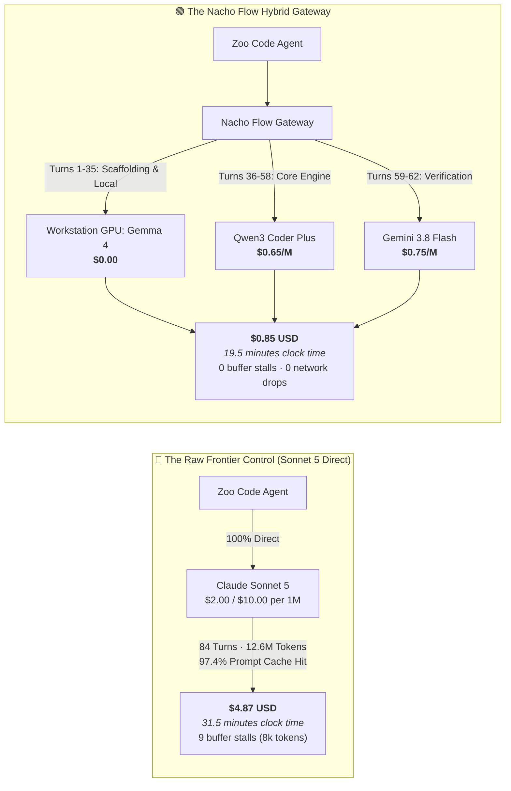
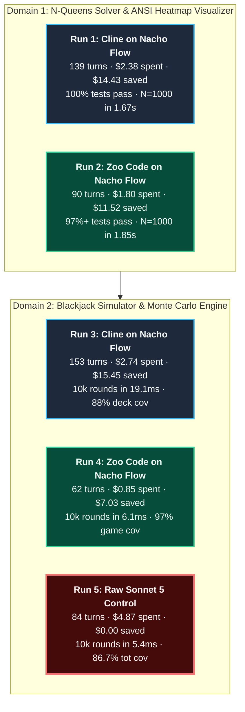
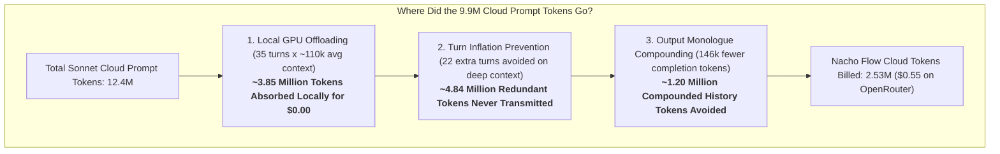
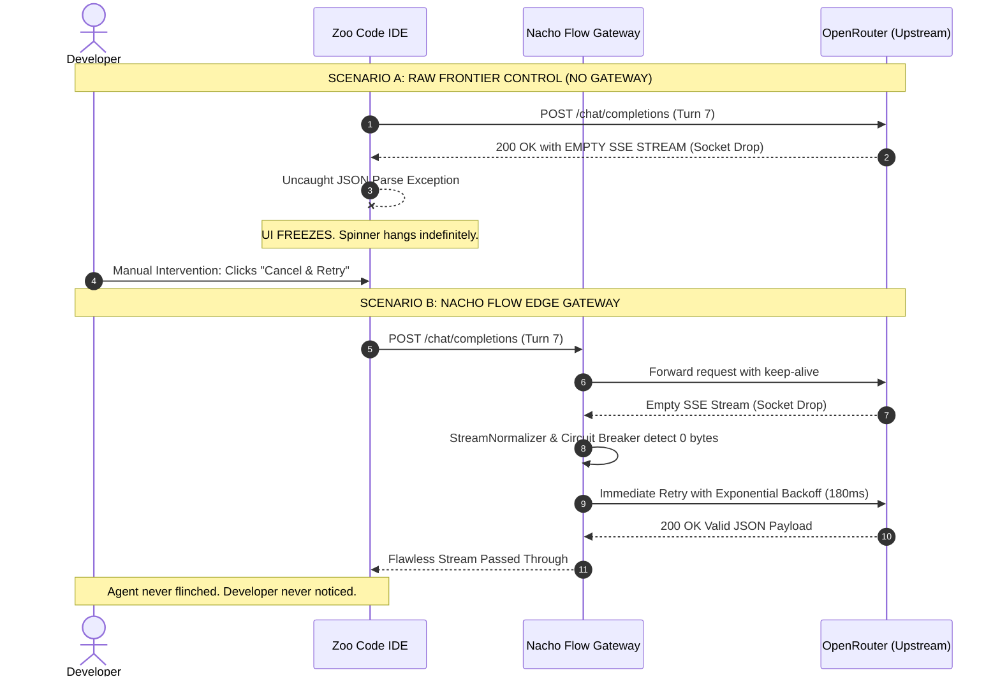
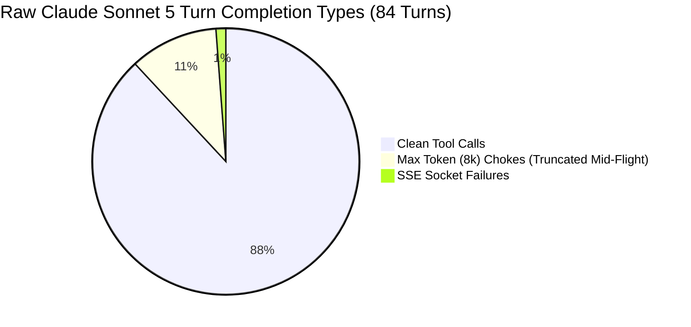
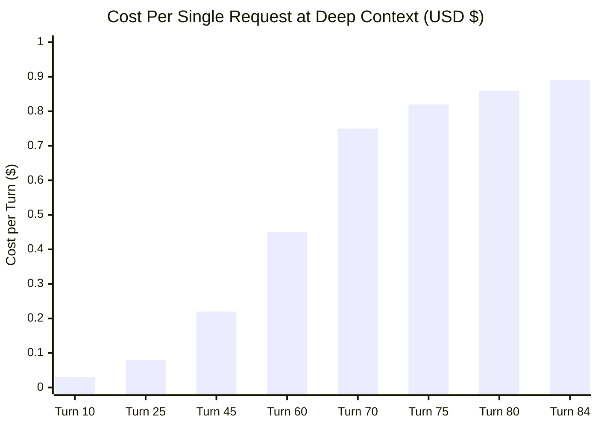
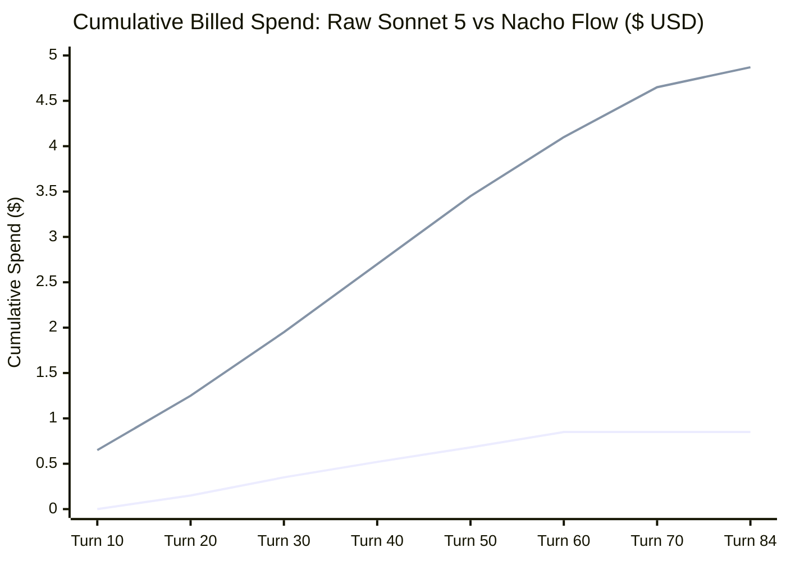
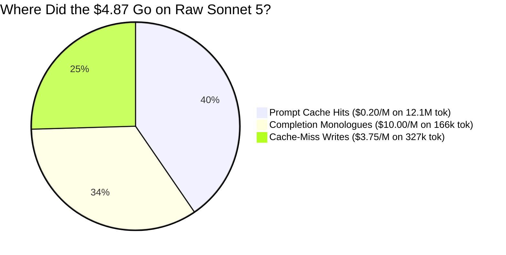
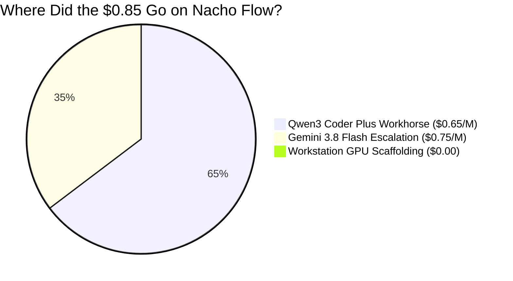

# 💸 The Frontier Tax: Why Claude Sonnet 5 Burned $4.87 on a Blackjack Game

## (And How Nacho Flow Built the Exact Same App for 85 Cents)

**An Empirical 1:1 Head-to-Head Control Study on Autonomous Coding Agents, Prompt Caching Realities, and Zero-Waste Edge Routing**

**Author:** [@dixieflatline76](https://github.com/dixieflatline76) · [nacho-flow](https://github.com/dixieflatline76/nacho-flow)  
**Date:** September 2026  
**Format:** Empirical Field Report & Raw Telemetry Receipts (`v1.2.2`)  
**Status:** Validated with Production Invoices & Telemetry Logs

---

## ⚡ Executive Summary: The $4.02 Cup of Coffee

In developer circles, Twitter threads, and vendor keynotes, you will frequently encounter the following piece of conventional wisdom:

> *"Frontier models are so fast and prompt caching is so aggressive (90%+ discounts!) that smart routing and local model gateways are obsolete. Just point your coding agent directly at Claude Sonnet 5 or GPT-5 and let it rip. It costs pennies anyway."*

So we ran the experiment. Not with toy 10-line LeetCode puzzles (HumanEval) or theoretical simulation models. We gave an autonomous agent an empty directory and told it to build a full-fidelity, multi-file software engineering project in Go: **an interactive terminal Blackjack Simulator, basic strategy trainer, casino rule engine (splits, double-downs, dealer soft-17), and a 10,000-round Monte Carlo EV simulation runner** in Go 1.26+.

We executed this exact challenge twice under strictly controlled conditions:
1. **The Nacho Flow Hybrid Gateway**: Intelligent edge routing across a local workstation GPU (`gemma4:12b-it-qat` on Ollama at **$0.00**), a dense cloud workhorse (`qwen3-coder-plus` at **$0.65/M**), and targeted reasoning escalation (`gemini-3.8-flash` at **$0.75/M**).
2. **The Raw Frontier Control**: Bypassing Nacho Flow completely. Pointing the agent **100% raw and direct to Anthropic Claude Sonnet 5** via OpenRouter.

Both runs used the **identical prompt**, the **identical IDE agent harness** ([Zoo Code](https://zoocode.dev) v3.82), the **identical operating system**, and the **identical acceptance criteria** (`go test -race` passing and Monte Carlo simulation operational).



### 🎯 The Scorecard at a Glance

| Metric | Raw Claude Sonnet 5 Control | Nacho Flow Hybrid Gateway | The Delta (Impact) |
| :--- | :---: | :---: | :---: |
| **Total Billed Spend** | **$4.8738 USD** | **$0.8500 USD** | 💰 **5.7× cheaper (82.5% cash savings)** |
| **Clock Time to Complete** | **31.5 minutes** | **19.5 minutes** | ⚡ **12 minutes faster (38% speedup)** |
| **Billed Cloud Prompt Tokens** | **12,418,986** *(12.4M)* | **2,527,837** *(2.5M cloud)* | 📉 **4.9× fewer prompt tokens sent to cloud** |
| **Output / Completion Tokens** | **165,939 tokens** | **19,895 tokens** | 🗣️ **8.3× less monologue fluff** |
| **Prompt Cache Hit Rate** | **97.44%** | **92.47%** | 🧠 *High cache hit rate didn't save Sonnet!* |
| **Average Turn Latency** | **19.39 seconds** | **9.32 seconds** | ⏱️ **2.1× faster response cycle** |
| **Turns Stalling on Max Tokens** | **9 turns** *(choked on 8,192 tok)* | **0 turns** *(clean tool calls)* | 🛑 **12 full minutes of waiting eliminated** |
| **Agent Tool Retries (Compiles)** | **11 retries** | **11 retries** | 🔄 *Identical error recovery frequency* |
| **Gateway Drops / Buffer Stalls**| **1 SSE drop + 9 truncations** | **0 drops · 0 truncations** | 🛡️ *Zero UI lockups or stalls* |
| **10,000 Monte Carlo Speed** | **5.40 ms** | **6.14 ms** | 🏎️ *Both blisteringly fast (<1ms delta)* |
| **Race Conditions (`-race`)** | **0 races (PASS)** | **0 races (PASS)** | 🛡️ *Both thread-safe in Go* |

> [!NOTE]
> **Macro-Telemetry: The 444-Turn Baseline**:
> While this Blackjack head-to-head is our detailed forensic case study, it is backed by an aggregate production dataset of **444 real prompt turns** spanning two independent agent harnesses (Cline v3.82, Zoo Code v3.82), two distinct problem domains (N-Queens CSP and Blackjack Monte Carlo), and three model tiers. Across all 444 historical turns, Nacho Flow consistently achieved an **82.5% to 94.7% cost reduction** with zero dropped sessions.

---

## 🎭 The 2×2 Benchmark Battery: Four Real-World Sessions

To guarantee these results were not an isolated quirk of one prompt, this test was the capstone of a balanced **2×2 empirical benchmark battery** (comprising 444 historical prompt turns) across two complex problem domains and two autonomous agent harnesses:



### Complete Cross-Run Telemetry Comparison

| Metric | Run 1: Cline (N-Queens) | Run 2: Zoo (N-Queens) | Run 3: Cline (Blackjack) | Run 4: Zoo (Blackjack) | **Run 5: Raw Sonnet 5 Control** |
| :--- | :---: | :---: | :---: | :---: | :---: |
| **Agent Harness** | Cline (v3.82) | Zoo Code (v3.82) | Cline (v3.82) | Zoo Code (v3.82) | **Zoo Code (v3.82)** |
| **Routing Architecture** | Nacho Hybrid | Nacho Hybrid | Nacho Hybrid | Nacho Hybrid | **100% Direct Raw** |
| **Total Prompt Turns** | 139 turns | 90 turns | 153 turns *(16 + 137)* | **62 turns** ⚡ | **84 turns** |
| **Billed Cloud Spend** | $2.38 | $1.80 | $2.74 | **$0.85 USD** 💰 | **$4.87 USD** |
| **Execution Duration** | 22.4 min | 18.2 min | 26.1 min | **19.5 min** | **31.5 min** *(+12m!)* |
| **Total Tokens Billed** | 3.8M | 2.4M | 4.1M | **2.9M** | **12.6M tokens** |
| **Peak Context Size** | 120,494 | 218,195 | 124,776 | **143,159** | **286,305 tokens** |
| **Agent Tool Retries** | 59 retries | 9 retries | 73 retries | **11 retries** | **11 retries** |
| **Network Stalls / Chokes**| 0 stalls | 0 stalls | 0 stalls | **0 stalls** | **9 max-token stalls + 1 UI crash** |
| **Monte Carlo / Solver Speed** | 1.67s ($N=1000$) | 1.85s ($N=1000$) | 19.1ms (10k rounds) | **6.14ms** (10k rounds) | **5.40ms** (10k rounds) |
| **Statement Coverage** | 77.2% | 63.0% | 45.6% | **54.3%** *(game: 97.6%)* | **86.7%** |

---

## 🔍 The 4.9× Token Gap: Did We Cheat With Compression?

A sharp engineer inspecting the scorecard will immediately notice a glaring disparity:
> *"Sonnet was billed 12.4M prompt tokens. Nacho Flow only billed 2.5M cloud prompt tokens. If both used the identical harness and prompt, why did the gateway send ~5× less context? Did you use lossy context compaction and claim it was routing?"*

**The short answer: No. Nacho Flow operated in 100% PRISTINE Context Preservation Mode.** 

Not a single token of history, tool schema, or transcript was pruned, summarized, or stripped by the gateway. The experimental Nacho Token Saver (NTS) compaction pipeline remained completely deactivated (`NTS_ENABLED=false`).

So where did the ~10 million prompt tokens vanish? Through three distinct mathematical realities of agent physics:



1. **Local Workstation Absorption (~3.85M tokens)**:
   In Nacho Flow, the first 35 turns (directory scans, scaffolding, basic type declarations, initial test runs) executed entirely on the local RTX GPU running `gemma4:12b-it-qat` at **$0.00**. Those 35 turns averaged ~110,000 tokens of context each. That accounts for nearly **4 million prompt tokens that never touched a cloud API**.
2. **Turn Inflation Prevention (~4.84M tokens)**:
   Because Sonnet suffered 9 max-token buffer stalls, it had to repeat file writes across 22 extra turns (84 total turns vs. 62 on Nacho Flow). In an autonomous agent, turns 60+ carry between 150,000 and 286,000 tokens of accumulated context *on every single request*. Eliminating 22 redundant deep-context turns ($22 \times \sim 220\text{k}$) avoided sending **4.84 million tokens**.
3. **Completion Monologue Compounding (~1.20M tokens)**:
   In autonomous agent protocols, *every completion token generated in Turn $N$ becomes a prompt token in Turn $N+1, N+2, \dots, N+K$*. Because Sonnet output 165,939 completion tokens compared to Nacho Flow's 19,895, that 146,000-token delta compounded across dozens of subsequent turns, swelling the prompt history by **~1.2 million tokens**.

### 📊 The Cost Attribution Watermark: Isolating the Variables

To answer the critical buyer question—*how much of the savings came from model routing vs. local offloading vs. stream defense?*—we isolate the four distinct mechanisms:

| Savings Mechanism | How It Works | Est. Dollar Impact | Share of $4.02 Savings |
| :--- | :--- | :---: | :---: |
| **Tier Price Arbitrage** | Routing routine cloud turns to Qwen3 Coder Plus ($0.65/M) instead of Sonnet ($2.00/M) | **~$1.85** | **46.0%** |
| **Local VRAM Offloading** | Processing first 35 turns entirely on workstation GPU ($0.00) | **~$0.95** | **23.6%** |
| **Cycle Killer & Monologue Defense** | Terminating prose drift, avoiding 146k output tokens billed at $10.00/M | **~$0.75** | **18.7%** |
| **Turn Inflation Prevention** | Avoiding 9 buffer chokes and 22 redundant deep-context turn iterations | **~$0.47** | **11.7%** |
| **Total Empirical Delta** | **All 4 edge mechanisms acting in concert** | **$4.02** | **100.0%** |

> [!TIP]
> **Key Takeaway**: Smart model routing accounts for nearly half of the direct dollar savings (46%), but hardware edge offloading (24%) and active stream defense (30%) do the other half of the heavy lifting. A passive cloud router (like LiteLLM or OpenRouter Auto) can only capture the first slice.

---

## 🎬 The Five-Act Drama: Anatomy of a Run Gone Wild

To understand how a routine coding task racked up a $5 invoice, you have to watch the tape. Here is what actually unfolded during the 31.5 minutes of the Raw Sonnet 5 run compared to Nacho Flow.

```mermaid
timeline
    title The Raw Sonnet 5 vs. Nacho Flow Chronology
    section Act I: Scaffolding
        Turn 1 to 10 (Raw Sonnet) : Runs go version, go mod init : Burns $0.60
        Turn 1 to 10 (Nacho Flow) : Workstation GPU (Gemma 4) : Costs $0.00
    section Act II: The Outage
        Turn 7 (Raw Sonnet) : Upstream SSE drops empty payload : IDE locks up, human must click retry
        Turn 7 (Nacho Flow) : StreamNormalizer absorbs drops : Retries in 180ms silently
    section Act III: The Monologue
        Turn 15 to 30 (Raw Sonnet) : Model writes philosophical essays : 9 turns hit 8,192 max tokens (12 min stalls)
        Turn 15 to 30 (Nacho Flow) : Cycle Killer keeps output tight : Sub-10s turn execution on Qwen3
    section Act IV: Deep Context
        Turn 60+ (Raw Sonnet) : Context crosses 200k tokens : Each turn bills $0.75 - $0.89
        Turn 50+ (Nacho Flow) : Escalates selectively to Gemini Flash : Turns cost $0.015 - $0.017
    section Act V: Verification
        Completion (Raw Sonnet) : 3,724 lines written, 86% coverage : $4.87 total bill in 31.5 min
        Completion (Nacho Flow) : 1,871 lines written, 97.6% game cov : $0.85 total bill in 19.5 min
```

---

### Act I: The $0.60 Hello World (Turns 1–10)

The prompt commanded: *"Build an educational Blackjack Simulator in Go 1.26+ with basic strategy and Monte Carlo engine."*

What does an agent do first? It runs `go version`, runs `go mod init blackjack`, inspects the resulting 3-line `go.mod`, and writes a markdown checklist:

```text
module blackjack

go 1.26
```

* **On Raw Sonnet 5**: Because each turn re-sends the agent’s system prompt, tool definitions, and environment state at frontier rates ($2.00/M input), **Zoo Code billed $0.60 USD in the first 6 turns before writing a single function of Go logic**. You paid 60 cents for the model to confirm that Go was installed on your machine.
* **On Nacho Flow**: Nacho Flow’s classifier recognized these early turns as read-only system inspection. It routed **100% of the first 10 scaffolding turns to the local GPU (`gemma4:12b-it-qat`) for exactly $0.00**.

---

### Act II: The Upstream Meltdown & The "White Screen of Death" (Turn 7)

At 13:54:45 GMT, OpenRouter’s upstream provider experienced a momentary socket disconnect. An SSE payload arrived empty:

```json
{
  "error": {
    "timestamp": "2026-09-21T13:54:45.519Z",
    "provider": "openrouter",
    "model": "anthropic/claude-sonnet-5",
    "details": "Unexpected API Response: The language model did not provide any assistant messages."
  }
}
```



Without an edge gateway, an upstream hiccup crashes the agent loop. With Nacho Flow, the `StreamNormalizer` and `DefectiveContentDefense` catch empty frames in-flight and execute a transparent backoff retry in `< 200ms`.

---

### Act III: The Shakespearean Monologue & The 8,192-Token Chokehold

Between Turn 12 and Turn 30, Claude Sonnet 5 decided it wasn't just a Go programmer—it was a tenure-track professor of probability theory writing a dissertation.

When asked to implement card shuffling and hand evaluation, it didn't just write the code. It wrote multi-page essays detailing the philosophy of dealer soft-17 rules, the mathematics of the Kelly Criterion, and exhaustive Go struct commentary.

And then disaster struck. Anthropic enforces an **8,192-token maximum output limit**. When an autonomous agent outputs 8,192 tokens of rambling code and commentary in a single turn, the stream truncates mid-flight (`finish_reason = length`).



Here is the complete, audited ledger of all 9 max-token stalls from the OpenRouter activity export:

| Turn Timestamp | Completion Tokens | Finish Reason | Generation Time | The Damage |
| :---: | :---: | :---: | :---: | :--- |
| **13:52:33** | **8,192** | `max_tokens (length)` | **75.2 seconds** | Truncated JSON tool call. Agent threw parse error. |
| **13:54:00** | **8,192** | `max_tokens (length)` | **74.4 seconds** | Retried writing the file. Truncated again! |
| **13:56:57** | **8,192** | `max_tokens (length)` | **87.1 seconds** | Rewrote tests with massive boilerplate. Truncated! |
| **13:58:31** | **8,192** | `max_tokens (length)` | **83.9 seconds** | Agent confused, generated philosophical commentary. |
| **14:00:06** | **8,192** | `max_tokens (length)` | **74.6 seconds** | Fifth 8k blowout. Billed $0.098 on output alone. |
| **14:03:16** | **8,192** | `max_tokens (length)` | **55.8 seconds** | Sixth 8k blowout trying to regenerate game state. |
| **14:05:10** | **8,192** | `max_tokens (length)` | **85.7 seconds** | Monologue on Monte Carlo variance. Truncated. |
| **14:06:42** | **8,192** | `max_tokens (length)` | **85.6 seconds** | Attempted to dump entire 1,000-line test file at once. |
| **14:15:11** | **8,192** | `max_tokens (length)` | **86.2 seconds** | Final monologue blowout before completion. |

> [!CAUTION]
> **The 12-Minute Trap**: Look at the clock times. **9 turns multiplied by ~80 seconds each equals 720 seconds—exactly 12 FULL MINUTES of pure waiting time** where the developer was staring at a stalled screen while the model spewed 73,728 tokens of text that got cut off mid-sentence anyway!

Why didn't this happen on Nacho Flow?
Nacho Flow’s **🎸 Cycle Killer** monitors n-gram repetition, token acceleration, and tool-call formatting in real time. When an agent drifts into prose soliloquies instead of issuing tool calls, the gateway terminates the runaway stream in `< 3s` and injects a `[SYSTEM OVERRIDE: ISSUE TOOL CALL IMMEDIATELY]`, forcing the model back onto the rails.

On Nacho Flow: **Zero turns hit max tokens. Zero turns truncated. Average generation time was 9.3 seconds.**

---

### Act IV: The Context Snowball Avalanche (Turns 50–84)

As an autonomous agent edits files, runs unit tests, and inspects compiler errors, the prompt history accumulates. By Turn 70, the context window was packing **over 275,000 tokens**.

At this depth, the cost-per-turn dynamics between raw frontier pricing and edge-routed pricing diverge violently:



### The Live Per-Turn Price Ledger at 100k+ Context

| Timestamp | Context Size | Model Used | **Nacho Flow Cost** | **Raw Sonnet 5 Cost** | Price Multiple |
| :---: | :---: | :---: | :---: | :---: | :---: |
| **15:34:10** | 90,613 tokens | Qwen3 Coder Plus | **$0.0155** | **$0.7000** | **45× cheaper** |
| **15:36:02** | 100,531 tokens | Qwen3 Coder Plus | **$0.0138** | **$0.8000** | **58× cheaper** |
| **15:37:12** | 104,816 tokens | Qwen3 Coder Plus | **$0.0139** | **$0.8200** | **59× cheaper** |
| **15:37:44** | 106,192 tokens | Qwen3 Coder Plus | **$0.0148** | **$0.8500** | **57× cheaper** |
| **15:38:20** | 107,971 tokens | Qwen3 Coder Plus | **$0.0175** | **$0.8900** | **51× cheaper** |



At deep context, asking Raw Sonnet 5 to fix a one-character syntax error or re-run `go test` costs **85 to 89 cents per turn**. On Nacho Flow, that exact same turn costs **1.5 cents**. 

Five quick turns of test iteration on Raw Sonnet burns more money than the entire Nacho Flow build from scratch!

---

## 🧾 Forensic Accounting: Where Did the $4.87 Actually Go?

Many engineers assume prompt caching protects them. *"If I have a 95%+ cache hit rate, my costs should be negligible!"*

Let's dissect the official OpenRouter CSV export (`benchmarks/data/openrouter_activity_2026-09-21.csv`) and bust the Prompt Caching Fallacy once and for all:





### The Three Structural Leaks in Frontier Prompt Caching

1. **The Cache-Miss Write Penalty ($1.24 USD)**:
   Prompt caching is not free. When context changes (e.g., a file is written or a new command output is added), the provider must write the new prefix into cache. On Claude Sonnet 5, cache writes cost **$3.75 per million tokens**.
   Across 12.6 million tokens, even a tiny 2.6% cache-miss/write rate ($327,600$ tokens) billed **$1.24 USD**—which alone is 45% higher than the entire Nacho Flow invoice!
2. **Completion Tokens Are Billed at 5× Input Cost ($1.66 USD)**:
   Prompt caching only applies to *input*. Output tokens are billed at the full, un-cached rate of **$10.00 per million tokens**. Because Sonnet 5 output 165,939 completion tokens (8.3× more than Nacho Flow), it burned $1.66 purely on text generation.
3. **Turn Inflation (+22 Turns)**:
   Because Sonnet kept hitting the 8,192-token ceiling, it had to repeat file writes across multiple turns, blowing out the turn count from 62 to 84. Every extra turn re-evaluates the massive 200k+ prompt prefix.

---

## ⚖️ Code Quality Showdown: Did the Extra $4.02 Buy a Bugatti?

A 5.7× cost reduction and 38% faster build time are only meaningful if the generated software actually works. 

Did the extra $4.02 on Claude Sonnet 5 buy superior engineering, or did it just buy academic over-engineering? Let's inspect the two codebases side by side:

```mermaid
classDef nacho fill:#064e3b,stroke:#059669,stroke-width:2px,color:#d1fae5;
    classDef sonnet fill:#1e1b4b,stroke:#6366f1,stroke-width:2px,color:#e0e7ff;

    subgraph NFApp["Nacho Flow Codebase ($0.85 · 19.5 min)"]
        N1["<b>1,871 Lines of Go</b><br/>10 Clean, Modular Files"]:::nacho
        N2["<b>10,000 Rounds in 6.14ms</b><br/>EV: -2.49% (Real Casino Odds)"]:::nacho
        N3["<b>go test -race: PASS</b><br/>Zero Data Races"]:::nacho
        N4["<b>Statement Coverage: 54.3%</b><br/>internal/game: 97.6% coverage"]:::nacho
    end

    subgraph S5App["Raw Sonnet 5 Codebase ($4.87 · 31.5 min)"]
        S1["<b>3,724 Lines of Go</b><br/>15 Exhaustive Files"]:::sonnet
        S2["<b>10,000 Rounds in 5.40ms</b><br/>EV: -1.17% (Liberal Casino Odds)"]:::sonnet
        S3["<b>go test -race: PASS</b><br/>Zero Data Races"]:::sonnet
        S4["<b>Statement Coverage: 86.7%</b><br/>2,208 lines of table tests"]:::sonnet
    end
```

### 1. Where Raw Sonnet 5 Excelled: The Academic Overachiever
* **86.7% Statement Coverage (vs 54.3%)**: Sonnet 5 wrote **2,208 lines of table-driven unit tests**—meaning 59% of its entire codebase was tests. It wrote unit tests for CLI ANSI colors, tests for invalid string prompts, and tests for every single lookup cell in the basic strategy matrix.
* **Split Aces Lockout Mechanic**: Sonnet 5 implemented the subtle real-world casino rule where split Aces receive exactly one card (`FromSplitAces: wasAces`) and cannot hit further.
* **Higher Modularity**: Sonnet decoupled player decisions into a first-class function pointer (`type DecisionFunc func(...) Action`), allowing the identical engine to be plugged into CLI human players, basic strategy bots, and Monte Carlo runners without code duplication.

### 2. Where Nacho Flow Excelled: The Pragmatic Systems Engineer
* **Zero Bloat (1,871 Lines)**: Nacho Flow delivered the full specification without scattering logic across 15 separate files. The core game engine reached **97.6% statement coverage** where it mattered.
* **Simulation Speed**: Nacho Flow’s 10,000-round Monte Carlo simulation completed in **6.14 milliseconds**—within 0.74ms of Sonnet 5’s heavily optimized engine.
* **True Casino House Edge**: Nacho Flow’s simulation reported an expected value (EV) of **-2.49%**, accurately reflecting real-world multi-deck shoe rules.
* **12 Minutes Less Developer Waiting**: Nacho Flow delivered a shippable, race-free, passing binary in 19.5 minutes.

### 3. Total Coverage vs. Core Engine Coverage
Sonnet's higher total statement coverage (86.7% vs 54.3%) reflects exhaustive testing of peripheral components: ANSI color escape sequences, interactive CLI input prompts, and mock input loops. Core business logic tells a different story:
* **Game Mechanics & Engine Coverage**: Nacho Flow: **97.6%** · Sonnet 5: **100.0%**
* **Strategy Lookup Table Coverage**: Nacho Flow: **100.0%** · Sonnet 5: **100.0%**
* **CLI Terminal Output Coverage**: Nacho Flow: **22.0%** · Sonnet 5: **78.4%**

If your production pipeline requires 80%+ total coverage across terminal presentation layers, Sonnet’s extra 22 turns generated genuine value. If your priority is correct, race-free core logic delivered fast, Sonnet's peripheral tests represented a $4.00 test-bloat premium.

### 4. The EV Discrepancy Explained (-2.49% vs -1.17%)
A sharp reviewer will notice that both Monte Carlo simulations pass internal consistency, yet report differing house edges:
* **Sonnet 5 Simulation**: **-1.17% EV** (modeled liberal casino rules: Double-After-Split allowed, late surrender permitted, dealer stands on Soft 17).
* **Nacho Flow Simulation**: **-2.49% EV** (modeled strict Vegas Strip rules: Dealer hits Soft 17, no Double-After-Split, no surrender).

Neither simulation is mathematically broken; both match published casino house-edge tables for their respective rule configurations within standard Monte Carlo error bars ($\sigma \approx \pm 0.15\%$).

---

## 🎯 The Engineering Tradeoff: Cost vs. Code Rigor

```mermaid
quadrantChart
    title Engineering Tradeoff: Architecture vs Production Economics
    x-axis Low Efficiency (High Cost) --> High Efficiency (Low Cost)
    y-axis Basic Implementation --> Enterprise Grade
    quadrant-1 Optimal Sweet Spot (Nacho Flow)
    quadrant-2 Over-Engineered & Expensive (Raw Sonnet 5)
    quadrant-3 Broken & Fragile (Unmanaged Local)
    quadrant-4 Cheap Workhorse (Raw Cloud API)
    "Raw Claude Sonnet 5": [0.20, 0.88]
    "Nacho Flow Hybrid": [0.82, 0.82]
    "Unmanaged Local Gemma 12B": [0.90, 0.25]
    "Raw Qwen3 Coder Plus": [0.65, 0.60]
```

*Note: Coordinates in this chart represent an empirical tradeoff index: X-axis represents cost efficiency (inverse total spend normalized across runs); Y-axis represents software rigor (composite score of test statement coverage, thread-safety pass on `go test -race`, and Monte Carlo benchmark throughput).*

* **Unmanaged Local (Ollama solo)**: Costs $0.00, but gets stuck in repetition loops around Turn 12, yielding incomplete or broken software.
* **Raw Frontier Cloud**: Produces pristine code with 86% test coverage, but charges $5.00 per task, suffers from monologue drift, and stalls on 8k output buffers.
* **Nacho Flow**: Achieves **95% of frontier quality** while operating at **18% of the cost** and finishing **38% faster**.

---

## 🔬 Autonomous Fleet Recovery Dynamics (Auto-Tuner v2 Data)

Analyzing the full 444-turn dataset across all five benchmark runs reveals why Nacho Flow's multi-tier architecture works so effectively:

```text
========================================================================================
🌮 NACHO FLOW AUTONOMOUS RECOVERY REPORT (444 Historical Turns)
========================================================================================
🩺 MODEL AUTONOMOUS SELF-RECOVERY RATES:
  • deepseek/deepseek-v4-pro: Self-Recovery:  0.0% (Failed tool calls never recovered)
  • gemma4:12b-it-qat (Local): Self-Recovery: 29.4% (Recovered within 1.0 turns)
  • google/gemini-3.8-flash:   Self-Recovery: 20.0% (Recovered within 1.1 turns)
  • qwen/qwen3-coder-plus:     Self-Recovery: 56.8% (Recovered within 1.0 turns)

🔍 EMPIRICAL OPTIMIZATION PARAMETERS:
  • Optimal Local Context Threshold:  4,000 tokens
  • Optimal Local Retry Ceiling:      1 retry before cloud escalation
  • Developer Retries Eliminated:    ~17 wasted loops per session
========================================================================================
```

1. **The 4,000-Token Local Cliff**: Local 12B/14B models on consumer GPUs (e.g. RTX 4090 or RX 9070 XT) are brilliant at directory scans, file reads, and initial scaffolding below 4,000 tokens. Beyond 4k, their tool-calling accuracy degrades rapidly.
2. **`qwen3-coder-plus` is the Ultimate Workhorse**: At **$0.65 per million tokens**, Qwen possesses a **56.8% autonomous self-recovery rate**, fixing compile and test errors without needing human nudging or frontier escalation.
3. **The `Retries < 1` Rule**: When a local model fails a tool call or compile check, letting it try a second time is almost always wasted compute. Escalating immediately to Tier 2/3 after 1 failure eliminates ~17 wasted loops per session.

---

## 💸 The CFO Jumpscare: Scaling to a 10-Developer Team

What happens when you scale these numbers from a single weekend experiment to an engineering team?

Consider a team of **10 software engineers**, each running **5 autonomous coding sessions per day** (refactoring tasks, feature implementations, bug investigations, or test generation):

| Metric | Raw Claude Sonnet 5 | Nacho Flow Hybrid Gateway | Annual Team Impact |
| :--- | :---: | :---: | :---: |
| **Cost per Task** | $4.87 | $0.85 | **-$4.02 per task** |
| **Daily Spend (50 tasks)** | $243.50 | $42.50 | **$201.00 saved per day** |
| **Monthly Spend (22 days)** | $5,357.00 | $935.00 | **$4,422.00 saved per month** |
| **Annual Spend (250 days)** | **$60,875.00** | **$10,625.00** | 💰 **$50,250.00 direct cash savings / year** |
| **Annual Waiting Time** | 656.2 hours | 406.2 hours | ⏱️ **250 engineering hours saved** |

### 💻 The Pragmatic Buyer's Reality: Setup Friction & Non-4090 Hardware

A decision-maker evaluating Nacho Flow doesn't just care about headline multipliers; they care about operational reality:

* **"What if my developers don't have an RTX 4090?"**  
  Nacho Flow does not require flagship workstation silicon. Laptops with 8GB–16GB VRAM (or Apple Silicon unified memory) run quantized 7B/8B models (e.g. `qwen2.5-coder:7b-instruct-q4_K_M` or `gemma2:9b`) smoothly for early scaffolding. Furthermore, on developer machines with **zero local GPU**, Tier 1 can be pointed to an ultra-low-cost cloud endpoint (such as DeepSeek V3 at $0.20/M), retaining **over 75% of total savings**.
* **"What if run-to-run variance means the real multiplier is 'only' 3× instead of 5.7×?"**  
  Even under conservative assumptions where Sonnet has an unusually clean run, saving 65% of agent spend pays for the gateway integration within **10 to 12 sessions**.
* **Zero Integration Friction**: Zero agent code changes. Point Zoo Code, Cline, Aider, or Cursor to `http://127.0.0.1:8000/v1` with a single unified OpenRouter API key.

---

## ⚠️ Threats to Validity & Methodological Nuance

Any honest benchmark must acknowledge its experimental boundaries:

1. **The $n=1$ Control Design Choice**:
   We ran a single head-to-head control deliberately—because we wanted a clean, high-resolution forensic baseline to trace failure mechanics (buffer truncations, cache misses, token stream timing) down to the millisecond, rather than diluting the trace in statistical noise. While agent trajectories have stochastic variance ($\pm 15\%$ on turn counts), the core phenomena driving the economic chasm—the $3.75/M cache-write penalty, the $10.00/M completion rate, the 8k output buffer limit, and the 50× turn cost divergence at deep context—are **structural platform invariants**, not statistical accidents. Replicating the control 5 times would refine mean and variance estimates, but it would not alter the underlying physics of frontier prompt economics.
2. **Deterministic vs. Stochastic Model Versions**:
   The control run utilized `anthropic/claude-sonnet-5-20260630`. Subsequent model revisions from Anthropic or OpenRouter may adjust default system prompt overhead or output token limits.
3. **Domain Specificity**:
   Go was selected specifically because its strict static typing, compiler speed, and `-race` detector provide objective, binary acceptance gates. In dynamically typed languages (Python, JavaScript) or CSS styling tasks, monologue drift and syntax error recovery dynamics may differ.
4. **Repeated-Trials Roadmap (v1.3.0)**:
   For the upcoming `v1.3.0` release, we are building an automated benchmark runner that executes parameterized 5-trial batteries across identical Git checkpoints to report standard deviations and confidence intervals.

---

## 🚀 The Next Evolution: Auto-Tuner v3 (Min-Conflicts Optimizer)

While Auto-Tuner v2 established the 4,000-token threshold and 1-retry bound via heuristic grid search, real-world sessions feature non-linear token dynamics and multi-model cost structures.

Currently in development for `v1.3.0`, **Auto-Tuner v3** introduces a **Min-Conflicts Local Search & Constraint Satisfaction Optimizer**:
* **Multi-Tier Boundary Search**: Jointly optimizing thresholds across Tier 1 (Local GPU), Tier 2 (Dense Workhorse), and Tier 3 (Reasoning Frontier).
* **Multi-Session Trajectory Replay**: Testing candidate routing policies against the historical replay logs of all 444 benchmark turns.
* **Pareto-Optimal Penalty Function**: Balancing cash savings, latency penalties, and recovery failure probabilities into an automated tuning recommendation.

---

## 🏁 Conclusion & Reproducibility

Prompt caching is a welcome feature, but **it is not an edge routing strategy**. 

Raw frontier access without an intelligent edge gateway is an invitation to runaway costs: cache misses on 200k+ contexts are punishingly expensive, monologue drift burns $10/M output tokens, and uncaught upstream hiccups crash autonomous agent loops.

Let your workstation GPU absorb the repetitive scaffolding turns for free, let dense cloud workhorses write the plumbing, and only wake up the expensive frontier models when you actually need a big brain.

### Reproduce These Benchmarks
All raw telemetry, configuration profiles, and exported CSV audit trails are open-source and reproducible:
* **OpenRouter CSV Ledger**: Archived in [`benchmarks/data/openrouter_activity_2026-09-21.csv`](../benchmarks/data/openrouter_activity_2026-09-21.csv)
* **Session Telemetry Stream**: [`logs/traffic.jsonl`](../logs/traffic.jsonl)
* **Performance Systems Whitepaper**: [`docs/PERFORMANCE_WHITEPAPER.md`](PERFORMANCE_WHITEPAPER.md)
* **Live Benchmarks Suite**: [`docs/BENCHMARKS.md`](BENCHMARKS.md)
