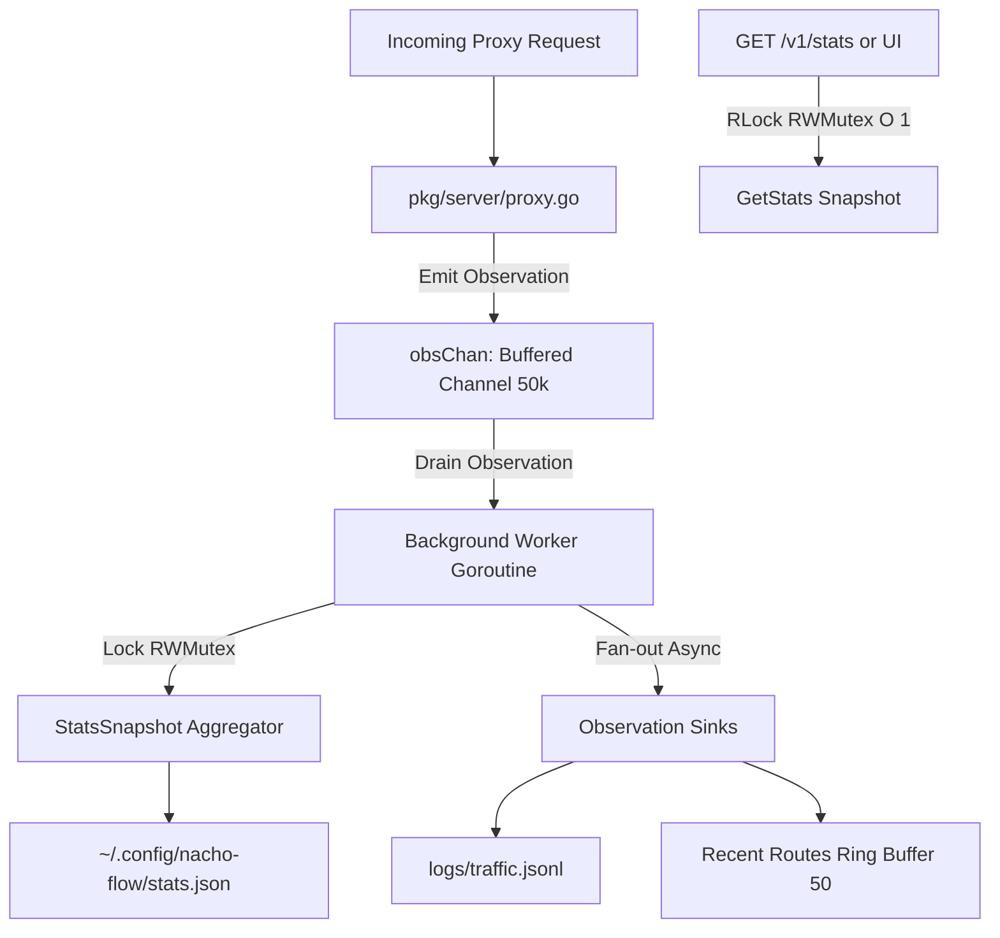
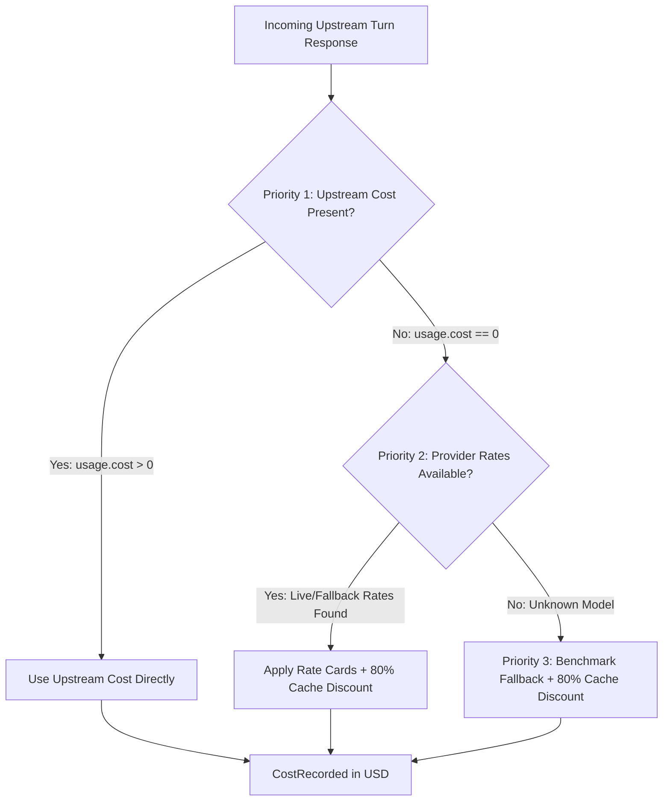
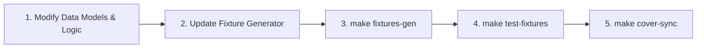

# 📊 Nacho Flow — Telemetry & Metrics Developer Guide

**Audience:** Core engine developers, contributors, and AI pair-programming agents  
**Package Path:** [`pkg/telemetry`](file:///c:/Users/karlk/development/Go/src/github.com/dixieflatline76/nacho-flow/pkg/telemetry)  
**Status:** Living Engineering Standard (v0.8.4+)

---

## Table of Contents

1. [Architectural Overview & Concurrency Model](#1-architectural-overview--concurrency-model)
2. [Dual Financial Accounting Engine](#2-dual-financial-accounting-engine)
3. [Pre-Aggregated Time Window Horizons](#3-pre-aggregated-time-window-horizons)
4. [Cycle Killer Defense Telemetry](#4-cycle-killer-defense-telemetry)
5. [Persistence, State Hydration & Historical Replay](#5-persistence-state-hydration--historical-replay)
6. [Mandatory Protocol: Adding New Metrics & Fixture Generation](#6-mandatory-protocol-adding-new-metrics--fixture-generation)

---

## 1. Architectural Overview & Concurrency Model

Nacho Flow processes proxy telemetry asynchronously with a high-throughput, non-blocking pipeline engineered for zero latency impact on active LLM inference streams:



### Key Concurrency Rules:
1. **Hot-Path Isolation**: When a proxy request finishes in `pkg/server`, `StatsTracker.Record(obs)` pushes the `Observation` into a non-blocking buffered Go channel (`obsChan`, capacity $50{,}000$). The proxy handler never acquires a mutex or performs disk I/O.
2. **Single-Writer Background Thread**: A dedicated worker goroutine (`worker()`) drains `obsChan`, updates in-memory counters, and fans out records to registered sinks.
3. **Atomic Read Path**: `GetStats()` acquires an `s.mu.RLock()` to return a shallow copy of `StatsSnapshot` in sub-microsecond $O(1)$ time with zero heap allocations on the critical proxy path.
4. **Copy-on-Write Sink Registry**: Sinks are stored via `atomic.Pointer[[]ObservationSink]` and updated via `s.sinkMu`, ensuring reading and emitting to sinks never blocks stats aggregation.

---

## 2. Dual Financial Accounting Engine

Nacho Flow measures both **actual cash spent** and **counterfactual cloud cost saved** by comparing local inference and tier routing against direct frontier model baseline pricing:

### Mathematical Formulas:

$$\text{Spent} = \sum_{\text{turns}} \text{CostSpentUSD}$$

$$\text{Saved} = \sum_{\text{turns}} \max\left(0, \text{BaselineCostUSD} - \text{CostSpentUSD}\right)$$

$$\text{CostReductionPct} = \begin{cases} \left(\frac{\text{Saved}}{\text{Saved} + \text{Spent}}\right) \times 100.0 & \text{if } (\text{Saved} + \text{Spent}) > 0 \\ 0.0 & \text{otherwise} \end{cases}$$

### Token Splitting & Pricing Defaults:
- **Local GPU Routing**: Always $\$0.00$ cost spent.
- **Estimated Savings**: Calculated against the curated baseline model (e.g. Claude Sonnet 5 @ $\$3.00$/1M prompt, $\$15.00$/1M completion).
- **Prompt vs. Completion Ratio**: When raw turn tokens are unmarshalled without explicit role splits, the Pricing Oracle applies an **80% prompt / 20% completion** heuristic (`float64(tokens) * 0.8`).

### 2.1 Prompt Cache-Aware Cost Calculation & 3-Tier Oracle

Modern cloud providers (e.g., OpenRouter, Anthropic, DeepSeek) apply significant discounts (typically **~80% off prompt token price**) for prompt cache hits. When calculating turn cost, Nacho Flow evaluates cost using a **3-tier priority oracle**:



#### Cache Discount Mathematical Formula:
When live or fallback rates are used, cached tokens receive an 80% discount:

$$\text{PromptCost} = (\text{PromptTokens} - \text{CachedTokens}) \times P_{\text{prompt}} + \text{CachedTokens} \times (P_{\text{prompt}} \times 0.20)$$

$$\text{CompletionCost} = \text{OutputTokens} \times P_{\text{completion}}$$

$$\text{CostSpentUSD} = \text{PromptCost} + \text{CompletionCost}$$

When only total tokens are available with cached tokens:
$$\text{UncachedTokens} = \max(0, \text{TotalTokens} - \text{CachedTokens})$$
$$\text{PromptTokens}_{\text{uncached}} = \text{UncachedTokens} \times 0.80,\quad \text{CompletionTokens} = \text{UncachedTokens} \times 0.20$$
$$\text{CostSpentUSD} = (\text{PromptTokens}_{\text{uncached}} \times P_{\text{prompt}}) + (\text{CachedTokens} \times P_{\text{prompt}} \times 0.20) + (\text{CompletionTokens} \times P_{\text{completion}})$$

---

## 3. Pre-Aggregated Time Window Horizons

To eliminate slow database queries, Nacho Flow maintains pre-aggregated metrics in memory across five discrete time horizons:

| Window Key | Horizon Definition | Aggregation Source |
| :--- | :--- | :--- |
| `today` | Current calendar day in UTC (`00:00:00` to now) | Live active bucket `DailyBuckets[activeDay]` |
| `yesterday` | Immediately preceding 24h UTC calendar day | `DailyBuckets[now.AddDate(0,0,-1)]` |
| `this_week` | Current ISO week (Monday `00:00:00` UTC to now) | Rolling sum of `DailyBuckets` from Monday $\rightarrow$ today |
| `this_month` | Current calendar month (`YYYY-MM-01` to now) | Rolling sum of `DailyBuckets` matching `YYYY-MM` prefix |
| `all_time` | Engine inception / total accumulated metrics | Incremental cumulative counters |

### Daily Buckets (`DailyBuckets`):
- Keyed by ISO date string: `"YYYY-MM-DD"` (e.g. `"2026-08-31"`).
- Retained for **31 days**; older daily buckets are pruned automatically during midnight rollover via `pruneBucketsLocked()`.

### Midnight Rollover Protocol (`updateWindowsLocked`):
When an incoming observation's timestamp crosses UTC midnight (`dayKey > s.activeDay`):
1. The prior day's accumulated bucket becomes `Windows.Yesterday`.
2. `s.activeDay` advances to `dayKey`.
3. `Windows.Today` resets to the new day's bucket.
4. If ISO week changes (`weekKey != s.activeWeek`), `Windows.ThisWeek` resets.
5. If calendar month changes (`monthKey != s.activeMonth`), `Windows.ThisMonth` resets.
6. `pruneBucketsLocked(observedAt)` purges buckets older than 31 days.

---

## 4. Defense Telemetry: Cycle Killer & Fairy Dust

### 4.1 Cycle Killer Defense Telemetry

The **Cycle Killer** subsystem severs infinite prompt loops (e.g. repetition loops, diff churn, degenerated tool chains). The telemetry tracker records these interventions:

### Empirical Engineering Constants:
```go
// pkg/telemetry/metrics.go
const estimatedAvoidedTokensPerIntervention = 8000 // Average runaway context burn prevented
const estimatedLocalTokensPerSecond        = 35   // ROCm/CUDA inference throughput for 12B/14B QAT
```

### Metrics Tracked:
- **`total_interventions`**: Number of times the loop shield severed a runaway loop.
- **`avoided_runaway_tokens`**: Cumulative tokens saved: $\text{interventions} \times 8{,}000$.
- **`avoided_gpu_seconds`**: Cumulative GPU lockup time prevented: $\frac{\text{avoided\_tokens}}{35\text{ tok/s}}$ ($\approx 228\text{ s}$ per intervention).
- **`stage1_local_heals`**: Loops resolved locally via system steering / correction prompt.
- **`stage2_cloud_escalations`**: Degenerations that required fallback to a reasoning cloud tier.
- **`session_kickstarts`**: Multi-turn idle/planning loops resuscitated by Kickstart.
- **`local_heal_success_rate_pct`**: Derived dynamically on read:
  $$\text{LocalHealRate} = \begin{cases} \left(\frac{\text{Stage1LocalHeals}}{\text{TotalInterventions}}\right) \times 100.0 & \text{if } \text{TotalInterventions} > 0 \\ 0.0 & \text{otherwise} \end{cases}$$

### 4.2 Fairy Dust Quality Checkpoint Telemetry

**Fairy Dust** proactively elevates inference to frontier reasoning models at strategic cadence checkpoints (e.g. every $N$ write tool calls). The telemetry tracker aggregates Fairy Dust operations across all time horizons:

- **`total_triggers`**: Total number of Fairy Dust quality checkpoints executed across the active window.
- **`total_cost_usd`**: Cumulative financial cost incurred solely by Fairy Dust invocations.
- **`by_entry`**: Per-entry breakdown (`map[string]FairyDustEntryMetrics`):
  - `triggers`: Count of triggers for the named checkpoint (e.g. `tactical_review`).
  - `cost_usd`: Total USD cost generated by this specific checkpoint.
  - `last_triggered_at`: RFC3339 timestamp of the most recent activation.

> [!IMPORTANT]
> `LocalHealSuccessRatePct` is computed **on read** inside `GetStats()` via `computeHealRate()`. It is **never saved to disk** to prevent floating-point serialization drift.

---

## 5. Persistence, State Hydration & Historical Replay

Telemetry is stored across two complementary media:

| Artifact | Location | Format | Purpose |
| :--- | :--- | :--- | :--- |
| **Stats Snapshot** | `~/.config/nacho-flow/stats.json` | JSON Object | Fast state restoration on daemon startup. |
| **Traffic Log** | `logs/traffic.jsonl` | JSON Lines | Immutable append-only audit stream of every prompt turn. |

### Self-Healing Legacy Snapshot Migration:
When a daemon starts up, it reads `stats.json`. If restoring from a legacy pre-v0.8.4 snapshot (where `DailyBuckets` lacked per-bucket CycleKiller metrics), `restoreWindowsFromBuckets()` executes a smart one-time migration that backfills the highest-volume daily bucket and propagates across active time windows:

```go
isLegacySnapshot := s.stats.CycleKiller.TotalInterventions > 0
if isLegacySnapshot {
    for _, b := range s.stats.DailyBuckets {
        if b.CycleKiller.TotalInterventions > 0 {
            isLegacySnapshot = false // A modern bucket exists — do not overwrite
            break
        }
    }
}
if isLegacySnapshot {
    // Backfill highest-volume bucket so stats.json persists cleanly
    if largestKey != "" {
        b := s.stats.DailyBuckets[largestKey]
        b.CycleKiller = s.stats.CycleKiller
        s.stats.DailyBuckets[largestKey] = b
    }
    if s.stats.Windows.Yesterday.Requests > 0 && largestKey == yesterdayKey {
        s.stats.Windows.Yesterday.CycleKiller = s.stats.CycleKiller
    }
    if weekMetrics.Requests > 0 {
        weekMetrics.CycleKiller = s.stats.CycleKiller
    }
    if monthMetrics.Requests > 0 {
        monthMetrics.CycleKiller = s.stats.CycleKiller
    }
}
```

### 5.1 ⚠️ Architectural Footgun: TurnRecord Sink Emission Completeness

> [!CAUTION]
> **The Dual Data-Path Trap**: Nacho Flow uses two related but distinct data representations:
> 1. `Observation` (`pkg/telemetry/metrics.go`): The ephemeral in-memory DTO passed via `obsChan` on the hot path.
> 2. `TurnRecord` (`pkg/telemetry/sink.go`): The serializable audit DTO emitted to `traffic.jsonl`, the 50-entry ring buffer, and SSE clients.
>
> When `worker()` processes an `Observation`:
> - It updates in-memory counters (`s.stats...`, `addToWindow()`).
> - It instantiates a `TurnRecord` literal and fans out to all registered sinks.
>
> **The Bug Pattern**: If you add a new metric to `Observation` and accumulate it in memory, but **forget to populate it in the `TurnRecord` constructor** inside `worker()`:
> - The live dashboard will display the metric correctly *while the daemon stays running*.
> - As soon as the daemon restarts or the user triggers `RecalculateFromRecords()`, Nacho Flow replays `traffic.jsonl`.
> - Because the field was never written to disk in `TurnRecord`, replaying historical turns reads `false` / `0`, **silently zeroing out historical counters on restart**.
>
> **Rule**: Every field added to `Observation` that must survive restarts **MUST** be mapped into the `TurnRecord` constructor in `worker()`, unmarshalled in `RecalculateFromRecordsAt()`, and tested via `TestStatsTracker_SinkEmission_FairyDustAndKickstart`.

### 5.2 ⚠️ Dashboard Footgun: Root Accumulator vs. Timeframe Window Selection

> [!WARNING]
> In the `/v1/stats` API payload, global cumulative totals exist at the root (`stats.cycle_killer`, `stats.fairy_dust`), while discrete timeframe data lives in `stats.windows.<window>.*`.
>
> Webview components must **NEVER** read from root-level accumulators when rendering time-windowed tabs (`today`, `yesterday`, `this_week`, `this_month`). Doing so causes timeframe blindness where selecting "Today" or "Yesterday" shows all-time cumulative counts. Always use `windowCycleKiller()` and `windowFairyDust()` selector helpers.

---

## 6. Mandatory Protocol: Adding New Metrics & Fixture Generation

Whenever you add, modify, or extend telemetry metrics, time horizons, or pricing formulas, you **MUST follow this 5-step engineering checklist**:



### Step 1: Update the Data Models & Aggregation
- Update `TimeWindowMetrics`, `StatsSnapshot`, or `TurnRecord` in [`pkg/telemetry/metrics.go`](file:///c:/Users/karlk/development/Go/src/github.com/dixieflatline76/nacho-flow/pkg/telemetry/metrics.go) or [`pkg/telemetry/sink.go`](file:///c:/Users/karlk/development/Go/src/github.com/dixieflatline76/nacho-flow/pkg/telemetry/sink.go).
- Update `addToWindow()`, `addBucketToWindow()`, and `restoreWindowsFromBuckets()`.

### Step 2: Update the Deterministic Generator
- Open [`pkg/telemetry/testdata/gen_fixtures.go`](file:///c:/Users/karlk/development/Go/src/github.com/dixieflatline76/nacho-flow/pkg/telemetry/testdata/gen_fixtures.go).
- Add the new field to `WindowExpected` and ensure `addRecordToExpected()` calculates the ground truth using the exact same formula.

### Step 3: Regenerate Static Fixtures
Run the Makefile generator target:
```bash
make fixtures-gen
```
This regenerates `pkg/telemetry/testdata/historical_turns.json` and `pkg/telemetry/testdata/historical_expected.json` with `--seed 42`.

### Step 4: Run Contract Verification Tests
Run the fixture contract test suite:
```bash
make test-fixtures
# and full race tests:
make test-race
```
Verify that `TestStatsTracker_HistoricalFixtures` and `TestStatsTracker_LegacyMigration_Fixtures` in [`pkg/telemetry/metrics_fixtures_test.go`](file:///c:/Users/karlk/development/Go/src/github.com/dixieflatline76/nacho-flow/pkg/telemetry/metrics_fixtures_test.go) pass cleanly with zero tolerance errors.

### Step 5: Synchronize Documentation & Coverage
Run the documentation coverage synchronizer:
```bash
make cover-sync
```

---

## 7. Useful Makefile Commands

```bash
# Run all unit tests including fixture validation
make test

# Run race detector across all Go packages
make test-race

# Run ONLY historical telemetry fixture integration tests
make test-fixtures

# Regenerate deterministic historical fixtures
make fixtures-gen

# Inspect interactive visual statement coverage
make test-cover

# Re-synchronize documentation matrices
make cover-sync
```
