# 🌮 Nacho Hugo ("Not-Yo' Hugo"): Architectural Blueprint & Execution Plan
## The Zero-Bloat, AI-Native Static Documentation Generator for the Spicebox Ecosystem

**Author:** [@dixieflatline76](https://github.com/dixieflatline76) · [spicebox.dev/nacho-flow](https://spicebox.dev/)  
**Document Classification:** System Architecture, Specification & Step-by-Step Implementation Blueprint  
**Status:** Ready for Future Autonomous Execution  

---

## 1. Executive Summary & Vision

### 1.1 Why "Nacho Hugo"?
Traditional static site generators and documentation engines fall into two frustrating extremes:
1. **The Over-Engineered Giants (Hugo, Docusaurus, MkDocs)**: Require complex folder archetypes, arcane configuration languages (TOML/YAML matrices), heavy Node.js or Python virtual environments, and steep learning curves just to publish markdown docs.
2. **The Client-Side SPAs (Marked.js in a single `docs.html`)**: While fast to build, they fail fundamentally in the modern AI and social era:
   - **Invisible to AI Web Crawlers** (ChatGPT Web, Claude Web, Perplexity): Scrapers do not execute JavaScript; they receive an empty `<div id="markdown-content"></div>` and miss the entire document.
   - **Broken Social Cards** (LinkedIn, Twitter/X, Slack, Discord): Query params like `docs.html?doc=case_study` cannot serve custom OpenGraph banner images or unique document titles to scrapers.
   - **HTTP Client Blindness**: `curl https://spicebox.dev/nacho-flow/docs.html?doc=case_study` returns zero content.

**Nacho Hugo ("Not-Yo' Hugo")** is the spicy, zero-bloat, pure-Go alternative: Point it at a directory of Markdown files $\rightarrow$ it outputs **100% pre-rendered, SEO-optimized, OpenGraph-ready, glassmorphic HTML5 pages in $< 10\text{ms}$** with zero configuration files.

---

## 2. System Architecture

```mermaid
flowchart TD
    subgraph Input["Markdown & Asset Sources"]
        MD_Case["docs/BENCHMARKS_AB_CASE_STUDY.md"]
        MD_User["docs/USER_GUIDE.md"]
        MD_Ext["docs/EXTENSION_USER_GUIDE.md"]
        MD_Arch["docs/ARCHITECTURE.md"]
        MD_Bench["docs/BENCHMARKS.md"]
        MD_Tune["docs/TUNING_GUIDE.md"]
        MD_Dev["docs/DEVELOPER_GUIDE.md"]
        MD_Road["ROADMAP.md"]
        Charts["docs/benchmarks/charts/*.png"]
    end

    subgraph NachoHugo["Nacho Hugo Engine (cmd/util/nacho_hugo or Standalone Repo)"]
        Parser["Goldmark CommonMark Engine (GFM Extensions)"]
        AlertTransformer["GitHub Alerts AST Transformer (> [!NOTE], [!TIP], etc.)"]
        MermaidWrapper["Mermaid.js Vector SVG Wrapper"]
        TOCGenerator["Heading Extractor -> Dynamic 'On This Page' TOC"]
        MetaRegistry["Document Metadata & OpenGraph / Twitter Card Registry"]
        TemplateEngine["html/template Glassmorphism Shell (Inter Font + Atoms)"]
    end

    subgraph Output["Static HTML Distribution (site/ + GitHub Pages)"]
        HTML_Case["site/case-study.html & site/whitepaper.html"]
        HTML_User["site/user-guide.html"]
        HTML_Ext["site/extension-guide.html"]
        HTML_Arch["site/architecture.html"]
        HTML_Bench["site/benchmarks.html"]
        HTML_Tune["site/tuning-guide.html"]
        HTML_Dev["site/developer-guide.html"]
        HTML_Road["site/roadmap.html"]
        HTML_Docs["site/docs.html (Backward-Compatible SPA Redirector)"]
        Assets["site/benchmarks/charts/*.png & site/index.css"]
    end

    Input --> NachoHugo
    NachoHugo --> Output
```



---

## 3. Core Technical Specifications

### 3.1 Dependencies
* **Go Version**: Go 1.22+ (Zero CGO, pure Go).
* **Core Dependency**: `github.com/yuin/goldmark` (v1.7.8+)
  * CommonMark compliant with GFM extensions: `extension.GFM`, `extension.Table`, `extension.Linkify`, `extension.Strikethrough`, `extension.TaskList`.
  * Parser Options: `parser.WithAutoHeadingID()` for automated anchor linking.
  * Renderer Options: `html.WithUnsafe()` (to permit custom image containers and HTML alerts).

### 3.2 Document Metadata Registry (`DocCatalog`)
Each document is registered with complete metadata:

```go
type DocMeta struct {
    Slug        string // Output filename without extension (e.g., "case-study")
    DocKey      string // Legacy query-param key for docs.html?doc= (e.g., "case_study")
    SourceFile  string // Relative path to source Markdown (e.g., "docs/BENCHMARKS_AB_CASE_STUDY.md")
    Title       string // Browser tab & OpenGraph title
    Description string // Meta description & social card snippet
    Keywords    string // SEO keywords
    OGImage     string // Full URL to OpenGraph banner image
    TwitterCard string // "summary_large_image" or "summary"
    Category    string // "Benchmark Report", "User Guide", "Architecture"
    NavLabel    string // Label in sidebar switcher
    NavIcon     string // Emoji or SVG icon
    Aliases     []string // Additional output aliases (e.g. "whitepaper.html")
}
```

#### Document Registry Table:
| Slug | Source File | OpenGraph Image | Title |
| :--- | :--- | :--- | :--- |
| `case-study` (alias: `whitepaper`) | `docs/BENCHMARKS_AB_CASE_STUDY.md` | `https://spicebox.dev/nacho-flow/benchmarks/charts/chart1_tco_comparison.png` | Empirical Evaluation of Hybrid Multi-Tier AI Routing in Autonomous Coding Agents |
| `user-guide` | `docs/USER_GUIDE.md` | `https://spicebox.dev/nacho-flow/images/favicon.png` | User Guide & Configuration Reference - Nacho Flow |
| `extension-guide` | `docs/EXTENSION_USER_GUIDE.md` | `https://spicebox.dev/nacho-flow/images/favicon.png` | VS Code Companion Extension Guide - Nacho Flow |
| `architecture` | `docs/ARCHITECTURE.md` | `https://spicebox.dev/nacho-flow/images/favicon.png` | Architecture & System Design - Nacho Flow |
| `benchmarks` | `docs/BENCHMARKS.md` | `https://spicebox.dev/nacho-flow/benchmarks/charts/chart2_cost_savings_baseline.png` | High-Concurrency Benchmarks & Stress Tests - Nacho Flow |
| `tuning-guide` | `docs/TUNING_GUIDE.md` | `https://spicebox.dev/nacho-flow/images/favicon.png` | Rule Tuning & Cost-Penalty Auto-Tuner - Nacho Flow |
| `developer-guide`| `docs/DEVELOPER_GUIDE.md` | `https://spicebox.dev/nacho-flow/images/favicon.png` | Developer & TDD Contributor Guide - Nacho Flow |
| `roadmap` | `ROADMAP.md` | `https://spicebox.dev/nacho-flow/images/favicon.png` | Product & Commercial Roadmap - Nacho Flow |

---

## 4. Implementation Blueprint (Code Architecture)

When ready to execute, implement the following components:

### 4.1 Step 1: Add Dependency to `go.mod`
```bash
go get github.com/yuin/goldmark@v1.7.8
```

### 4.2 Step 2: Create `cmd/util/nacho_hugo/main.go`
The generator script should implement:
1. **Markdown Pre-Processor**:
   - Template replacement for `{{VERSION}}` reading from `version.txt`.
   - Alert blockquote regex transformation:
     ```go
     alertRegex := regexp.MustCompile(`(?m)^>\s*\[!(NOTE|TIP|IMPORTANT|WARNING|CAUTION)\]\s*\n((?:>.*\n?)*)`)
     // Converts to <div class="alert-box alert-note"><strong>NOTE:</strong> ...</div>
     ```
2. **Goldmark Parser Setup**:
   ```go
   md := goldmark.New(
       goldmark.WithExtensions(
           extension.GFM,
           extension.Table,
           extension.Linkify,
           extension.TaskList,
       ),
       goldmark.WithParserOptions(
           parser.WithAutoHeadingID(),
       ),
       goldmark.WithRendererOptions(
           html.WithUnsafe(),
       ),
   )
   ```
3. **Table of Contents (TOC) Extractor**:
   - Scan generated HTML or AST for `<h2>` and `<h3>` tags with IDs.
   - Build a list of `{ID: string, Title: string, Level: int}` items to populate `#toc-links`.
4. **HTML Template Rendering (`template.html`)**:
   - Injects `.Title`, `.Description`, `.OGImage`, `.BodyHTML`, `.TOC`, and active navigation links.
   - Outputs files to `site/<slug>.html` and mirrors to root `<slug>.html`.

### 4.3 Step 3: Master Template (`cmd/util/nacho_hugo/template.html`)
The HTML template must contain:
```html
<!DOCTYPE html>
<html lang="en">
<head>
    <meta charset="UTF-8">
    <meta name="viewport" content="width=device-width, initial-scale=1.0">
    <title>{{.Title}} - Nacho Flow 🌮</title>
    <meta name="description" content="{{.Description}}">
    <meta name="keywords" content="{{.Keywords}}">
    <link rel="canonical" href="https://spicebox.dev/nacho-flow/{{.Slug}}.html">
    <link rel="stylesheet" href="index.css">
    
    <!-- OpenGraph Metadata -->
    <meta property="og:type" content="article">
    <meta property="og:title" content="{{.Title}}">
    <meta property="og:description" content="{{.Description}}">
    <meta property="og:image" content="{{.OGImage}}">
    <meta property="og:url" content="https://spicebox.dev/nacho-flow/{{.Slug}}.html">
    <meta property="og:site_name" content="Nacho Flow">

    <!-- Twitter Cards -->
    <meta name="twitter:card" content="{{.TwitterCard}}">
    <meta name="twitter:title" content="{{.Title}}">
    <meta name="twitter:description" content="{{.Description}}">
    <meta name="twitter:image" content="{{.OGImage}}">

    <!-- JSON-LD Structured Data -->
    <script type="application/ld+json">
    {
      "@context": "https://schema.org",
      "@type": "TechArticle",
      "headline": "{{.Title}}",
      "description": "{{.Description}}",
      "image": "{{.OGImage}}",
      "author": {
        "@type": "Person",
        "name": "dixieflatline76",
        "url": "https://github.com/dixieflatline76"
      },
      "publisher": {
        "@type": "Organization",
        "name": "Spicebox",
        "url": "https://spicebox.dev"
      }
    }
    </script>

    <!-- Client-Side Enhancements: Mermaid.js & Highlight.js -->
    <script src="https://cdn.jsdelivr.net/npm/mermaid@10/dist/mermaid.min.js"></script>
    <link rel="stylesheet" href="https://cdn.jsdelivr.net/gh/highlightjs/cdn-release@11.9.0/build/styles/atom-one-dark.min.css">
    <script src="https://cdn.jsdelivr.net/gh/highlightjs/cdn-release@11.9.0/build/highlight.min.js"></script>
    <script src="https://cdn.jsdelivr.net/gh/highlightjs/cdn-release@11.9.0/build/languages/go.min.js"></script>
    <script src="https://cdn.jsdelivr.net/gh/highlightjs/cdn-release@11.9.0/build/languages/yaml.min.js"></script>
    <script src="https://cdn.jsdelivr.net/gh/highlightjs/cdn-release@11.9.0/build/languages/bash.min.js"></script>
    <script src="https://cdn.jsdelivr.net/gh/highlightjs/cdn-release@11.9.0/build/languages/json.min.js"></script>
</head>
<body>
    <!-- Sticky Glass Navigation -->
    <nav class="glass">
        <!-- Brand logo & top links -->
    </nav>

    <main class="docs-layout">
        <aside class="docs-sidebar glass">
            <div class="doc-switcher">
                <h3>Developer Guides</h3>
                {{range .AllDocs}}
                <a href="{{.Slug}}.html" class="doc-nav-item {{if eq .Slug $.Slug}}active{{end}}">
                    <span>{{.NavIcon}}</span> {{.NavLabel}}
                </a>
                {{end}}
            </div>

            {{if .TOC}}
            <div class="toc-section">
                <h3>On This Page</h3>
                <div id="toc-links">
                    {{range .TOC}}
                    <a href="#{{.ID}}" class="toc-link toc-level-{{.Level}}">{{.Title}}</a>
                    {{end}}
                </div>
            </div>
            {{end}}
        </aside>

        <!-- 100% Pre-Rendered Markdown Content -->
        <article class="docs-content glass">
            <div class="markdown-body">
                {{.BodyHTML}}
            </div>
        </article>
    </main>

    <script>
        document.addEventListener('DOMContentLoaded', () => {
            mermaid.initialize({ startOnLoad: true, theme: 'dark' });
            hljs.highlightAll();
        });
    </script>
</body>
</html>
```

### 4.4 Step 4: Unit Test Suite (`cmd/util/nacho_hugo/nacho_hugo_test.go`)
Verify:
1. Every registered document compiles to valid HTML.
2. No empty files or broken headings.
3. Every OpenGraph image file exists locally in `docs/benchmarks/charts/` or `site/images/`.
4. Output HTML contains `<article>`, `<h1>`, and required `<meta property="og:...">` tags.

---

## 5. CI/CD Integration (`.github/workflows/pages.yml`)

Update the GitHub Pages workflow to build with Nacho Hugo automatically:

```yaml
      - name: Build Static Documentation via Nacho Hugo
        run: |
          go run ./cmd/util/nacho_hugo
          mkdir -p site/benchmarks
          cp -r docs/benchmarks/* site/benchmarks/ 2>/dev/null || true
          mkdir -p site/images
          cp -r images/* site/images/ 2>/dev/null || true
```

---

## 6. Verification & Acceptance Criteria

When executed, verify the deployment using these automated checks:

1. **Raw HTTP / `curl` Test (Zero JavaScript)**:
   ```bash
   curl -s https://spicebox.dev/nacho-flow/case-study.html | grep -i "Empirical Evaluation"
   # Must return the pre-rendered H1 title directly in HTTP response.
   ```

2. **OpenGraph Banner Verification**:
   ```bash
   curl -s https://spicebox.dev/nacho-flow/case-study.html | grep -i "og:image"
   # Must return: <meta property="og:image" content="https://spicebox.dev/nacho-flow/benchmarks/charts/chart1_tco_comparison.png">
   ```

3. **Social Preview Unfurling**:
   - Test `https://spicebox.dev/nacho-flow/case-study.html` in [LinkedIn Post Inspector](https://www.linkedin.com/post-inspector/) or [Twitter Card Validator](https://cards-dev.twitter.com/validator).
   - Card must render with high-res TCO stacked bar chart banner and full headline.

4. **Backward Compatibility**:
   - `docs.html?doc=case_study` must automatically route or redirect to `case-study.html`.

---

🌮 *This blueprint is complete and self-contained. Any future session can load this document and execute the Nacho Hugo pipeline in a single turn without additional context gathering.*
