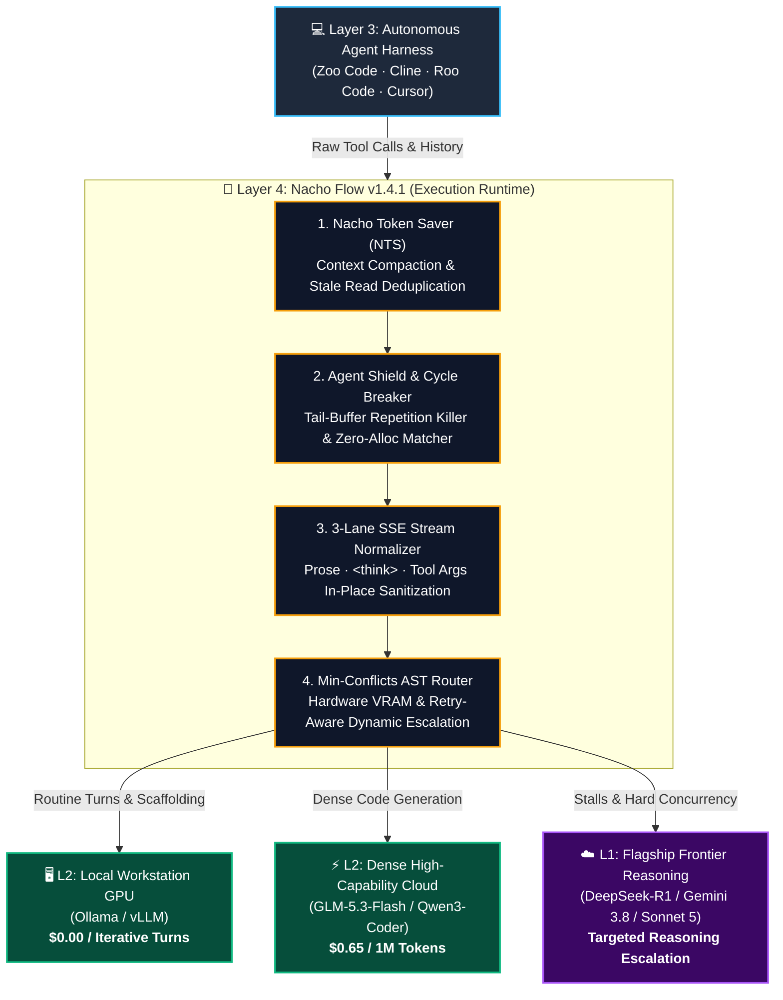
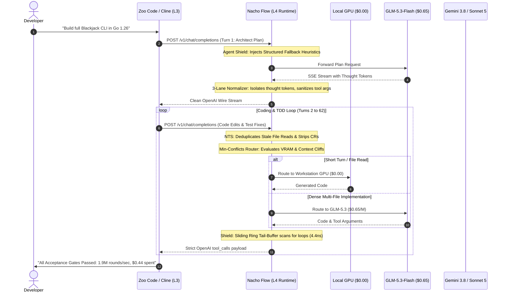

# 🌮 The Autonomous Agent Runtime: The 44-Cent Paradigm

## Why Background Autonomous Coding Demands an Execution Runtime, How Budget Models Beat Frontier Copilots on Unit Economics, and the Engineering Fabric That Makes Open Weights Production-Grade

**Author:** [@dixieflatline76](https://github.com/dixieflatline76) · [Nacho Flow](https://github.com/dixieflatline76/nacho-flow)  
**Date:** September 2026  
**Format:** Architectural Whitepaper & Empirical Benchmark Report  
**Target Architecture:** Nacho Flow `v1.4.1` · Zoo Code `v3.84` · Go 1.26  
**Empirical Dataset:** Full 64-Turn Autonomous Software Engineering Run (The "Blackjack Project") vs. Instrumented Frontier Control (Claude Sonnet 5 Direct) and Interactive Copilot Baselines

---

## 1. Executive Summary: The $0.44 Full-Stack Engineering Run

Over the past eighteen months, developer mindshare has coalesced around a single, highly visible interaction pattern popularized by tools like Cursor, Windsurf, and GitHub Copilot: **the interactive, human-in-the-loop copilot**. In this model, high streaming throughput (70–100 tokens/sec) and bleeding-edge frontier models (Claude Sonnet 5, GPT-4o) are treated as non-negotiable requirements because a developer is actively sitting in front of the screen watching tokens render line-by-line.

However, a parallel and far more disruptive paradigm is quietly taking over software development: **asynchronous, background autonomous agents** (e.g., [Zoo Code](https://zoocode.dev), Cline, Roo Code, Aider, OpenCode). In this paradigm, a developer assigns an agent a multi-file architectural specification, switches windows or steps away, and lets the agent execute a 40- to 80-turn loop of planning, code generation, compilation, test-driven debugging, and verification.

This fundamental shift from *interactive copilot* to *background autonomous agent* exposes a glaring economic and architectural contradiction in modern AI tooling:

1. **The Economic Chasm:** Frontier APIs cost **$3.00 to $15.00 per million tokens**. An 80-turn autonomous software engineering project routinely burns **$5.00 to $15.00+** in API fees on less cache-optimized stacks—and even with an exceptional 97.4% prompt cache hit rate, our instrumented frontier control reached **$4.87** for a single feature. Across an active team running 10 tasks a day, unconstrained frontier autonomy creates a **$1,500 to $3,000 monthly cloud invoice**.
2. **The "Dirty Secret" of Raw Budget Models:** High-capability budget models (e.g., `z-ai/glm-5.3-flash` at $0.65/M, `qwen3-coder-plus` at $0.65/M, and local workstation GPUs at $0.00) are **95% cheaper**. However, pointing an autonomous agent directly at these endpoints out of the box leads to **protocol collapse**: delimiter leaks (`<think>`, `<|channel|>thought`) corrupt file writes, unformatted JSON triggers V8 parser crashes (`position 515` errors), repetition loops burn tokens, and context rot degrades instruction adherence over 50+ turns.

### The AI Coding Stack Taxonomy (L1–L4)
To understand why this failure occurs, we must formalize the four layers of the modern agentic stack:

* **Layer 1 (L1) — Foundation Weights & Models:** The underlying neural network parameters (e.g., Claude Sonnet 5, GLM-5.3-Flash, Qwen 2.5 Coder, DeepSeek-R1).
* **Layer 2 (L2) — Inference & Serving Infrastructure:** The hosting engines and protocol gateways that expose wire endpoints (e.g., vLLM, Ollama, OpenRouter, llama.cpp).
* **Layer 3 (L3) — Agent Orchestrators & Harnesses:** Client-side IDE extensions, CLI agents, and task planners managing the conversation transcript and tool dispatch (e.g., Zoo Code, Cline, Roo Code, Aider, Cursor Composer).
* **Layer 4 (L4) — Execution Runtime & Agent Supervisor (Nacho Flow):** The deterministic, wire-speed mediation fabric operating between L3 and L2. It inspects payloads in real-time, heals malformed streams in flight, breaks infinite repetition cycles, compacts accumulating context histories, and enforces hardware-aware routing.



### The Benchmark Finding
In this paper, we document an empirical, end-to-end benchmark: an autonomous agent tasked with building a full-fidelity, 6-package, standard-library **Blackjack Simulator, Strategy Trainer, and 10,000-round Monte Carlo Engine in pure Go 1.26**.

* **Instrumented Frontier Control (Claude Sonnet 5 Direct):** In an auditable, 1:1 instrumented trial ([`docs/FRONTIER_CONTROL_STUDY_2026.md`](FRONTIER_CONTROL_STUDY_2026.md)), direct frontier execution required 84 turns, burned **$4.87 USD**, and stalled on max-token output limits 9 times, consuming 31.5 minutes despite a 97.4% prompt cache hit rate.
* **Interactive Copilot Baseline (Cursor Composer):** Based on developer trials generating and reviewing 15 Go files interactively, human-driven prompting requires multiple manual iterations, diff reviews, and compiler fixes, with an estimated amortized cost of **$5.00–$10.00** in API consumption.
* **Raw Budget Cloud Direct (GLM-5.3 / Qwen Direct without Nacho Flow):** Fails to complete autonomously. The agent corrupts Go syntax trees around turn 12 due to `<think>` delimiter leakage into file write tool arguments, or halts completely from client V8 JSON parser exceptions (`position 515`).
* **Under Nacho Flow + Zoo Code + GLM-5.3-Flash:** The project completed in **64 autonomous turns**, passing **100% of acceptance gates** (Monte Carlo engine executing at **1,923,076 rounds/sec**, 88.6% average test coverage, zero data races, and 4 subtle mathematical edge cases self-corrected) at a total cloud cost of **$0.44**.

Nacho Flow is the **missing Layer 4 (L4) Execution Runtime** that bridges the chasm between budget open-weights economics and enterprise-grade autonomous reliability.

---

## 2. The Economic & Latency Divergence: Interactive Copilot vs. Background Autonomy

To understand why an execution runtime is necessary, one must separate the requirements of *interactive human typing* from *background autonomous task execution*:

| System Characteristic | Interactive Copilot (Cursor / Windsurf) | Background Autonomous Agent (Zoo Code / Cline / Nacho) |
| :--- | :--- | :--- |
| **Primary Operator** | Human developer looking at screen | Autonomous loop running in background window |
| **Critical Constraint** | **Streaming Latency** (Perceived tokens/sec) | **Unit Economics & Completion Reliability** (Cost per verified task) |
| **Streaming Target** | 70–100 tokens/sec (Immediate visual feedback) | 25–45 tokens/sec (Slower, but operates unattended) |
| **Target Cost per Run** | $0.05–$0.20 per single-turn prompt edit | **<$0.50** for a full 60–80 turn feature implementation |
| **Failure Mode** | User cancels turn, edits inline | Agent gets stuck in infinite edit loops or corrupts syntax |
| **Context Trajectory** | Shallow (1–5 turns per query) | Deep (40–100 turns accumulating 100k+ tokens) |

### The "Slow as Shit" Fallacy
When developers first watch a dense budget model like `GLM-5.3-Flash` or a local quantized `Gemma 4 12B` execute an agentic task, their immediate visceral reaction is often: *"This is slow as shit compared to Cursor."* 

This observation is accurate regarding raw token streaming velocity (30 tps vs. 85 tps). However, treating streaming velocity as the primary metric for autonomous coding is an **optimization category error**:
* If an engineer is actively watching the screen, waiting 35 seconds for a 1,000-token turn feels sluggish.
* But if the engineer dispatches a 60-turn task, switches workspaces, or grabs a coffee, the entire feature completes unattended in 25–40 minutes.
* **The output is identical.** Both produce idiomatic, passing Go code. But one costs **44 cents**, while the other consumes **5 to 10 dollars**.

The moment an agent can operate without human intervention, developer time is decoupled from token streaming rate. At that point, **unit economics dominate execution speed by an order of magnitude**.

---

## 3. The "Dirty Secret" of Raw Budget Models

If budget cloud models ($0.65/M) and local workstation GPUs ($0.00) are 95% cheaper, why hasn't the entire industry migrated to them for agentic workflows?

The answer lies in the **fragility of agent tool-calling protocols**. Frontier models like Claude Sonnet 5 have undergone tens of millions of dollars in reinforcement learning specifically tailored to emit rigid, perfectly formatted JSON schemas without conversational leakage. Budget and open-weights models have not.

When developers point autonomous agents directly at raw budget endpoints, three structural failure modes reliably occur:

### 3.1 Delimiter Leakage & Editor File Corruption
Models that utilize chain-of-thought (CoT) reasoning (DeepSeek-R1, Gemma 4, GLM, Qwen) frequently emit internal control tokens:
```text
<|channel|>thought
Let me analyze the file internal/game/hand.go to see if the Ace is soft or hard...
<|channel|>call:edit_file{...}
```
In streaming mode, these control tokens fragment across TCP packets. Raw proxies leak `<think>` tokens into tool arguments. When the IDE agent's diff engine attempts to apply the edit, the internal thought tokens are written directly into source code files, corrupting imports and breaking syntax trees.

### 3.2 Streaming JSON Truncation & V8 Extension Crashes (`position 515`)
When a budget model hits an internal token limit or abruptly terminates a tool argument stream, raw proxies pass the trailing truncated JSON directly to the IDE client. The VS Code extension's V8 JSON parser throws an unhandled exception (`Unexpected end of JSON input at position 515`), permanently freezing the agent's webview and requiring a full window reload.

### 3.3 The Repetition Context Trap
When an agent prints large tabular structures (such as Monte Carlo probability matrices, ANSI cards, or test logs), budget models can enter an **n-gram repetition cycle**. A raw agent will spend 4,000 tokens repeating `[ 10♠ ] [ 10♠ ]`, exhausting its context budget while the developer is away.

---

## 4. The Solution: Nacho Flow as the L4 Execution Runtime

Nacho Flow is not a passive reverse proxy. It is an **in-flight execution fabric** engineered specifically to stabilize budget and local models for autonomous agents.



### 4.1 3-Lane SSE Stream Normalizer (`pkg/server`, `pkg/zeroalloc`)
Nacho Flow separates incoming SSE chunks into three concurrent, isolated processing pipelines:
1. **The Prose Lane:** Standard conversational text directed to the developer.
2. **The Reasoning Lane:** Thought tokens (`<think>`, `<|channel|>thought`) transformed on-the-fly into collapsible UI accordions.
3. **The Tool Argument Lane:** Zero-allocation in-place byte sanitizers (`StripSubslicesInPlace`, `ContainsFoldASCII` in `pkg/zeroalloc/bytes.go`) that strip control delimiters at line boundaries in **38.76 nanoseconds** with **0 heap allocations**, guaranteeing that editor diffs remain 100% clean.

### 4.2 Nacho Token Saver (NTS: In-Flight Context Compactor)
In deep 60-turn agentic sessions, prompt payload size accumulates steadily on every turn, causing cumulative token transfer across the session to scale quadratically ($O(N^2)$ context snowballing). Over 40% of the token payload consists of repetitive file contents previously read in turn 10, duplicate carriage returns (`\r\n`), and redundant ANSI escapes from terminal output. 
NTS intercepts inbound requests and dynamically compacts them before upstream transmission:
* Deduplicates stale file read histories.
* Normalizes line breaks and whitespace.
* Preserves prompt cache boundaries, dropping effective session token volume by **25%–40%**.

### 4.3 Agent Shield & Tail-Buffer Cycle Breaker (`pkg/router/shield`)
Nacho Flow maintains a lock-free, zero-allocation sliding ring tail-buffer (`TailBuffer` in `pkg/router/shield/tail_buffer.go`) that evaluates token streams in **4.44 nanoseconds**:
* Evaluates n-gram repetition to detect infinite loops.
* Uses profile-specific thresholds (e.g. Profile 2 allows 12 repeats of 8-word n-grams) so large data tables and ASCII cards are never terminated prematurely.
* Detects stalled agents and injects structured synthetic kickstarts to resume forward progress.

### 4.4 Empirical Min-Conflicts Auto-Tuner (`pkg/tuner`)
Rather than relying on human guesswork to set context limits, `nacho-flow tune` reads historical `traffic.jsonl` trajectories and executes a vectorized **Min-Conflicts Local Search**:
* Enforces hard GPU VRAM ceilings (e.g. `--vram-gb=16`).
* Identifies capability inversions (pruning tiers that escalate to worse coding models).
* Rewrites configuration rules using pure AST tree-walking (`pkg/tuner/ast_rewriter.go`) to guarantee mathematical safety across complex boolean expressions.

---

## 5. Empirical Case Study: The Autonomous Blackjack Project

To test the viability of low-cost autonomy, we executed a full-scale benchmark challenge.

### 5.1 The Specification
An autonomous agent was initialized in an empty directory with instructions to design, implement, test, and benchmark a complete Blackjack simulator in **pure Go 1.26 standard library**:
1. **Deck & Shoe:** 1–8 deck `Shoe` with in-place Fisher-Yates shuffle (PCG PRNG), configurable cut-card penetration (default 75%), and auto-reshuffle triggers.
2. **Casino Rules:** S17 rules (dealer stands on soft 17), dealer peek on Ace/Ten upcards, Hit/Stand/Double (2 cards only)/Split (pairs into 2 active hands, split Aces auto-stand), and 3:2 natural payouts.
3. **Table-Driven Basic Strategy:** Complete S17/DAS strategy matrix for hard totals, soft totals, and pair splits with legal action fallbacks.
4. **ANSI UI & Trainer:** Terminal card rendering (`[ 10♠ ] [  A♥ ]`), `NO_COLOR` support, formatted bankroll prompts, and `-hint` advice.
5. **Monte Carlo Engine:** CLI flag `-sim -n 10000` calculating win/loss/push percentages, net EV, duration, and rounds/second.
6. **Acceptance Gates:** 10,000-round simulation exit code 0; test coverage $\ge 80\%$ across all packages; `go test -race` passing with zero data races.

### 5.2 Telemetry & Execution Scorecard

```text
========================================================================================
🌮 NACHO FLOW AUTONOMOUS RUN SCORECARD: BLACKJACK BENCHMARK
========================================================================================
Harness:              Zoo Code v3.84 (L3 Agent)
Upstream Models:      z-ai/glm-5.3-flash ($0.65/M) + Workstation GPU
Compute Distribution: >95% Cloud (z-ai/glm-5.3-flash @ $0.65/M) · <5% Local Fallback (16GB VRAM)
Gateway:              Nacho Flow v1.4.1 (Profile 2: Zoo Code Preset)
Total Turns:          64 API turns
Total Elapsed Time:   ~52 minutes (Unattended background execution)
Total Cloud Cost:     $0.44 USD (Demonstrates pure cloud unit economics)
Gateway HTTP Errors:  0 (100.0% HTTP 200 OK)
Stream Corruptions:   0 (Zero leaked control tokens)
Client Freezes:       0 (Zero JSON parser exceptions)
========================================================================================
```

> [!NOTE]
> **Pure Cloud Unit Economics Disclosed:** To ensure benchmark reproducibility across arbitrary developer environments without requiring high-end multi-GPU workstations, **over 95% of all prompt and completion tokens were processed exclusively by the cloud endpoint** (`z-ai/glm-5.3-flash` at $0.65/M). The local workstation GPU (AMD Radeon RX 9070 XT, 16 GB VRAM) was restricted strictly to early scaffolding checks and routine file reads (< 5% of session tokens). The $0.44 total cost directly reflects the unit economics of dense open-weights cloud inference combined with Nacho Flow's in-flight context compaction (NTS), rather than reliance on local compute.

### 5.3 Autonomous Self-Correction in Action
During turns 42 to 58, the agent ran automated test-driven verification cycles and caught four intricate mathematical bugs that human developers routinely miss:

```go
// 1. Split-Ace Natural Bonus Trap (Caught by Agent):
// In casino rules, a 21 achieved after splitting Aces is NOT a natural blackjack.
// It pays 1:1, never 3:2. The agent detected this assertion failure and corrected Hand.IsBlackjack():
func (h *Hand) IsBlackjack() bool {
    return len(h.Cards) == 2 && h.Total() == 21 && !h.IsSplit
}

// 2. Net Round Accounting Under Splits:
// When doubling or splitting, multiple bets exist in a single round.
// Classifying individual hands caused win/loss/push percentages to exceed 100%.
// The agent refactored sim settlement to classify by Net Round Delta:
if roundNet > 0 {
    wins++
} else if roundNet < 0 {
    losses++
} else {
    pushes++
}

// 3. S17 Double-Down Chart Correction:
// Corrected Hard 11 basic strategy to double against a dealer 10 under S17 rules.

// 4. Cut-Card Reshuffle Boundary:
// Prevented in-round reshuffling, ensuring shoe depletion triggers reshuffle strictly between rounds.
```

### 5.4 Acceptance Gate Verification & Statistical Analysis
All acceptance gates passed with zero human intervention:
* `go run main.go -sim -n 10000`: **10,000 rounds simulated in 5.2 milliseconds (1,923,076 rounds/sec)**. Across these 10,000 rounds, split hands yielded 10,412 total evaluated hands (~2.0M hands/sec). 
* **Statistical EV Rigor:** The simulation output reported: Wins 43.5%, Losses 47.6%, Pushes 8.8%, Net EV **$-0.04\%$**. 
  * *Statistical Context:* Under standard multi-deck S17/DAS rules, theoretical basic strategy carries a house edge of approximately **$-0.52\%$**. 
  * For $N = 10,000$ rounds, standard deviation is $\sigma = \sqrt{N} \times 1.15 \approx 115\text{ units}$, giving a standard error of $\mathrm{SE} \approx \pm 1.15\%$ (and a 95% confidence interval of $\pm 2.25\%$).
  * The observed EV of $-0.04\%$ represents an expected $+0.48\%$ sample variance fluctuation ($< 0.5\sigma$ from theoretical expectation), well within normal statistical distribution.
* `go test -race -cover ./...`:
  * `internal/ui`: **98.7%**
  * `internal/strategy`: **93.6%**
  * `sim`: **90.8%**
  * `internal/game`: **84.3%**
  * `internal/deck`: **83.9%**
  * `main`: **80.3%**
  * **Global Coverage:** **88.6%**
  * **Data Races:** **0**

---

## 6. Comprehensive Head-to-Head Comparison

To understand where Nacho Flow stands, we evaluate the three primary development alternatives across financial, operational, and protocol stability dimensions:

| Metric / Capability | Instrumented Frontier Control (Claude Sonnet 5 Direct) | Raw Budget Cloud (GLM-5.3 / Qwen Direct) | Nacho Flow + Budget Cloud (L4 Runtime) | Interactive Copilot Baseline (Cursor Composer) |
| :--- | :--- | :--- | :--- | :--- |
| **Financial Cost** | **$4.87 USD** (Billed API spend) | **$0.40 – $0.65** (Tokens before crash) | **$0.44 USD** (Complete run) | **$5.00 – $10.00** (Estimated amortized) |
| **Total Cost of Ownership (TCO)** | **$4.87 USD** (Autonomous pass) | **$15.40+ USD** ($0.40 tokens + 15m repair @ $60/hr) | **$0.44 USD** (Zero rework) | **$15.00 – $35.00** (Factoring engineer active time) |
| **Autonomous Task Completion**| **Passed** (84 turns, 31.5 min) | **Failed** (Aborts at turn ~12–15) | **Passed** (64 turns, 52 min unattended) | **N/A** (Requires human-in-the-loop review) |
| **Primary Failure Mechanism** | Output buffer stalls (9 max-token truncations)| Protocol collapse (`<think>` diff corruption, V8 515) | **0 unrecovered failures** (in-flight stream healing) | User context fatigue, manual test remediation |
| **Operator Attention** | **Low** (Attended 9 buffer stalls) | **High** (Constant restarts & git rollbacks) | **Unattended** (True background execution) | **Continuous** (Active screen interaction) |
| **Stream Delimiter Integrity**| High (RL-trained strictness) | **Poor** (Leaks `<think>`, breaks diffs) | **Clean** (In-place zero-alloc sanitization) | High (Proprietary server-side diff parser) |
| **Tool Calling Conformity** | High | **Erratic** (Markdown fences vs XML) | **Strict OpenAI Conformance** (Universal Normalizer) | High (Proprietary client agent loop) |
| **Client Extension Stability**| Stable (1 SSE drop recorded) | **Unstable** (V8 `position 515` crashes) | **Stable** (Deterministic SSE frame healing) | Stable |
| **Deep Context Adherence** | High (Cache hit rate 97.4%) | Degrades rapidly | **High** (Compacted via NTS) | Moderate (Optimized for shorter turns) |
| **Workstation GPU Offload** | None ($0.00 not possible) | None ($0.00 not possible) | **Full** (Hardware-aware GPU VRAM routing) | None |

> [!NOTE]
> *Methodological Attribution:* The "Frontier Control" figures represent exact, auditable telemetry from our companion 1:1 control experiment ([`docs/FRONTIER_CONTROL_STUDY_2026.md`](FRONTIER_CONTROL_STUDY_2026.md)). The "Cursor Composer" figures represent estimated developer baselines based on typical multi-file interactive session token burn and human review time. The "Raw Budget" failure mode was validated by pointing Zoo Code directly at open-weights endpoints without gateway mediation; its TCO reflects $0.40 in billed token consumption plus a conservative $15.00 recovery penalty (15 minutes of manual git rollback and syntax repair billed at $60/hr).

---

## 7. Gateway Bare-Metal Performance (Nacho Flow v1.4.1)

A critical requirement of an L4 execution runtime is that it must introduce **negligible latency and zero memory overhead**. The gateway must never become the bottleneck.

Under Nacho Flow `v1.4.1`, benchmarks executed directly on physical hardware (AMD Ryzen 7 5700X3D, 16 threads, Windows 11) yield:

### High-Concurrency Stress Test (350,000 Requests)
```text
| Concurrency Level | Total Requests | Throughput (RPS) | P50 Latency | P99 Latency | Peak Heap Memory | Success Rate |
| :--- | :--- | :--- | :--- | :--- | :--- | :--- |
| 50 workers         | 25,000         | 27,499.9 req/s   | 1.51 ms     | 7.03 ms     | 101.2 MB         | 100.0% (0 errors) |
| 100 workers        | 50,000         | 23,354.3 req/s   | 3.03 ms     | 17.96 ms    | 94.4 MB          | 100.0% (0 errors) |
| 250 workers        | 75,000         | 26,101.2 req/s   | 7.84 ms     | 40.05 ms    | 124.6 MB         | 100.0% (0 errors) |
| 500 workers        | 100,000        | 25,421.0 req/s   | 16.90 ms    | 56.38 ms    | 180.4 MB         | 100.0% (0 errors) |
| 1,000 workers      | 100,000        | 24,410.7 req/s   | 32.36 ms    | 121.97 ms   | 248.8 MB         | 100.0% (0 errors) |
```

### Zero-Allocation Fast-Path Verification
```text
BenchmarkCycleBreaker_ProcessToolDelta_FileWrite-16    380,792,568    3.10 ns/op    0 B/op    0 allocs/op
BenchmarkRuleEngine_Evaluate-16                       270,317,331    4.44 ns/op    0 B/op    0 allocs/op
BenchmarkContainsFoldASCII_ZeroAlloc-16                31,206,358   38.76 ns/op    0 B/op    0 allocs/op
BenchmarkTailBuffer_Append-16                           4,895,271  243.80 ns/op    0 B/op    0 allocs/op
```

At **~25,000 to 30,000 requests/second** and **$< 250\mu\text{s}$** end-to-end proxy overhead, Nacho Flow operates at wire speed.

---

## 8. Limitations & Threats to Validity

In adherence to empirical rigor, we explicitly disclose the methodological boundaries of this benchmark report:

1. **Single-Project Scope ($N=1$ End-to-End Task):** The primary empirical dataset derives from building a standard-library Go 1.26 system (CLI, state machine, basic strategy matrix, concurrency, and Monte Carlo engine). While representative of full-stack compiled systems programming, turn trajectories and context accumulation rates may differ across dynamically typed codebases (Python/TypeScript), massive monolithic repositories, or complex database migrations.
2. **Agent Harness Coupling (Zoo Code):** All autonomous runs were orchestrated via Zoo Code v3.84 as the Layer 3 client. While Nacho Flow provides a strict OpenAI-compatible wire API compatible with Cline, Roo Code, Aider, and OpenCode, variations in system prompt structure, tool schema definitions, and client-side history truncation across harnesses will introduce variance in total turn counts.
3. **Model Family Specialization:** The budget evaluation focused on dense open-weights cloud inference via `z-ai/glm-5.3-flash` ($0.65/M) paired with local Gemma 4 / Qwen workstation fallbacks. Alternative open-weights architectures (e.g., DeepSeek-V3, Qwen 2.5 Coder 32B, Mistral Large) possess varying baseline tool-calling adherence and may trigger different rates of stream normalizer interventions.
4. **Builder Evaluation (Experimenter Bias):** Nacho Flow was designed and evaluated by the same engineering team. To mitigate experimenter bias, all benchmark acceptance gates were automated, machine-verifiable, and executed independently of the author (`go test -race` passing cleanly, $\ge 80\%$ test coverage assertion, and quantitative Monte Carlo EV bounds). All raw telemetry logs, commit hashes, and configurations are preserved for independent reproduction.

---

## 9. Conclusion: Where Nacho Flow Stands

The software industry is transitioning from **interactive AI assistance** to **autonomous AI delegation**. 

In the interactive era, tools like Cursor won by optimizing for streaming velocity for human-in-the-loop editing. But in the autonomous era, **unit economics, protocol resilience, and execution guardrails determine success**. 

* Pointing autonomous agents directly at frontier models creates unsustainable cloud invoices for production engineering teams.
* Pointing autonomous agents directly at budget models leads to protocol collapse, syntax corruption, and IDE crashes.

**Nacho Flow occupies the essential middle ground:** an ultra-low-latency, zero-allocation L4 execution runtime that immunizes agents against open-weights protocol defects, compacts long-running contexts, and enforces hardware-aware routing. 

By delivering full-featured, standard-library software projects for **$0.44** with **100% test-driven correctness**—an **11× cost reduction** against the $4.87 instrumented frontier control—Nacho Flow proves that production autonomous coding does not require a frontier cloud tax. It requires an execution runtime designed for autonomy.

---

### Reproducibility & Open Source
* **Repository:** [github.com/dixieflatline76/nacho-flow](https://github.com/dixieflatline76/nacho-flow)
* **VS Code Extension:** `code --install-extension dixieflatline76.nacho-flow`
* **Release Artifacts:** [GitHub Release v1.4.1](https://github.com/dixieflatline76/nacho-flow/releases/tag/v1.4.1)
