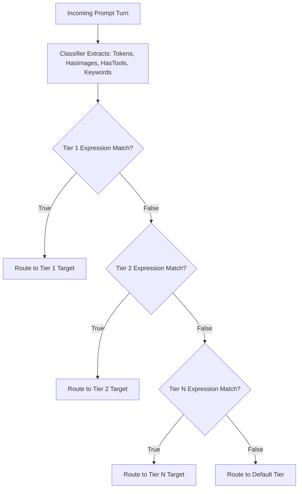

# 🎯 Nacho Flow: Rule & Tier Tuning Guide

This guide teaches you how to write, optimize, test, and tune dynamic routing rules in **Nacho Flow** using `expr-lang/expr` expressions.

## Table of Contents
1. [How the Evaluation Pipeline Works](#1-how-the-evaluation-pipeline-works)
2. [Available Context Variables & Tier Properties](#2-available-context-variables--tier-properties)
3. [Recommended Tier Ordering Strategy](#3-recommended-tier-ordering-strategy)
4. [Real-World Rule Recipes](#4-real-world-rule-recipes)
5. [Testing & Validating Your Rules](#5-testing--validating-your-rules)
6. [Autonomous Cost-Penalty Auto-Tuning (`nacho-flow tune`)](#6-autonomous-cost-penalty-auto-tuning-nacho-flow-tune)
7. [Manual Heuristic Tuning Tips](#7-manual-heuristic-tuning-tips-for-custom-power-rules)
8. [Troubleshooting & FAQ](#8-troubleshooting--faq)

---

## 1. How the Evaluation Pipeline Works

When an agent (Roo Code, Cline, Aider, Cursor) sends a prompt turn, Nacho Flow evaluates your configured tiers sequentially from **top to bottom** (*First Match Wins*):



---

## 2. Available Context Variables & Tier Properties

### Variables in `when` Expressions:
| Variable | Type | Description | Example Condition |
| :--- | :--- | :--- | :--- |
| `Tokens` | `int` | Real-time adaptive estimated token count across all prompt messages | `Tokens < 16000` |
| `HasImages` | `bool` | `true` if any message contains screenshots or image URLs | `HasImages == true` |
| `HasTools` | `bool` | `true` if function/tool definitions or active tool calls are present | `HasTools == true` |
| `Keywords` | `[]string` | Code keywords detected **strictly in the latest user prompt** | `any(Keywords, { # in ['deadlock', 'mutex'] })` |
| `Retries` | `int` | Number of consecutive prompt retries in current session (sliding 5m TTL) | `Retries < 2` |
| `IsRetry` | `bool` | `true` if this prompt is a retry of a previous failure | `!IsRetry` |
| `Model` | `string` | The requested model ID sent by the client (e.g. `nacho-hybrid`) | `Model == 'nacho-coder'` |

### Tier Properties:
- `max_context` (`int`): Optional. Upper bound of the model's context window (e.g. `16384`, `32768`). If `Tokens > max_context`, Nacho Flow immediately skips this tier with zero expression overhead.
- `strip_images` (`bool`): If `true`, strips raw base64 image strings from older conversation turns to prevent 400 errors on text-only models.
- `reasoning_effort` (`string`): Passes `"low"`, `"medium"`, or `"high"` to supported reasoning providers.

---

## 3. Recommended Tier Ordering Strategy

To maximize cost savings without degrading agent intelligence, follow the **Hierarchy of Complexity**:

```text
[1. Complex Keywords / Reasoning]  --> Route to DeepSeek-R1 / o1 (Specialized Brain)
[2. Multimodal Vision (Images)]    --> Route to Gemini Flash / Claude 3.5 Sonnet (Vision Encoders)
[3. Active Tool Calls]             --> Route to Cloud Fast Coder (High Tool Adherence)
[4. Routine Local Coding (< 16k)]  --> Route to Local GPU (Ollama/vLLM) ($0.00 / 100% Free)
[5. Retry Escalation (Retries>=2)] --> Route to Cloud Provider (Breaks Local Failure Loops)
[6. Large Context Overflow (>= 16k)]-> Route to Cheap Cloud Fast (e.g. Qwen 3 Coder / DeepSeek)
[Default Fallback]                 --> Reliable Cloud Fallback
```

### 🎯 GPU Hardware & Token Sizing Cheat Sheet

Not sure what token limits to set for your local workstation? Use this reference table based on your available VRAM:

| Workstation Hardware | VRAM | Recommended Local Model | Suggested `Tokens` Bound |
| :--- | :--- | :--- | :--- |
| **8 GB VRAM** (RTX 3060/4060, Apple M1/M2 8GB) | 8 GB | `qwen2.5-coder:7b` | `Tokens < 8000` |
| **16 GB VRAM** (RTX 4080, RX 7800/9070 XT, Apple 16-24GB) | 16 GB | `qwen2.5-coder:14b` | `Tokens < 16000` |
| **24 GB VRAM** (RTX 3090/4090, Apple M-Max 32GB) | 24 GB | `qwen2.5-coder:32b` (Q4) | `Tokens < 24000` |
| **32 GB+ VRAM / Mac Studio** | 32 GB+ | `qwen2.5-coder:32b` (Q8) / `deepseek-r1:32b` | `Tokens < 32000` |

---

## 4. Real-World Rule Recipes

### 🔥 Top 5 Copy-Paste Rule Patterns

| Pattern | `when` Condition | Purpose |
| :--- | :--- | :--- |
| **1. Standard Local Workhorse** | `Tokens < 16000 && !HasImages && Retries < 2` | Routes routine iterative turns to GPU for $0.00, breaking on failures. |
| **2. Concurrency / Math Escapement** | `any(Keywords, { # in ['deadlock', 'mutex', 'concurrency', 'race'] })` | Instantly flags deep reasoning keywords to DeepSeek-R1 / o1. |
| **3. Vision Escapement** | `HasImages` | Routes screenshot turns to vision models (Gemini Flash / Claude Sonnet). |
| **4. Tool-Safety Boundary** | `!HasTools && Tokens < 12000` | Restricts local models to pure code generation without calling external tools. |
| **5. Cloud Recovery Overflow** | `Tokens >= 16000 || HasTools || Retries >= 2` | Catch-all for large context overflow, tool execution, or retry recovery. |

---

### Recipe 1: Local-First GPU Routing with Auto-Escalation
Routes small, single-file edits and routine coding tasks to your local GPU, escalating to cloud when history accumulates, images are attached, or if the local model fails 2 consecutive times:

```yaml
tiers:
  - name: "Cloud Vision"
    model: "google/gemini-2.5-flash-lite"
    provider: "openrouter"
    when: "HasImages"

  - name: "Local ROCm / CUDA GPU"
    model: "qwen2.5-coder:14b"
    provider: "local_gpu"
    max_context: 16384
    when: "Tokens < 16000 && !HasImages && !HasTools && Retries < 2"
    strip_images: true

  - name: "Cloud Agentic Fast"
    model: "qwen/qwen3-coder-30b-a3b-instruct"
    provider: "openrouter"
    when: "Tokens >= 16000 || HasTools || Retries >= 2"

default_tier:
  name: "Cloud Fallback"
  model: "deepseek/deepseek-v4-flash-latest"
  provider: "openrouter"
  when: "true"
```

---

### Recipe 2: Domain-Specific Routing (SQL, Concurrency & Security)
Automatically detects deep architectural concepts and delegates them to specialized reasoning models (evaluated strictly on the latest user prompt):

```yaml
tiers:
  # Concurrency & Race Conditions -> DeepSeek-R1
  - name: "Deep Reasoning"
    model: "deepseek/deepseek-r1"
    provider: "openrouter"
    when: "any(Keywords, { # in ['deadlock', 'mutex', 'race', 'concurrency', 'atomic', 'goroutine'] })"

  # Database & Migrations -> Specialized Model
  - name: "SQL Specialist"
    model: "deepseek/deepseek-chat"
    provider: "deepseek"
    when: "any(Keywords, { # in ['sql', 'postgres', 'migration', 'index', 'query', 'schema'] })"

  # Everything else < 12k context without prior retries -> Local GPU
  - name: "Local Fast"
    model: "qwen2.5-coder:14b"
    provider: "local_gpu"
    max_context: 16384
    when: "Tokens < 12000 && !HasImages && Retries < 2"
```

---

### Recipe 3: Reasoning Effort Injection
For models supporting explicit reasoning controls (e.g. OpenAI o3-mini or Gemini thinking):

```yaml
tiers:
  - name: "Heavy Reasoning"
    model: "openai/o3-mini"
    provider: "openrouter"
    reasoning_effort: "high"
    when: "any(Keywords, { # in ['architecture', 'proof', 'refactor-entire-repo'] })"

  - name: "Fast Reasoning"
    model: "openai/o3-mini"
    provider: "openrouter"
    reasoning_effort: "low"
    when: "Tokens > 20000"
```

---

## 5. Testing & Validating Your Rules

### Dry-Run Validation
Nacho Flow validates all `expr` rules at startup. If any syntax error or missing variable is detected, the server refuses to boot and displays the exact line and character:

```bash
$ nacho-flow -config config.yaml
# Evaluator compile error: unknown name "TokenCount" (did you mean "Tokens"?)
```

### ⚡ Test Rules On-The-Fly with HotSauce Directives
You don't need to restart the server or edit `config.yaml` to test how a model behaves on a specific turn. Simply splash a **HotSauce directive** right into your agent chat prompt:

```text
@nacho:tier="Deep Reasoning" please analyze the lock contention in this channel fan-out
@nacho:local write a unit test for this handler
@nacho:reasoning prove why this algorithm is O(N log N)
```
Nacho Flow strips the directive and routes the turn directly to the requested tier, allowing you to test candidate rules in real time.

### 🔍 Live Route Inspector (VS Code Webview)
If you use the [VS Code Companion Extension](file:///docs/EXTENSION_USER_GUIDE.md), open the **Nacho Flow Dashboard** (`Ctrl+Shift+P` → `Nacho Flow: Show Dashboard`). The **Live Route Inspector** displays a real-time table of your last 500 LLM requests with:
* Exact prompt token count
* Matched routing tier and rule reason
* Turn latency (ms)
* Estimated dollars saved ($0.00 vs Cloud)
* Upstream target provider

---

## 6. Autonomous Cost-Penalty Auto-Tuning (`nacho-flow tune`)

While manual rule crafting is powerful, human developers shouldn't have to guess where their local model begins to struggle. Nacho Flow features an autonomous **Cost-Penalty Auto-Tuner** that analyzes your real-world coding telemetry, detects model failure boundaries, and synthesizes optimal rules.

### 6.1 The Mathematical Problem: The "Context Cliff"
Local open-weight models (e.g. `qwen2.5-coder:14b`, `deepseek-coder:6.7b`) are remarkably capable on concise prompt turns ($< 8\text{k}\text{--}12\text{k}$ tokens). However, as conversation history snowballs, smaller models experience **attention dilution** and context degradation:
1. **The Hidden Cost of Local Failures**: While a local GPU turn costs **$0.00** in direct API spend, a defective response that hallucinates an edit or breaks a file forces the human developer to manually intervene, rollback, or re-prompt. This costs minutes of developer flow state (quantified as a **~$2.00 penalty** per wasted retry).
2. **The Cloud Alternative**: Escalating a 20k token turn to an economy cloud model (e.g. `qwen3-coder` or `deepseek-v3`) costs only **~$0.03**.
3. **The Objective Function**: The auto-tuner runs a grid-search sweep across historical turns to find the threshold $T$ and friction keywords that maximize total utility:
   $$\text{Utility} = - \text{CloudDirectSpend} - (\text{LocalRetries} \times \text{RetryPenaltyUSD})$$

---

### 6.2 Step-by-Step Tuning Workflow

#### Step 1: Accumulate Natural Traffic
Run Nacho Flow during your normal coding workflow for a few days (recommended: 50 to 500 prompt turns). Nacho Flow automatically appends structured turn telemetry to `logs/traffic.jsonl`:
```json
{"timestamp":"2026-08-24T14:32:00Z","tokens":9450,"has_images":false,"has_tools":false,"keywords":["docker","compose"],"retries":0,"is_retry":false,"is_local":true,"tier":"Local ROCm GPU","model":"qwen2.5-coder:14b","latency_ms":1250,"cost_saved_usd":0.0236}
```

#### Step 2: Run the Advisory Analysis (Dry-Run)
Analyze your historical traffic without modifying any files:
```bash
nacho-flow tune
```

**Example Advisory Output**:
```text
========================================================================================
🌮 NACHO FLOW ADVISORY TUNING REPORT
========================================================================================

📊 Sample Size: 240 historical prompt turns evaluated

🔍 FRICTION & BOTTLENECK SIGNALS DETECTED:
  • Optimal Local Context Threshold: 24,000 tokens
  • Multimodal Vision:              Clean (0% retry rate — enabled locally)
  • Agentic Tool Calls:             Clean (0% retry rate — enabled locally)
  • High-Friction Domain Keywords:  ['deadlock', 'kubernetes', 'migration'] (Spikes local retry probability)

📈 PROJECTED MONTHLY IMPACT:
  • Developer Retries Avoided: ~18 retries eliminated
  • Net Monthly Cost Optimization: +$36.00 USD saved

🛠️ RECOMMENDED CONFIGURATION DIFF:
----------------------------------------------------------------------------------------
  Tier: "Tier 2: Local GPU Free (Ollama 14B + Tool Normalizer)"
  - when: "Tokens < 10000 && !HasImages && Retries < 2"
  + when: "Tokens < 24000 && !any(Keywords, { # in ['deadlock', 'kubernetes', 'migration'] }) && Retries < 2"
----------------------------------------------------------------------------------------

To apply this recommendation with automatic backup:
  $ nacho-flow tune --apply
========================================================================================
```

#### Step 3: Understand the Signals in the Report
* **Optimal Local Context Threshold (e.g. `24,000 tokens`)**: The exact token boundary where keeping requests on your local GPU begins costing more in developer retries than the modest API cost of escalating to cloud (bounded by the model's `max_context`).
* **Multimodal Vision & Tool Call Status**: Reports whether local image or tool execution experiences failure spikes. If $\sim 0\%$ failures are recorded, modalities remain enabled for local processing without adding `!HasImages` or `!HasTools`.
* **High-Friction Keywords (e.g. `['deadlock', 'kubernetes']`)**: Domains where the local model exhibited an odds ratio $\ge 1.5\times$ baseline retry rate. Nacho Flow synthesizes an exclusion rule to route these specific concepts directly to cloud reasoning.
* **Preserved Guardrails (e.g. `Retries < 2`)**: Existing user conditions and escalation guards are automatically preserved via AST parsing.

#### Step 4: Apply Recommendations Automatically
To update your `config.yaml` with the synthesized rule:
```bash
nacho-flow tune --apply
```
```text
✅ SUCCESS: Successfully updated config.yaml with optimal rules!
   Backup saved at: config.yaml.bak.20260824-164500
   Restart or reload nacho-flow to activate changes.
```

> [!TIP]
> **1-Click Auto-Tuning in VS Code**: You can also trigger the empirical optimizer, review recommended rule diffs, and hot-reload `config.yaml` with one click directly from the **Nacho Flow Analytics Dashboard** webview inside the [VS Code Companion Extension](file:///docs/EXTENSION_USER_GUIDE.md).

---

### 6.3 Advanced Tuning CLI Options

| Flag | Default | Description |
| :--- | :--- | :--- |
| `--config <path>` | `config.yaml` | Path to the target configuration file to inspect and update. |
| `--traffic-log <path>` | `logs/traffic.jsonl` | Path to the historical traffic JSONL log file. |
| `--sample <N>` | `5000` | Maximum number of historical prompt records to analyze. |
| `--apply` | `false` | Atomically writes the optimized rule to `config.yaml` with a timestamped `.bak` backup. |

---

## 7. Manual Heuristic Tuning Tips (For Custom Power Rules)

If you prefer writing and refining your own rules by hand:

1. **Check Live Financials First**: Run `curl http://127.0.0.1:8000/v1/stats` or view `@nacho:status` in your chat prompt to see your current local vs cloud distribution. Aim for **70%–85% local turns** on typical coding tasks.
2. **Start with Conservative Token Bounds**: If your local GPU has 16GB VRAM running a 14B model, set `Tokens < 12000`. If running an 8B model, set `Tokens < 8000`.
3. **Always Include `Retries < 2` on Local Tiers**: This ensures that if a local model produces a broken response, the agent's second attempt automatically escalates to a cloud frontier model (e.g. Claude Sonnet 5 or DeepSeek-R1) instead of looping indefinitely on local hardware.
4. **Use `strip_images: true` on Text-Only Local Models**: If your agent sends a screenshot in Turn 1, Turn 10 doesn't need 40,000 tokens of raw base64 image data sent to a text-only local model. Setting `strip_images: true` removes legacy base64 strings while preserving the conversational text.

---

## 8. Troubleshooting & FAQ

### Q: How do I know if my local GPU is actually processing turns?
- **Response Headers**: Check the `x-nacho-router-tier` and `x-nacho-target-model` headers returned in your agent's HTTP responses.
- **In-Prompt Directive**: Type `@nacho:status` directly into your chat prompt to see total tokens routed locally vs to cloud and dollars saved.
- **CLI Log Output**: When running interactively, the daemon prints green routing log entries:
  ```text
  INFO Routing request tier="Local ROCm GPU" model=qwen2.5-coder:14b tokens=4,120 is_fallback=false
  ```

### Q: What happens if Ollama or my local GPU runs out of VRAM or crashes?
- **Zero Broken Loops**: Nacho Flow's built-in **Circuit Breaker** detects the connection failure or defective empty response and immediately re-routes the prompt to your configured `default_tier` (Cloud Fallback) with **0ms dial delay**.
- **Exception**: If you explicitly forced `@nacho:local` via a HotSauce directive, Nacho Flow respects your strict override and returns a zero-cost chat alert instead of billing your credit card.

### Q: How do I test a new rule before putting it in production?
- You can override any turn on-the-fly directly from your chat prompt using **🌶️ HotSauce Directives** (`@nacho:local`, `@nacho:cloud`, `@nacho:reasoning`, `@nacho:tier="..."`, `@nacho:model="..."`) without modifying `config.yaml`.

