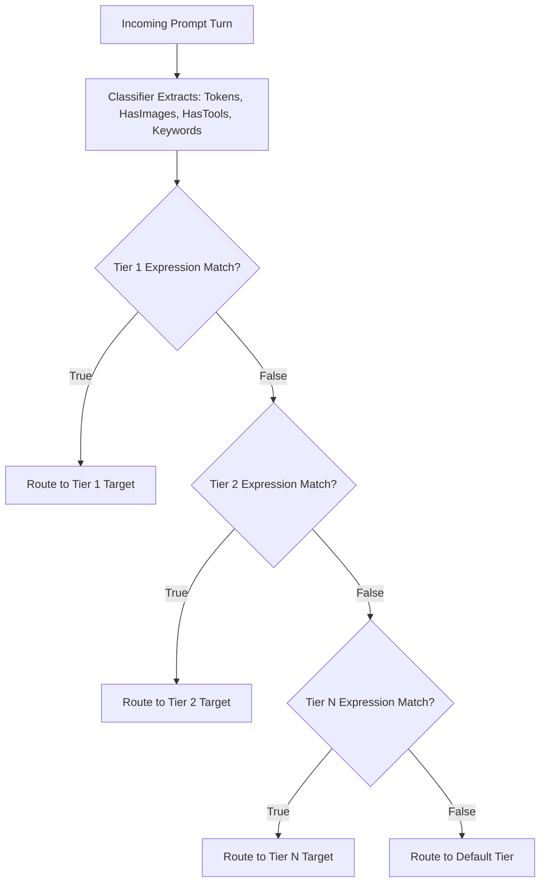

# 🎯 Nacho Flow: Rule & Tier Tuning Guide

This guide teaches you how to write, optimize, test, and tune dynamic routing rules in **Nacho Flow** using `expr-lang/expr` expressions.

---

## 1. How the Evaluation Pipeline Works

When an agent (Roo Code, Cline, Aider, Cursor) sends a prompt turn, Nacho Flow evaluates your configured tiers sequentially from **top to bottom** (*First Match Wins*):



---

## 2. Available Context Variables

Every `when` rule has access to real-time prompt context attributes:

| Variable | Type | Description | Example Condition |
| :--- | :--- | :--- | :--- |
| `Tokens` | `int` | Estimated total token count across all messages in history | `Tokens < 16000` |
| `HasImages` | `bool` | `true` if any message contains screenshots or image URLs | `HasImages == true` |
| `HasTools` | `bool` | `true` if function/tool definitions or active tool calls are present | `HasTools == true` |
| `Keywords` | `[]string` | Code keywords detected in recent turns (`deadlock`, `sql`, `refactor`, etc.) | `any(Keywords, { # in ['deadlock', 'mutex'] })` |
| `Model` | `string` | The requested model ID sent by the client (e.g. `nacho-hybrid`) | `Model == 'nacho-coder'` |

---

## 3. Recommended Tier Ordering Strategy

To maximize cost savings without degrading agent intelligence, follow the **Hierarchy of Complexity**:

```text
[1. Complex Keywords / Reasoning]  --> Route to DeepSeek-R1 / o1 (Specialized Brain)
[2. Multimodal Vision (Images)]    --> Route to Gemini Flash / Claude 3.5 Sonnet (Vision Encoders)
[3. Active Tool Calls]             --> Route to Cloud Fast Coder (High Tool Adherence)
[4. Routine Local Coding (< 16k)]  --> Route to Local GPU (Ollama/vLLM) ($0.00 / 100% Free)
[5. Large Context Overflow (>= 16k)]-> Route to Cheap Cloud Fast (e.g. Qwen 3 Coder / DeepSeek)
[Default Fallback]                 --> Reliable Cloud Fallback
```

---

## 4. Real-World Rule Recipes

### Recipe 1: The Local-First Cost Slasher (90% Savings)
Routes small, single-file edits and routine coding tasks to your local GPU, escalating to cloud only when history accumulates or images are attached:

```yaml
tiers:
  - name: "Cloud Vision"
    model: "google/gemini-2.5-flash-lite"
    provider: "openrouter"
    when: "HasImages"

  - name: "Local ROCm / CUDA GPU"
    model: "qwen2.5-coder:14b"
    provider: "local_gpu"
    when: "Tokens < 16000 && !HasImages && !HasTools"
    strip_images: true

  - name: "Cloud Agentic Fast"
    model: "qwen/qwen3-coder-30b-a3b-instruct"
    provider: "openrouter"
    when: "Tokens >= 16000 || HasTools"

default_tier:
  name: "Cloud Fallback"
  model: "~deepseek/deepseek-v4-flash-latest"
  provider: "openrouter"
  when: "true"
```

---

### Recipe 2: Domain-Specific Routing (SQL, Concurrency & Security)
Automatically detects deep architectural concepts and delegates them to specialized reasoning models:

```yaml
tiers:
  # Concurrency & Race Conditions -> DeepSeek-R1
  - name: "Deep Reasoning"
    model: "deepseek/deepseek-r1"
    provider: "openrouter"
    when: "any(Keywords, { # in ['deadlock', 'mutex', 'race', 'concurrency', 'atomic', 'goroutine'] })"

  # Database & Migrations -> Specialized Model
  - name: "SQL Specialist"
    model: "deepseek/deepseek-chat"
    provider: "deepseek"
    when: "any(Keywords, { # in ['sql', 'postgres', 'migration', 'index', 'query', 'schema'] })"

  # Everything else < 12k context -> Local GPU
  - name: "Local Fast"
    model: "qwen2.5-coder:14b"
    provider: "local_gpu"
    when: "Tokens < 12000 && !HasImages"
```

---

### Recipe 3: Reasoning Effort Injection
For models supporting explicit reasoning controls (e.g. OpenAI o3-mini or Gemini thinking):

```yaml
tiers:
  - name: "Heavy Reasoning"
    model: "openai/o3-mini"
    provider: "openrouter"
    reasoning_effort: "high"
    when: "any(Keywords, { # in ['architecture', 'proof', 'refactor-entire-repo'] })"

  - name: "Fast Reasoning"
    model: "openai/o3-mini"
    provider: "openrouter"
    reasoning_effort: "low"
    when: "Tokens > 20000"
```

---

## 5. Testing & Validating Your Rules

### Dry-Run Validation
Nacho Flow validates all `expr` rules at startup. If any syntax error or missing variable is detected, the server refuses to boot and displays the exact line and character:

```bash
$ nacho-flow -config config.yaml
# Evaluator compile error: unknown name "TokenCount" (did you mean "Tokens"?)
```

### Live Route Inspection via Headers
When your agent sends a request, Nacho Flow injects response headers showing exactly which rule matched:
```http
HTTP/1.1 200 OK
x-nacho-router-tier: Local ROCm GPU
x-nacho-target-model: qwen2.5-coder:14b
```

---

## 6. Future: Autonomous "Agent-on-Agent" Auto-Tuning

In upcoming releases, Nacho Flow will include an autonomous optimization agent (`nacho-flow tune`):
1. **Telemetry Analysis:** Analyzes historical request retry rates and user prompt patterns.
2. **Rule Synthesis:** Automatically adjusts token thresholds (`Tokens < 14000` $\rightarrow$ `Tokens < 18000`) as local GPU models improve.
3. **Closed-Loop A/B Testing:** Validates mutated rules against past logs before hot-reloading `config.yaml`.
