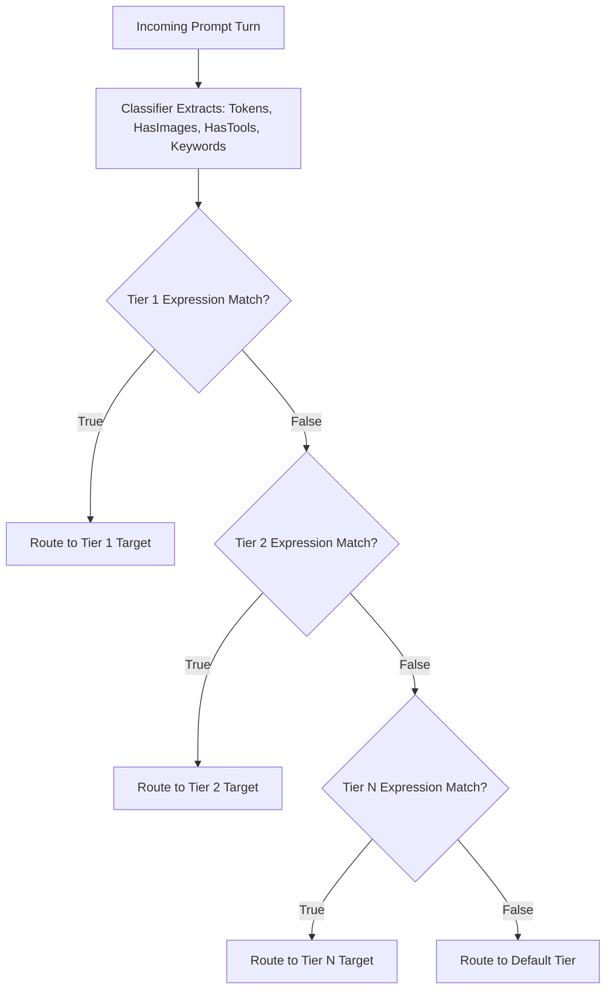

# 🎯 Nacho Flow: Rule & Tier Tuning Guide

This guide teaches you how to write, optimize, test, and tune dynamic routing rules in **Nacho Flow** using `expr-lang/expr` expressions.

## Table of Contents
1. [How the Evaluation Pipeline Works](#1-how-the-evaluation-pipeline-works)
2. [Available Context Variables & Tier Properties](#2-available-context-variables--tier-properties)
3. [Recommended Tier Ordering Strategy](#3-recommended-tier-ordering-strategy)
4. [Real-World Rule Recipes](#4-real-world-rule-recipes)
5. [Testing & Validating Your Rules](#5-testing--validating-your-rules)
6. [Autonomous Cost-Penalty Auto-Tuning (`nacho-flow tune`)](#6-autonomous-cost-penalty-auto-tuning-nacho-flow-tune)
7. [Manual Heuristic Tuning Tips](#7-manual-heuristic-tuning-tips-for-custom-power-rules)
8. [Agent-Specific Harness Tuning: Zoo Code vs. Cline](#8-agent-specific-harness-tuning-zoo-code-vs-cline)
9. [🧚 Fairy Dusting & Cost Shield Architecture](#9-fairy-dusting--cost-shield-architecture)
10. [Troubleshooting & FAQ](#10-troubleshooting--faq)

---

## 1. How the Evaluation Pipeline Works

When an agent (Zoo Code, Cline, Aider, Cursor) sends a prompt turn, Nacho Flow evaluates your configured tiers sequentially from **top to bottom** (*First Match Wins*):



---

## 2. Available Context Variables & Tier Properties

### Variables in `when` Expressions:
| Variable | Type | Description | Example Condition |
| :--- | :--- | :--- | :--- |
| `Tokens` | `int` | Real-time adaptive estimated token count across all prompt messages | `Tokens < 16000` |
| `HasImages` | `bool` | `true` if any message contains screenshots or image URLs | `HasImages == true` |
| `HasTools` | `bool` | `true` if function/tool definitions or active tool calls are present | `HasTools == true` |
| `HasWriteCapability` | `bool` | `true` if declared client tools contain at least one tool from `kickstart_write_tools`. Automatically `false` in Plan Mode / read-only exploration | `HasWriteCapability && Tokens < 16000` |
| `Keywords` | `[]string` | Code keywords detected **strictly in the latest user prompt** | `any(Keywords, { # in ['deadlock', 'mutex'] })` |
| `Retries` | `int` | Consecutive error count from in-history failures (`[ERROR]`, `<error_details>`) and identical prompt retries. Automatically resets to `0` when intermediate tools succeed (`role: tool`). | `Retries < 2` |
| `IsRetry` | `bool` | `true` if this turn is an error recovery turn | `!IsRetry` |
| `Model` | `string` | The requested model ID sent by the client (e.g. `nacho-hybrid`) | `Model == 'nacho-coder'` |
| `SessionKickstarted` | `bool` | `true` if the session exceeded `kickstart_threshold` without tool/write progress | `SessionKickstarted && Retries < 3` |
| `SessionKickstartCount` | `int` | Number of times kickstart resuscitation has fired this session | `SessionKickstartCount > 2` |
| `HasToolProgress` | `bool` | `true` if the previous turn contained successful tool execution | `HasToolProgress` |
| `HasWriteProgress` | `bool` | `true` if the previous turn contained productive write/command tool execution | `HasWriteProgress` |
| `HistoryErrors` | `int` | Number of consecutive trailing errors in conversation history | `HistoryErrors >= 2` |
| `CoolingDownModels` | `[]string` | Models currently under cooldown after Cycle Killer severed streams | `!('gemma4:12b-it-qat' in CoolingDownModels)` |

> [!TIP]
> **Automatic Escalation Safety Cap**: When a turn escalates to the `default_tier` (e.g. Claude Sonnet 5), Nacho Flow automatically limits consecutive frontier execution to `MaxEscalationTurns = 3`. If a problem cannot be fixed after 3 consecutive frontier turns, the gateway automatically de-escalates to Tier 2 (e.g. Gemini 3.7 Flash) to prevent runaway billing.

### Tier Properties:
- `max_context` (`int`): Optional. Upper bound of the model's context window (e.g. `16384`, `32768`, `65536`). If `Tokens > max_context`, Nacho Flow immediately skips this tier with zero expression overhead.
- `strip_images` (`bool`): If `true`, strips raw base64 image strings from older conversation turns to prevent 400 errors on text-only models.
- `reasoning_effort` (`string`): Passes `"low"`, `"medium"`, or `"high"` to supported reasoning providers (e.g. OpenAI o3-mini).
- `raw` (`bool`): If `true`, disables all tool normalizers, thinking-tag converters, and fallback shields for a 100% transparent, unadulterated SSE stream.
- `shield` (`bool`): If `false`, disables the Agentic Tool Fallback Shield (prevents converting trailing questions/plans into synthetic `ask_followup_question` tool calls), essential for automated headless scripts and batch CI runners.
- `normalizer` (`bool`): Master toggle for the Universal Tool Normalizer on this tier.
- `normalizers` (`object`): Granular sub-normalizer toggles:
  - `markdown` (`bool`): Normalizes ```json ... ``` markdown code blocks into OpenAI tool calls.
  - `bare_json` (`bool`): Normalizes raw top-level JSON objects into OpenAI tool calls.
  - `react` (`bool`): Normalizes ReAct `Action: / Action Input:` patterns into OpenAI tool calls.
- `cycle_breaker` (`object`): In-Flight Stream Guard and Monologue Breaker settings:
  - `enabled` (`bool`): Toggles real-time repetition and prose monologue detection.
  - `max_prose_tokens` (`int`): Soft ceiling for pure prose tokens before triggering (default: `800`).
  - `repetition_window` (`int`): Word window for N-gram sliding hash detector (default: `6`).
  - `repetition_threshold` (`int`): Repetition match threshold for instant stream abort (default: `3`).
  - `max_retries` (`int`): Number of Stage 1 local `$0.00` self-correction retries before cloud failover (default: `1`).
  - `correction_prompt` (`string`): Custom authoritative `[SYSTEM OVERRIDE]` injection prompt.

---

## 3. Recommended Tier Ordering Strategy

To maximize cost savings without degrading agent intelligence, follow the **Hierarchy of Complexity**:

```text
[1. Complex Keywords / Reasoning]  --> Route to DeepSeek-R1 / o1 (Specialized Brain)
[2. Multimodal Vision (Images)]    --> Route to Gemini Flash / Claude Sonnet 5 (Vision Encoders)
[3. Active Tool Calls]             --> Route to Cloud Fast Coder (High Tool Adherence)
[4. Routine Local Coding (< 16k)]  --> Route to Local GPU (Ollama/vLLM) ($0.00 / 100% Free)
[5. Retry Escalation (Retries>=2)] --> Route to Cloud Provider (Breaks Local Failure Loops)
[6. Large Context Overflow (>= 16k)]-> Route to Cheap Cloud Fast (e.g. Gemini 3.7 Flash)
[Default Fallback]                 --> Reliable Cloud Fallback (Capped at 3 turns max)
```

### 🎯 GPU Hardware & Token Sizing Cheat Sheet

Not sure what token limits to set for your local workstation? Use this reference table based on your available VRAM:

| Workstation Hardware | VRAM | Recommended Local Model | Suggested `Tokens` Bound |
| :--- | :--- | :--- | :--- |
| **8 GB VRAM** (RTX 3060/4060, Apple M1/M2 8GB) | 8 GB | `qwen2.5-coder:7b` | `Tokens < 8000` |
| **16 GB VRAM** (Radeon RX 6900/9070 XT, RTX 4080) | 16 GB | `qwen-3.8:27b` (`IQ3_S`) / `gemma4:12b` | `Tokens < 16000` |
| **24 GB VRAM** (RTX 3090/4090, Apple M-Max 32GB) | 24 GB | `qwen-3.8:27b` (`Q4_K_M`) / `ornith-1.5:35b` | `Tokens < 32000` |
| **32 GB+ VRAM / Mac Studio** | 32 GB+ | `qwen-3.8:27b` (`Q8`) / `deepseek-r1:32b` | `Tokens < 48000` |

---

## 4. Real-World Rule Recipes

### 🔥 Top 5 Copy-Paste Rule Patterns

| Pattern | `when` Condition | Purpose |
| :--- | :--- | :--- |
| **1. Standard Local Workhorse** | `Tokens < 16000 && !HasImages && Retries < 2` | Routes routine iterative turns to GPU for $0.00, breaking on failures. |
| **2. Concurrency / Math Escapement** | `any(Keywords, { # in ['deadlock', 'mutex', 'concurrency', 'race'] })` | Instantly flags deep reasoning keywords to DeepSeek-R1 / o1. |
| **3. Vision Escapement** | `HasImages` | Routes screenshot turns to vision models (Gemini Flash / Claude Sonnet). |
| **4. Tool-Safety Boundary** | `!HasTools && Tokens < 12000` | Restricts local models to pure code generation without calling external tools. |
| **5. Cloud Recovery Overflow** | `Tokens >= 16000 || HasTools || Retries >= 2` | Catch-all for large context overflow, tool execution, or retry recovery. |

---

### Recipe 1: Local-First GPU Routing with Auto-Escalation
Routes small, single-file edits and routine coding tasks to your local GPU, escalating to cloud when history accumulates, images are attached, or if the local model fails 2 consecutive times:

```yaml
tiers:
  - name: "Cloud Vision"
    model: "google/gemini-2.5-flash-lite"
    provider: "openrouter"
    when: "HasImages"

  - name: "Local ROCm / CUDA GPU"
    model: "qwen2.5-coder:14b"
    provider: "local_gpu"
    max_context: 16384
    when: "Tokens < 16000 && !HasImages && !HasTools && Retries < 2"
    strip_images: true

  - name: "Cloud Agentic Fast"
    model: "qwen/qwen3-coder-30b-a3b-instruct"
    provider: "openrouter"
    when: "Tokens >= 16000 || HasTools || Retries >= 2"

default_tier:
  name: "Cloud Fallback"
  model: "deepseek/deepseek-v4-flash-latest"
  provider: "openrouter"
  when: "true"
```

---

### Recipe 2: Domain-Specific Routing (SQL, Concurrency & Security)
Automatically detects deep architectural concepts and delegates them to specialized reasoning models (evaluated strictly on the latest user prompt):

```yaml
tiers:
  # Concurrency & Race Conditions -> DeepSeek-R1
  - name: "Deep Reasoning"
    model: "deepseek/deepseek-r1"
    provider: "openrouter"
    when: "any(Keywords, { # in ['deadlock', 'mutex', 'race', 'concurrency', 'atomic', 'goroutine'] })"

  # Database & Migrations -> Specialized Model
  - name: "SQL Specialist"
    model: "deepseek/deepseek-chat"
    provider: "deepseek"
    when: "any(Keywords, { # in ['sql', 'postgres', 'migration', 'index', 'query', 'schema'] })"

  # Everything else < 12k context without prior retries -> Local GPU
  - name: "Local Fast"
    model: "qwen2.5-coder:14b"
    provider: "local_gpu"
    max_context: 16384
    when: "Tokens < 12000 && !HasImages && Retries < 2"
```

---

### Recipe 3: Reasoning Effort Injection
For models supporting explicit reasoning controls (e.g. OpenAI o3-mini or Gemini thinking):

```yaml
tiers:
  - name: "Heavy Reasoning"
    model: "openai/o3-mini"
    provider: "openrouter"
    reasoning_effort: "high"
    when: "any(Keywords, { # in ['architecture', 'proof', 'refactor-entire-repo'] })"

  - name: "Fast Reasoning"
    model: "openai/o3-mini"
    provider: "openrouter"
    reasoning_effort: "low"
    when: "Tokens > 20000"
```

---

### Recipe 4: Headless Automated CI & Evaluation (No Interactive Tool Prompts)
When running automated CI scripts, batch test generators, or headless benchmark runners, you want plain text model output rather than interactive tool wrapping:

```yaml
tiers:
  - name: "Headless Automated CI Evaluator"
    model: "deepseek/deepseek-chat"
    provider: "openrouter"
    when: "any(Keywords, { # in ['ci_batch', 'test_eval', 'headless'] })"
    # Disables synthetic ask_followup_question tool calls so batch runners never hang
    shield: false
    # Retains standard tool normalization for valid function calls
    normalizer: true
```

---

### Recipe 5: Transparent Raw Stream & Tokenizer Benchmarking
When benchmarking exact upstream token throughput, debugging SSE streaming libraries, or developing custom client wrappers without proxy rewrites:

```yaml
tiers:
  - name: "Raw Stream Debugging & Benchmarking"
    model: "anthropic/claude-sonnet-5"
    provider: "openrouter"
    when: "any(Keywords, { # in ['raw_stream', 'inspect_bytes', 'benchmark'] })"
    # Completely bypasses all normalizers, reasoning stream wrappers, and fallback shields
    raw: true
```

---

### Recipe 6: Tailored Tool Parsing for Local Open-Weight Models
When running specialized local models (such as Qwen 2.5 Coder or Mistral NeMo) that output structured tool calls in Markdown code blocks or bare JSON, but produce code diffs containing words like `Action: ` that could trip ReAct regexes:

```yaml
tiers:
  - name: "Local Qwen Coder (Selective Parsers)"
    model: "qwen2.5-coder:14b"
    provider: "local_gpu"
    max_context: 16384
    when: "Tokens < 12000 && !HasImages && Retries < 2"
    shield: true
    normalizer: true
    # Selectively configure sub-normalizer strategies
    normalizers:
      markdown: true    # Normalizes ```json ... ``` tool blocks
      bare_json: true   # Normalizes raw JSON objects
      react: false      # Disables ReAct regex scanner to eliminate code diff false positives

---

### Recipe 7: 🎸 Cycle Killer & ⚡ Kickstart Defense
When using local models (e.g. Gemma 4 12B QAT, DeepSeek-R1 14B) or cloud tiers that occasionally suffer from degenerative circular reasoning, 4-minute monologue loops, or multi-turn read/plan stalls:

```yaml
tiers:
  - name: "Local GPU with Cycle Killer & Kickstart"
    model: "gemma4:12b-it-qat"
    provider: "ollama"
    when: "Tokens < 16000 && Retries == 0"
    cycle_killer:
      enabled: true
      max_prose_tokens: 4096    # Max non-tool prose tokens (reasoning <think> is 100% exempt)
      max_thinking_tokens: 1500 # Max thinking token budget before repetition enforcement
      repetition_window: 6      # Sliding N-gram window (6 words)
      repetition_threshold: 3   # Murders stream if same 6-word phrase repeats 3x (<3s)
      max_retries: 1            # Stage 1: retries locally with [SYSTEM OVERRIDE] @ $0.00
      kickstart_threshold: 5    # ⚡ Kickstart: fires after 5 consecutive turns without tool progress (0 = disabled)
      # kickstart_write_only: true # Only count file writes / terminal commands as progress (ignores read-only tools)
      # kickstart_write_tools:     # Optional custom write tools list (defaults cover major agents)
```
*(Also supports `cycle_breaker:` as a backwards-compatible alias, and works across both local and cloud tiers).*

---

## 4.5 Agent-Specific Presets: Cline vs Zoo Code

Different AI coding agents have fundamentally different tool-calling architectures that affect how well they work with local models. Nacho Flow ships two preset configurations:

| Config File | Optimized For | Key Trait |
| :--- | :--- | :--- |
| `config.yaml` | Zoo Code, Aider, OpenCode | `write_to_file` whole-file overwrites — local models handle this well |
| `config.cline.yaml` | Cline, Roo Code | `replace_in_file` diff edits — requires exact `old_text` match, needs cloud precision |

### Why Cline Needs a Different Config

Cline's `SdkDiffEditCoordinator` requires the model to reproduce the **exact existing file content** in an `old_text` parameter. Local 12B models frequently fail this, producing near-matches that Cline rejects. Zoo Code's `write_to_file` approach sends the entire new file content, which local models handle reliably.

### Key Tuning Differences

| Parameter | Zoo Code (`config.yaml`) | Cline (`config.cline.yaml`) | Why |
| :--- | :--- | :--- | :--- |
| Local Token Threshold | `Tokens < 16000` | `Tokens < 10000` | Cline starts diffing by Turn 3–5; escalate earlier |
| `HasToolProgress` Guard | Not used | `!HasToolProgress` | Once files are created, edits need cloud precision |
| Cycle Killer Prose Limit | 4096 | 6144 | Cline's XML tool format needs more prose room |
| Cycle Killer Repetition | 3 | 4 | Cline's XML is naturally more repetitive |
| `kickstart_threshold` | 5 | 0 (disabled by default) | Zoo Code is prone to `read_file`/`update_todo` semantic loops |
| `kickstart_write_only` | Optional (`true`) | Not needed | Ignores `read_file`/`list_dir` tool churn, only counts write/exec tools |
| Max Context (Local) | 64000 | 32000 | Force cloud escalation earlier for edit-heavy tasks |

### Usage

```bash
# For Cline / Roo Code users:
nacho-flow -config config.cline.yaml

# For Zoo Code / Aider / OpenCode users (default):
nacho-flow
```

---

## 5. Testing & Validating Your Rules

### Dry-Run Validation
Nacho Flow validates all `expr` rules at startup. If any syntax error or missing variable is detected, the server refuses to boot and displays the exact line and character:

```bash
$ nacho-flow -config config.yaml
# Evaluator compile error: unknown name "TokenCount" (did you mean "Tokens"?)
```

### ⚡ Test Rules On-The-Fly with HotSauce Directives
You don't need to restart the server or edit `config.yaml` to test how a model behaves on a specific turn. Simply splash a **HotSauce directive** right into your agent chat prompt:

```text
@nacho:tier="Deep Reasoning" please analyze the lock contention in this channel fan-out
@nacho:local write a unit test for this handler
@nacho:reasoning prove why this algorithm is O(N log N)
```
Nacho Flow strips the directive and routes the turn directly to the requested tier, allowing you to test candidate rules in real time.

### 🔍 Live Route Inspector (VS Code Webview)
If you use the [VS Code Companion Extension](file:///docs/EXTENSION_USER_GUIDE.md), open the **Nacho Flow Dashboard** (`Ctrl+Shift+P` → `Nacho Flow: Show Dashboard`). The **Live Route Inspector** displays a real-time table of your last 500 LLM requests with:
* Exact prompt token count
* Matched routing tier and rule reason
* Turn latency (ms)
* Estimated dollars saved ($0.00 vs Cloud)
* Upstream target provider

---

## 6. Autonomous Cost-Penalty Auto-Tuning (`nacho-flow tune`)

While manual rule crafting is powerful, human developers shouldn't have to guess where their local model begins to struggle. Nacho Flow features an autonomous **Cost-Penalty Auto-Tuner** that analyzes your real-world coding telemetry, detects model failure boundaries, and synthesizes optimal rules.

### 6.1 The Mathematical Problem: The "Context Cliff"
Local open-weight models (e.g. `qwen2.5-coder:14b`, `deepseek-coder:6.7b`) are remarkably capable on concise prompt turns ($< 8\text{k}\text{--}12\text{k}$ tokens). However, as conversation history snowballs, smaller models experience **attention dilution** and context degradation:
1. **The Hidden Cost of Local Failures**: While a local GPU turn costs **$0.00** in direct API spend, a defective response that hallucinates an edit or breaks a file forces the human developer to manually intervene, rollback, or re-prompt. This costs minutes of developer flow state (quantified as a **~$2.00 penalty** per wasted retry).
2. **The Cloud Alternative**: Escalating a 20k token turn to an economy cloud model (e.g. `qwen3-coder` or `deepseek-v3`) costs only **~$0.03**.
3. **The Objective Function**: The auto-tuner runs a grid-search sweep across historical turns to find the threshold $T$ and friction keywords that maximize total utility:
   $$\text{Utility} = - \text{CloudDirectSpend} - (\text{LocalRetries} \times \text{RetryPenaltyUSD})$$

---

### 6.2 Step-by-Step Tuning Workflow

#### Step 1: Accumulate Natural Traffic
Run Nacho Flow during your normal coding workflow for a few days (recommended: 50 to 500 prompt turns). Nacho Flow automatically appends structured turn telemetry to `logs/traffic.jsonl`:
```json
{"timestamp":"2026-08-24T14:32:00Z","tokens":9450,"has_images":false,"has_tools":false,"keywords":["docker","compose"],"retries":0,"is_retry":false,"is_local":true,"tier":"Local ROCm GPU","model":"qwen2.5-coder:14b","latency_ms":1250,"cost_saved_usd":0.0236}
```

#### Step 2: Run the Advisory Analysis (Dry-Run)
Analyze your historical traffic without modifying any files:
```bash
nacho-flow tune
```

**Example Advisory Output**:
```text
========================================================================================
🌮 NACHO FLOW ADVISORY TUNING REPORT
========================================================================================

📊 Sample Size: 240 historical prompt turns evaluated

🔍 FRICTION & BOTTLENECK SIGNALS DETECTED:
  • Optimal Local Context Threshold: 24,000 tokens
  • Multimodal Vision:              Clean (0% retry rate — enabled locally)
  • Agentic Tool Calls:             Clean (0% retry rate — enabled locally)
  • High-Friction Domain Keywords:  ['deadlock', 'kubernetes', 'migration'] (Spikes local retry probability)

📈 PROJECTED MONTHLY IMPACT:
  • Developer Retries Avoided: ~18 retries eliminated
  • Net Monthly Cost Optimization: +$36.00 USD saved

🛠️ RECOMMENDED CONFIGURATION DIFF:
----------------------------------------------------------------------------------------
  Tier: "Tier 2: Local GPU Free (Ollama 14B + Tool Normalizer)"
  - when: "Tokens < 10000 && !HasImages && Retries < 2"
  + when: "Tokens < 24000 && !any(Keywords, { # in ['deadlock', 'kubernetes', 'migration'] }) && Retries < 2"
----------------------------------------------------------------------------------------

To apply this recommendation with automatic backup:
  $ nacho-flow tune --apply
========================================================================================
```

#### Step 3: Understand the Signals in the Report
* **Optimal Local Context Threshold (e.g. `24,000 tokens`)**: The exact token boundary where keeping requests on your local GPU begins costing more in developer retries than the modest API cost of escalating to cloud (bounded by the model's `max_context`).
* **Multimodal Vision & Tool Call Status**: Reports whether local image or tool execution experiences failure spikes. If $\sim 0\%$ failures are recorded, modalities remain enabled for local processing without adding `!HasImages` or `!HasTools`.
* **High-Friction Keywords (e.g. `['deadlock', 'kubernetes']`)**: Domains where the local model exhibited an odds ratio $\ge 1.5\times$ baseline retry rate. Nacho Flow synthesizes an exclusion rule to route these specific concepts directly to cloud reasoning.
* **Preserved Guardrails (e.g. `Retries < 2`)**: Existing user conditions and escalation guards are automatically preserved via AST parsing.

#### Step 4: Apply Recommendations Automatically
To update your `config.yaml` with the synthesized rule:
```bash
nacho-flow tune --apply
```
```text
✅ SUCCESS: Successfully updated config.yaml with optimal rules!
   Backup saved at: config.yaml.bak.20260824-164500
   Restart or reload nacho-flow to activate changes.
```

> [!TIP]
> **1-Click Auto-Tuning in VS Code**: You can also trigger the empirical optimizer, review recommended rule diffs, and hot-reload `config.yaml` with one click directly from the **Nacho Flow Analytics Dashboard** webview inside the [VS Code Companion Extension](file:///docs/EXTENSION_USER_GUIDE.md).


---

### 6.3 Advanced Tuning CLI Options

| Flag | Default | Description |
| :--- | :--- | :--- |
| `--config <path>` | `config.yaml` | Path to the target configuration file to inspect and update. |
| `--traffic-log <path>` | `logs/traffic.jsonl` | Path to the historical traffic JSONL log file. |
| `--sample <N>` | `5000` | Maximum number of historical prompt records to analyze. |
| `--apply` | `false` | Atomically writes the optimized rule to `config.yaml` with a timestamped `.bak` backup. |

---

## 7. Manual Heuristic Tuning Tips (For Custom Power Rules)

### 7.1 General Routing & Hardware Guardrails
1. **Check Live Financials First**: Run `curl http://127.0.0.1:8000/v1/stats` or view `@nacho:status` in your chat prompt to see your current local vs cloud distribution. Aim for **70%–85% local turns** on typical coding tasks.
2. **Start with Conservative Token Bounds**: If your local GPU has 16GB VRAM running a 14B model, set `Tokens < 12000`. If running an 8B model, set `Tokens < 8000`.
3. **Always Include `Retries < 2` on Local Tiers**: This ensures that if a local model produces a broken response, the agent's second attempt automatically escalates to a cloud frontier model (e.g. Claude Sonnet 5 or DeepSeek-R1) instead of looping indefinitely on local hardware.
4. **Use `strip_images: true` on Text-Only Local Models**: If your agent sends a screenshot in Turn 1, Turn 10 doesn't need 40,000 tokens of raw base64 image data sent to a text-only local model. Setting `strip_images: true` removes legacy base64 strings while preserving conversational text.

---

### 7.2 Tuning Tool Normalizers & Eliminating Regex False Positives
Modern open-weight models have vastly different formatting behaviors:
* **Disable ReAct on Structured Code Models**: Advanced coder models (like `qwen2.5-coder:14b` or `deepseek-chat`) output standard JSON or markdown blocks. If they generate code diffs or commit messages containing phrases like `Action: Added mutex lock`, aggressive ReAct regexes can trigger false-positive tool extractions. Set `normalizers.react: false` on tiers dedicated to structured models.
* **Keep Markdown Fences Active for Ollama/vLLM**: Many open-source models wrap their function calls in ` ```json ... ``` ` blocks. Setting `normalizers.markdown: true` ensures these are converted to standard OpenAI `tool_calls` without breaking client JSON parsers.
* **Raw Passthrough for Benchmarking**: If you want to benchmark raw upstream token velocity or test custom client parsers without proxy interception, set `raw: true` or use `@nacho:raw` in your prompt.

---

### 7.3 Tuning the Agentic Fallback Shield
In agent IDEs like Zoo Code or Cline, agents expect models to always invoke tools (`read_file`, `execute_command`). When smaller local models output conversational plans or ask questions ("Should I proceed with the edit?"), agent harnesses fail with "Model did not invoke a tool" 3-strike deadlocks.
* **For Interactive Coding (IDE)**: Keep `shield: true` (default). Nacho Flow's sliding tail-buffer (4.67ns, 0 allocs) detects trailing question heuristics and wraps the text into an `ask_followup_question` tool call, prompting you in the UI instead of crashing.
* **For Headless CI & Batch Scripts**: Set `shield: false` on your batch tier (or splash `@nacho:no-shield` in prompts). Automated scripts don't have interactive humans to answer tool questions, so returning raw conversational text prevents test runner timeouts.

---

### 7.4 Testing Rules On-The-Fly with Directives
Before committing changes to `config.yaml`, test different routing behaviors live in your chat:
* `@nacho:raw` — Force unadulterated pass-through on the current prompt.
* `@nacho:no-shield` — Disable fallback tool synthesis for the current turn.
* `@nacho:tier="<Name>"` — Route directly to a specific named tier to test its model output.

---

---

## 8. Agent-Specific Harness Tuning: Zoo Code vs. Cline

Different autonomous coding agents interact with LLMs using fundamentally different protocols. Tuning Nacho Flow for your specific extension ensures optimal performance, zero false-positive stream interruptions, and maximum cost efficiency.

### 8.1 Architectural Differences

| Dimension | Zoo Code / Roo Code | Cline |
| :--- | :--- | :--- |
| **Tool Calling Protocol** | OpenAI JSON `tools` parameter | XML tags embedded in conversational prose (`<write_to_file>`) |
| **Context Accumulation** | Compact sliding transcript + pruned tools | Full multi-turn conversation transcripts re-sent every turn |
| **Average Turn 50+ Context** | ~35k–45k tokens | ~80k–110k tokens |
| **Local Model Compatibility** | Gemma 4 12B, Qwen 2.5/3 (native JSON function calling) | Qwen 3 14B, Devstral (XML agent-trained models) |
| **Cycle Killer Prose Threshold** | `max_prose_tokens: 4096` | `max_prose_tokens: 6144` (relaxed for prose-embedded XML) |
| **Kickstart Recommendation** | **Enabled** (`kickstart_threshold: 5`) | **Disabled or High** (`kickstart_threshold: 0` / off) |

### 8.2 Zoo Code Tuning Profile (`config.zoo.yaml`)
Zoo Code uses native OpenAI tool calling. Local models like Gemma 4 produce JSON tool calls reliably without long conversational preambles:
```yaml
cycle_killer:
  enabled: true
  max_prose_tokens: 4096
  max_thinking_tokens: 1500
  repetition_threshold: 3
  kickstart_threshold: 5
  kickstart_write_only: true
```

### 8.3 Cline Tuning Profile (`config.cline.yaml`)
Cline models output XML tags within prose explanations. To avoid false-positive Cycle Killer stream severing and prevent Kickstart loops:
```yaml
cycle_killer:
  enabled: true
  max_prose_tokens: 6144       # Relaxed for prose XML preambles
  max_thinking_tokens: 2000    # Extra planning runway
  repetition_threshold: 4      # XML formats are naturally more repetitive
  # kickstart_threshold: 0     # Disabled: Cline rarely idles in read loops
  kickstart_write_tools:       # Required for Fairy Dust write progress tracking
    - write_to_file
    - replace_in_file
    - execute_command
    - insert_code_block
```

---

## 9. 🧚 Fairy Dusting & Cost Shield Architecture

### 9.1 Proactive Quality Checkpoints
Rather than debugging syntax errors and missing module extensions 40 turns into a session, Fairy Dusting introduces scheduled frontier checkpoints triggered **strictly on productive write turns** (`WriteProgressCount`):

```yaml
fairy_dust:
  enabled: true
  entries:
    # Tactical Checkpoint: Catches missing imports (.js in ESM), type mismatches, syntax regressions
    - name: "Tactical Code Review"
      frequency: 15       # Fires every 15 file writes
      max_count: 5        # Hard cap: max 5 reviews per session
      provider: "openrouter"
      model: "anthropic/claude-sonnet-5"
      prompt: >
        [SYSTEM CHECKPOINT: TACTICAL CODE REVIEW]
        Inspect recent edits for syntax correctness, valid imports, and edge-case errors.

    # Strategic Checkpoint: Catches architectural drift, missing requirements, structural debt
    - name: "Strategic Architecture Review"
      frequency: 40       # Fires every 40 file writes
      max_count: 2        # Hard cap: max 2 deep audits per session
      provider: "openrouter"
      model: "anthropic/claude-opus-5"
      prompt: >
        [SYSTEM CHECKPOINT: STRATEGIC ARCHITECTURE REVIEW]
        Audit implementation against initial requirements and resolve systemic structural drift.
```

### 9.2 The Cost-Safe Default Tier Shield
In runaway error cascades or edge cases, routing must **never default to ultra-expensive models** ($15/$75 per 1M Opus 5):
1. **Set `default_tier` to Claude Sonnet 5**: Sonnet 5 ($3/$15) is 5× cheaper than Opus. A 30-turn runaway costs ~$2.50 instead of $12.65+.
2. **Isolate Opus with `when: "false"`**:
   ```yaml
   - name: "Tier 5: Opus On-Demand (Spicy Only)"
     provider: "openrouter"
     model: "anthropic/claude-opus-5"
     when: "false"
   ```
   This guarantees that automated routing never accidentally lands on Opus. Opus is accessible solely through **Fairy Dust strategic reviews** and **manual in-prompt `@nacho:model` / `X-Spicy-Model` overrides**.

### 9.3 HotSauce Kickstart & Plan-Mode Tuning

**Kickstart** detects semantic idle churn where an agent gets trapped in reading/planning loops without writing code:

```yaml
cycle_killer:
  kickstart_threshold: 5        # Jolt after N idle turns without write tool progress
  kickstart_max_count: 10       # Max kickstart escalations before default cloud failover
  kickstart_max_failures: 3     # Suppress override after N consecutive failures
  kickstart_write_only: true    # Only file writes/terminal executions reset the idle counter
  kickstart_write_tools:        # Tools defining write capability
    - write_to_file
    - replace_in_file
    - replace_file_content
    - multi_replace_file_content
    - execute_command
```

#### Automatic Plan-Mode Auto-Suspension:
In pure investigation or planning phases (such as Cline/Zoo Code Plan Mode), the client only declares read/inspection tools (`view_file`, `list_dir`, `grep_search`). Nacho Flow automatically evaluates `HasWriteCapability == false` and **suspends Kickstart idle stall escalation**. The agent can read files and explore codebases across 50+ turns without premature `[SYSTEM OVERRIDE]` prompts.

#### Dynamic Session Control Directives:
If you want to manually disable or re-enable Kickstart or Cycle Killer mid-session without restarting the gateway:
- `@nacho:kickstart-off` / `@nacho:kickstart-on`: Suspends or resumes Kickstart idle tracking for the active session.
- `@nacho:cyclekiller-off` / `@nacho:cyclekiller-on`: Suspends or resumes Cycle Killer in-flight stream loop interruption.
- `@nacho:toggles`: Inspects the active state of all session guardrails.
- `@nacho:reset`: Resets session turns and restores all switches to configuration defaults.

---

## 10. Troubleshooting & FAQ

### Q: How do I know if my local GPU is actually processing turns?
- **Response Headers**: Check the `x-nacho-router-tier` and `x-nacho-target-model` headers returned in your agent's HTTP responses.
- **In-Prompt Directive**: Type `@nacho:status` directly into your chat prompt to see total tokens routed locally vs to cloud and dollars saved.
- **CLI Log Output**: When running interactively, the daemon prints green routing log entries:
  ```text
  INFO Routing request tier="Local ROCm GPU" model=qwen2.5-coder:14b tokens=4,120 is_fallback=false
  ```

### Q: What happens if Ollama or my local GPU runs out of VRAM or crashes?
- **Zero Broken Loops**: Nacho Flow's built-in **Circuit Breaker** detects the connection failure or defective empty response and immediately re-routes the prompt to your configured `default_tier` (Cloud Fallback) with **0ms dial delay**.
- **Exception**: If you explicitly forced `@nacho:local` via a HotSauce directive, Nacho Flow respects your strict override and returns a zero-cost chat alert instead of billing your credit card.

### Q: How do I test a new rule before putting it in production?
- You can override any turn on-the-fly directly from your chat prompt using **🌶️ HotSauce Directives** (`@nacho:local`, `@nacho:cloud`, `@nacho:reasoning`, `@nacho:tier="..."`, `@nacho:model="..."`) without modifying `config.yaml`.

### Q: Why didn't Kickstart fire while my agent spent 15 turns reading code in Plan Mode?
- This is intentional! Nacho Flow's **Tool Schema Guard** inspects the declared tools in each request. If the tool schema contains zero write tools (`HasWriteCapability == false`), Kickstart automatically suspends idle stall escalation so your agent can plan and investigate uninterrupted.

### Q: How do I inspect or toggle session switches in my editor chat?
- Type `@nacho:toggles` alone in your chat prompt for an instant zero-cost ($0.00 / 0 tokens) view of all session guardrails.
- Type `@nacho:kickstart-off`, `@nacho:cyclekiller-off`, `@nacho:shield-off`, `@nacho:raw-on`, or `@nacho:reset` to change switches on the fly.


