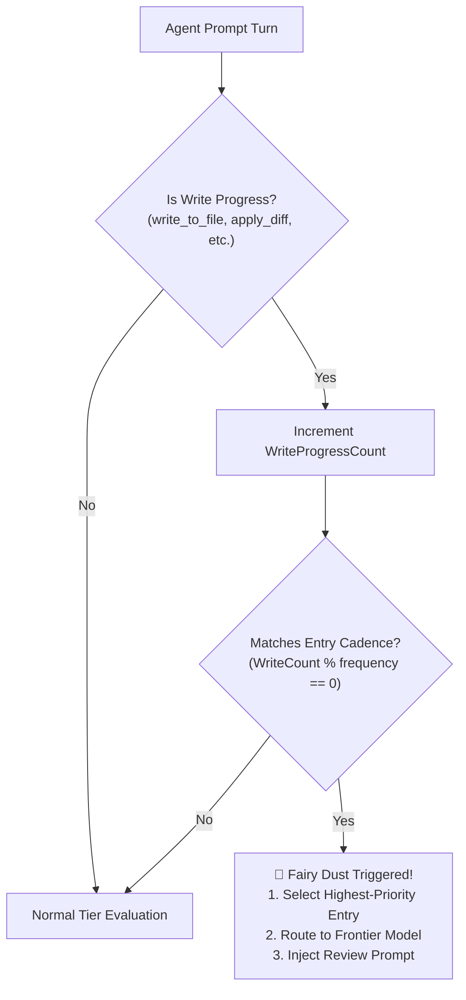

# 🌮 Nacho Flow: User Guide

Welcome to the **Nacho Flow** user guide. This document explains how to configure, run, and integrate Nacho Flow with your favorite autonomous coding agents and IDEs.

---

## Table of Contents
1. [Installation & Setup](#1-installation--setup)
2. [Configuration Reference (`config.yaml`)](#2-configuration-reference-configyaml)
3. [Writing Custom Routing Tiers (`expr` Rules)](#3-writing-custom-routing-tiers-expr-rules)
4. [Running Modes (Interactive vs. OS Service)](#4-running-modes-interactive-vs-os-service)
5. [IDE & Agent Integrations](#5-ide--agent-integrations)
6. [Monitoring, Telemetry & Stats API](#6-monitoring-telemetry--stats-api)
7. [Autonomous Rule Auto-Tuning (`nacho-flow tune`)](#7-autonomous-rule-auto-tuning-nacho-flow-tune)
8. [🔥 Heat Seeker: Live Model Deals & Discount Scout (`nacho-flow deals` / `nacho-flow heat-seek`)](#8-heat-seeker-live-model-deals--discount-scout-nacho-flow-deals--nacho-flow-heat-seek)
9. [🌶️ HotSauce Directives (In-Prompt Routing & Meta Commands)](#9-hotsauce-directives-in-prompt-routing--meta-commands)
10. [🧩 VS Code Companion Extension & Real-Time Control Plane](#10-vs-code-companion-extension--real-time-control-plane)

---

## ⚡ 60-Second Quickstart (Fastest Path to $0.00)

If you just want to stop wasting cloud money and start saving in under 2 minutes:


1. **Pull a local coding model** (if you haven't already):
   ```bash
   ollama pull qwen2.5-coder:14b   # or qwen2.5-coder:7b for 8GB VRAM
   ```
2. **Install Nacho Flow & Create `config.yaml`**:
   ```bash
   # Linux / macOS
   curl -fsSL https://raw.githubusercontent.com/dixieflatline76/nacho-flow/main/scripts/install.sh | bash
   
   # Windows (PowerShell)
   winget install dixieflatline76.NachoFlow
   ```
3. **Launch Nacho Flow**:
   ```bash
   nacho-flow
   ```
   *(Or if using VS Code, install the companion extension and click **▶ Start** in the sidebar!)*
4. **Point Your Coding Agent** (Zoo Code, Cline, Cursor, Aider):
   * **API Provider**: `OpenAI Compatible`
   * **Base URL**: `http://127.0.0.1:8000/v1`
   * **API Key**: `sk-nacho-secret-key` (or any string)
   * **Model ID**: `nacho-hybrid`

That's it! Routine prompt turns (inspections, syntax edits, test runs) now run on your GPU for **$0.00**, while complex multi-file reasoning automatically escalates to Claude or DeepSeek-R1.

---

## 1. Installation & Setup

### Universal Shell Installer (Linux & macOS - Recommended)
```bash
curl -fsSL https://raw.githubusercontent.com/dixieflatline76/nacho-flow/main/scripts/install.sh | bash
```
The installer automatically:
- Detects your CPU architecture (`amd64` / `arm64`) and OS.
- Verifies SHA-256 cryptographic checksums against `checksums.txt`.
- Installs to `/usr/local/bin` (or falls back to `~/.local/bin` if non-root).
- Offers to register and start a native `systemd` background service on Linux.

### Windows (Winget & Signed Installer)
```powershell
winget install dixieflatline76.NachoFlow
```

### Docker / Podman (Multi-Arch Distroless Container)
Run as a lightweight (< 15MB) container with nonroot security:
```bash
docker run -d --name nacho-flow \
  -p 8000:8000 \
  -v $(pwd)/config.yaml:/config/config.yaml \
  ghcr.io/dixieflatline76/nacho-flow:latest
```

**Docker Compose Recipe (Ollama + Nacho Flow)**:
```yaml
version: '3.8'

services:
  nacho-flow:
    image: ghcr.io/dixieflatline76/nacho-flow:latest
    container_name: nacho-flow
    restart: unless-stopped
    ports:
      - "8000:8000"
    volumes:
      - ./config.yaml:/config/config.yaml:ro
    extra_hosts:
      - "host.docker.internal:host-gateway"
```

### Homebrew (macOS & Linux)
```bash
brew install dixieflatline76/nacho-flow/nacho-flow
```

### Pre-compiled Binaries
Download the latest binary for your operating system from [GitHub Releases](https://github.com/dixieflatline76/nacho-flow/releases):
- **Windows (AMD64)**: `nacho-flow-windows-amd64.zip` (Cryptographically signed with Azure Trusted Signing)
- **Linux (AMD64 / ARM64)**: `nacho-flow-linux-amd64.tar.gz` / `nacho-flow-linux-arm64.tar.gz`
- **macOS (Apple Silicon / Intel)**: `nacho-flow-darwin-arm64.tar.gz` / `nacho-flow-darwin-amd64.tar.gz`

### Install via Go
```bash
go install github.com/dixieflatline76/nacho-flow/cmd/nacho-flow@latest
```

---

## 2. Configuration Reference (`config.yaml`)

### 2.1 Minimal Starter Config (Ollama + OpenRouter Fallback)

Copy and save this as `config.yaml` to get started immediately:

```yaml
port: 8000

providers:
  # Local GPU (Free turns)
  ollama:
    base_url: "http://127.0.0.1:11434/v1"
    type: "local"

  # Cloud Fallback (When reasoning context exceeds local limits)
  openrouter:
    base_url: "https://openrouter.ai/api/v1"
    type: "cloud"
    api_key: "ENV_OPENROUTER_API_KEY"

tiers:
  # Routine turns < 16k context stay on your GPU for $0.00
  - name: "Local GPU"
    model: "qwen2.5-coder:14b"
    provider: "ollama"
    max_context: 16384
    when: "Tokens < 16000 && !HasImages && Retries < 2"

# Flagship cloud model for deep reasoning or heavy context
default_tier:
  name: "Cloud Fallback (Claude Sonnet 5)"
  model: "anthropic/claude-sonnet-5"
  provider: "openrouter"
```

---

### 2.2 Full Production Reference Config

For advanced setups featuring multiple cloud providers, reasoning keyword rules, and private enterprise endpoints:

```yaml
# Port to listen on (Default: 8000)
port: 8000

# Inbound Gateway Authentication (Optional: Secures gateway on LAN / 0.0.0.0)
auth_token: "sk-nacho-gateway-token"

# Upstream model providers (Local GPUs, Cloud Gateways, Direct APIs)
providers:
  # 1. Local GPU (Ollama / vLLM / llama.cpp - $0.00 cost)
  ollama:
    base_url: "http://127.0.0.1:11434/v1"
    type: "local"

  # 2. OpenRouter Aggregator
  openrouter:
    base_url: "https://openrouter.ai/api/v1"
    type: "cloud"
    api_key: "ENV_OPENROUTER_API_KEY"
    headers:
      HTTP-Referer: "https://spicebox.dev"
      X-Title: "nacho-flow"

  # 3. Langdock Enterprise / Private Tenant
  langdock:
    base_url: "https://api.langdock.com/v1"
    type: "cloud"
    api_key: "ENV_LANGDOCK_API_KEY"
    headers:
      X-Custom-Org: "engineering"

  # 4. DeepSeek Direct
  deepseek:
    base_url: "https://api.deepseek.com/v1"
    type: "cloud"
    api_key: "ENV_DEEPSEEK_API_KEY"

# Ordered Dynamic Routing Tiers (Evaluated from top to bottom: First Match Wins)
tiers:
  # Tier 1: Concurrency & Complex Reasoning Keywords
  - name: "Cloud Reasoning"
    model: "deepseek/deepseek-r1"
    provider: "openrouter"
    when: "any(Keywords, { # in ['deadlock', 'mutex', 'race', 'concurrency', 'atomic'] })"

  # Tier 2: Multimodal Vision (Screenshots / Images)
  - name: "Cloud Vision"
    model: "google/gemini-2.5-flash-lite"
    provider: "openrouter"
    when: "HasImages"

  # Tier 3: Local GPU (100% Free, Routine tasks < 16k context, auto-escalates after 2 retries)
  - name: "Local ROCm GPU"
    model: "qwen2.5-coder:14b"
    provider: "ollama"
    max_context: 16384
    when: "Tokens < 16000 && !HasImages && !HasTools && Retries < 2"
    strip_images: true

  # Tier 4: Frontier Powerhouse (Complex refactoring, higher retry counts)
  - name: "Cloud Frontier Powerhouse"
    model: "anthropic/claude-sonnet-5"
    provider: "openrouter"
    when: "Retries >= 2 && Retries < 8"

  # Tier 5: On-Demand Opus (Unreachable by automatic routing)
  # Accessible strictly via @nacho:model or X-Spicy-Model, and invoked by Fairy Dusting
  - name: "Opus On-Demand (Spicy Only)"
    model: "anthropic/claude-opus-5"
    provider: "openrouter"
    when: "false"

# 🛡️ Cost-Safe Default Tier: Safety net catch-all (Sonnet 5 prevents runaway Opus costs)
default_tier:
  name: "Default: Cost-Safe Catch-All (Claude Sonnet 5)"
  model: "anthropic/claude-sonnet-5"
  provider: "openrouter"
  when: "true"

# 🛡️ Agentic Tool Fallback Shield
# Intercepts conversational plans & questions from local models in Zoo Code / Cline / Roo Code
# and auto-synthesizes schema-compliant tool calls (supporting both follow_up and options arrays)
# to prevent 3-strike deadlocks across all extensions.
agent_shield:
  enabled: true
  tail_buffer_bytes: 256
  question_heuristics:
    - "are you satisfied"
    - "would you like"
    - "should i"
    - "do you approve"
    - "please confirm"
    - "let me know if"
    - "how would you like to proceed"
  mode_switch_heuristics:
    - "switch to code mode"
    - "switch to architect mode"
    - "ready to implement"

# 🎸 Cycle Killer & ⚡ Kickstart: In-Flight Stream Defense & Session Resuscitation
cycle_killer:
  enabled: true
  max_prose_tokens: 4096            # Max non-tool prose before intervention (<think> is exempt)
  max_thinking_tokens: 1500         # Max reasoning tokens before repetition enforcement kicks in
  repetition_window: 6              # Sliding n-gram window size (words) for loop detection
  repetition_threshold: 3           # Kill stream if same n-gram repeats this many times
  thinking_repetition_threshold: 5  # Same, but for <think> reasoning blocks
  max_retries: 1                    # Stage 1 local retries with [SYSTEM OVERRIDE] before cloud escalation
  model_cooldown_seconds: 120       # 🧊 Model Cooldown: skip cycle-killed model on this session for 2m
  retry_floor: 3                    # 📈 Auto-Escalation: jump session retries to 3 on severed streams
  kickstart_threshold: 5            # ⚡ Kickstart: jolt after N idle turns without tool progress (0 = off)
  kickstart_max_count: 10           # 🛑 Kickstart Cap: force-escalate to default tier after N kickstarts
  kickstart_write_only: true        # Only count file writes / commands as progress (ignores read-only tools)
  kickstart_write_tools:            # Tools that count as "real progress" (read-only tools are ignored)
    - write_to_file
    - replace_in_file
    - replace_file_content
    - execute_command
    - apply_diff

# 🧚 Fairy Dusting: Periodic Proactive Frontier Quality Checkpoints
# Routes every N write-progress turns to frontier models with injected quality review prompts
fairy_dust:
  enabled: true
  entries:
    # Tactical Review: Catch subtle syntax/import bugs every 15 file writes
    - name: "Tactical Code Review"
      frequency: 15
      max_count: 5
      provider: "openrouter"
      model: "anthropic/claude-sonnet-5"
      prompt: >
        [SYSTEM CHECKPOINT: TACTICAL CODE REVIEW]
        Review recently written code for (1) correct imports and type safety,
        (2) subtle edge case bugs, (3) test coverage gaps. If you spot issues,
        fix them immediately. If correct, confirm and continue.

    # Strategic Review: Catch architectural drift every 40 file writes
    - name: "Strategic Architecture Review"
      frequency: 40
      max_count: 2
      provider: "openrouter"
      model: "anthropic/claude-opus-5"
      prompt: >
        [SYSTEM CHECKPOINT: STRATEGIC ARCHITECTURE REVIEW]
        Perform a high-level architectural audit: (1) Does implementation match
        original requirements? (2) Has technical debt accumulated? (3) Restructure
        if necessary, or confirm trajectory and continue.
```

---

### 2.3 Tier Feature Flags & Transformation Policies: Granular Proxy Control

By default, Nacho Flow acts as an intelligent proxy that actively optimizes and sanitizes LLM streams:
1. **Universal Tool Normalizer**: Converts 8 raw tool formats (Hermes XML, Mistral arrays, bare JSON, Markdown fences) into OpenAI-standard `tool_calls`.
2. **Reasoning Stream Formatter**: Formats raw `<|im_start|>think` and `<thinking>` streams into `<think>...</think>` tags for IDE UI accordions.
3. **Agentic Fallback Shield**: Detects trailing conversational questions/plans from local models in Zoo Code / Cline / Roo Code and synthesizes dual-schema `ask_followup_question` / `ask_question` tool calls to prevent agent deadlocks.
4. **Anti-Runaway Escalation Budget**: Caps consecutive frontier tier executions at `MaxEscalationTurns = 3` before automatically de-escalating to cloud workhorse tiers.

However, different workflows and engineering personas require different levels of proxy intervention. Nacho Flow provides granular controls to selectively tune or completely bypass these transformations.

---

#### 👥 Why Different Personas Use These Controls

| Persona / Use Case | Challenge / Goal | Solution | How to Use |
| :--- | :--- | :--- | :--- |
| **🛠️ The Systems Developer / Prompt Engineer** | Needs to inspect raw, unadulterated SSE byte streams directly from upstream models for tokenizer debugging, raw benchmarking, or custom client tools. | **Full Raw Pass-Through**: Bypasses all normalizers, reasoning formatters, and fallback shields with 0 modification. | • In-prompt: `@nacho:raw`<br>• In `config.yaml`: `raw: true` on tier |
| **🤖 The Headless Automation / CI Pipeline** | Automated CI scripts and batch evaluators don't have interactive human operators. If a local model outputs a question ("Would you like me to proceed?"), synthesizing an interactive `ask_followup_question` tool call halts the automated runner. | **Disable Fallback Shield**: Allows pure text questions to stream back as standard conversational content without tool synthesis. | • In-prompt: `@nacho:no-shield`<br>• In `config.yaml`: `shield: false` on tier |
| **🖥️ The Self-Hosted Model Specialist / Operator** | Hosting specialized models on vLLM or Ollama (e.g. Qwen 2.5 vs Mistral NeMo) that output structured tool calls in a known format. You want to disable aggressive ReAct regexes to avoid false positives on code diffs while keeping Markdown JSON fences active. | **Selective Sub-Strategy Toggles**: Fine-tunes exact parser families per tier. | • In `config.yaml`: `normalizers: { markdown: true, bare_json: true, react: false }` |

---

#### ⚙️ Configuration Reference (`config.yaml`)

You can declare transformation policies directly on individual routing tiers in `config.yaml`:

```yaml
tiers:
  # Scenario 1: Dedicated Raw Passthrough Tier for Benchmark & Token Debugging
  - name: "Raw Stream Debugging"
    model: "anthropic/claude-sonnet-5"
    provider: "openrouter"
    when: "any(Keywords, { # in ['raw_stream', 'inspect_bytes', 'benchmark'] })"
    # When raw: true, the proxy acts as a transparent reverse proxy (zero stream rewriting)
    raw: true

  # Scenario 2: Autonomous Headless CI Tier (No Interactive Tool Wrapping)
  - name: "Headless Automated CI Tasks"
    model: "deepseek/deepseek-r1"
    provider: "openrouter"
    when: "any(Keywords, { # in ['ci_eval', 'batch_test', 'headless'] })"
    # Disables synthetic ask_followup_question tool calls; keeps tool normalizers active
    shield: false

  # Scenario 3: Specialized Local Model with Tailored Parser Pipeline
  - name: "Local Qwen Coder (Selective Normalizers)"
    model: "qwen2.5-coder:14b"
    provider: "ollama"
    when: "Tokens < 8000"
    shield: true
    normalizer: true
    # Granular sub-normalizer toggles:
    normalizers:
      markdown: true    # Parses ```json { "name": ... } ``` markdown blocks
      bare_json: true   # Parses raw top-level JSON objects
      react: false      # Disables ReAct "Action: / Action Input:" regex scanner
```

---

#### ⚖️ Precedence Hierarchy (How Flags Are Resolved)

Nacho Flow resolves active feature flags on every single turn using a strict 3-level precedence model:

$$\mathbf{\text{Per-Turn In-Prompt Directive}} \quad \succ \quad \mathbf{\text{Routing Tier Policy}} \quad \succ \quad \mathbf{\text{Global Config Defaults}}$$

1. **Per-Turn In-Prompt Directives (Highest Priority)**:
   - Adding `@nacho:raw` to your prompt forces full transparent pass-through for that single turn regardless of tier settings.
   - Adding `@nacho:no-shield` disables fallback tool synthesis for that single turn.
   - Directive tokens are stripped before upstream transmission with **zero prompt leakage**.
2. **Routing Tier Policy**:
   - The matched tier's `raw`, `shield`, `normalizer`, and `normalizers` settings apply to the turn.
3. **Global Config Defaults (Base Fallback)**:
   - If a tier omits a flag, Nacho Flow falls back to global settings declared under `agent_shield` and default proxy normalizers.

---

### 2.4 🧚 Fairy Dusting: Periodic Proactive Frontier Quality Checkpoints

Autonomous agents writing code with low-cost or local models (e.g. Gemini 3.7 Flash, Devstral, Qwen) produce high throughput at minimal cost, but can accumulate subtle syntax errors, missing module extensions (e.g. Node 22 ESM `.js` imports), or architectural drift over long 40+ turn sessions.

**Fairy Dusting** solves this by periodically and transparently hijacking prompt turns and routing them to frontier models (e.g., Claude Sonnet 5 or Claude Opus 5) with an injected quality review prompt.



#### How It Works:
1. **Write-Progress Driven**: Fairy Dust only counts turns where the agent actually modifies files or executes state-altering commands (`write_to_file`, `replace_in_file`, `execute_command`, etc.). Read-only inspection turns (`read_file`, `list_dir`) do not increment the counter.
2. **Layered Checkpoints**:
   - **Tactical Code Review** (e.g., every 15 writes): Routes to Claude Sonnet 5 to inspect syntax, types, and imports.
   - **Strategic Architecture Review** (e.g., every 40 writes): Routes to Claude Opus 5 to inspect high-level requirement alignment and design structure.
3. **Candidate Priority**: If both a 15-turn tactical and a 40-turn strategic review trigger on turn 120, the highest-priority candidate (topmost in `entries` or highest configured priority) wins.
4. **Max Count Enforcement**: Each entry respects a strict `max_count` cap per session, guaranteeing that frontier reviews never exceed your budget.

---

### 2.5 ⚡ Kickstart Resuscitation & Write-Only Filtering

When autonomous agents get stuck in repetitive read-only planning loops (e.g. repeatedly calling `read_file` or updating task metadata without writing code), **Kickstart** intervenes to jolt the session forward:

1. **Semantic Stall Detection**: If `kickstart_threshold: 5` is set, Nacho Flow monitors consecutive turns without state progress.
2. **Write-Only Precision (`kickstart_write_only: true`)**: Ignores read-only churn (`read_file`, `list_files`, `update_todo`). Only actual file writes or command executions reset the stall counter.
3. **Cline XML Support**: Automatically detects Cline's XML-style tool calls (`<write_to_file>`, `<replace_in_file>`, `<execute_command>`) in text streams alongside OpenAI and Anthropic JSON formats.
4. **Jolt & Escalation**:
   - Injects a resuscitation directive prompting the model to transition to action.
   - Sets `SessionKickstarted = true`, enabling rules like `when: "SessionKickstarted && Retries < 3"` to escalate to smarter models (e.g. Gemini 3.7 Flash).
   - If stalled past `kickstart_max_count: 10`, automatically force-escalates to cloud default tier to break stubborn loops.

---

### 2.6 🛡️ Cost-Safe Default Tier & 🌶️ Spicy-Only Tiers (`when: "false"`)

To protect your wallet from runaway loops while preserving on-demand access to flagship frontier models:

* **Sonnet as Cost-Safe Default**: Configure `anthropic/claude-sonnet-5` ($3/$15 per 1M) as your `default_tier`. If a 30-turn loop occurs, the cost is capped at ~$2.50 rather than $12.65+ on Opus.
* **Unrouted Spicy-Only Tiers (`when: "false"`)**:
  ```yaml
  - name: "Opus On-Demand (Spicy Only)"
    model: "anthropic/claude-opus-5"
    provider: "openrouter"
    when: "false"
  ```
  Setting `when: "false"` guarantees that automatic tier routing **never** selects this model. It is reachable strictly through:
  1. **Fairy Dusting**: Strategic architecture reviews (e.g. max 2 per session).
  2. **HotSauce In-Prompt Directives**: `@nacho:model="anthropic/claude-opus-5"` or HTTP header `X-Spicy-Model`.

---

## 3. Writing Custom Routing Tiers (`expr` Rules)

For a complete guide with recipes on tuning token thresholds, keyword extraction, and reasoning parameters, check out the **[Rule & Tier Tuning Guide](TUNING_GUIDE.md)**.

### Available Variables in `when` Expressions:
| Variable | Type | Description | Example |
| :--- | :--- | :--- | :--- |
| `Tokens` | `int` | Real-time adaptive estimated token count of entire prompt history | `Tokens < 16000` |
| `HasImages` | `bool` | `true` if the request includes screenshots or image URLs | `HasImages == true` |
| `HasTools` | `bool` | `true` if the request provides function/tool definitions | `HasTools == true` |
| `Keywords` | `[]string` | Extracted code keywords scoped to the **latest user prompt** (`mutex`, `sql`, `refactor`) | `any(Keywords, { # in ['deadlock', 'mutex'] })` |
| `Retries` | `int` | Number of consecutive prompt retries recorded in the current session (sliding 5m TTL) | `Retries < 2` |
| `IsRetry` | `bool` | `true` if the current request is a retry of a previous failure | `!IsRetry` |
| `Model` | `string` | The requested model ID sent by the client | `Model == 'nacho-hybrid'` |
| `SessionKickstarted` | `bool` | `true` if session exceeded `kickstart_threshold` without tool/write progress | `SessionKickstarted && Retries < 3` |
| `SessionKickstartCount` | `int` | Total number of kickstart events triggered in this session | `SessionKickstartCount > 2` |
| `HasToolProgress` | `bool` | `true` if the previous turn contained successful tool execution | `HasToolProgress` |
| `HasWriteProgress` | `bool` | `true` if the previous turn contained write/execute tool execution | `HasWriteProgress` |
| `HistoryErrors` | `int` | Number of consecutive trailing tool execution errors in conversation history | `HistoryErrors >= 2` |
| `CoolingDownModels` | `[]string` | List of model IDs currently on temporary cooldown from Cycle Killer severances | `!('gemma4:12b-it-qat' in CoolingDownModels)` |

### Tier Configuration Options:
| Property | Type | Description |
| :--- | :--- | :--- |
| `name` | `string` | Human-readable label for logs and `x-nacho-router-tier` header. |
| `model` | `string` | Upstream model identifier to rewrite in the payload. |
| `provider` | `string` | Target provider key configured in `providers`. |
| `when` | `string` | `expr` boolean expression. |
| `max_context` | `int` | *(Optional)* Model context window size limit. Automatically skips this tier if `Tokens > max_context`. |
| `strip_images`| `bool` | *(Optional)* If `true`, strips base64 images from conversation history. |
| `reasoning_effort` | `string` | *(Optional)* Passes `reasoning_effort` (`"low"`, `"medium"`, `"high"`) to supported reasoning endpoints. |

### ⚠️ Critical Rule: Top-to-Bottom Precedence (First Match Wins)
Nacho Flow evaluates tiers sequentially from **top to bottom**. The **first tier whose `when` condition evaluates to `true` is selected**.

* **Place Narrow & Specialized Tiers at the TOP:** High-complexity keyword matching (`Keywords`), multimodal vision (`HasImages`), and agent tool calls (`HasTools`) must be listed before broad catch-all rules.
* **Place Broad & Free Local Tiers in the MIDDLE:** Rules like `Tokens < 16000 && !HasImages && Retries < 2` should sit below specialized tiers to prevent shadowing reasoning prompts.
* **Fallback Tier at the BOTTOM:** The `default_tier` acts as the safety net if none of the above match, or if an upstream local provider is unavailable.

### 🛡️ Autonomous Self-Healing & Fallback Patterns

1. **Adaptive Token Estimator**:  
   Code and JSON payloads have a significantly higher token density (~3.0–3.2 chars/token) than standard English prose (~4.0 chars/token). Nacho Flow uses a self-calibrating Exponential Moving Average ($\alpha = 0.2$) estimator seeded at 3.2 chars/token with lock-free atomic updates from upstream `usage.prompt_tokens` feedback.
2. **Keyword Signal Scoping**:  
   Keyword extraction is strictly scoped to the **latest user prompt**. This prevents past turns in a 20-turn session from permanently locking routing into expensive reasoning models when the user transitions to routine edits.
3. **Retry-Based Auto-Escalation**:  
   If a local model generates malformed code or hallucinates, coding agents retry. Nacho Flow tracks session retry counts (keyed by prompt prefix hash with sliding 5-min TTL) so routing expressions like `Retries < 2` automatically escalate the turn to cloud models, breaking failure loops.
4. **Local Provider Circuit Breaker**:  
   Monitors local provider errors (connection refused, timeouts, 5xx). After consecutive failures, the circuit breaker opens for 20 seconds, fast-failing local attempts in 0ms and routing directly to cloud fallback without client-visible errors.
5. **Delayed Header / Quality Fallback**:  
   For streaming SSE requests, Nacho Flow delays sending `200 OK` until peeking the first data chunk. If the local model returns empty choices or immediate `data: [DONE]`, Nacho Flow transparently cancels the local attempt and streams from the default fallback tier.

### 🛠️ Universal Multi-Model Tool-Calling Normalizer
Open-source models (e.g. Qwen 2.5, Mistral, Llama 3.1, Hermes) often return tool calls formatted inside markdown code fences or specialized XML tags rather than native OpenAI `tool_calls` structures.

Nacho Flow includes a **zero-alloc lexical bracket balancer** that automatically detects and converts 7 format families on the fly:
1. **Hermes / Nous / Qwen ChatML**: `<tool_call>{"name":"...","arguments":{...}}</tool_call>`
2. **Mistral / Mixtral**: `[TOOL_CALLS] [{"name":"...","arguments":{...}}]`
3. **Llama 3 Tags**: `<function=name>{"param":"value"}</function>`
4. **Llama 3.1 Python Calls**: `<|python_tag|>tool_name.call(param="value")`
5. **Claude XML Format**: `<function_calls><invoke name="..."><parameter name="...">...</parameter></invoke></function_calls>`
6. **ReAct / LangChain**: `Action: tool_name\nAction Input: {...}`
7. **DeepSeek-R1 & Qwen Reasoning**: Preserves `<think>...</think>`, `<|im_start|>think`, and `<thinking>` internal thoughts while extracting the embedded tool call block.

Nacho Flow converts all of these into standard OpenAI `tool_calls` arrays with stringified `function.arguments` JSON, enabling **flawless tool execution in Zoo Code, Cline, Cursor, and Continue**.

---

## 4. Running Modes & OS Background Service Installation

Nacho Flow can run either interactively in your foreground terminal or as a persistent, autostarting background system service across Windows, macOS, and Linux.

---

### Option A: Interactive Mode (CLI Foreground)
Ideal for testing configurations, viewing live colorized terminal logs, and tuning rules:
```bash
nacho-flow -config config.yaml -log-level info
```
* **Version Check**: `nacho-flow version`, `nacho-flow -v`, or `nacho-flow --version`.
* Logs stream to **both standard output and `logs/router.log`** with automatic 10MB rotation.
* Telemetry records are written to `logs/traffic.jsonl`.
* Press `Ctrl+C` to cleanly shut down.

---

### Option B: Native OS Background Daemon (Autostart on Boot)

Nacho Flow integrates with native OS service managers via `nacho-flow service <command>` (`install`, `start`, `stop`, `restart`, `uninstall`).

#### 🪟 1. Windows Service Installation (Windows 10 / 11 / Server)
Install Nacho Flow to run in the background under the Windows Service Control Manager:

1. **Open PowerShell as Administrator** (Right-click PowerShell $\rightarrow$ *Run as Administrator*).
2. **Install and start the service:**
   ```powershell
   # Move binary and config to permanent location (e.g. C:\Program Files\nacho-flow\)
   .\nacho-flow.exe service install
   .\nacho-flow.exe service start
   ```
3. **Manage the service:**
   ```powershell
   # Check service status
   Get-Service nacho-flow
   
   # Stop or Restart
   Stop-Service nacho-flow
   Start-Service nacho-flow
   
   # Uninstall service
   .\nacho-flow.exe service uninstall
   ```
4. **Service Logs:** Viewable in **Windows Event Viewer** under `Windows Logs -> Application` (Source: `nacho-flow`).

---

#### 🍎 2. macOS Service Installation (`launchd` / LaunchDaemons)
Install Nacho Flow to start automatically on macOS boot using Apple's native `launchd`:

1. **Install and start the daemon (requires `sudo`):**
   ```bash
   # Install as a LaunchDaemon (/Library/LaunchDaemons/nacho-flow.plist)
   sudo nacho-flow service install
   sudo nacho-flow service start
   ```
2. **Manage the service:**
   ```bash
   # Check status / Stop / Uninstall
   sudo nacho-flow service stop
   sudo nacho-flow service uninstall
   ```
3. **Live Log Streaming:** Stream logs via macOS Unified Logging System:
   ```bash
   log stream --predicate 'process == "nacho-flow"' --level info
   ```

---

#### 🐧 3. Linux Service Installation (`systemd`)
Install Nacho Flow as a `systemd` service on Ubuntu, Debian, Arch, Fedora, or Rocky Linux:

1. **Install and enable the service (requires `sudo`):**
   ```bash
   sudo nacho-flow service install
   sudo nacho-flow service start
   ```
2. **Manage via `systemctl`:**
   ```bash
   # Check real-time service status
   sudo systemctl status nacho-flow

   # Enable auto-start on boot
   sudo systemctl enable nacho-flow

   # Restart or stop
   sudo systemctl restart nacho-flow
   sudo systemctl stop nacho-flow

   # Uninstall
   sudo nacho-flow service uninstall
   ```
3. **Live Log Streaming:**
   ```bash
   journalctl -u nacho-flow -f -o cat
   ```

---

### Service Telemetry & Persistence Notes
* **Data Storage:** When running as a service, cumulative cost savings and tier analytics are automatically persisted to `~/.config/nacho-flow/stats.json`.
* **Zero Overhead:** Background service execution consumes $< 25\text{MB}$ RAM and $0.00\%$ idle CPU.

---

## 5. IDE & Agent Integrations (Local & Multi-Device LAN)

Nacho Flow exposes a standard OpenAI-compatible API on `http://127.0.0.1:8000/v1` (or your host LAN / Tailscale IP, e.g. `http://192.168.1.100:8000/v1`). Because Nacho Flow intercepts requests and dynamically rewrites models according to your tier rules, you can use `nacho-hybrid` (or any string) as your Model ID.

### 1. Zoo Code & Cline (VS Code)
In **Settings** (Gear Icon $\rightarrow$ API Configuration):
- **API Provider**: `OpenAI Compatible`
- **Base URL**: `http://localhost:8000/v1` *(or `http://<lan-ip>:8000/v1`)*
- **API Key**: `sk-nacho-secret-key` *(Matches `auth_token` if configured; otherwise use any string like `sk-local`)*
- **Model ID**: `nacho-hybrid`
- Under **Custom Model Info**:
  - **Supports Images / Vision**: `Enabled`
  - **Supports Computer Use / Tools**: `Enabled`
  - **Context Window**: `128,000` tokens
  * **Max Output**: `8,192` tokens

### 2. OpenCode (Terminal Agent)
```bash
# Run OpenCode in terminal:
export OPENAI_BASE_URL="http://127.0.0.1:8000/v1"
export OPENAI_API_KEY="sk-nacho-secret-key"
opencode --model openai/nacho-hybrid
```
Or in `~/.config/opencode/config.json`:
```json
{
  "$schema": "https://opencode.ai/config.json",
  "provider": {
    "nacho": {
      "npm": "@ai-sdk/openai",
      "options": {
        "baseURL": "http://127.0.0.1:8000/v1",
        "apiKey": "sk-nacho-secret-key"
      },
      "models": {
        "nacho-hybrid": {
          "name": "Nacho Flow Hybrid"
        }
      }
    }
  }
}
```

### 3. Aider (CLI Pair Programmer)
```bash
# Local Single-Machine Setup
export OPENAI_API_BASE="http://127.0.0.1:8000/v1"
export OPENAI_API_KEY="sk-nacho-secret-key"
aider --model openai/nacho-hybrid

# Remote Multi-Device / LAN Setup (with auth_token configured)
export OPENAI_API_BASE="http://192.168.1.100:8000/v1"
export OPENAI_API_KEY="sk-nacho-gateway-token"
aider --model openai/nacho-hybrid
```

### 4. Cursor
In **Cursor Settings** $\rightarrow$ **Models**:
- **OpenAI API Base URL**: `http://localhost:8000/v1`
- **OpenAI API Key**: `sk-nacho-secret-key` *(or any dummy string)*
- Add custom model: `nacho-hybrid`

### 5. Continue.dev
In `~/.continue/config.json`:
```json
{
  "models": [
    {
      "title": "Nacho Flow (Hybrid Local + Cloud)",
      "provider": "openai",
      "model": "nacho-hybrid",
      "apiBase": "http://127.0.0.1:8000/v1",
      "apiKey": "sk-nacho-secret-key"
    }
  ]
}
```

---

### 5.5 ✅ 3 Ways to Verify It's Working

Once you have pointed Zoo Code, Cline, or Cursor to Nacho Flow, test your setup by asking your agent a routine question (e.g. `"explain this file"`). Here is how to immediately verify that the turn ran on your local GPU for **$0.00**:

1. **Check Live Terminal Logs (or VS Code Output Channel `🌮 Nacho Flow Engine`)**:
   You will see an instant routing log line:
   ```text
   INFO Routing request tier="Local GPU" model=qwen2.5-coder:14b provider=ollama tokens=4,120 is_fallback=false
   ```
2. **Type `@nacho:status` Directly in Agent Chat**:
   Ask your agent: `@nacho:status`. Nacho Flow intercepts the query in $< 7\text{ ns}$ ($0.00 cost, 0 upstream tokens) and replies instantly with live stats:
   ```text
   🌮 Nacho Flow Gateway Status:
   • Total Requests: 18
   • Local GPU Turns: 14 (77.8%) — $0.00 Spent
   • Cloud Escalation Turns: 4
   • Total Estimated Dollars Saved: $0.42 USD
   ```
3. **Inspect HTTP Response Headers**:
   Nacho Flow attaches metadata headers to every completion:
   * `x-nacho-router-tier`: Name of the matched tier (e.g. `Local GPU` or `Cloud Reasoning`).
   * `x-nacho-target-model`: The actual model that processed the turn.

### 🔒 Dual-Layer Gateway Security (LAN / Tailscale)
* **Inbound Protection:** When `auth_token` is set in `config.yaml`, the gateway blocks any unauthorized LAN/Tailnet clients with `401 Unauthorized`.
* **Outbound Injection:** Once authenticated, the gateway attaches your upstream cloud credentials (`OpenRouter`, `Langdock`) or strips auth for `Ollama` automatically.

---

## 6. Monitoring, Telemetry & Stats API

Nacho Flow includes built-in live analytics and model endpoints:

### Check Health:
```bash
curl http://127.0.0.1:8000/health
```
```json
{"status":"ok","service":"nacho-flow","version":"0.5.x"}
```

### View Live Analytics & Cost Savings:
```bash
curl http://127.0.0.1:8000/v1/stats
```
```json
{
  "started_at": "2026-08-31T08:00:00Z",
  "total_requests": 2540,
  "total_tokens": 16850000,
  "total_tokens_routed_locally": 14500000,
  "estimated_cost_spent_usd": 12.4500,
  "estimated_cost_saved_usd": 65.2500,
  "cost_reduction_pct": 83.98,
  "tier_breakdown": {
    "Tier 1: Local Free": 1820,
    "Tier 2: Cloud Coder": 510,
    "Tier 3: Cloud Reasoning": 140,
    "Tier 4: Cloud Vision": 60,
    "Explicit Override": 0,
    "Fallbacks": 10
  },
  "cycle_killer": {
    "total_interventions": 12,
    "avoided_runaway_tokens": 96000,
    "avoided_gpu_seconds": 2742.85,
    "stage1_local_heals": 8,
    "stage2_cloud_escalations": 4,
    "session_kickstarts": 14,
    "local_heal_success_rate_pct": 66.67
  },
  "fairy_dust": {
    "total_triggers": 18,
    "total_cost_usd": 1.3400,
    "by_entry": {
      "tactical_review": {
        "triggers": 18,
        "cost_usd": 1.3400,
        "last_triggered_at": "2026-08-31T14:22:00Z"
      }
    }
  },
  "windows": {
    "today": {
      "requests": 450,
      "tokens": 2800000,
      "tokens_local": 2400000,
      "cost_spent_usd": 2.1500,
      "cost_saved_usd": 11.2000,
      "cost_reduction_pct": 83.89,
      "fairy_dust": { "total_triggers": 4, "total_cost_usd": 0.28 }
    },
    "yesterday": {
      "requests": 620,
      "tokens": 4100000,
      "tokens_local": 3600000,
      "cost_spent_usd": 3.1000,
      "cost_saved_usd": 16.4000,
      "cost_reduction_pct": 84.10,
      "fairy_dust": { "total_triggers": 5, "total_cost_usd": 0.38 }
    },
    "this_week": {
      "requests": 1420,
      "tokens": 9200000,
      "tokens_local": 8000000,
      "cost_spent_usd": 6.8000,
      "cost_saved_usd": 36.5000,
      "cost_reduction_pct": 84.30
    },
    "this_month": {
      "requests": 2540,
      "tokens": 16850000,
      "tokens_local": 14500000,
      "cost_spent_usd": 12.4500,
      "cost_saved_usd": 65.2500,
      "cost_reduction_pct": 83.98
    }
  }
}
```

> [!NOTE]
> All costs reflect **Prompt Cache-Aware Accounting** (applying upstream discounts from OpenRouter / Anthropic / DeepSeek) and include dedicated **Fairy Dust Telemetry** tracking proactive quality checkpoints.

---

## 7. Autonomous Rule Auto-Tuning (`nacho-flow tune`)

Human developers shouldn't have to manually guess where their local GPU model starts struggling. Nacho Flow features a built-in, pure Go **Cost-Penalty Auto-Tuner** that analyzes your team's real-world traffic, identifies prompt failure bottlenecks, and generates human-readable rule recommendations.

### 7.1 How Auto-Tuning Works
1. **Traffic Accumulation**: As you code, Nacho Flow automatically records turn metrics (tokens, retries, domain keywords, latency) to `logs/traffic.jsonl`.
2. **Context Cliff Detection**: Smaller local models (e.g. 14B Qwen) perform great under 12k tokens, but degrade on long multi-file prompts. The auto-tuner finds the exact mathematical sweet spot between saving cloud costs ($0.00 local turns) and avoiding developer retry frustration.
3. **Friction Keyword Discovery**: Automatically flags domain keywords (e.g. `deadlock`, `kubernetes`, `migration`) that cause disproportionate local retries, routing them directly to cloud reasoning.

### 7.2 Run Advisory Analysis (Dry-Run):
```bash
# Analyze historical traffic and generate recommendation diff
nacho-flow tune

# Analyze custom sample size from specific traffic log
nacho-flow tune --sample 10000 --traffic-log logs/traffic.jsonl
```

**Example Advisory Output**:
```text
========================================================================================
🌮 NACHO FLOW ADVISORY TUNING REPORT
========================================================================================

📊 Sample Size: 240 historical prompt turns evaluated

🔍 FRICTION & BOTTLENECK SIGNALS DETECTED:
  • Optimal Local Context Threshold: 12,000 tokens
  • High-Friction Domain Keywords:  [deadlock, kubernetes, migration] (Spikes local retry probability)

📈 PROJECTED MONTHLY IMPACT:
  • Developer Retries Avoided: ~18 retries eliminated
  • Net Monthly Cost Optimization: +$36.00 USD saved

🛠️ RECOMMENDED CONFIGURATION DIFF:
----------------------------------------------------------------------------------------
  Tier: "Local ROCm GPU"
  - when: "Tokens < 16000 && !HasImages && !HasTools"
  + when: "Tokens < 12000 && !HasImages && !HasTools && !any(Keywords, { # in ['deadlock', 'kubernetes', 'migration'] })"
----------------------------------------------------------------------------------------

To apply this recommendation with automatic backup:
  $ nacho-flow tune --apply
========================================================================================
```

### 7.3 Apply Recommendations Automatically:
```bash
# Applies the synthesized rule to config.yaml and saves an automatic timestamped backup (config.yaml.bak.<timestamp>)
nacho-flow tune --apply
```
```text
✅ SUCCESS: Successfully updated config.yaml with optimal rules!
   Backup saved at: config.yaml.bak.20260824-164500
   Restart or reload nacho-flow to activate changes.
```

For comprehensive rule syntax, context variables, and recipes, see the full [Rule & Tier Tuning Guide](file:///c:/Users/karlk/development/Go/src/github.com/dixieflatline76/nacho-flow/docs/TUNING_GUIDE.md).

---

## 8. 🔥 Heat Seeker: Live Model Deals & Discount Scout (`nacho-flow deals` / `nacho-flow heat-seek`)

Heat Seeker continuously scans the LLM market for models that can replace your active routing tiers at a fraction of the cost. Every recommendation is validated for tool-calling support, coding capability, and compatibility with your configured tier roles — then mapped to the specific tier it can substitute.

No browsing. No coupon pages. Just drop-in replacements for your current tiers, surfaced as one-click substitutions.

### 8.1 Discover Tier Replacements (CLI)

Run Heat Seeker directly from your terminal:
```bash
# View active tier replacements in aligned table format
nacho-flow deals
# (or alias)
nacho-flow heat-seek

# Output structured JSON for automation or scripting
nacho-flow deals -json

# Target remote or authenticated gateway
nacho-flow deals -host 127.0.0.1 -port 8000 -auth my-secret-token
```

**Example Output**:
```text
🔥  HEAT SEEKER
Benchmark: anthropic/claude-3.5-sonnet ($3.00/1M tokens)
─────────────────────────────────────────────────────────────────────────────────────────────────────────────────
MODEL                            ROLE             CONTEXT    PROMPT/1M    COMP/1M      CODING   DISCOUNT  
google/gemini-2.5-flash-lite     vision_workhorse 1.0M       $0.10        $0.40        68.1     96.7% 🔥  
   ↳ Recommended for tier_1_vision (Replaces benchmark at 96.7% discount)
dots-studio/dots-3-note:free     coding_workhorse 512k       $0.00        $0.00        --       100.0% 🆓 
   ↳ Discovery scouted high value model at 100.0% discount
─────────────────────────────────────────────────────────────────────────────────────────────────────────────────
💡 Tip: Use the VS Code extension dashboard to adopt any deal into your active routing tiers with 1-click.
```

### 8.2 Configuring Deals Filter in `config.yaml`

Fine-tune your deal scout thresholds:

```yaml
deals:
  enabled: true                  # Enable background model deal tracking
  alert_threshold_pct: 50.0      # Minimum discount % required to surface deal (Default: 30.0%)
  min_coding_index: 60.0         # Minimum SWE-bench/coding score required (Default: 40.0)
  require_tools: true            # Only show models supporting tool/function calling (Default: true)
```

### 8.3 REST Management API (`GET /api/v1/deals`)

Query deals programmatically from custom dashboards, IDEs, or automated pipelines:

```bash
curl -H "Authorization: Bearer my-secret-token" http://127.0.0.1:8000/api/v1/deals
```

```json
{
  "benchmark_model": "anthropic/claude-3.5-sonnet",
  "benchmark_cost_per_m": 3.00,
  "deals_count": 2,
  "deals": [
    {
      "provider": "openrouter",
      "model_id": "google/gemini-2.5-flash-lite",
      "name": "Google: Gemini 2.5 Flash Lite",
      "context_length": 1048576,
      "prompt_cost_per_m": 0.10,
      "completion_cost_per_m": 0.40,
      "discount_pct": 96.67,
      "is_free": false,
      "supports_tools": true,
      "supports_vision": true,
      "supports_reasoning": false,
      "tier_role": "vision_workhorse",
      "coding_index": 68.1,
      "recommended_tiers": ["tier_1_vision"]
    }
  ],
  "last_synced": "2026-08-24T12:00:00Z"
}
```

---

## 9. 🌶️ HotSauce Directives (In-Prompt Routing & Meta Commands)

### 🔥 Heat Seeker & 🌶️ HotSauce Directives

Two complementary ways to optimize your agent routing costs:

- **Heat Seeker** runs autonomously in the background, continuously scanning 300+ models for underpriced capacity. When it finds a deal meeting your thresholds, it surfaces it as a one-click tier substitution.
- **HotSauce Directives** let you steer routing, inspect daemon telemetry, or toggle session guardrails on-the-fly by typing `@nacho:...` directly into your chat or editor prompt.

> **Together: Heat Seeker finds the fire. HotSauce lets you control it.**

---

**HotSauce Directives** allow developers and autonomous coding agents (Zoo Code, Cline, OpenCode, Cursor, Aider) to spice up prompt turns with instant routing overrides, session guardrail toggles, or daemon metadata inspection using zero-cost `@nacho:` tags.

### 🎮 Unified Directive Control Plane

Nacho Flow evaluates directives using a single, unified regex grammar:
```regex
(?i)@nacho:([a-zA-Z0-9_\-]+)(?:=(?:"([^"]+)"|([^\s]+)))?
```

Directives operate in two seamless modes:
1. **Standalone Commands** (submitted alone in chat, e.g. `@nacho:toggles` or `@nacho:kickstart-off`): Executed in-process by the daemon with **$0.00 cost**, **0 upstream tokens**, and instant local Markdown responses.
2. **Embedded Modifiers** (included alongside a prompt, e.g. `@nacho:cloud fix this architecture`): Modifies the routing tier or session state, and is **cleanly stripped** before reaching upstream LLMs so the model never sees directive syntax.

---

### 🛡️ Session Guardrail Toggles (Persistent Switches)

Session guardrails persist across the active 5-minute sliding session window. Both hyphenated (`@nacho:<feature>-off`) and key-value (`@nacho:<feature>=off`) syntax are supported:

| Directive | Key-Value Alias | Default | Behavior |
| :--- | :--- | :--- | :--- |
| `@nacho:kickstart-off` / `on` | `kickstart=off` / `on` | `on` | **HotSauce Kickstart**: Suspends or re-enables idle stall escalation and `[SYSTEM OVERRIDE]` prompts. |
| `@nacho:cyclekiller-off` / `on` | `cyclekiller=off` / `on` | `on` | **Cycle Killer**: Suspends or re-enables in-flight stream loop detection and monologue interruption. |
| `@nacho:shield-off` / `on` | `shield=off` / `on` | `on` | **Agentic Shield**: Disables or re-enables synthetic `ask_followup_question` tool synthesis on trailing prose. |
| `@nacho:raw-on` / `off` | `raw=on` / `off` | `off` | **Raw Stream Mode**: Enables or disables 100% unadulterated upstream SSE stream pass-through. |
| `@nacho:fairydust-off` / `on` | `fairydust=off` / `on` | `on` | **Fairy Dust**: Suspends or re-enables periodic frontier quality checkpoints after $N$ write actions. |

> [!TIP]
> **Automatic Plan-Mode Guard (Zero-Config Protection)**:
> You don't even need to remember `@nacho:kickstart-off` when switching your agent to Plan Mode! When Nacho Flow detects that the client declared tools (`HasTools == true`) but none of them have write capabilities (`HasWriteCapability == false`), it **automatically suspends Kickstart stall escalation**. Your agent can read files, grep code, and draft plans for 50+ consecutive turns with zero false `[SYSTEM OVERRIDE]` interruptions.

---

### 🔥 Heat Levels (Per-Turn Routing Overrides)

Splash any heat-level directive into your prompt to override automatic AST rule evaluation for that specific prompt turn:

| Directive | Heat Level | Behavior | Example |
| :--- | :--- | :--- | :--- |
| `@nacho:local` | 🟢 **Mild** | Forces routing to your local GPU tier ($0.00 / Ollama / ROCm / CUDA). | `@nacho:local write a unit test for this function` |
| `@nacho:cloud` | 🟡 **Medium** | Forces routing to your cloud workhorse / fallback tier. | `@nacho:cloud analyze this multi-file architecture` |
| `@nacho:frontier` | 🟠 **Extra Hot** | Forces routing to your frontier cloud tier (Claude Sonnet 5 / GPT-4o). | `@nacho:frontier refactor this complex state machine` |
| `@nacho:reasoning` | 🔥 **Inferno** | Forces routing to your deep reasoning tier (DeepSeek-R1 / o1). | `@nacho:reasoning prove why this algorithm is O(N log N)` |
| `@nacho:tier="<Name>"` | 🌶️ **Custom** | Forces routing to a specific named tier from `config.yaml`. | `@nacho:tier="Tier 1: Local ROCm" quick fix` |
| `@nacho:model="<ID>"` | 🌶️ **Chef's Special** | Directs request straight to a specific model ID across any configured provider. | `@nacho:model="deepseek/deepseek-r1" solve this concurrency race` |

---

### ⚡ Zero-Cost Meta & Inspection Commands

Meta directives execute entirely in-process and return instant local responses with **$0.00 LLM cost** and **0 upstream tokens consumed**:

| Directive | Aliases | Description |
| :--- | :--- | :--- |
| `@nacho:status` | — | **Daemon Telemetry**: Displays live uptime, request counts, financial savings, and active provider circuit states. |
| `@nacho:toggles` | `guardrails`, `features` | **Active Switches**: Inspects live session guardrail switches (`Kickstart`, `Cycle Killer`, `Shield`, `Raw Mode`, `Fairy Dust`). |
| `@nacho:reset` | `clear` | **Session Hard Reset**: Resets session turn counter, consecutive error streak, and restores all guardrail toggles to defaults. |
| `@nacho:help` | — | **Quick Reference**: Displays available directives, syntax cheatsheet, and daemon version. |
| `@nacho:tiers` | — | **Active Catalog**: Lists all configured routing tiers, models, and providers currently active from `config.yaml`. |
| `@nacho:deals` | — | **Heat Seeker Deals**: Displays real-time spot market discounts and promotional pricing from pricing oracles. |

#### Client Compatibility & Anti-Abuse:
- **Universal Wire Format**: Works seamlessly with streaming (`stream: true` SSE chunks) and non-streaming (`chat.completion` JSON) clients.
- **Levenshtein Typo Matcher**: Unrecognized tags like `@nacho:toggels` or `@nacho:statuss` return an instant helper message: *"Did you mean `@nacho:toggles`?"*.
- **Anti-Abuse Debounce**: Rapid repeated meta queries within 2 seconds receive a lightweight cached acknowledgment to prevent agent loops.
- **Strict Circuit Alert (Fallback Bypass)**: If you force `@nacho:local` and your local GPU/Ollama instance is offline (Circuit Breaker: OPEN), Nacho Flow does **not** silently fall through to an expensive cloud model. It instantly returns a clear zero-cost chat alert explaining that the local provider is down and how to resolve it.

---

### Configuration Toggle

In-prompt directives are enabled by default. To disable them for strict enterprise compliance, add to `config.yaml`:

```yaml
router:
  enable_in_prompt_directives: false
```

---

## 10. 🧩 VS Code Companion Extension & Real-Time Control Plane

The **Nacho Flow VS Code Extension** delivers full lifecycle management, visual routing telemetry, and agent configuration directly inside VS Code.

### 10.1 Key Capabilities

1. **Sidebar Control Hub**:
   - **Local Daemon Lifecycle**: 1-click Start, Stop, and Restart with real-time log output streaming to the `🌮 Nacho Flow Engine` output channel.
   - **Engine Mode Toggle**: Seamlessly switch between **This Machine** (`127.0.0.1:8000`) and **Remote Server** (`http://<ip>:8000` with Bearer auth). Credentials and endpoint preferences are persisted separately.
   - **Upstream Engine Discovery**: Live discovery and status chips for Ollama, OpenRouter, vLLM, SGLang, and llama.cpp.
   - **1-Click Agent Setup**: Instant copy helpers for Base URL, API Key, and Model ID (`nacho-hybrid`) for Zoo Code, Cline, and Cursor.
   - **Direct Help & Support**: 1-click buttons linking directly to the User Guide and Support Desk.

2. **Status Bar & Hover Telemetry**:
   - Live status bar widget (`🌮 $X.XX svd`) updating continuously via Server-Sent Events (SSE).
   - Rich Markdown hover card displaying daemon health, uptime, total savings, and provider circuit states.

3. **Analytics Dashboard Webview**:
   - **Financial KPI Cards**: Cumulative spend, savings, savings percentage, and total turns.
   - **O(1) Rolling Time Windows**: Filter metrics by Today, This Week, This Month, or All-Time.
   - **Live Route Inspector**: Inspect the last 500 LLM requests in memory with zero disk overhead.
   - **Interactive Circuit Breaker Control**: Live status cards with individual reset buttons.
   - **Configuration Editor**: Hot-reload `config.yaml` with syntax validation.
   - **Autonomous Auto-Tuning Trigger**: Run `nacho-flow tune` empirical optimization directly from the webview.

For complete extension setup and features, see the [VS Code Companion Extension Guide](file:///docs/EXTENSION_USER_GUIDE.md).

---

### 10.2 Control Plane IPC Endpoints (Internal Architecture)

> [!NOTE]
> These internal endpoints serve as the high-throughput IPC data plane connecting the compiled Go daemon with the official VS Code Companion Extension and centralized enterprise management hubs.

Nacho Flow exposes internal management endpoints protected by Bearer authentication (`/api/v1/*` / `/v1/mgmt/*`):

#### 1. Recalculate Statistics from Logs
```http
POST /v1/mgmt/stats/recalculate
Authorization: Bearer <auth-token>
```
Re-reads historical traffic logs (`traffic.jsonl`) and recomputes cumulative savings and metrics.

#### 2. Reset Statistics Counters
```http
POST /v1/mgmt/stats/reset
Authorization: Bearer <auth-token>
```
Atomically resets all runtime financial and request counters to $0.00.

#### 3. Inspect Circuit Breakers
```http
GET /v1/mgmt/circuits
Authorization: Bearer <auth-token>
```
Returns live health and trip states for all upstream provider circuit breakers.

#### 4. Reset a Tripped Circuit Breaker
```http
POST /v1/mgmt/circuits/reset
Authorization: Bearer <auth-token>
Content-Type: application/json

{"provider": "openrouter"}
```
Closes a tripped circuit breaker to immediately resume traffic to that upstream provider.

---

### 10.3 Markdown Diff Sanitizer

Local models occasionally emit malformed markdown diff blocks (e.g. invalid hunk prefixes or corrupt headers). Nacho Flow's internal **Diff Sanitizer** automatically cleans and standardizes diff blocks before returning responses to coding agents (Zoo Code, Cline, Cursor), preventing agent file-patching crashes.


