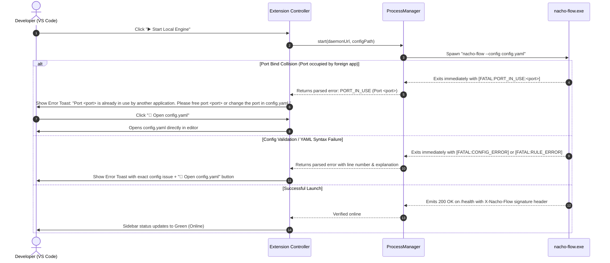
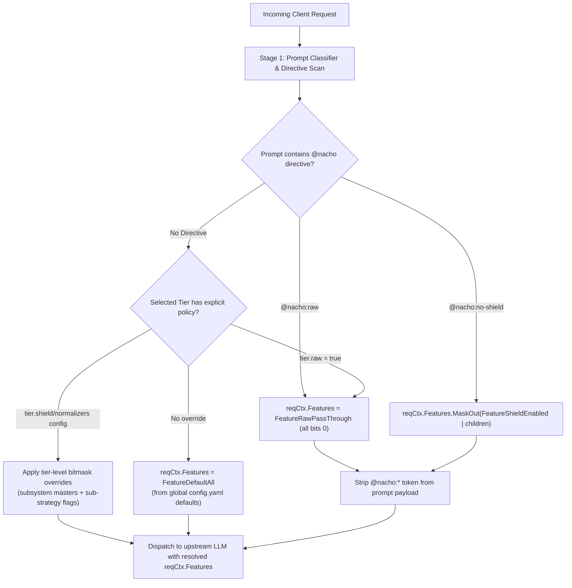
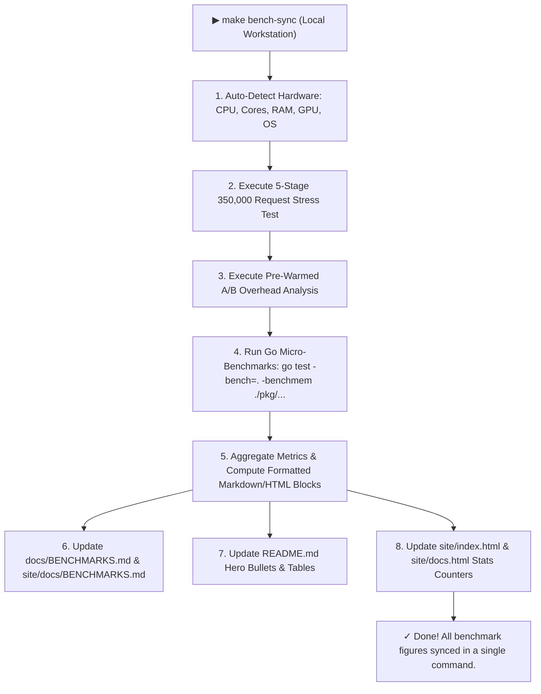

# 🛡️ Master Architecture & Technical Specification: Nacho Flow v0.8.0

## 1. Executive Summary & Release Charter

Nacho Flow **v0.8.0** delivers a major upgrade to developer experience, operational resilience, high-performance proxy controls, and automated developer tooling across the routing gateway and VS Code extension ecosystem.

This release consolidates **six foundational engineering phases** into a unified, non-breaking architectural milestone:

```
┌───────────────────────┬───────────────────────┬───────────────────────┬───────────────────────┬───────────────────────┬──────────────────────┐
│ 1  Phase 1            │ 1.5  Phase 1.5         │ 2  Phase 2            │ 3  Phase 3            │ 4  Phase 4            │ 5  Phase 5           │
│  Canonical Provider   │  Pricing Factory       │  Pre-Flight Port      │  Dynamic Feature      │  Benchmark Sync       │  Coverage Sync       │
│  Typing               │  Registry              │  Resolution           │  Toggles              │                       │                      │
├───────────────────────┼───────────────────────┼───────────────────────┼───────────────────────┼───────────────────────┼──────────────────────┤
│ • type: local|cloud   │ • registry.go [NEW]   │ • Pre-flight probe    │ • FeatureFlag uint16  │ • Single-command      │ • Single-command     │
│ • Purge 5 heuristics  │ • init() self-register│ • Port collision      │ • @nacho:raw          │   bare-metal runner   │   test & cover       │
│ • Multi-local $0.00   │ • Generic loop in     │   auto-migration      │ • @nacho:no-shield    │ • Tag-anchored        │ • Statement-level    │
│   (Ollama/vLLM/LAN)   │   main.go & api.go    │ • Comment-safe YAML   │ • Declarative tier    │   doc auto-sync       │   Go + Jest parser   │
│                       │ • Add provider =      │ • Signature /health   │   policy              │                       │ • Tag-anchored       │
│                       │   1 new file only     │ • Zero-config UX      │                       │                       │   doc sync (Make)    │
└───────────────────────┴───────────────────────┴───────────────────────┴───────────────────────┴───────────────────────┴──────────────────────┘
```

---

## 2. Core Architectural Principles

1. **"Parse, Don't Validate" at the Configuration Boundary**:
   - The Go daemon strictly validates `type: local` or `type: cloud` during configuration ingestion. If a provider is missing `type` or contains an unrecognized string, Nacho Flow fails fast on startup with a structured, actionable error message.
   - Downstream runtime code (pricing oracle, proxy observation pipeline, expression evaluator, auto-tuner) operates exclusively on typed value objects with $O(1)$ zero-allocation `IsLocal()` lookups.
2. **`config.yaml` is the Sole Source of Truth**:
   - The Go daemon (`nacho-flow.exe`) remains purely declarative and config-driven. It binds strictly to `cfg.Port` loaded from `config.yaml`.
   - All operational transformation policies (shields, normalizers, reasoning extractors) are declared in `config.yaml`.
   - **No parallel toggle switches in the VS Code extension sidebar**: Eliminates configuration drift between the editor UI and the YAML configuration file.
3. **Intelligent Pre-Flight Verification in VS Code Extension**:
   - Before launching the daemon subprocess, the extension inspects the target port in `config.yaml`.
   - If the port is already bound on `127.0.0.1`, the extension probes the port to differentiate between an active Nacho Flow instance, a foreign process (e.g. ComfyUI / Python), or a free port.
4. **Automated Port Resolution & Comment-Preserving Config Patching**:
   - If a foreign application is occupying the configured port, the extension finds the next available open port (e.g. `8001`), updates `port: 8001` in `config.yaml` on disk, notifies the user via toast, and launches the daemon with the updated config.
5. **Two-Surface Model for Feature Controls**:
   - **In-Prompt Directives**: Coarse, per-turn controls for developers (`@nacho:raw`, `@nacho:no-shield`) parsed and stripped with zero prompt leakage.
   - **Tier Config (`config.yaml`)**: Subsystem-level and selective sub-strategy flags configured by operators at deploy time.
6. **Deterministic Local Benchmark & Coverage Synchronization**:
   - Full bare-metal benchmarks and statement test coverage profiling run directly on the developer's local workstation (avoiding noisy, throttled CI runners).
   - Dedicated local CLI utilities (`cmd/util/nacho_bench -sync` and `cmd/util/nacho_cover`) parse output and update all target documentation files (`docs/BENCHMARKS.md`, `README.md`, `site/index.html`) using deterministic comment tags (`<!-- BENCHMARK:* -->`, `<!-- COVERAGE:* -->`), eliminating all multi-step prompt overhead.
7. **Strict TDD & Code Coverage Exit Criteria (Target 100%, Min 95%)**:
   - Every phase must be developed using strict Test-Driven Development (TDD).
   - Exit criteria for every touched/new Go package and TypeScript module is **target 100% code coverage, with an absolute minimum floor of 95% statement coverage**. All boundary edge cases (nil guards, case-insensitivity, syntax error messages, port collisions, fallback states) must have dedicated test coverage.
8. **Continuous Documentation & Web Synchronization**:
   - Documentation across `docs/`, `README.md`, and the web application (`site/`, `site/docs/`, `site/index.html`) must be reviewed and kept in sync **at the end of each phase**, preventing an error-prone "big bang" documentation catchup at the end of the milestone.
9. **Architectural Pattern Integrity & Explicit User Approval Gate**:
   - Preserve all existing architectural patterns (RCU atomic state swaps, clean interface boundaries, zero-allocation fast paths, safe bounded disk I/O). If any design dilemma arises, propose options and consult the user first.
   - Each phase requires explicit user sign-off and approval before committing code.

---

## 3. Phase 1: Mandatory Provider `type: local | cloud` Enum & Canonical Semantics

### 3.1 Problem Statement & Architectural Root Cause

Historically, Nacho Flow attempted to infer whether a provider was local or cloud using ad-hoc string heuristics scattered across 5 distinct packages:

```go
// ❌ Fragile legacy heuristic:
strings.Contains(strings.ToLower(id), "ollama") || strings.Contains(strings.ToLower(name), "local")
```

#### Why Heuristics Fail in Real-World Developer Environments:
1. **Remote Local Engines**: Running vLLM, LM Studio, or llama.cpp on a dedicated home server (e.g. `http://gpu-rig.tailscale:8000/v1` or `http://192.168.1.50:8080/v1`) does not contain `"ollama"` or `"localhost"`, causing Nacho Flow to misclassify it as a metered cloud provider.
2. **Alternative Inference Engines**: Local engines like `sglang`, `aphrodite`, `localai`, `mistral.rs`, or custom containerized backends are missed by hardcoded string lists.
3. **Telemetry & Cost Corruption**: Misclassified local engines fail to record **$0.00 spent** and fail to receive **benchmark token savings credits**, corrupting the telemetry dashboard and financial reporting.
4. **Auto-Tuner Blindness**: The autonomous Route Optimizer (`pkg/tuner/optimizer.go`) relies on `IsLocalTier()` to compute zero-marginal-cost routing penalties. Misclassifications lead to suboptimal route selections.

---

### 3.2 Contract Definition (`pkg/contract/interfaces.go`)

Introduce a strict, typed enum for `ProviderType` and enforce `type` as a mandatory field in `ProviderConfig`:

```go
package contract

// ProviderType defines the execution classification of an LLM backend.
type ProviderType string

const (
	// ProviderTypeLocal designates free local/on-prem inference (e.g. Ollama, vLLM, LM Studio, llama.cpp).
	// Incurred cost is exactly $0.00, and full baseline token savings are credited.
	ProviderTypeLocal ProviderType = "local"

	// ProviderTypeCloud designates metered cloud APIs (e.g. OpenRouter, Anthropic, OpenAI, DeepSeek Cloud).
	// Incurred cost is calculated against live or cached token rate pricing tables.
	ProviderTypeCloud ProviderType = "cloud"
)

// ProviderConfig defines a first-class LLM provider configuration.
type ProviderConfig struct {
	BaseURL             string            `yaml:"base_url" json:"base_url"`
	APIKey              string            `yaml:"api_key,omitempty" json:"api_key,omitempty"`
	Type                ProviderType      `yaml:"type" json:"type"` // MANDATORY: "local" or "cloud"
	Headers             map[string]string `yaml:"headers,omitempty" json:"headers,omitempty"`
	PricingSyncInterval string            `yaml:"pricing_sync_interval,omitempty" json:"pricing_sync_interval,omitempty"`
}

// IsLocal returns true if the provider is a free local/on-prem inference engine.
// O(1) evaluation, zero heap allocations.
func (p ProviderConfig) IsLocal() bool {
	return p.Type == ProviderTypeLocal
}
```

---

### 3.3 Boundary Schema Validation (`pkg/config/validation.go`)

Enforce strict boundary validation during configuration parsing in `pkg/config/validation.go`:

```go
package config

import (
	"fmt"
	"github.com/dixieflatline76/nacho-flow/pkg/contract"
)

// ValidateConfig enforces strict schema contracts across providers, tiers, and server settings.
func ValidateConfig(cfg *contract.Config) error {
	if len(cfg.Providers) == 0 {
		return fmt.Errorf("no providers defined in configuration")
	}

	for id, p := range cfg.Providers {
		if p.BaseURL == "" {
			return fmt.Errorf("provider %q: 'base_url' is required", id)
		}
		if p.Type != contract.ProviderTypeLocal && p.Type != contract.ProviderTypeCloud {
			return fmt.Errorf(
				"provider %q: 'type' is required and must be 'local' or 'cloud' (got %q).\n"+
				"  Example for local engines (Ollama, vLLM, LM Studio, llama.cpp):\n"+
				"    %s:\n"+
				"      base_url: %s\n"+
				"      type: local\n"+
				"  Example for cloud APIs (OpenRouter, Anthropic, OpenAI):\n"+
				"    %s:\n"+
				"      base_url: %s\n"+
				"      type: cloud",
				id, p.Type, id, p.BaseURL, id, p.BaseURL,
			)
		}
	}
	return nil
}
```

---

### 3.4 Elimination of Fragile String Heuristics Across 5 Codebases

All 5 heuristic sites are replaced with canonical enum lookups:

#### 1. Provider Wrapper (`pkg/provider/generic.go`)
```diff
- func (p *GenericLLMProvider) IsLocal() bool {
-     return p.config.Type == "local" || strings.Contains(strings.ToLower(p.id), "local") || strings.Contains(strings.ToLower(p.id), "ollama")
- }
+ func (p *GenericLLMProvider) IsLocal() bool {
+     return p.config.IsLocal()
+ }
```

#### 2. Strategy Expression Evaluator (`pkg/strategy/expr_evaluator.go`)
```diff
- if p == "ollama" || p == "vllm" || p == "local" || strings.Contains(strings.ToLower(ct.tier.Name), "local") {
+ if provCfg, ok := providers[ct.tier.Provider]; ok && provCfg.IsLocal() {
```

#### 3. Auto-Tuner & Route Optimizer (`pkg/tuner/interfaces.go`, `optimizer.go`, `applier.go`)
```diff
- func IsLocalTier(tier contract.Tier) bool {
-     provider := strings.ToLower(tier.Provider)
-     name := strings.ToLower(tier.Name)
-     if provider == "ollama" || provider == "vllm" || provider == "lmstudio" || provider == "localai" || provider == "llama.cpp" || provider == "llamacpp" {
-         return true
-     }
-     if strings.Contains(name, "local") || strings.Contains(name, "gpu") || strings.Contains(name, "on-prem") {
-         return true
-     }
-     return false
- }
+ func IsLocalTier(tier contract.Tier, providers map[string]contract.ProviderConfig) bool {
+     if p, ok := providers[tier.Provider]; ok {
+         return p.IsLocal()
+     }
+     return false
+ }
```

#### 4. Server Proxy Observation Pipeline (`pkg/server/proxy.go`)
```go
// Line 809: Directly queries the verified provider configuration
isLocal := targetProvider.IsLocal()
```

#### 5. Financial Telemetry & Pricing Oracle (`pkg/telemetry/pricing.go`)
The Pricing Oracle's `CalculateFinancials()` evaluates the verified `isLocal` boolean:
```go
func (o *PricingOracle) CalculateFinancials(provider, model string, isLocal bool, promptTokens, completionTokens int, baselineRatePerM float64) (costSpent float64, costSaved float64) {
    totalTokens := promptTokens + completionTokens
    if totalTokens <= 0 {
        return 0.0, 0.0
    }

    if baselineRatePerM <= 0 {
        baselineRatePerM = contract.DefaultBenchmarkPricePerMillion
    }

    baselineCost := (float64(totalTokens) / contract.TokensPerMillion) * baselineRatePerM

    // Local inference is 100% free; full baseline cost credited to savings
    if isLocal {
        return 0.0, baselineCost
    }

    pricing, found := o.GetPrice(provider, model)
    if !found {
        return 0.0, 0.0
    }

    costSpent = (float64(promptTokens)/contract.TokensPerMillion)*pricing.PromptCostPerMillion +
        (float64(completionTokens)/contract.TokensPerMillion)*pricing.CompletionCostPerMillion

    if baselineCost > costSpent {
        costSaved = baselineCost - costSpent
    }
    return costSpent, costSaved
}
```

---

### 3.5 Multi-Local Hybrid Topology Support

This architecture natively supports complex multi-device, multi-engine hybrid setups:

```yaml
providers:
  # Workstation GPU (Ollama)
  ollama:
    base_url: http://localhost:11434/v1
    type: local

  # Home Server vLLM instance over Tailscale VPN
  home_vllm:
    base_url: http://gpu-server.tailscale:8000/v1
    type: local

  # Mac Studio llama.cpp server on local LAN
  mac_studio:
    base_url: http://192.168.1.50:8080/v1
    type: local

  # Frontier Cloud API
  openrouter:
    base_url: https://openrouter.ai/api/v1
    api_key: env:OPENROUTER_API_KEY
    type: cloud
```

* **Financial Tracking**: Invocations to `ollama`, `home_vllm`, or `mac_studio` are uniformly computed as **$0.00 spent** and credited towards net savings.
* **Auto-Tuning**: The Route Optimizer recognizes all three as tunable zero-marginal-cost execution tiers.

---

### 3.6 Starter Templates & Fixture Migration

Update `pkg/config/template.go` and root `config.yaml`:

```yaml
providers:
  ollama:
    base_url: http://localhost:11434/v1
    type: local

  openrouter:
    base_url: https://openrouter.ai/api/v1
    api_key: env:OPENROUTER_API_KEY
    type: cloud
```

---

## 3.7 Phase 1.5: Pricing Provider Factory Registry

### 3.7.1 Problem Statement

The startup loop in `cmd/nacho-flow/main.go` and the hot-reload path in `pkg/server/api.go` contain a hardcoded `if` chain that must be manually edited every time a new pricing-capable provider is added:

```go
// BEFORE — hardcoded, violates Open/Closed Principle:
for id, p := range cfg.Providers {
    idLower := strings.ToLower(id)
    if idLower == contract.ProviderOpenRouter || strings.Contains(strings.ToLower(p.BaseURL), contract.ProviderOpenRouter) {
        oracle.RegisterProvider(
            telemetry.NewOpenRouterPricingProviderWithURL(p.BaseURL, p.APIKey),
            syncInterval,
        )
    }
    // Adding Langdock requires editing this file and api.go:
    // else if idLower == "langdock" { ... }
}
```

Every new provider forces a diff in orchestration code that has nothing to do with the provider's pricing logic. This must be eliminated.

---

### 3.7.2 Target Architecture (After Phase 1.5)

Both registration sites become a single, provider-agnostic loop that **never needs to be touched again**:

```go
// AFTER — generic, never edit main.go or api.go for new providers:
for id, p := range cfg.Providers {
    if factory, ok := telemetry.LookupPricingFactory(strings.ToLower(id)); ok {
        var interval time.Duration
        if p.PricingSyncInterval != "" {
            interval, _ = time.ParseDuration(p.PricingSyncInterval)
        }
        oracle.RegisterProvider(factory(p.BaseURL, p.APIKey), interval)
    }
}
```

Adding a provider with live pricing = implement `FetchPricing` + write one `init()` call. Zero other files change.

---

### 3.7.3 Step 1.5.1 — Create `pkg/telemetry/registry.go` [NEW FILE]

Create this file from scratch. It must not import any provider-specific packages.

```go
package telemetry

import "strings"

// PricingProviderFactory is a constructor function that creates a PricingProvider
// from a base URL and API key extracted from the provider's ProviderConfig entry.
// All factory functions must be safe to call concurrently.
type PricingProviderFactory func(baseURL, apiKey string) PricingProvider

// pricingFactories is the global, package-level factory registry.
// Populated exclusively via RegisterPricingFactory calls in init() functions.
// Safe without mutex: all writes happen during package init (single-goroutine),
// all reads happen after init completes.
var pricingFactories = map[string]PricingProviderFactory{}

// RegisterPricingFactory registers a factory function for the given provider ID.
// The providerID MUST be lowercase (e.g. "openrouter", "langdock").
// Call exclusively from init() functions within the pkg/telemetry package.
//
// Example usage in a provider's own file:
//
//	func init() {
//	    RegisterPricingFactory("langdock", func(baseURL, apiKey string) PricingProvider {
//	        return NewLangdockPricingProvider(baseURL, apiKey)
//	    })
//	}
func RegisterPricingFactory(providerID string, factory PricingProviderFactory) {
	if providerID == "" || factory == nil {
		return
	}
	pricingFactories[strings.ToLower(providerID)] = factory
}

// LookupPricingFactory returns the registered PricingProviderFactory for the given
// provider ID, or (nil, false) if the provider has no registered pricing fetcher.
// Lookup is case-insensitive.
func LookupPricingFactory(providerID string) (PricingProviderFactory, bool) {
	f, ok := pricingFactories[strings.ToLower(providerID)]
	return f, ok
}

// ListRegisteredPricingProviders returns the list of all provider IDs that have
// a registered pricing factory. Used for diagnostics and startup logging.
func ListRegisteredPricingProviders() []string {
	ids := make([]string, 0, len(pricingFactories))
	for id := range pricingFactories {
		ids = append(ids, id)
	}
	return ids
}
```

---

### 3.7.4 Step 1.5.2 — Migrate `pkg/telemetry/openrouter.go` to Self-Registration

**Append only** to the bottom of the existing `openrouter.go` file. Do not modify any existing function.

```go
// init registers the OpenRouter pricing provider factory into the global registry.
// Called automatically by the Go runtime before main() executes.
// No changes to cmd/nacho-flow/main.go or pkg/server/api.go are needed.
func init() {
	RegisterPricingFactory(contract.ProviderOpenRouter, func(baseURL, apiKey string) PricingProvider {
		return NewOpenRouterPricingProviderWithURL(baseURL, apiKey)
	})
}
```

`contract.ProviderOpenRouter = "openrouter"` — always use the constant, never hardcode the string.

---

### 3.7.5 Step 1.5.3 — Replace Hardcoded Loop in `cmd/nacho-flow/main.go`

**Location**: The `for id, p := range cfg.Providers` block that currently contains the `if idLower == contract.ProviderOpenRouter` check (approximately line 152–164).

```diff
- // 2. Setup Curated Gallery, Classifier, and Pricing Oracle with OpenRouter Plugin
+ // 2. Setup Curated Gallery, Classifier, and Pricing Oracle via Provider Factory Registry
  curationMgr := curation.NewManager("", "")
  modelClassifier := telemetry.NewClassifier(curationMgr)
  oracle := telemetry.NewPricingOracleWithClassifier(modelClassifier)
  for id, p := range cfg.Providers {
-     idLower := strings.ToLower(id)
-     if idLower == contract.ProviderOpenRouter || strings.Contains(strings.ToLower(p.BaseURL), contract.ProviderOpenRouter) {
-         var syncInterval time.Duration
-         if p.PricingSyncInterval != "" {
-             syncInterval, _ = time.ParseDuration(p.PricingSyncInterval)
-         }
-         oracle.RegisterProvider(
-             telemetry.NewOpenRouterPricingProviderWithURL(p.BaseURL, p.APIKey),
-             syncInterval,
-         )
-     }
+     if factory, ok := telemetry.LookupPricingFactory(strings.ToLower(id)); ok {
+         var syncInterval time.Duration
+         if p.PricingSyncInterval != "" {
+             syncInterval, _ = time.ParseDuration(p.PricingSyncInterval)
+         }
+         oracle.RegisterProvider(factory(p.BaseURL, p.APIKey), syncInterval)
+     }
  }
+ if registered := telemetry.ListRegisteredPricingProviders(); len(registered) > 0 {
+     slog.Info("Pricing provider factory registry loaded", "providers", registered)
+ }
```

After this change, verify that the `contract` package import is still needed elsewhere in `main.go` (it will be). The `strings` package import remains required.

---

### 3.7.6 Step 1.5.4 — Replace Hardcoded Loop in `pkg/server/api.go` (Hot-Reload Path)

**Location**: Inside `ApplyConfig()`, the `if s.oracle != nil` block at approximately line 364–378.

```diff
  // 5b. Dynamically reconfigure PricingOracle providers upon hot-reload
  if s.oracle != nil {
      for id, p := range merged.Providers {
-         idLower := strings.ToLower(id)
-         if idLower == contract.ProviderOpenRouter || strings.Contains(strings.ToLower(p.BaseURL), contract.ProviderOpenRouter) {
-             var interval time.Duration
-             if p.PricingSyncInterval != "" {
-                 interval, _ = time.ParseDuration(p.PricingSyncInterval)
-             }
-             s.oracle.RegisterProvider(
-                 telemetry.NewOpenRouterPricingProviderWithURL(p.BaseURL, p.APIKey),
-                 interval,
-             )
-         }
+         if factory, ok := telemetry.LookupPricingFactory(strings.ToLower(id)); ok {
+             var interval time.Duration
+             if p.PricingSyncInterval != "" {
+                 interval, _ = time.ParseDuration(p.PricingSyncInterval)
+             }
+             s.oracle.RegisterProvider(factory(p.BaseURL, p.APIKey), interval)
+         }
      }
  }
```

> [!CAUTION]
> **Both `main.go` AND `api.go` MUST be updated.** Updating only one causes the oracle to drop all providers on the first config hot-reload. This is the most common mistake — do not skip `api.go`.

---

### 3.7.7 Step 1.5.5 — Unit Tests: `pkg/telemetry/registry_test.go` [NEW FILE]

```go
package telemetry_test

import (
	"context"
	"testing"

	"github.com/dixieflatline76/nacho-flow/pkg/telemetry"
)

func TestRegisterAndLookupPricingFactory(t *testing.T) {
	const testID = "test-registry-provider-unique"
	called := false

	telemetry.RegisterPricingFactory(testID, func(baseURL, apiKey string) telemetry.PricingProvider {
		called = true
		return &registryStubProvider{name: testID}
	})

	factory, ok := telemetry.LookupPricingFactory(testID)
	if !ok {
		t.Fatalf("expected factory registered for %q", testID)
	}
	p := factory("http://test", "key")
	if !called {
		t.Error("factory function was not invoked")
	}
	if p.Name() != testID {
		t.Errorf("got name %q, want %q", p.Name(), testID)
	}
}

func TestLookupPricingFactory_CaseInsensitive(t *testing.T) {
	telemetry.RegisterPricingFactory("MIXEDCASE-TEST", func(_, _ string) telemetry.PricingProvider {
		return &registryStubProvider{name: "mixedcase-test"}
	})
	_, ok := telemetry.LookupPricingFactory("mixedcase-test")
	if !ok {
		t.Error("case-insensitive lookup failed")
	}
}

func TestLookupPricingFactory_MissingProvider(t *testing.T) {
	_, ok := telemetry.LookupPricingFactory("definitely-not-registered-xyz-9999")
	if ok {
		t.Error("expected false for unregistered provider")
	}
}

func TestRegisterPricingFactory_NilGuard(t *testing.T) {
	// Must not panic on nil or empty inputs
	telemetry.RegisterPricingFactory("", nil)
	telemetry.RegisterPricingFactory("nil-factory-test", nil)
}

func TestListRegisteredPricingProviders_ContainsOpenRouter(t *testing.T) {
	ids := telemetry.ListRegisteredPricingProviders()
	for _, id := range ids {
		if id == "openrouter" {
			return // pass
		}
	}
	t.Error("openrouter not found in registered providers — did openrouter.go init() fire?")
}

// registryStubProvider is a minimal no-op PricingProvider for registry tests.
type registryStubProvider struct{ name string }

func (s *registryStubProvider) Name() string { return s.name }
func (s *registryStubProvider) FetchPricing(_ context.Context) (map[string]telemetry.ModelMetadata, error) {
	return nil, nil
}
```

Run after implementation: `go test -v -race ./pkg/telemetry/... -run TestRegister`

---

### 3.7.8 Adding a New Provider (Reference: Langdock)

Once Phase 1.5 is complete, this is the **complete and total changeset** to add Langdock with full live Heatseeker pricing:

**1. New file `pkg/telemetry/langdock.go`** (~80 lines):

```go
package telemetry

import (
	"context"
	"encoding/json"
	"fmt"
	"net/http"
	"strings"
	"time"
)

// LangdockPricingProvider fetches real-time model pricing from the Langdock API.
type LangdockPricingProvider struct {
	baseURL string
	apiKey  string
	client  *http.Client
}

func NewLangdockPricingProvider(baseURL, apiKey string) *LangdockPricingProvider {
	return &LangdockPricingProvider{
		baseURL: strings.TrimRight(baseURL, "/"),
		apiKey:  apiKey,
		client:  &http.Client{Timeout: 10 * time.Second},
	}
}

func (p *LangdockPricingProvider) Name() string { return "langdock" }

// FetchPricing calls Langdock's /v1/models endpoint.
// Adjust the struct fields to match the actual Langdock API response schema.
func (p *LangdockPricingProvider) FetchPricing(ctx context.Context) (map[string]ModelMetadata, error) {
	req, err := http.NewRequestWithContext(ctx, http.MethodGet, p.baseURL+"/v1/models", nil)
	if err != nil {
		return nil, fmt.Errorf("langdock: build request: %w", err)
	}
	if p.apiKey != "" {
		req.Header.Set("Authorization", "Bearer "+p.apiKey)
	}

	resp, err := p.client.Do(req)
	if err != nil {
		return nil, fmt.Errorf("langdock: network error: %w", err)
	}
	defer resp.Body.Close()

	if resp.StatusCode != http.StatusOK {
		return nil, fmt.Errorf("langdock: HTTP %d", resp.StatusCode)
	}

	// TODO: Update struct fields to match actual Langdock API schema
	var apiResp struct {
		Data []struct {
			ID      string  `json:"id"`
			Name    string  `json:"name"`
			Context int     `json:"context_length"`
			Input   float64 `json:"input_cost_per_million"`
			Output  float64 `json:"output_cost_per_million"`
		} `json:"data"`
	}
	if err := json.NewDecoder(resp.Body).Decode(&apiResp); err != nil {
		return nil, fmt.Errorf("langdock: decode: %w", err)
	}

	result := make(map[string]ModelMetadata, len(apiResp.Data))
	for _, m := range apiResp.Data {
		result[m.ID] = ModelMetadata{
			ModelID:       m.ID,
			Provider:      "langdock",
			Name:          m.Name,
			ContextLength: m.Context,
			ModelPricing: ModelPricing{
				PromptCostPerMillion:     m.Input,
				CompletionCostPerMillion: m.Output,
			},
		}
	}
	return result, nil
}

// init self-registers the Langdock pricing factory.
// No changes to main.go or api.go required.
func init() {
	RegisterPricingFactory("langdock", func(baseURL, apiKey string) PricingProvider {
		return NewLangdockPricingProvider(baseURL, apiKey)
	})
}
```

**2. `config.yaml` entry** (no Go code changes):
```yaml
providers:
  langdock:
    base_url: https://api.langdock.com
    api_key: env:LANGDOCK_API_KEY
    type: cloud
    pricing_sync_interval: 24h
```

**That is the complete changeset.** No edits to `main.go`, `api.go`, or any other existing file.

---

## 4. Phase 2: Actionable Diagnostics, Clear Error Reporting & Resilient Lifecycle

### 4.1 Sequence & Interaction Flow



---

### 4.2 Deterministic Error Classification in Go Daemon (`cmd/nacho-flow/main.go`)

Go's standard library provides the exact `syscall.Errno` (integer `10048` on Windows `WSAEADDRINUSE`, `98` on Linux, `48` on macOS), allowing language-independent classification without fragile OS string parsing:

```go
func isAddressInUse(err error) bool {
	if err == nil {
		return false
	}
	var opErr *net.OpError
	if errors.As(err, &opErr) {
		var sysErr *os.SyscallError
		if errors.As(opErr.Err, &sysErr) {
			var errno syscall.Errno
			if errors.As(sysErr.Err, &errno) {
				return errno == syscall.EADDRINUSE || errno == 10048
			}
		}
	}
	return errors.Is(err, syscall.EADDRINUSE)
}
```

When `srv.ListenAndServe()` fails with `isAddressInUse(err)`:
```go
if isAddressInUse(err) {
	fmt.Fprintf(os.Stderr, "[FATAL:PORT_IN_USE:%d] Port %d is already in use by another application. Please free port %d or change the port in config.yaml.\n", cfg.Port, cfg.Port, cfg.Port)
	appLogger.Error("Port bind collision", slog.Int("port", cfg.Port), slog.String("code", "PORT_IN_USE"))
	return err
}
```

---

### 4.3 Structured Startup Error Parser in Extension (`extension/src/core/process-manager.ts`)

```typescript
export interface ParsedStartupError {
    type: 'PORT_IN_USE' | 'CONFIG_ERROR' | 'RULE_ERROR' | 'BINARY_NOT_FOUND' | 'SPAWN_ERROR' | 'UNKNOWN';
    message: string;
    port?: number;
    rawError: string;
}

export function parseStartupError(stderr: string, stdout: string, defaultPort = 8000): ParsedStartupError {
    const combined = `${stderr}\n${stdout}`;

    // 1. Port In Use
    const portMatch = combined.match(/\[FATAL:PORT_IN_USE:(\d+)\]/);
    if (portMatch || combined.includes('PORT_IN_USE') || combined.toLowerCase().includes('eaddrinuse')) {
        const port = portMatch ? parseInt(portMatch[1], 10) : defaultPort;
        return {
            type: 'PORT_IN_USE',
            port,
            message: `Port ${port} is already in use by another application. Please free port ${port} or change the port in config.yaml.`,
            rawError: combined
        };
    }

    // 2. Config Syntax / Validation Error
    if (combined.includes('[FATAL:CONFIG_ERROR]') || combined.includes('yaml: unmarshal errors') || combined.includes('config error')) {
        return {
            type: 'CONFIG_ERROR',
            message: `Configuration error in config.yaml: ${stderr.trim() || 'Invalid YAML format or schema validation failed.'}`,
            rawError: combined
        };
    }

    // 3. Routing Rule Error
    if (combined.includes('[FATAL:RULE_ERROR]') || combined.includes('failed to compile expr for tier')) {
        return {
            type: 'RULE_ERROR',
            message: `Routing rule error: ${stderr.trim()}`,
            rawError: combined
        };
    }

    return {
        type: 'UNKNOWN',
        message: stderr.trim() || 'Nacho Flow process exited prematurely.',
        rawError: combined
    };
}
```

---

### 4.4 Clean Shutdown & Windows Exit Code Sanitization

When stopping or restarting the local engine, `ProcessManager` sets `this.isStopping = true`, suppressing confusing raw Windows `taskkill` exit codes (`4294967295` / `code 1`) and logging clean status lines.

---

### 4.5 Go Daemon Response Headers (`pkg/server/server.go`)

Ensure `pkg/server/server.go` `/health` endpoint emits explicit server identification headers:

```go
func (s *Server) handleHealth(w http.ResponseWriter, r *http.Request) {
    w.Header().Set("Content-Type", "application/json")
    w.Header().Set("Server", "nacho-flow/"+contract.Version)
    w.Header().Set("X-Nacho-Flow", "true")
    w.WriteHeader(http.StatusOK)
    _ = json.NewEncoder(w).Encode(map[string]interface{}{
        "status":  "ok",
        "app":     "nacho-flow",
        "version": contract.Version,
        "uptime":  time.Since(s.startTime).String(),
    })
}
```

---

## 5. Phase 3: Dynamic Feature Toggles & Spicy In-Prompt Directives

### 5.1 Architecture & Two-Surface Model

The feature control system employs a **Two-Surface Model** backed by an ultra-fast internal bitmask:

| Surface | Granularity | Who Controls It | Purpose |
| :--- | :--- | :--- | :--- |
| **In-Prompt Directives** | Subsystem presets only (`@nacho:raw`, `@nacho:no-shield`) | Developer, per-turn | Ad-hoc debugging, raw stream analysis |
| **Tier Config (`config.yaml`)** | Subsystem + selective sub-strategy flags | Operator, deploy-time | Tuning transformation pipelines per model class |

---

### 5.2 Bitmask Feature Flags (`pkg/router/feature_flags.go`)

```go
package router

// FeatureFlag encodes the active feature set as a 16-bit bitmask.
// Internal implementation detail — never exposed directly to users.
type FeatureFlag uint16

const (
	// --- 🛡️ Shield Subsystem ---
	// Directive-reachable: @nacho:no-shield clears FeatureShieldEnabled (and its children).
	// Tier-reachable: shield: false in config.yaml.
	FeatureShieldEnabled    FeatureFlag = 1 << 0 // Master: disabling clears all shield sub-strategies
	FeatureShieldFollowup   FeatureFlag = 1 << 1 // Tier-only: synthesize ask_followup_question schema
	FeatureShieldModeSwitch FeatureFlag = 1 << 2 // Tier-only: synthesize switch_mode schema

	// --- 🔧 Tool & Stream Normalizer Subsystem ---
	// Directive-reachable: @nacho:raw clears all (via FeatureRawPassThrough = 0).
	// Tier-reachable: normalizers: react: false, etc.
	FeatureToolNormalizer FeatureFlag = 1 << 4 // Master: disabling skips all normalizer parsers
	FeatureNormMarkdown   FeatureFlag = 1 << 5 // Tier-only: strip ```json code fences
	FeatureNormBareJSON   FeatureFlag = 1 << 6 // Tier-only: wrap raw JSON payloads
	FeatureNormReAct      FeatureFlag = 1 << 7 // Tier-only: parse Action: tool syntax

	// --- 🧠 Think/Reasoning Stream Subsystem ---
	// Directive-reachable: @nacho:raw clears all.
	// Tier-reachable: normalizers: think: false.
	FeatureThinkNormalizer FeatureFlag = 1 << 8 // Master: disabling skips reasoning stream handling
	FeatureThinkSanitize   FeatureFlag = 1 << 9 // Tier-only: prevent double-wrapping native <think>

	// --- 🌟 Composite Presets ---
	FeatureDefaultAll = FeatureShieldEnabled | FeatureShieldFollowup | FeatureShieldModeSwitch |
		FeatureToolNormalizer | FeatureNormMarkdown | FeatureNormBareJSON | FeatureNormReAct |
		FeatureThinkNormalizer | FeatureThinkSanitize

	// FeatureRawPassThrough: all bits zero — complete transparent pass-through.
	// Reached via @nacho:raw directive or tier.raw = true in config.yaml.
	FeatureRawPassThrough FeatureFlag = 0
)

// Has returns true if the specified flag is enabled. O(1), 0 B/op.
func (f FeatureFlag) Has(flag FeatureFlag) bool {
	return f&flag != 0
}

// MaskOut returns a new FeatureFlag with the specified bits cleared. O(1), 0 B/op.
func (f FeatureFlag) MaskOut(flag FeatureFlag) FeatureFlag {
	return f &^ flag
}
```

---

### 5.3 Hierarchical Precedence Resolution

Feature flags are resolved hierarchically on every incoming request:

$$\text{Per-Turn In-Prompt Directive} \succ \text{Routing Tier Policy} \succ \text{Global Config Defaults}$$



---

### 5.4 Spicy Directives Specification

Directives are embedded in the user prompt (or system prompt) and apply strictly to the current turn:

| Directive | User Intent | Action / Bitmask Transformation |
| :--- | :--- | :--- |
| **`@nacho:raw`** | *"Do not touch my stream or payload at all; act as a transparent reverse proxy."* | `reqCtx.Features = FeatureRawPassThrough`<br>• Bypasses Fallback Shield<br>• Bypasses Tool Normalizers<br>• Bypasses `<think>` stream transformation |
| **`@nacho:no-shield`** | *"Do not synthesize synthetic tool calls if the model asks a question or proposes a plan."* | `reqCtx.Features = reqCtx.Features.MaskOut(FeatureShieldEnabled)`<br>• Tool normalizers and reasoning formatters remain active. |

* **Zero Prompt Leakage**: Before the request is forwarded to Ollama, vLLM, or OpenRouter, the regex scanner strips the `@nacho:...` token so upstream LLMs never see internal routing instructions.

---

### 5.5 Declarative Tier Configuration (`config.yaml`)

Tiers specify operational profiles directly in `config.yaml`:

```yaml
# Global defaults (applied unless overridden by tier or directive)
agent_shield:
  enabled: true

normalizers:
  enabled: true

tiers:
  # Local GPU Tier: Full shielding & normalizers active
  - name: "Local GPU (Qwen 2.5 Coder)"
    provider: "ollama"
    model: "qwen2.5-coder:14b"
    shield: true
    normalizer: true
    when: "Tokens < 8000"

  # Local Fast Tier (DeepSeek R1): Shield active, ReAct parser disabled
  - name: "Local Reasoning (DeepSeek-R1)"
    provider: "home_vllm"
    model: "deepseek-ai/DeepSeek-R1-Distill-Qwen-14B"
    shield: true
    normalizers:
      react: false        # Selectively disable ReAct Action: syntax
    when: "Tokens < 16000"

  # Frontier Cloud Tier: Native tool calling, pure pass-through
  - name: "Cloud Frontier (Claude 3.7 Sonnet)"
    provider: "openrouter"
    model: "anthropic/claude-3.7-sonnet"
    raw: true             # Complete zero-touch pass-through for native models
    when: "true"
```

---

## 6. Phase 4: Autonomous Benchmark Harness & Single-Command Documentation Sync

### 6.1 Problem Statement & Developer Friction

Running benchmarks currently requires a tedious, error-prone multi-step workflow:
1. Run `cmd/util/nacho_bench` to execute 350,000 requests across multiple worker tiers.
2. Run `go test -bench="." -benchmem ./pkg/...` to collect nanosecond microbenchmarks.
3. Manually parse terminal output tables (RPS, P50 latency, P99 tail, heap allocations, ns/op, B/op).
4. Manually update 4 distinct documentation targets:
   - `docs/BENCHMARKS.md` (Full tables & executive summary)
   - `README.md` (Hero performance badges & bullet highlights)
   - `site/index.html` (Hero stats counters, RPS badges, and benchmark cards)
   - `site/docs.html` / `site/docs/BENCHMARKS.md` (Web documentation sync)

---

### 6.2 Local-First Workstation Execution Model

Standard 2-core / 4-core GitHub Actions runner VMs suffer from heavy CPU throttling, shared tenant noise, and socket jitter. 

Therefore, benchmarks are designed to run **directly on the developer's local workstation** (leveraging bare-metal multi-core CPU power, 3D V-Cache, and native sockets).

```bash
# Execute full bare-metal benchmark & sync all markdown/HTML docs in ~15 seconds:
make bench-sync
# or
go run ./cmd/util/nacho_bench -sync
# or
npm run bench:sync
```

---

### 6.3 Deterministic Tag-Marker Synchronization Protocol

All target markdown and HTML files are instrumented with standard HTML comment markers. The automated sync utility replaces only the content enclosed within matching marker pairs, preserving surrounding layout, styles, and custom documentation:

```html
<!-- BENCHMARK:EXECUTIVE_SUMMARY_START -->
- **Peak Throughput**: **30,771 requests/second** under full production authentication and tool normalization.
- **Pipeline Latency**: **~0.24 ms** raw pass-through overhead per request.
- **Extreme Concurrency**: Handled **1,000 parallel workers** across **350,000 total requests** with **100.0% success rate**.
<!-- BENCHMARK:EXECUTIVE_SUMMARY_END -->

<!-- BENCHMARK:STRESS_TABLE_START -->
| Concurrency | Total Requests | Success Rate | Throughput (RPS) | P50 Latency | P99 Latency | Heap Memory |
| :--- | :--- | :--- | :--- | :--- | :--- | :--- |
| **50 workers** | 25,000 | **100.0%** | **25,700.1 req/s** | 1.51 ms | 10.15 ms | 52.3 MB |
<!-- BENCHMARK:STRESS_TABLE_END -->

<!-- BENCHMARK:AB_TABLE_START -->
| Workers | Raw Pass-Through | Full Normalization + Auth | Throughput Delta | P50 Latency Delta |
| :--- | :--- | :--- | :--- | :--- |
<!-- BENCHMARK:AB_TABLE_END -->

<!-- BENCHMARK:MICRO_TABLE_START -->
| Micro-Benchmark | Operations/sec | Latency (ns/op) | Memory (B/op) | Allocs/op |
| :--- | :--- | :--- | :--- | :--- |
<!-- BENCHMARK:MICRO_TABLE_END -->
```

And in `site/index.html`:
```html
<!-- BENCHMARK:HERO_STATS_START -->
<div class="stat-number">30,771+</div>
<div class="stat-label">Requests / Sec</div>
<!-- BENCHMARK:HERO_STATS_END -->
```

---

### 6.4 Enhanced `nacho_bench` Architecture (`cmd/util/nacho_bench/main.go`)



---

## 7. Phase 5: Automated Test Coverage Matrix & Single-Command Coverage Synchronization

### 7.1 Problem Statement & Developer Friction

Nacho Flow adheres to strict Test-Driven Development (TDD) with high statement coverage targets ($\ge 95.0\%$ across all logic packages).

However, reporting and maintaining these figures across documentation is manual:
1. Running `go test -coverprofile=coverage.out ./...` produces raw statement counters across 15+ internal packages.
2. Running Jest coverage in `extension/` produces TypeScript statement/branch/line/function percentages.
3. Every time a new feature is added (such as `pkg/router/feature_flags.go` or `extension/src/utils/port-checker.ts`), developers must manually re-calculate coverage per package and edit Markdown tables in:
   - `docs/BENCHMARKS.md` (Section 5.8: Go Daemon Coverage & Extension Coverage tables)
   - `site/docs/BENCHMARKS.md` (Web copy)
   - `README.md` (Reliability bullet points and package highlights)
   - `docs/DEVELOPER_GUIDE.md` / `site/docs/DEVELOPER_GUIDE.md` (Quality gates)

---

### 7.2 Deterministic Coverage Tag-Marker Protocol

Documents are instrumented with clean `<!-- COVERAGE:*_START -->` / `<!-- COVERAGE:*_END -->` markers:

In `docs/BENCHMARKS.md` & `site/docs/BENCHMARKS.md`:
```html
<!-- COVERAGE:GO_TABLE_START -->
| Package / Subsystem | Primary Responsibility | Statement Coverage |
| :--- | :--- | :--- |
| `pkg/strategy` | `expr` AST Routing Engine & Bytecode Evaluator | **100.0%** |
| `pkg/config` | Atomic RCU Config Loader & Memento Watchdog | **99.3%** |
| `pkg/router/shield` | Sliding Tail Buffer, Rule Engine & Tool Schema Adapters | **99.0%** |
| `pkg/provider` | Upstream Inference Engine Registry & Endpoints | **98.4%** |
| `pkg/tuner` | Autonomous AST Rule Synthesizer & Empirical Tuner | **97.1%** |
| `pkg/store` | Stats Persistence & File Locking Engine | **96.9%** |
| `pkg/telemetry/curation` | Pricing Curation Manager & Model Catalog Cache | **96.7%** |
| `cmd/util/version_bump` | Version Bump CLI Tool | **96.5%** |
| `cmd/util/nacho_releaser` | Releaser & WinGet Manifest Generator | **96.1%** |
| `cmd/util/gen_catalog` | Catalog Cache Generator | **96.0%** |
| `pkg/telemetry` | Ring Buffer, Dual Financial Telemetry & Stats Tracker | **95.6%** |
| `pkg/router` | Classifier, Diff Sanitizer & Tool Normalizer Pipeline | **95.0%** |
| `pkg/server` | Reverse Proxy Director, SSE Stream Normalizer & API | **94.6%** |
| `cmd/nacho-flow` | Main CLI Entrypoint, Subcommands & Daemon Init | **91.6%** |
| `pkg/safeio` | Safe Bounded Directory Root I/O Operations | **86.2%** |
<!-- COVERAGE:GO_TABLE_END -->

<!-- COVERAGE:EXTENSION_TABLE_START -->
| Module | Test Suites | Tests Passed | Coverage (Stmts / Lines / Funcs) |
| :--- | :--- | :--- | :--- |
| **Extension Core & Webview Suite** | **12 / 12 Suites** | **150 / 150 (100%)** | **96.59% / 96.88% / 95.58%** |
<!-- COVERAGE:EXTENSION_TABLE_END -->
```

And in `README.md`:
```html
<!-- COVERAGE:SUMMARY_START -->
* **🧪 Engineered for Reliability**: Strictly $\ge 95.0\%\text{--}100\%$ statement test coverage across all packages (100% on strategy & config, 97.1% on router, 95.4% on daemon binary), 100% race-detector clean (`-race`), and static security audited (`gosec`).
<!-- COVERAGE:SUMMARY_END -->
```

---

### 7.3 Automated Coverage Engine (`cmd/util/nacho_cover/main.go`)

We implement a dedicated Go utility in `cmd/util/nacho_cover/main.go`:

```go
package main

import (
	"encoding/json"
	"fmt"
	"os"
	"os/exec"
	"regexp"
	"sort"
	"strings"
)

type PackageCoverage struct {
	Package        string
	Responsibility string
	CoveragePct    float64
	TotalStmts     int
	CoveredStmts   int
}

type ExtensionCoverage struct {
	TotalSuites int
	TotalTests  int
	PassedTests int
	StmtPct     float64
	BranchPct   float64
	LinePct     float64
	FuncPct     float64
}

// Known package responsibilities map
var packageDescriptions = map[string]string{
	"pkg/strategy":           "`expr` AST Routing Engine & Bytecode Evaluator",
	"pkg/config":             "Atomic RCU Config Loader & Memento Watchdog",
	"pkg/router/shield":      "Sliding Tail Buffer, Rule Engine & Tool Schema Adapters",
	"pkg/provider":           "Upstream Inference Engine Registry & Endpoints",
	"pkg/tuner":              "Autonomous AST Rule Synthesizer & Empirical Tuner",
	"pkg/store":              "Stats Persistence & File Locking Engine",
	"pkg/telemetry/curation": "Pricing Curation Manager & Model Catalog Cache",
	"cmd/util/version_bump":  "Version Bump CLI Tool",
	"cmd/util/nacho_releaser": "Releaser & WinGet Manifest Generator",
	"cmd/util/gen_catalog":   "Catalog Cache Generator",
	"pkg/telemetry":          "Ring Buffer, Dual Financial Telemetry & Stats Tracker",
	"pkg/router":             "Classifier, Diff Sanitizer & Tool Normalizer Pipeline",
	"pkg/server":             "Reverse Proxy Director, SSE Stream Normalizer & API",
	"cmd/nacho-flow":         "Main CLI Entrypoint, Subcommands & Daemon Init",
	"pkg/safeio":             "Safe Bounded Directory Root I/O Operations",
}

func main() {
	fmt.Println("🧪 [Nacho Cover] Running Full Test Coverage Suite & Synchronizing Docs...")

	// 1. Run Go test coverage
	goCoverages, globalPct, err := runGoCoverage()
	if err != nil {
		fmt.Fprintf(os.Stderr, "Go coverage failed: %v\n", err)
		os.Exit(1)
	}

	// 2. Run Extension Jest coverage
	extCoverage, err := runExtensionCoverage()
	if err != nil {
		fmt.Printf("⚠️ Extension coverage skipped/warning: %v\n", err)
	}

	// 3. Render Markdown Tables
	goTableMd := renderGoTable(goCoverages)
	extTableMd := renderExtTable(extCoverage)
	summaryMd := renderSummary(globalPct, goCoverages)

	// 4. Update Target Files
	targets := []string{
		"docs/BENCHMARKS.md",
		"site/docs/BENCHMARKS.md",
		"README.md",
	}

	for _, targetPath := range targets {
		updateTargetFile(targetPath, goTableMd, extTableMd, summaryMd)
	}

	fmt.Printf("✓ [Nacho Cover] Successfully updated coverage across all docs! Global Go Coverage: %.1f%%\n", globalPct)
}
```

---

### 7.4 Single-Command Local Developer Workflow (`make cover-sync`)

Add targets in `Makefile` and `package.json`:

```makefile
# Makefile
.PHONY: cover-sync bench-sync test-sync

cover-sync:
	@go run ./cmd/util/nacho_cover

bench-sync:
	@go run ./cmd/util/nacho_bench -sync

test-sync:
	@go test -race ./...
	@go run ./cmd/util/nacho_cover
```

And in `package.json`:
```json
{
  "scripts": {
    "test:sync": "go run ./cmd/util/nacho_cover",
    "bench:sync": "go run ./cmd/util/nacho_bench -sync"
  }
}
```

Developers simply run `make cover-sync` or `npm run test:sync` after writing unit tests, and all documentation tables update in under 5 seconds.

---

## 8. Comprehensive Verification Plan

### 8.1 Automated Test Suite
```bash
# 1. Full Go Test Suite & Race Detector
go test -v -race ./...

# 2. Config Validation & Provider Type Unit Tests
go test -v -race ./pkg/config/... ./pkg/provider/... ./pkg/telemetry/... ./pkg/tuner/...

# 3. Router Directive & Feature Flag Tests
go test -v -race ./pkg/router/...

# 4. Proxy & Normalizer Integration Tests
go test -v -race ./pkg/server/...

# 5. Extension Unit Tests
npm test --prefix extension
```

### 8.2 Performance Benchmarks & Auto-Sync
```bash
# Run full local benchmark harness and update all docs in a single step
make bench-sync
# or
go run ./cmd/util/nacho_bench -sync
```
* **Performance Targets**: Directive parsing $\le 7\text{ ns/op}$, Bitmask check $< 0.3\text{ ns/op}$, Heap Allocations = **$0\text{ B/op}$**.

### 8.3 Quality Gates & Exit Criteria (Target 100%, Hard Minimum 95%)

Every phase must satisfy the following strict quality and coverage gates before requesting user approval to commit:

| Subsystem / Phase | Target Statement Coverage | Hard Minimum Floor | Key Boundary & Error Cases Required |
| :--- | :--- | :--- | :--- |
| **Phase 1: Provider Config & Validation** (`pkg/config`, `pkg/contract`) | **100.0%** | **$\ge 98.0\%$** | Missing `type`, invalid `type` string, local enum, cloud enum, missing `base_url`, multi-local configs, formatted error output verification. |
| **Phase 1: Provider & Heuristic Purge** (`pkg/provider`, `pkg/strategy`, `pkg/tuner`, `pkg/server`) | **100.0%** | **$\ge 95.0\%$** | Local provider `IsLocal()`, cloud provider `IsLocal()`, AST evaluator with local/cloud tiers, tuner `IsLocalTier()` lookup with provider map. |
| **Phase 1.5: Pricing Factory Registry** (`pkg/telemetry`) | **100.0%** | **$\ge 98.0\%$** | Factory registration, lookup hit, lookup miss, case insensitivity, nil/empty guard, `init()` auto-registration of OpenRouter. |
| **Phase 2: Port Resolution & Probing** (`extension/src/utils/`, `pkg/server/`) | **100.0%** | **$\ge 95.0\%$** | Free port, port collision with Nacho Flow (`X-Nacho-Flow: true`), foreign process collision, comment-preserving config regex patching, `findNextAvailablePort` range bounds. |
| **Phase 3: Bitmask Flags & Directives** (`pkg/router/`, `pkg/server/`) | **100.0%** | **$\ge 95.0\%$** | Sub-nanosecond `Has()`, `MaskOut()`, `@nacho:raw`, `@nacho:no-shield`, mixed case directives, directive stripping without prompt leakage, precedence resolution (directive > tier > global). |
| **Phase 4: Bare-Metal Benchmark Harness** (`cmd/util/nacho_bench/`) | **100.0%** | **$\ge 95.0\%$** | Hardware auto-detection, `-sync` doc replacement regex, marker mismatch error handling, markdown/HTML table formatting. |
| **Phase 5: Test Coverage Profiler & Sync** (`cmd/util/nacho_cover/`) | **100.0%** | **$\ge 95.0\%$** | `coverage.out` parser, Jest JSON parser, summary calculation, marker replacement across `docs/BENCHMARKS.md` and `README.md`. |

### 8.4 Per-Phase Documentation & Web Synchronization
To ensure documentation is never stale and avoid a massive "big bang" catchup at the end of the release:
1. At the completion of each phase, review and update corresponding files in:
   - `docs/` (e.g. `docs/ARCHITECTURE.md`, `docs/TUNING_GUIDE.md`, `docs/BENCHMARKS.md`, `docs/EXTENSION_USER_GUIDE.md`)
   - `README.md` (architecture descriptions, config examples, feature flags)
   - `site/` (e.g. `site/index.html`, `site/docs.html`, `site/docs/V0.8.0_PLAN.md`)
2. Synchronize all modified documentation files alongside code changes before concluding the phase.

### 8.5 Manual End-to-End Scenarios
1. **Provider Type Validation**: Attempt to launch daemon with a provider missing `type` $\rightarrow$ verify startup failure with actionable diagnostic error.
2. **Multi-Local Topology Financials**: Route requests across local Ollama and remote Tailscale vLLM $\rightarrow$ verify both record $0.00 spent and full savings credit.
3. **Port Collision Auto-Migration**: Occupy port 8000 with a dummy HTTP server $\rightarrow$ click "Start Engine" in VS Code $\rightarrow$ verify `config.yaml` updates to `port: 8001`, toast appears, and engine launches cleanly.
4. **`@nacho:raw` Pass-Through**: Send prompt with `@nacho:raw` $\rightarrow$ verify unadulterated SSE stream arrives with 0 alterations.
5. **`@nacho:no-shield` Pass-Through**: Send prompt asking a question with `@nacho:no-shield` $\rightarrow$ verify text response streams directly to client without synthetic tool wrapping.
6. **Benchmark Auto-Sync Verification**: Run `make bench-sync` $\rightarrow$ verify `git diff docs/BENCHMARKS.md README.md site/index.html` shows accurately updated benchmark tables with zero manual edits.
7. **Coverage Auto-Sync Verification**: Run `make cover-sync` $\rightarrow$ verify `git diff docs/BENCHMARKS.md README.md` shows accurately updated statement coverage percentages.

---

## 9. Consolidated Implementation Roadmap

> [!IMPORTANT]
> Execute steps **in the exact order listed**. Each phase has compile-time dependencies on the previous phase.
> Run `go build ./...` after every individual step to catch regressions immediately.
> Run `go test -v -race ./...` after completing each **full phase** boundary before starting the next.

| Step | Phase | Files Touched | Exact Action |
| :--- | :--- | :--- | :--- |
| **1.1** | Phase 1 | `pkg/contract/interfaces.go` | ADD `ProviderType string` type. ADD constants `ProviderTypeLocal = "local"` and `ProviderTypeCloud = "cloud"`. ADD `Type ProviderType` field to `ProviderConfig` struct with tag `yaml:"type"`. ADD method `func (p ProviderConfig) IsLocal() bool { return p.Type == ProviderTypeLocal }`. |
| **1.2** | Phase 1 | `pkg/config/validation.go` | ADD or MODIFY `ValidateConfig(cfg *contract.Config) error`. For each `id, p` in `cfg.Providers`: if `p.Type != ProviderTypeLocal && p.Type != ProviderTypeCloud`, return a formatted error with the provider ID, bad value, and two YAML correction examples (local + cloud). See section 3.3 for exact error format. |
| **1.3a** | Phase 1 | `pkg/provider/generic.go` | DELETE all `strings.Contains` / `strings.ToLower` heuristic logic in `IsLocal()`. REPLACE body with `return p.config.IsLocal()`. |
| **1.3b** | Phase 1 | `pkg/strategy/expr_evaluator.go` | FIND the `if p == "ollama" \|\| p == "vllm" \|\|...` block. REPLACE with `if provCfg, ok := providers[ct.tier.Provider]; ok && provCfg.IsLocal() {`. Update function signature if `providers` param is not already `map[string]contract.ProviderConfig`. |
| **1.3c** | Phase 1 | `pkg/tuner/interfaces.go`, `optimizer.go`, `applier.go` | DELETE heuristic body of `IsLocalTier()`. CHANGE signature to `IsLocalTier(tier contract.Tier, providers map[string]contract.ProviderConfig) bool`. NEW BODY: `if p, ok := providers[tier.Provider]; ok { return p.IsLocal() }; return false`. Update all call sites in `optimizer.go` and `applier.go` to pass `cfg.Providers`. |
| **1.3d** | Phase 1 | `pkg/server/proxy.go` | FIND the `isLocal` computation. REPLACE with `targetProvider.IsLocal()` where `targetProvider` is the `*GenericLLMProvider`. No string logic. |
| **1.3e** | Phase 1 | `pkg/telemetry/pricing.go` | VERIFY `CalculateFinancials` already accepts `isLocal bool` as a parameter (no body change needed). Verify all call sites pass a boolean from `providerCfg.IsLocal()`, not a string comparison. Fix any that do not. |
| **1.4** | Phase 1 | `pkg/config/template.go`, `config.yaml`, all `*_test.go` fixture YAML strings | ADD `type: local` to every local provider YAML block. ADD `type: cloud` to every cloud provider YAML block. Use `grep -rn "base_url:"` to find all fixture YAML needing `type:` added. |
| **1.5.1** | Phase 1.5 | `pkg/telemetry/registry.go` [NEW] | CREATE new file. Implement `PricingProviderFactory` type, `pricingFactories` package-level map, `RegisterPricingFactory()`, `LookupPricingFactory()`, `ListRegisteredPricingProviders()`. Full implementation in section 3.7.3. |
| **1.5.2** | Phase 1.5 | `pkg/telemetry/openrouter.go` | APPEND `func init()` to bottom of existing file (do not modify any existing function). Calls `RegisterPricingFactory(contract.ProviderOpenRouter, ...)`. Full code in section 3.7.4. |
| **1.5.3** | Phase 1.5 | `cmd/nacho-flow/main.go` | REPLACE the `for id, p := range cfg.Providers` block containing `if idLower == contract.ProviderOpenRouter` with the generic `LookupPricingFactory` loop. ADD startup log call to `ListRegisteredPricingProviders()`. Full diff in section 3.7.5. |
| **1.5.4** | Phase 1.5 | `pkg/server/api.go` | REPLACE the identical hardcoded block inside `ApplyConfig()` hot-reload path (~line 368) with the same generic `LookupPricingFactory` loop. Full diff in section 3.7.6. **Do not skip this step — see CAUTION below.** |
| **1.5.5** | Phase 1.5 | `pkg/telemetry/registry_test.go` [NEW] | CREATE unit test file with 5 test functions (register, case-insensitive lookup, missing provider, nil guard, openrouter auto-registration). See section 3.7.7. Run: `go test -v -race ./pkg/telemetry/... -run TestRegister` |
| **2.1** | Phase 2 | `pkg/server/server.go` | MODIFY `handleHealth()`: add `w.Header().Set("Server", "nacho-flow/"+contract.Version)` and `w.Header().Set("X-Nacho-Flow", "true")`. Add `"uptime"` field to JSON body. |
| **2.2** | Phase 2 | `cmd/nacho-flow/main.go` | IMPLEMENT `isAddressInUse(err) bool`. Format fatal errors on bind collision (`[FATAL:PORT_IN_USE:<port>]`), config failure (`[FATAL:CONFIG_ERROR]`), and rule failure (`[FATAL:RULE_ERROR]`). |
| **2.3** | Phase 2 | `extension/src/core/process-manager.ts` | IMPLEMENT `parseStartupError(stderr, stdout, defaultPort)` returning typed `ParsedStartupError`. ADD clean shutdown suppression for Windows taskkill `4294967295` codes. |
| **2.4** | Phase 2 | `extension/src/core/controller.ts` | WIRE `startEngine()` and `restartEngine()` to inspect `parsedError` and display actionable error toasts with 1-click **"Open config.yaml"** button. |
| **2.5** | Phase 2 | `pkg/server/server_test.go`, `cmd/nacho-flow/main_test.go` | ADD unit tests for health headers, `isAddressInUse`, and structured fatal error output. |
| **2.6** | Phase 2 | `extension/src/core/process-manager.test.ts`, `extension/src/core/controller.test.ts` | ADD unit tests for error parsing, actionable toast callbacks, and clean shutdown suppression ($\ge 95\%$ coverage). |
| **3.1** | Phase 3 | `pkg/router/feature_flags.go` [NEW] | CREATE file. Define `FeatureFlag uint16`, 9 bit constants, presets `FeatureDefaultAll` and `FeatureRawPassThrough = 0`, methods `Has()` and `MaskOut()`. Full implementation in section 5.2. |
| **3.2** | Phase 3 | `pkg/router/directive.go` [NEW or MODIFY] | IMPLEMENT `ScanDirectives(prompt string) (FeatureFlag, string)`. Case-insensitive scan. `@nacho:raw` → `FeatureRawPassThrough`. `@nacho:no-shield` → `FeatureDefaultAll.MaskOut(shield bits)`. Strip matched token. Zero heap allocs (no regex on hot path). |
| **3.3** | Phase 3 | `pkg/router/classifier.go` | MODIFY request classification to call `ScanDirectives()`. Attach resolved `FeatureFlag` to `RequestContext`. |
| **3.4** | Phase 3 | `pkg/server/proxy.go` | MODIFY: if `reqCtx.Features == FeatureRawPassThrough`, skip stream normalizer and shield entirely. |
| **3.5** | Phase 3 | `pkg/server/stream_normalizer.go` | MODIFY: early-return if `!features.Has(FeatureToolNormalizer)`. Sub-checks for markdown/bareJSON/ReAct use `features.Has(FeatureNormMarkdown)` etc. |
| **3.6** | Phase 3 | `pkg/router/shield/manager.go` | MODIFY: early-return if `!features.Has(FeatureShieldEnabled)`. Sub-strategy selection gated on individual bits. |
| **3.7** | Phase 3 | `pkg/router/feature_flags_test.go` [NEW] | CREATE benchmark tests: `BenchmarkHas` (target: < 0.3 ns/op, 0 B/op), `BenchmarkMaskOut` (< 0.3 ns/op, 0 B/op), `BenchmarkScanDirectives` (≤ 7 ns/op, 0 B/op). |
| **4.1** | Phase 4 | `docs/BENCHMARKS.md`, `README.md`, `site/index.html`, `site/docs.html` | INSERT deterministic HTML comment pairs: `BENCHMARK:EXECUTIVE_SUMMARY`, `BENCHMARK:STRESS_TABLE`, `BENCHMARK:AB_TABLE`, `BENCHMARK:MICRO_TABLE`, `BENCHMARK:HERO_STATS`. See section 6.3 for exact tag format. |
| **4.2** | Phase 4 | `cmd/util/nacho_bench/main.go` | ADD `-sync` flag. ADD `syncDocs(metrics)` function that formats markdown/HTML blocks and uses regex to replace between `<!-- BENCHMARK:X_START -->` and `<!-- BENCHMARK:X_END -->` markers in all 4 target files. ADD hardware detection via `runtime.NumCPU()`. |
| **4.3** | Phase 4 | `Makefile`, `package.json` | ADD `bench-sync:` target: `go run ./cmd/util/nacho_bench -sync`. ADD `"bench:sync"` npm script. |
| **5.1** | Phase 5 | `docs/BENCHMARKS.md`, `README.md` | INSERT deterministic HTML comment pairs: `COVERAGE:GO_TABLE`, `COVERAGE:EXTENSION_TABLE`, `COVERAGE:SUMMARY`. See section 7.2 for exact tag format. |
| **5.2** | Phase 5 | `cmd/util/nacho_cover/main.go` [NEW] | CREATE binary. Steps: run `go test -coverprofile=coverage.out -covermode=atomic ./...`, parse per-package statement counts from `coverage.out`, run Jest coverage, parse `coverage-summary.json`, render markdown tables, replace `COVERAGE:*` blocks in all target files. See section 7.3 for skeleton. |
| **5.3** | Phase 5 | `Makefile`, `package.json` | ADD `cover-sync:` target: `go run ./cmd/util/nacho_cover`. ADD `"test:sync"` npm script. |

> [!CAUTION]
> **Step 1.5.3 and 1.5.4 must both be done.** `main.go` handles initial startup. `api.go` handles config hot-reload. If only one is updated, the PricingOracle will lose all providers the first time the user runs "Reload Config" from the VS Code extension. This is silent data loss with no error — the oracle simply serves no pricing data after the first hot-reload.

