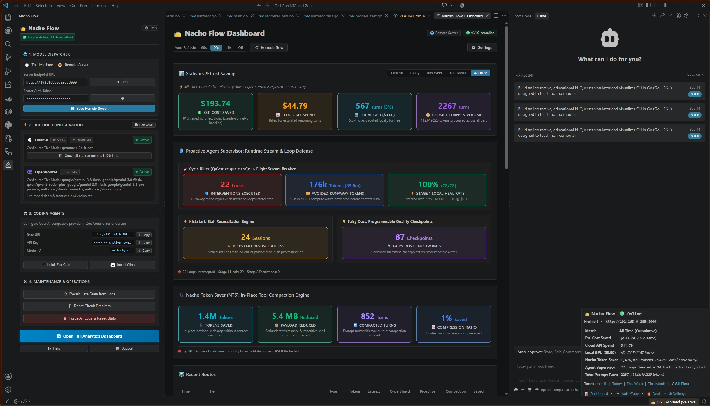

<p align="center">
  
</p>

# 🌮 Nacho Flow: VS Code Extension

<p align="center">
  <a href="https://marketplace.visualstudio.com/items?itemName=dixieflatline76.nacho-flow"></a>
  <a href="https://github.com/dixieflatline76/nacho-flow"></a>
  <a href="https://github.com/dixieflatline76/nacho-flow"></a>
  <a href="https://github.com/dixieflatline76/nacho-flow"></a>
  <a href="https://github.com/dixieflatline76/nacho-flow/blob/main/LICENSE"></a>
</p>

The VS Code companion extension for [Nacho Flow](https://github.com/dixieflatline76/nacho-flow) -- a hybrid model dispatcher and agent supervisor. Bundles the native Go binary directly. Zero CLI setup, zero Go toolchain required.

🌐 **Website & Docs**: [spicebox.dev/nacho-flow](https://spicebox.dev/nacho-flow/) · [GitHub](https://github.com/dixieflatline76/nacho-flow)

<p align="center">
  
</p>

---

## ⚡ 60-Second Quickstart

1. **Open the Nacho Flow Sidebar**: Click the **🌮 Nacho Flow** icon in the VS Code Activity Bar.
2. **Launch the Engine**: Under **1. Model Dispatcher**, click **`Start`**. Status turns `🟢 Engine Online`.
3. **Configure Your Agent**: Under **3. Coding Agents**, click **`Copy`** next to:
   - **Base URL**: `http://127.0.0.1:8000/v1`
   - **Model ID**: `nacho-hybrid`
   - *(Optional API Key: `sk-nacho-secret-key`)*
4. **Paste into Your Agent**: Open **Cline**, **Zoo Code**, or **Cursor** settings, set Provider to **OpenAI Compatible**, paste the copied values.

Routine turns now run on your GPU for **$0.00**, while complex reasoning automatically escalates to Claude or DeepSeek-R1.

---

## ✨ Features

### 🛡️ Agent Supervision

- **Cycle Killer**: Kills repetitive N-gram loops in < 3s across thinking/prose/tool streams. Injects a $0.00 local override to force a tool action. File writes are immune.
- **Kickstart**: Detects consecutive non-write turns (analysis paralysis) and injects resuscitation prompts or escalates to a smarter model. Auto-suspends in Plan Mode.
- **Fairy Dust**: Deploys frontier models (Claude, DeepSeek-R1) every N writes for quality checkpoints -- without running expensive models all day.
- **Tool Normalizer**: Converts 8 malformed tool-call format families into standard OpenAI `tool_calls` JSON, eliminating 3-strike harness crashes from small local models.

> **NTS (experimental token compaction)** is disabled by default for prompt cache stability. Enable in `config.yaml` if investigating extreme context limits. See [NTS docs](https://spicebox.dev/nacho-flow/docs.html?doc=user_guide).

---

### 🎛️ Sidebar Control Hub

- **Local / Remote Gateway**: 1-click Start, Stop, Restart and live streaming Logs for the bundled Go engine. Connect across LAN or Tailscale with optional Bearer Auth.
- **Routing Profiles**: Switch on the fly between three pre-tuned config profiles (`profile1.yaml`, `profile2.yaml`, `profile3.yaml`) with zero-downtime hot-reload.
  - **Profile 1 (Standard Hybrid)**: GLM-5.3-Flash Tier 2, balanced Kickstart
  - **Profile 2 (Zoo Code)**: Tuned for autonomous coding with 12x table repetition tolerance
  - **Profile 3 (Cline)**: Qwen3 Coder Plus Tier 2, immediate Kickstart on first retry
- **Provider Status**: Real-time health chips for local engines (Ollama, vLLM) and cloud APIs (OpenRouter, DeepSeek, Anthropic).
- **Agent Setup**: 1-click copy for Base URL, API Key, and Model ID.

---

### 📊 Real-Time Analytics Dashboard

Open with `Ctrl+Shift+P` -> `Nacho Flow: Show Dashboard`:

- **Financial Telemetry**: Total spend, savings ($, %), local GPU turns, cloud turns, billed vs. avoided tokens. Filter by Today, This Week, All Time.
- **Live Route Inspector**: Last 500 LLM requests -- token counts, latency, matched tier rule, provider, model, retry steps.
- **Auto-Tuner**: Click `Run Auto-Tuner` to replay `traffic.jsonl`, find optimal tier thresholds, and apply a green/red YAML diff with 1-click selective apply.

---

### 🔥 Heat Seeker: Live Model Deals

Scans 300+ cloud models on OpenRouter for flash discounts and free endpoints:

- Deal cards show discount %, prompt/completion pricing, tool support, and SWE-bench score.
- **1-Click Adopt**: Select a tier to replace, the extension backups `config.yaml`, updates the model, and hot-swaps with zero downtime.

---

### 🚦 Status Bar HUD

```text
🌮 Nacho Flow ● Online | $193.74 Saved All Time (5% Local)
```

Hover for active profile, cost metrics, supervisor defense telemetry, and NTS stats. Click for a QuickPick menu: open dashboard, switch presets, start/stop/restart, open `config.yaml`.

---

### 🌶️ In-Chat Directives (`@nacho:`)

Override routing directly from your prompt in Zoo Code, Cline, or Cursor:

| Directive | Type | Effect |
| :--- | :--- | :--- |
| `@nacho:toggles` | Inspection | Show live session switches |
| `@nacho:status` | Inspection | Show daemon uptime, spend, savings |
| `@nacho:reset` | Management | Hard reset session & restore defaults |
| `@nacho:kickstart-off` / `on` | Switch | Suspend / resume Kickstart |
| `@nacho:cyclekiller-off` / `on` | Switch | Suspend / resume Cycle Killer |
| `@nacho:shield-off` / `on` | Switch | Suspend / resume tool-call synthesis |
| `@nacho:raw-on` / `off` | Switch | Enable / disable raw SSE stream |
| `@nacho:fairydust-off` / `on` | Switch | Suspend / resume frontier checkpoints |
| `@nacho:local` | Single Turn | Force Local GPU ($0.00) |
| `@nacho:cloud` | Single Turn | Force Cloud Fallback tier |
| `@nacho:reasoning` | Single Turn | Force DeepSeek-R1 / o1 |

---

## ⌨️ Command Palette

All features via `Ctrl+Shift+P` / `Cmd+Shift+P`:

| Command | Identifier |
| :--- | :--- |
| Show Dashboard | `nacho-flow.showDashboard` |
| Open Controls in Sidebar | `nacho-flow.openSettings` |
| Open Config Editor | `nacho-flow.openConfig` |
| Run Auto-Tuner & Optimize | `nacho-flow.runOptimizer` |
| Refresh Heatseeker Deals | `nacho-flow.refreshDeals` |
| Reset Circuit Breaker | `nacho-flow.resetCircuit` |
| Refresh Statistics | `nacho-flow.refreshStats` |
| Set Auth Token | `nacho-flow.setAuthToken` |

---

## ⚙️ Extension Settings

| Setting | Default | Description |
| :--- | :--- | :--- |
| `nachoFlow.engineMode` | `"local"` | `'local'` runs the embedded daemon; `'remote'` connects to an external gateway |
| `nachoFlow.daemonUrl` | `http://127.0.0.1:8000` | Gateway endpoint URL (supports LAN / Tailscale) |
| `nachoFlow.authToken` | `""` | Optional Bearer Auth Token for protected remote gateways |
| `nachoFlow.autoStartDaemon` | `true` | Auto-resume the local binary on VS Code launch |
| `nachoFlow.showStatusBar` | `true` | Display cost savings and local routing % in the status bar |

---

## 📚 Documentation

- **Official Website**: [spicebox.dev/nacho-flow](https://spicebox.dev/nacho-flow/)
- **Extension User Guide**: [spicebox.dev/nacho-flow/docs.html?doc=extension_guide](https://spicebox.dev/nacho-flow/docs.html?doc=extension_guide)
- **Core Engine & CLI Guide**: [spicebox.dev/nacho-flow/docs.html?doc=user_guide](https://spicebox.dev/nacho-flow/docs.html?doc=user_guide)
- **GitHub Repository**: [github.com/dixieflatline76/nacho-flow](https://github.com/dixieflatline76/nacho-flow)

---

## 🌮 Support Nacho Flow

If Nacho Flow saved your sanity or your API bill:

- Grab a copy of **Spice** on the [Mac App Store](https://apps.apple.com/us/app/spice-wallpaper-manager/id6760980759?mt=12) or [Microsoft Store](https://apps.microsoft.com/detail/9NPBQ3C91WPF) -- you get a native desktop utility and it funds continued development.
- On Linux? [Star Nacho Flow on GitHub](https://github.com/dixieflatline76/nacho-flow).

---

## 📄 License

- The VS Code Companion Extension is open source under the **[MIT License](https://github.com/dixieflatline76/nacho-flow/blob/main/LICENSE)**.
- The core Nacho Flow gateway daemon is licensed under **GNU AGPL-3.0** with API Interoperability Exception.