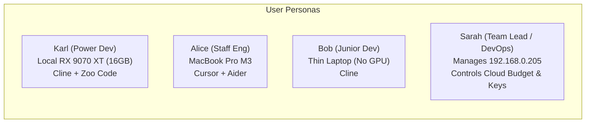
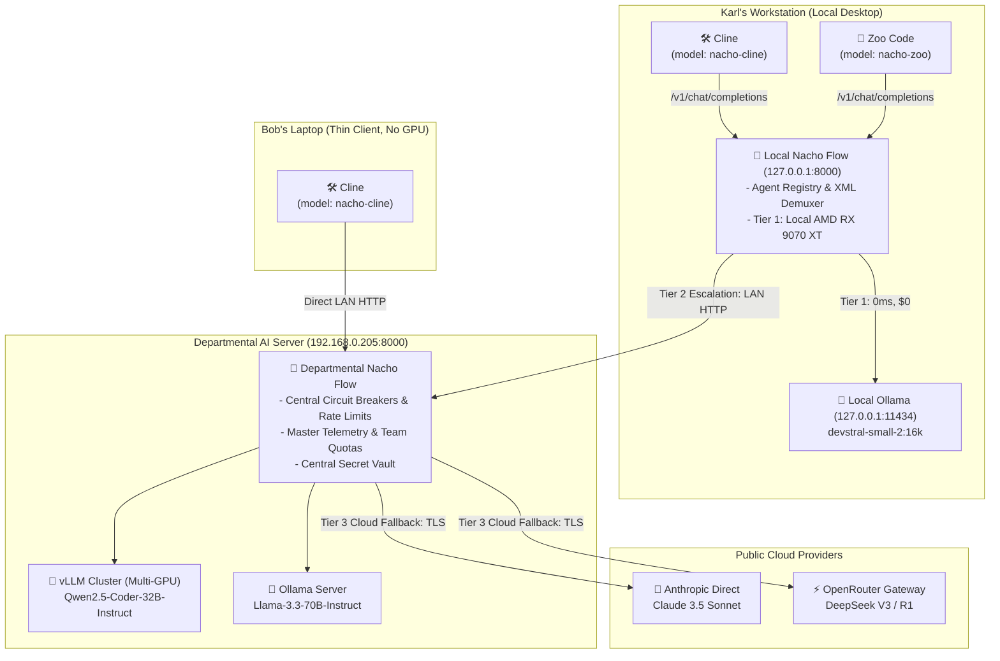
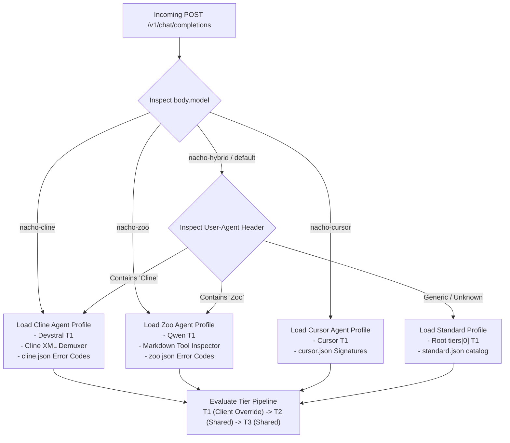
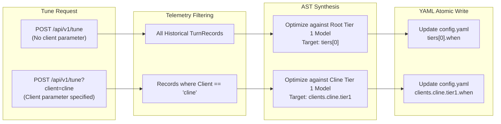
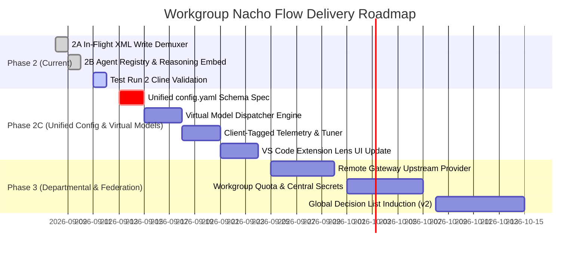

# Workgroup Nacho Flow: Product Requirements Document (PRD) & System Design Document (SDD)

**Document Status:** Draft for Review  
**Target Milestone:** Nacho Flow v2.0 / Workgroup Edition  
**Author:** Pair Programming Team (User & Antigravity)  
**Scope:** Architecture, Configuration Schema, Agent Registry, Telemetry, Auto-Tuner, and VS Code Extension UI  

---

## 1. Executive Summary & Vision

### 1.1 Vision
**Workgroup Nacho Flow** transforms Nacho Flow from an isolated, single-workstation proxy into a **hierarchical, multi-agent AI gateway and governance hub** for development teams. It bridges the gap between heterogeneous desktop hardware (local GPUs, NPUs, CPUs), shared departmental compute clusters (high-VRAM GPU servers running Ollama, vLLM, or SGLang), and centralized corporate cloud providers (Anthropic, OpenRouter, DeepSeek).

### 1.2 Core Tenets
1. **Zero Client Friction**: A single developer can run Cline, Zoo Code, Cursor, and Aider concurrently without touching server configurations, switching profiles, or restarting daemons.
2. **Hierarchical Compute Routing**: Cheap, sub-millisecond local desktop inference escalates transparently over LAN to departmental servers, which escalate to frontier cloud models only when necessary.
3. **Configuration Consolidation**: Eliminate config file fragmentation (`config.yaml`, `config.cline.yaml`, `config.zoo.yaml`). Maintain **one unified, human-readable `config.yaml`** with inherited tier pipelines.
4. **Agent-Scoped Telemetry & Auto-Tuning**: Real-time traffic analysis detects context degradation thresholds and friction keywords on a per-agent, per-model basis without cross-contaminating empirical datasets.
5. **Zero-Allocation Hot Path**: Maintain sub-microsecond routing latency and $0\text{ B/op}$ memory overhead on active streaming proxy paths.

---

## 2. Problem Statement & User Personas

### 2.1 Current Pain Points
* **Config Proliferation**: Maintaining separate configuration YAMLs per client creates sync hell. Updating an API key, fallback model, or cycle-killer threshold requires editing multiple files.
* **Agent Collisions**: Cline relies on verbose XML tools (`<write_to_file>`); Zoo Code uses Markdown backticks and JSON tool calls. A single global routing rule set causes false-positive Cycle Killer trips on Cline or syntax errors on Zoo.
* **Hardware Disparity in Teams**: In any real engineering team, hardware is uneven:
  * *Developer A*: Desktop with AMD Radeon RX 9070 XT (16GB VRAM) running local `devstral-small-2:16k`.
  * *Developer B*: Laptop with RTX 4060 (8GB VRAM) running local `qwen2.5-coder:7b`.
  * *Developer C*: Mac Studio with Unified Memory running `llama-3.3-70b` in LM Studio.
  * *Developer D*: Ultrabook with no local GPU relying entirely on remote endpoints.
* **Departmental Resource Wastage**: Labs often have powerful dedicated boxes (e.g. Ubuntu servers with multi-GPU setups at `192.168.0.205`), but developers either fail to share them or duplicate cloud costs by bypassing them.
* **Auto-Tuner Blindness**: Today's `TurnRecord` telemetry pools all historical turns into a single dataset, calculating an inaccurate compromise threshold across distinct models and agents.

### 2.2 Target Personas



* **The Multi-Agent Power Developer**: Uses Zoo Code for rapid workspace indexing and Cline for complex autonomous refactoring. Needs both to run concurrently against their local GPU with zero manual configuration.
* **The Resource-Constrained Developer**: Lacks local VRAM. Wants their editor to transparently route to the team's departmental GPU box without managing Ollama locally.
* **The Workgroup / Tech Lead**: Needs to centralize expensive frontier cloud API keys (Anthropic, OpenRouter), enforce circuit breakers and rate limits, inspect aggregate team telemetry, and track compute savings across all team members.

---

## 3. Product Requirements

### 3.1 Functional Requirements (FR)

* **FR-1: Unified Configuration File**: All system settings, upstream providers, shared fallback tiers, client-specific Tier 1 overrides, and circuit breaker policies must reside in a single, authoritative `config.yaml`.
* **FR-2: Concurrent Multi-Client Serving via Virtual Models**:
  * The daemon must expose `/v1/models` returning virtual endpoints: `nacho-hybrid` (default), `nacho-cline`, `nacho-zoo`, `nacho-cursor`, `nacho-aider`.
  * Each client targets its dedicated model ID; the router auto-binds that client's specific Tier 1 model, tool signatures, error codes, and XML normalizer without global state toggling.
* **FR-3: Hierarchical / Federated Gateway Routing**:
  * A local workstation instance of Nacho Flow can declare an upstream Departmental Nacho Flow server as an upstream provider (type: `remote_gateway` or standard `cloud`/`openai`).
  * If local Tier 1 fails or context exceeds threshold $T$, traffic escalates over LAN to the departmental server.
* **FR-4: Automatic Agent Signature Hydration**:
  * Client tool definitions (`execute_command`, `write_to_file`, `apply_diff`), error signatures, and XML write container tags are loaded from the embedded catalog (`data/agents/*.json`) and applied automatically without manual YAML boilerplate.
  * Manual overrides in `config.yaml` under `clients.<agent>.tools` take precedence when explicitly declared.
* **FR-5: Partitioned Multi-Agent Telemetry**:
  * `TurnRecord` must capture `Client: string` (e.g. `"cline"`, `"zoo"`, `"cursor"`).
  * The streaming metrics engine must record metrics both globally and partitioned per agent.
* **FR-6: Agent-Scoped Empirical Auto-Tuner**:
  * The API endpoint `POST /api/v1/tune?client=<client>` must filter historical records specifically for that client and optimize against that client's assigned local model.
  * Synthesized AST rules must atomically update the target client's Tier 1 rule without altering shared fallback tiers.
* **FR-7: Re-Imagined VS Code Extension UX**:
  * Eliminate the obsolete "Hot-Swap" workflow.
  * Replace the preset selector with an **Agent Perspective Lens** that reflects active pipelines per agent.
  * Clicking "Edit config.yaml" opens the single unified file.

### 3.2 Non-Functional Requirements (NFR)

* **NFR-1: Zero Heap Allocation on Hot Streaming**:
  * Routing, XML container tag demuxing, and reasoning token stripping must maintain $0\text{ B/op}$ overhead during active stream normalization.
* **NFR-2: Sub-Microsecond Dispatch Latency**:
  * Evaluating tier conditions (`when: "Tokens < 16000 && !HasImages"`) must complete in under $1\,\mu\text{s}$ using compiled `expr` bytecode.
* **NFR-3: High Test Coverage**:
  * All Go packages must maintain $\ge 95\%$ statement test coverage.
* **NFR-4: Air-Gapped / Local-First Security**:
  * Shipping configuration defaults must bind strictly to `127.0.0.1`.
  * Departmental deployments require explicit network configuration (`host: "0.0.0.0"`) and token authentication.

---

## 4. System Architecture & Topology

### 4.1 Hierarchical Deployment Topology



### 4.2 Data Flow & Tier Escalation Stages

| Stage | Node | Criteria / Triggers | Target Compute | Cost / Latency Profile |
| :--- | :--- | :--- | :--- | :--- |
| **Tier 1 (Workstation)** | Local Nacho Flow | `Tokens < 16k`, no friction keywords, no images | Local Desktop GPU (RX 9070 XT / RTX 4070) | **$0.00**, $\sim 15\text{–}30\text{ ms}$ TTFT |
| **Tier 2 (Departmental)** | Departmental Server (`192.168.0.205`) | Context $16\text{k}\text{–}64\text{k}$, local GPU busy, or thin-client request | Lab GPU Cluster (vLLM / Qwen 32B / Llama 70B) | **$0.00** (On-Prem CapEx), LAN $\sim 50\text{–}150\text{ ms}$ |
| **Tier 3 (Frontier Cloud)** | Departmental Server | Complex architecture keywords, retry exhaustion, high reasoning tasks | Cloud APIs (Claude 3.5 Sonnet, DeepSeek V3) | Commercial API rates, WAN $\sim 400\text{–}900\text{ ms}$ |
| **Default Rescue** | Departmental Server | Upstream timeout ($>30\text{s}$) or circuit breaker open | High-availability cloud provider | Commercial API rates, automated recovery |

---

## 5. Configuration Schema Design: The Unified `config.yaml`

### 5.1 Architecture of the Unified Config
Instead of spreading settings across disjoint preset files, `config.yaml` adopts a **hierarchical inheritance structure**:
1. **Providers**: Upstream local backends, remote departmental gateways, and cloud endpoints.
2. **Global Fallback Tiers (`tiers:`)**: The baseline escalation pipeline (Tier 2, Tier 3, Default Rescue).
3. **Client Blocks (`clients:`)**: Agent-specific customizations (Tier 1 model, tool overrides, custom thresholds).

### 5.2 Canonical Specification

```yaml
# =============================================================================
# 🌮 NACHO FLOW WORKGROUP CONFIGURATION
# Unified Gateway & Agent Dispatcher Specification
# =============================================================================

version: "2.0"
host: "127.0.0.1"        # "0.0.0.0" on departmental server
port: 8000

# -----------------------------------------------------------------------------
# 1. UPSTREAM PROVIDERS
# -----------------------------------------------------------------------------
providers:
  local_ollama:
    base_url: "http://127.0.0.1:11434"
    type: "local"

  dept_server:
    base_url: "http://192.168.0.205:8000/v1"
    type: "remote_gateway"  # Special type: passes through nacho headers
    api_key: "ENV_NACHO_DEPT_TOKEN"

  openrouter:
    base_url: "https://openrouter.ai/api/v1"
    type: "cloud"
    api_key: "ENV_OPENROUTER_API_KEY"

# -----------------------------------------------------------------------------
# 2. SHARED FALLBACK ESCALATION TIERS (Inherited by all clients)
# -----------------------------------------------------------------------------
tiers:
  - name: "Tier 1: Default Local Draft"
    provider: local_ollama
    model: "devstral-small-2:16k"
    when: "Tokens < 16000 && !HasImages && !any(Keywords, { # in ['architecture', 'security'] })"

  - name: "Tier 2: Departmental Heavy GPU"
    provider: dept_server
    model: "nacho-hybrid"  # Requests departmental tier resolution
    when: "Tokens < 64000"

  - name: "Tier 3: Frontier Cloud Rescue"
    provider: openrouter
    model: "anthropic/claude-3-5-sonnet"
    when: "true"

default_tier:
  name: "Fallback Rescue"
  provider: openrouter
  model: "anthropic/claude-3-5-sonnet"

# -----------------------------------------------------------------------------
# 3. AGENT SPECIFIC PROFILES & TIER 1 OVERRIDES
# -----------------------------------------------------------------------------
clients:
  # Cline Profile: XML-native tool container handling & Devstral tuning
  cline:
    tier1:
      model: "devstral-small-2:16k"
      provider: local_ollama
      when: "Tokens < 14000 && !HasImages"
    # Auto-hydrated from data/agents/cline.json unless overridden below:
    # tools: [execute_command, read_file, write_to_file, replace_in_file, ...]

  # Zoo Code Profile: Qwen code reasoning & Markdown parsing
  zoo:
    tier1:
      model: "qwen2.5-coder:7b"
      provider: local_ollama
      when: "Tokens < 18000"
    # Auto-hydrated from data/agents/zoo.json

  # Cursor Profile: Fast completions & diff editing
  cursor:
    tier1:
      model: "qwen2.5-coder:7b"
      provider: local_ollama
      when: "Tokens < 12000"

  # Aider Profile: Git-centric diff workflows
  aider:
    tier1:
      model: "deepseek/deepseek-chat"
      provider: openrouter
      when: "true"

# -----------------------------------------------------------------------------
# 4. SUPERVISION & SAFETY POLICIES
# -----------------------------------------------------------------------------
supervision:
  cycle_killer:
    enabled: true
    threshold: 3
    window: 10
    tool_immunity: true   # Preserves Phase 2A XML demuxer write-tag immunity
  kickstart:
    enabled: true
    prose_tokens: 15
  fairy_dust:
    enabled: true
```

---

## 6. Agent Routing, Virtual Models & Zero-Alloc Ingestion

### 6.1 Virtual Model Resolution
The gateway resolves incoming requests using a deterministic precedence hierarchy:



### 6.2 Zero-Allocation Hot Path Guarantees
* **Pre-Compiled Regex & In-Memory Replacers**: Reason tags (`<think>`, `[THINK]`), unicode escapes (`\u003c`), and write tag boundaries (`<write_to_file>`, `write_file`) are compiled once at initialization inside `agentregistry.Registry`.
* **Zero Allocations on Streaming**: Stream chunks pass through [`stream_normalizer.go`](file:///c:/Users/karlk/development/Go/src/github.com/dixieflatline76/nacho-flow/pkg/server/stream_normalizer.go) with zero heap allocation per chunk, maintaining line-rate streaming throughput.

---

## 7. Multi-Tenant Telemetry & Client-Scoped Auto-Tuning

### 7.1 Telemetry Schema Updates (`TurnRecord`)
To prevent telemetry contamination between distinct agents, [`pkg/telemetry/sink.go`](file:///c:/Users/karlk/development/Go/src/github.com/dixieflatline76/nacho-flow/pkg/telemetry/sink.go) is extended:

```go
type TurnRecord struct {
    Timestamp time.Time `json:"timestamp"`
    RequestID string    `json:"request_id"`
    SessionID string    `json:"session_id,omitempty"`
    
    // NEW: Multi-Agent & Workgroup Tracking
    Client    string    `json:"client"`              // e.g. "cline", "zoo", "cursor", "standard"
    User      string    `json:"user,omitempty"`      // e.g. "karl", "alice" (from Auth Token)
    Workgroup string    `json:"workgroup,omitempty"` // Departmental tag
    
    Tokens       int     `json:"tokens"`
    SelectedTier string  `json:"selected_tier"`
    TargetModel  string  `json:"target_model"`
    Provider     string  `json:"provider"`
    IsLocal      bool    `json:"is_local"`
    IsRetry      bool    `json:"is_retry"`
    CostSavedUSD float64 `json:"cost_saved_usd"`
    // ... preserved cycle killer & telemetry fields
}
```

### 7.2 Client-Scoped Auto-Tuner (`pkg/tuner`)

The Auto-Tuner operates in two distinct modes without breaking legacy contracts:



#### Tuner Invariants & Safeguards
1. **Model-Aware Cliff Detection**: Cline's `devstral-small-2` will be tuned strictly against Cline's coding sessions, finding the exact context cliff (e.g. 13,800 tokens) where Devstral begins to struggle. Zoo Code's `qwen2.5-coder` will be tuned independently.
2. **Safe Fallback**: If a client has fewer than 20 recorded turns, the tuner refuses to synthesize noisy rules and provides clear recommendations to collect more traffic.
3. **AST Rule Preservation**: Hand-crafted guardrails (`IsRetry == false`, `Retries < 2`) are parsed via `expr/parser` and preserved during rule synthesis.

---

## 8. Developer Experience & VS Code Extension UI/UX

### 8.1 Sidebar View Evolution

```
======================================================
🌮 NACHO FLOW
● Online (v2.0.0-workgroup)  |  Port: 8000
======================================================
⚡ 2. ROUTING CONFIGURATION            [📝 Edit YAML]
------------------------------------------------------
Agent Perspective:
[ 🛠️ Cline (XML-Native)                        ▼ ]

Active Pipeline for Cline:
  ● T1 (Local): devstral-small-2:16k  [Ollama]
    When: Tokens < 14000 && !HasImages
  ● T2 (Dept):  Qwen2.5-Coder-32B     [192.168.0.205]
    When: Tokens < 64000
  ● T3 (Cloud): claude-3-5-sonnet     [OpenRouter]
    When: Fallback Rescue
------------------------------------------------------
🤖 3. CLIENT CONFIGURATION
Base URL:   http://127.0.0.1:8000/v1       [📋 Copy]
API Key:    ••••••••••••••••               [📋 Copy]
Model ID:   nacho-cline                    [📋 Copy]

Status: Connected & Ready for Cline sessions.
======================================================
```

### 8.2 Key UI/UX Changes Explained

| UI Element | Old Preset Model | New Workgroup Model | User Benefit |
| :--- | :--- | :--- | :--- |
| **Preset Dropdown** | Overwrote engine memory with `config.<preset>.yaml` | Acts as an **Agent Lens** (filters view to that client's pipeline) | Zero engine restarts; all clients run simultaneously |
| **Hot-Swap Button** | Required clicking "Hot-Swap" every time you switched tools | **Removed / Replaced with "Reload Config"** | Seamless pairing: Zoo and Cline run side-by-side |
| **"Edit YAML" Action** | Opened one of 3 fractured preset files | **Opens the single authoritative `config.yaml`** | No duplicated edits or lost API keys |
| **Model ID Field** | Static `nacho-hybrid` | **Dynamically shows `nacho-cline`, `nacho-zoo`, etc.** | 1-click copy-paste directly into agent settings |
| **"⚡ Adopt Deal"** | Adopted deal into global tier only | **Modal asks: Adopt as Shared T2 or Client T1?** | Instant optimization of specific agent models |

---

## 9. Security, Governance & Workgroup Administration

### 9.1 Network Exposure & Host Binding Policy
* **Desktop Workstations**: Bound strictly to `127.0.0.1` by default. Prevents unauthorized LAN access to local GPU instances.
* **Departmental Gateway Servers**: Bound to `0.0.0.0` or dedicated subnet interfaces (`192.168.0.0/24`).
* **Authentication**: All endpoints on departmental servers require Bearer token authentication (`Authorization: Bearer <token>`). Tokens can be team-scoped or developer-scoped.

### 9.2 Central Secret Management
* Workstation developers **do not need individual OpenRouter or Anthropic API keys**.
* The departmental Nacho Flow server stores corporate API keys in environment variables or system vaults.
* Developers' local gateways escalate to the departmental server using a departmental token, preserving complete corporate credential isolation.

---

## 10. Phased Roadmap & Migration Path



---

## 11. Open Architectural Decisions for User Review

1. **Virtual Model Naming Convention**:
   * *Option A*: `nacho-cline`, `nacho-zoo`, `nacho-cursor` (Explicit, recommended for clarity).
   * *Option B*: Standard `nacho-hybrid` for all, relying strictly on automatic `User-Agent` and header detection.
   * *Option C*: Hybrid (Support both: explicit model IDs take priority, fall back to header detection).

2. **Upstream Gateway Provider Type**:
   * When a local workstation forwards an escalated Tier 2 request to `192.168.0.205`, should it use standard `type: "openai"` or a dedicated `type: "remote_gateway"` that forwards telemetry request IDs and original agent headers? *(Recommended: Dedicated `type: "remote_gateway"` for complete auditability).*

3. **Auto-Tuner Default Target**:
   * In the VS Code Dashboard, when the user clicks **"Run Auto-Tuner"**, should it prompt with a quick-pick (*"Tune Global Baseline"* vs *"Tune Active Selected Agent"*), or automatically tune the agent currently selected in the sidebar dropdown lens?
